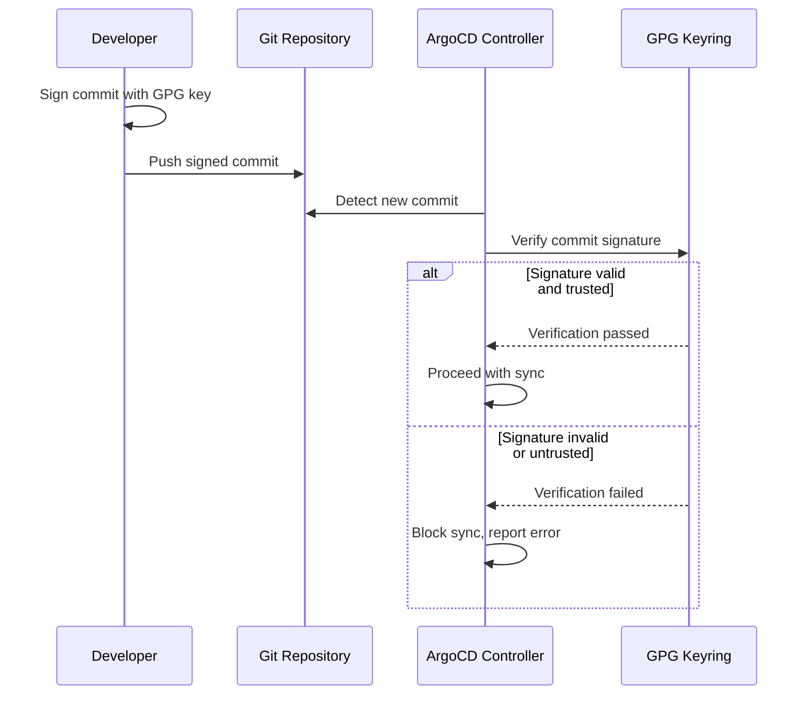

# How to Enable GnuPG Signature Verification in ArgoCD

Author: [nawazdhandala](https://github.com/nawazdhandala)

Tags: ArgoCD, GitOps, Kubernetes, GnuPG, Security

Description: Learn how to enable and configure GnuPG signature verification in ArgoCD to ensure only signed Git commits are deployed to your Kubernetes clusters.

---

In a GitOps workflow, the Git repository is the single source of truth for your infrastructure. But what happens if someone gains unauthorized access to the repository and pushes malicious changes? GnuPG (GPG) signature verification adds a cryptographic guarantee that every commit deployed by ArgoCD was made by an authorized person. If a commit is not signed or signed by an untrusted key, ArgoCD refuses to sync it.

This guide walks through enabling GPG signature verification in ArgoCD from scratch, including key management, project configuration, and handling the operational aspects of running verified deployments.

## How GPG Verification Works in ArgoCD

When GPG verification is enabled for an ArgoCD project, the system checks every commit before syncing:



ArgoCD maintains its own GPG keyring, separate from any system keyrings. You import the public keys of trusted signers, and ArgoCD verifies that each commit is signed by one of those keys.

## Prerequisites

Before enabling verification, make sure your developers have GPG signing set up:

```bash
# Generate a GPG key pair (if you don't have one)
gpg --full-generate-key
# Select RSA and RSA, 4096 bits, set expiration

# List your GPG keys
gpg --list-secret-keys --keyid-format long

# Configure Git to sign commits
git config --global user.signingkey YOUR_KEY_ID
git config --global commit.gpgsign true

# Export the public key for importing into ArgoCD
gpg --armor --export YOUR_KEY_ID > my-public-key.asc
```

## Step 1: Import GPG Keys into ArgoCD

ArgoCD stores GPG public keys in its own keyring. Import each trusted signer's key using the CLI:

```bash
# Import a public key from a file
argocd gpg add --from my-public-key.asc

# List all imported keys
argocd gpg list

# Output:
# KEYID                  TYPE     IDENTITY
# 3AA5C34371567BD2       RSA 4096 John Doe <john@example.com>
# 9B2C5A6E8F3D1E7A       RSA 4096 Jane Smith <jane@example.com>
```

You can also import keys declaratively by creating a ConfigMap:

```yaml
apiVersion: v1
kind: ConfigMap
metadata:
  name: argocd-gpg-keys-cm
  namespace: argocd
  labels:
    app.kubernetes.io/part-of: argocd
data:
  # Key ID as the key, ASCII-armored public key as the value
  3AA5C34371567BD2: |
    -----BEGIN PGP PUBLIC KEY BLOCK-----

    mQINBGV...
    (your ASCII-armored public key here)
    ...
    -----END PGP PUBLIC KEY BLOCK-----
  9B2C5A6E8F3D1E7A: |
    -----BEGIN PGP PUBLIC KEY BLOCK-----

    mQINBGV...
    -----END PGP PUBLIC KEY BLOCK-----
```

Apply the ConfigMap:

```bash
kubectl apply -f argocd-gpg-keys-cm.yaml
```

After importing keys, the ArgoCD repo-server needs to restart to pick them up:

```bash
kubectl rollout restart deployment argocd-repo-server -n argocd
```

## Step 2: Enable Verification on a Project

GPG verification is configured at the ArgoCD project level using the `signatureKeys` field:

```yaml
apiVersion: argoproj.io/v1alpha1
kind: AppProject
metadata:
  name: production
  namespace: argocd
spec:
  description: Production applications - GPG verification required
  sourceRepos:
    - https://github.com/myorg/k8s-production.git
  destinations:
    - namespace: '*'
      server: https://kubernetes.default.svc
  # Enable GPG verification
  signatureKeys:
    # List the key IDs that are trusted for this project
    - keyID: 3AA5C34371567BD2
    - keyID: 9B2C5A6E8F3D1E7A
```

Once `signatureKeys` is set on a project, ALL applications in that project require valid signatures. There is no per-application toggle - it is all or nothing at the project level.

## Step 3: Verify the Configuration

Test that verification is working:

```bash
# Create a test application in the verified project
argocd app create test-gpg \
  --repo https://github.com/myorg/k8s-production.git \
  --path apps/test \
  --dest-server https://kubernetes.default.svc \
  --dest-namespace test \
  --project production

# Try to sync - this should succeed if the latest commit is signed
argocd app sync test-gpg

# Check the verification status
argocd app get test-gpg -o json | jq '.status.sourceType'
```

If the commit is not signed or signed by an untrusted key:

```
FATA[0001] rpc error: code = Unknown desc = application spec is invalid:
InvalidSpecError: GnuPG verification required but commit is not signed
```

## Step 4: Check Verification Status

ArgoCD shows GPG verification status in the application details:

```bash
# Detailed GPG info for an application
argocd app get my-app -o json | jq '.status.operationState.syncResult.source'

# Check if the current revision has a valid signature
kubectl get application my-app -n argocd \
  -o jsonpath='{.status.sync.revision}'
```

In the ArgoCD UI, applications with GPG verification show a lock icon or verification badge next to the commit SHA.

## Handling Multiple Signers

In team environments, you typically have multiple developers who need to sign commits. Each signer's public key must be imported and listed in the project configuration:

```yaml
# Project with multiple trusted signers
spec:
  signatureKeys:
    - keyID: 3AA5C34371567BD2   # Developer 1
    - keyID: 9B2C5A6E8F3D1E7A   # Developer 2
    - keyID: 1C4D5E6F7A8B9C0D   # CI Bot
    - keyID: 2D3E4F5A6B7C8D9E   # Release Manager
```

A commit only needs to be signed by ANY ONE of the listed keys - not all of them.

## Signing Commits in CI/CD

For automated workflows, your CI system needs a GPG key to sign commits:

```bash
# In your CI pipeline
# Import the signing key (stored as CI secret)
echo "$GPG_PRIVATE_KEY" | gpg --batch --import

# Configure Git
git config user.signingkey "$GPG_KEY_ID"
git config commit.gpgsign true

# Make a signed commit
git add .
git commit -S -m "Automated update: bump image to v2.0"
git push
```

For GitHub Actions:

```yaml
# .github/workflows/deploy.yaml
jobs:
  deploy:
    runs-on: ubuntu-latest
    steps:
      - uses: actions/checkout@v4

      - name: Import GPG key
        uses: crazy-max/ghaction-import-gpg@v6
        with:
          gpg_private_key: ${{ secrets.GPG_PRIVATE_KEY }}
          passphrase: ${{ secrets.GPG_PASSPHRASE }}
          git_user_signingkey: true
          git_commit_gpgsign: true

      - name: Make signed commit
        run: |
          # Make changes
          sed -i "s/tag: .*/tag: v2.0/" values.yaml
          git add values.yaml
          git commit -S -m "Update image tag to v2.0"
          git push
```

## Handling Merge Commits

Merge commits on platforms like GitHub can be signed or unsigned depending on the platform settings:

- **GitHub**: Merge commits are signed with GitHub's GPG key if the repository has vigilant mode enabled
- **GitLab**: Merge commits can be signed if the server has GPG signing configured
- **Bitbucket**: Merge commits are typically unsigned

If your workflow relies on merge commits, you may need to import the platform's GPG key:

```bash
# Import GitHub's merge signing key
# (Check GitHub docs for the current key)
curl -s https://github.com/web-flow.gpg | argocd gpg add --from -
```

And add GitHub's key ID to your project:

```yaml
spec:
  signatureKeys:
    - keyID: 3AA5C34371567BD2   # Your developer
    - keyID: 4AEE18F83AFDEB23   # GitHub web-flow (merge commits)
```

## Key Rotation

When a team member leaves or a key expires, update the configuration:

```bash
# Remove an old key
argocd gpg rm 3AA5C34371567BD2

# Add the new key
argocd gpg add --from new-key.asc

# Update the project
kubectl edit appproject production -n argocd
# Remove old keyID, add new keyID in signatureKeys
```

## Disabling Verification

To disable GPG verification for a project, remove the `signatureKeys` field entirely:

```bash
kubectl patch appproject production -n argocd \
  --type json \
  -p '[{"op": "remove", "path": "/spec/signatureKeys"}]'
```

Or set it to an empty array:

```yaml
spec:
  signatureKeys: []
```

## Summary

GnuPG signature verification in ArgoCD adds a critical security layer to your GitOps pipeline by ensuring only cryptographically signed commits from trusted keys can trigger deployments. Enable it by importing public GPG keys into ArgoCD's keyring, then configure the `signatureKeys` field on your ArgoCD projects. Make sure all developers and CI systems have GPG signing configured, and plan for key rotation and merge commit signing from your Git platform.
