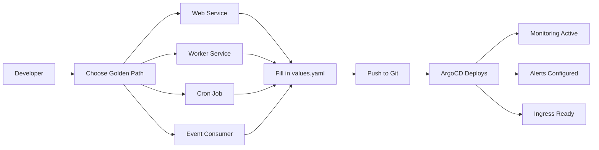
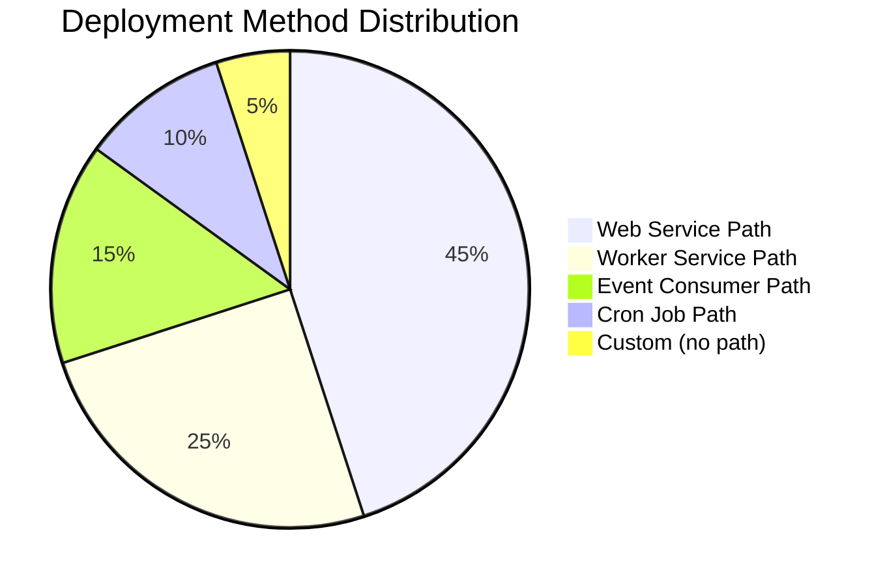

# How to Create Golden Paths for App Deployment with ArgoCD

Author: [nawazdhandala](https://github.com/nawazdhandala)

Tags: ArgoCD, GitOps, Kubernetes, Platform Engineering, Golden Path

Description: Learn how to create golden paths for application deployment using ArgoCD, providing opinionated workflows that help developers ship faster while maintaining best practices.

---

Golden paths are opinionated, well-supported workflows that represent the recommended way to accomplish a task. In the context of ArgoCD, a golden path is a pre-built deployment pattern that developers adopt to go from code to production without needing to understand every detail of Kubernetes, networking, or GitOps configuration. They ship faster, and the platform team sleeps better.

This guide covers building golden paths for common deployment patterns using ArgoCD, Helm templates, Kustomize overlays, and ApplicationSets.

## What Makes a Good Golden Path

A golden path should be:

- **Opinionated but flexible**: Sensible defaults with escape hatches
- **Well-documented**: Developers should know what they are getting
- **Tested**: The path itself should be validated in CI
- **Observable**: Built-in monitoring and alerting
- **Secure by default**: mTLS, network policies, RBAC included



## Step 1: Create a Platform Helm Chart Library

Build a library of platform-approved Helm charts that encode your organization's best practices.

### Web Service Golden Path

```yaml
# charts/web-service/Chart.yaml
apiVersion: v2
name: web-service
description: Golden path for deploying web services
type: application
version: 1.0.0
```

```yaml
# charts/web-service/values.yaml
# Minimal configuration required from developers
app:
  name: ""          # Required: application name
  team: ""          # Required: owning team
  image:
    repository: ""  # Required: container image
    tag: ""         # Required: image tag
  port: 8080        # Default port
  healthCheck:
    path: /health   # Default health check path

# Everything below has sensible defaults
replicas:
  min: 2
  max: 10

resources:
  requests:
    cpu: 100m
    memory: 128Mi
  limits:
    cpu: 500m
    memory: 512Mi

# Auto-scaling enabled by default
autoscaling:
  enabled: true
  targetCPU: 70
  targetMemory: 80

# Ingress enabled by default
ingress:
  enabled: true
  className: nginx

# Pod disruption budget for availability
pdb:
  enabled: true
  minAvailable: 1

# Monitoring enabled by default
monitoring:
  enabled: true
  dashboardEnabled: true
  alertsEnabled: true
  sloTarget: 99.9

# Security defaults
security:
  runAsNonRoot: true
  readOnlyRootFilesystem: true
  allowPrivilegeEscalation: false
```

The templates encode best practices:

```yaml
# charts/web-service/templates/deployment.yaml
apiVersion: apps/v1
kind: Deployment
metadata:
  name: {{ .Values.app.name }}
  labels:
    app.kubernetes.io/name: {{ .Values.app.name }}
    app.kubernetes.io/managed-by: platform
    team: {{ .Values.app.team }}
spec:
  replicas: {{ .Values.replicas.min }}
  selector:
    matchLabels:
      app.kubernetes.io/name: {{ .Values.app.name }}
  template:
    metadata:
      labels:
        app.kubernetes.io/name: {{ .Values.app.name }}
        team: {{ .Values.app.team }}
      annotations:
        prometheus.io/scrape: "true"
        prometheus.io/port: "{{ .Values.app.port }}"
    spec:
      securityContext:
        runAsNonRoot: {{ .Values.security.runAsNonRoot }}
      containers:
        - name: {{ .Values.app.name }}
          image: "{{ .Values.app.image.repository }}:{{ .Values.app.image.tag }}"
          ports:
            - containerPort: {{ .Values.app.port }}
              name: http
          resources:
            requests:
              cpu: {{ .Values.resources.requests.cpu }}
              memory: {{ .Values.resources.requests.memory }}
            limits:
              cpu: {{ .Values.resources.limits.cpu }}
              memory: {{ .Values.resources.limits.memory }}
          securityContext:
            readOnlyRootFilesystem: {{ .Values.security.readOnlyRootFilesystem }}
            allowPrivilegeEscalation: {{ .Values.security.allowPrivilegeEscalation }}
          livenessProbe:
            httpGet:
              path: {{ .Values.app.healthCheck.path }}
              port: http
            initialDelaySeconds: 15
            periodSeconds: 10
            failureThreshold: 3
          readinessProbe:
            httpGet:
              path: {{ .Values.app.healthCheck.path }}
              port: http
            initialDelaySeconds: 5
            periodSeconds: 5
            failureThreshold: 3
          startupProbe:
            httpGet:
              path: {{ .Values.app.healthCheck.path }}
              port: http
            initialDelaySeconds: 5
            periodSeconds: 5
            failureThreshold: 30
      topologySpreadConstraints:
        - maxSkew: 1
          topologyKey: kubernetes.io/hostname
          whenUnsatisfiable: DoNotSchedule
          labelSelector:
            matchLabels:
              app.kubernetes.io/name: {{ .Values.app.name }}
```

## Step 2: Create the Worker Service Golden Path

```yaml
# charts/worker-service/values.yaml
app:
  name: ""
  team: ""
  image:
    repository: ""
    tag: ""
  command: []
  args: []

replicas:
  count: 2  # Fixed replica count for workers

resources:
  requests:
    cpu: 200m
    memory: 256Mi
  limits:
    cpu: "1"
    memory: 1Gi

# Workers use KEDA for event-driven scaling
keda:
  enabled: false
  triggers: []

monitoring:
  enabled: true
  customMetrics: []
```

## Step 3: Create the Event Consumer Golden Path

```yaml
# charts/event-consumer/values.yaml
app:
  name: ""
  team: ""
  image:
    repository: ""
    tag: ""
  # Consumer-specific settings
  consumer:
    type: kafka  # kafka, rabbitmq, sqs, nats
    topics: []
    consumerGroup: ""
    maxConcurrency: 10

replicas:
  min: 2
  max: 20

# KEDA autoscaling based on queue depth
keda:
  enabled: true
  pollingInterval: 30
  cooldownPeriod: 300
  minReplicaCount: 2
  maxReplicaCount: 20
```

## Step 4: Wire Golden Paths to ArgoCD

Create an ApplicationSet that automatically deploys applications using golden paths.

```yaml
# platform/applicationsets/golden-path-apps.yaml
apiVersion: argoproj.io/v1alpha1
kind: ApplicationSet
metadata:
  name: golden-path-apps
  namespace: argocd
spec:
  generators:
    - git:
        repoURL: https://github.com/company/app-deployments.git
        revision: main
        files:
          - path: "teams/*/apps/*/config.yaml"
  template:
    metadata:
      name: "{{values.team}}-{{values.app.name}}-{{values.environment}}"
      labels:
        team: "{{values.team}}"
        golden-path: "{{values.goldenPath}}"
        environment: "{{values.environment}}"
      annotations:
        notifications.argoproj.io/subscribe.on-sync-failed.slack: "{{values.team}}-alerts"
        notifications.argoproj.io/subscribe.on-health-degraded.slack: "{{values.team}}-alerts"
    spec:
      project: "{{values.team}}"
      source:
        repoURL: https://github.com/company/platform-charts.git
        targetRevision: main
        path: "charts/{{values.goldenPath}}"
        helm:
          valueFiles:
            - "values.yaml"
          values: |
            {{values.helmValues | toYaml | nindent 12}}
      destination:
        server: https://kubernetes.default.svc
        namespace: "{{values.team}}-{{values.environment}}"
      syncPolicy:
        automated:
          prune: true
          selfHeal: true
```

## Step 5: Developer Config File

All a developer needs to provide is a simple config file:

```yaml
# teams/alpha/apps/payment-api/config.yaml
team: alpha
environment: production
goldenPath: web-service

helmValues:
  app:
    name: payment-api
    team: alpha
    image:
      repository: company-registry.com/alpha/payment-api
      tag: v2.3.1
    port: 8080
    healthCheck:
      path: /healthz

  # Override defaults only when needed
  replicas:
    min: 3
    max: 15

  resources:
    requests:
      cpu: 500m
      memory: 512Mi
    limits:
      cpu: "2"
      memory: 2Gi

  # Enable custom features
  ingress:
    enabled: true
    hosts:
      - payments.company.com
```

## Step 6: Validate Golden Paths in CI

Add CI validation to ensure developers are using golden paths correctly:

```yaml
# .github/workflows/validate-deployment.yaml
name: Validate Deployment Config
on:
  pull_request:
    paths:
      - "teams/**/config.yaml"

jobs:
  validate:
    runs-on: ubuntu-latest
    steps:
      - uses: actions/checkout@v4

      - name: Validate config schema
        run: |
          # Validate each changed config file
          for file in $(git diff --name-only HEAD~1 | grep config.yaml); do
            echo "Validating $file..."
            # Check required fields
            yq '.team' $file || exit 1
            yq '.goldenPath' $file || exit 1
            yq '.helmValues.app.name' $file || exit 1
            yq '.helmValues.app.image.repository' $file || exit 1
          done

      - name: Helm template test
        run: |
          for file in $(git diff --name-only HEAD~1 | grep config.yaml); do
            GOLDEN_PATH=$(yq '.goldenPath' $file)
            helm template test charts/$GOLDEN_PATH \
              -f <(yq '.helmValues' $file) \
              --dry-run
          done
```

## Golden Path Adoption Dashboard

Track which teams are using golden paths and which are going custom:



Monitor adoption through [OneUptime](https://oneuptime.com) by tracking the `golden-path` label across all ArgoCD applications.

## Conclusion

Golden paths transform ArgoCD from a deployment tool into a true developer platform. By providing opinionated Helm charts with sensible defaults, developers get production-ready deployments with monitoring, autoscaling, security, and high availability without configuring any of it themselves. The platform team maintains the paths, updates security practices, and improves defaults over time. Developers focus on their application code and a simple config file. This is the essence of platform engineering - making the right thing the easy thing.
