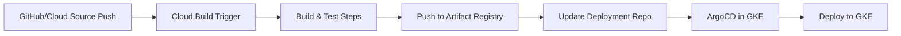

# How to Create a Complete Google Cloud Build + ArgoCD Pipeline

Author: [nawazdhandala](https://github.com/nawazdhandala)

Tags: ArgoCD, GitOps, Kubernetes, Google Cloud Build, CI/CD

Description: Learn how to build a complete CI/CD pipeline using Google Cloud Build for continuous integration with ArgoCD for GitOps deployment to GKE and other Kubernetes clusters.

---

Google Cloud Build is a serverless CI/CD platform that runs builds in Google Cloud. It integrates natively with Google Kubernetes Engine (GKE), Artifact Registry, and Cloud Source Repositories. Combined with ArgoCD for GitOps deployment, you get a pipeline where Cloud Build handles the build phase and ArgoCD handles the deployment phase to GKE.

This guide covers building a production Cloud Build + ArgoCD pipeline.

## Architecture

Cloud Build runs in Google Cloud. ArgoCD runs in your GKE cluster. Artifact Registry stores the container images:



## Cloud Build Configuration

The `cloudbuild.yaml` in your application repository:

```yaml
# cloudbuild.yaml
steps:
  # Step 1: Run tests
  - id: 'test'
    name: 'node:20-alpine'
    entrypoint: 'sh'
    args:
      - '-c'
      - |
        npm ci
        npm run test -- --ci
        npm run lint

  # Step 2: Build Docker image
  - id: 'build'
    name: 'gcr.io/cloud-builders/docker'
    args:
      - 'build'
      - '-t'
      - '${_REGION}-docker.pkg.dev/${PROJECT_ID}/${_REPO}/${_IMAGE}:${SHORT_SHA}'
      - '-t'
      - '${_REGION}-docker.pkg.dev/${PROJECT_ID}/${_REPO}/${_IMAGE}:latest'
      - '--cache-from'
      - '${_REGION}-docker.pkg.dev/${PROJECT_ID}/${_REPO}/${_IMAGE}:latest'
      - '.'
    waitFor: ['test']

  # Step 3: Push to Artifact Registry
  - id: 'push'
    name: 'gcr.io/cloud-builders/docker'
    args:
      - 'push'
      - '--all-tags'
      - '${_REGION}-docker.pkg.dev/${PROJECT_ID}/${_REPO}/${_IMAGE}'
    waitFor: ['build']

  # Step 4: Security scan with Container Analysis
  - id: 'scan'
    name: 'gcr.io/cloud-builders/gcloud'
    entrypoint: 'bash'
    args:
      - '-c'
      - |
        gcloud artifacts docker images scan \
          ${_REGION}-docker.pkg.dev/${PROJECT_ID}/${_REPO}/${_IMAGE}:${SHORT_SHA} \
          --format='value(response.scan)' > /workspace/scan_id.txt

        gcloud artifacts docker images list-vulnerabilities \
          $(cat /workspace/scan_id.txt) \
          --format='table(vulnerability.effectiveSeverity, vulnerability.cvssScore, vulnerability.packageIssue.affectedPackage, vulnerability.packageIssue.fixedPackage, vulnerability.shortDescription)' \
          --severity=CRITICAL,HIGH
    waitFor: ['push']
    # Allow scan failures without blocking the build
    allowFailure: true

  # Step 5: Update deployment repository
  - id: 'update-manifests'
    name: 'gcr.io/cloud-builders/git'
    entrypoint: 'bash'
    secretEnv: ['DEPLOY_SSH_KEY']
    args:
      - '-c'
      - |
        # Configure SSH
        mkdir -p ~/.ssh
        echo "$$DEPLOY_SSH_KEY" > ~/.ssh/id_rsa
        chmod 600 ~/.ssh/id_rsa
        ssh-keyscan github.com >> ~/.ssh/known_hosts

        # Clone deployment repo
        git clone git@github.com:myorg/k8s-deployments.git /workspace/deploy
        cd /workspace/deploy

        # Update image tag
        IMAGE="${_REGION}-docker.pkg.dev/${PROJECT_ID}/${_REPO}/${_IMAGE}"
        sed -i "s|image: ${IMAGE}:.*|image: ${IMAGE}:${SHORT_SHA}|" \
            apps/api-service/deployment.yaml

        # Commit and push
        git config user.name "Cloud Build"
        git config user.email "cloudbuild@${PROJECT_ID}.iam.gserviceaccount.com"
        git add .
        git commit -m "Deploy api-service ${SHORT_SHA}

        Cloud Build: https://console.cloud.google.com/cloud-build/builds/${BUILD_ID}
        Commit: ${COMMIT_SHA}"
        git push origin main
    waitFor: ['push']

substitutions:
  _REGION: us-central1
  _REPO: containers
  _IMAGE: api-service

options:
  machineType: 'E2_HIGHCPU_8'
  logging: CLOUD_LOGGING_ONLY

availableSecrets:
  secretManager:
    - versionName: projects/${PROJECT_ID}/secrets/deploy-ssh-key/versions/latest
      env: 'DEPLOY_SSH_KEY'

images:
  - '${_REGION}-docker.pkg.dev/${PROJECT_ID}/${_REPO}/${_IMAGE}:${SHORT_SHA}'
  - '${_REGION}-docker.pkg.dev/${PROJECT_ID}/${_REPO}/${_IMAGE}:latest'
```

## Cloud Build Trigger

Set up the trigger using gcloud:

```bash
# Create the build trigger
gcloud builds triggers create github \
    --name="api-service-deploy" \
    --repo-name="api-service" \
    --repo-owner="myorg" \
    --branch-pattern="^main$" \
    --build-config="cloudbuild.yaml" \
    --substitutions="_REGION=us-central1,_REPO=containers,_IMAGE=api-service"
```

Or define it declaratively for infrastructure-as-code:

```yaml
# terraform/cloud-build-trigger.tf would be the Terraform equivalent,
# but here is the YAML representation
resource:
  type: cloudbuild.googleapis.com/Trigger
  properties:
    name: api-service-deploy
    github:
      owner: myorg
      name: api-service
      push:
        branch: ^main$
    filename: cloudbuild.yaml
    substitutions:
      _REGION: us-central1
      _REPO: containers
      _IMAGE: api-service
```

## GKE Deployment Manifests

The deployment manifests use GKE-specific features like Workload Identity:

```yaml
# apps/api-service/deployment.yaml
apiVersion: apps/v1
kind: Deployment
metadata:
  name: api-service
  namespace: production
spec:
  replicas: 3
  selector:
    matchLabels:
      app: api-service
  template:
    metadata:
      labels:
        app: api-service
    spec:
      serviceAccountName: api-service
      nodeSelector:
        cloud.google.com/gke-nodepool: application-pool
      containers:
        - name: api-service
          image: us-central1-docker.pkg.dev/myproject/containers/api-service:abc1234
          ports:
            - containerPort: 8080
          env:
            - name: GOOGLE_CLOUD_PROJECT
              value: myproject
          resources:
            requests:
              cpu: 200m
              memory: 256Mi
            limits:
              cpu: "1"
              memory: 512Mi
          readinessProbe:
            httpGet:
              path: /healthz
              port: 8080
---
# Workload Identity binding
apiVersion: v1
kind: ServiceAccount
metadata:
  name: api-service
  namespace: production
  annotations:
    iam.gke.io/gcp-service-account: api-service@myproject.iam.gserviceaccount.com
```

## ArgoCD Application for GKE

```yaml
# argocd/api-service-app.yaml
apiVersion: argoproj.io/v1alpha1
kind: Application
metadata:
  name: api-service
  namespace: argocd
spec:
  project: applications
  source:
    repoURL: https://github.com/myorg/k8s-deployments.git
    path: apps/api-service
    targetRevision: main
  destination:
    server: https://kubernetes.default.svc
    namespace: production
  syncPolicy:
    automated:
      selfHeal: true
      prune: true
    syncOptions:
      - CreateNamespace=true
    retry:
      limit: 3
      backoff:
        duration: 5s
        factor: 2
        maxDuration: 3m
```

## Multi-Environment with Cloud Build

Handle staging and production deployments:

```yaml
# cloudbuild-staging.yaml
steps:
  - id: 'test'
    name: 'node:20-alpine'
    entrypoint: 'sh'
    args:
      - '-c'
      - 'npm ci && npm test'

  - id: 'build-push'
    name: 'gcr.io/cloud-builders/docker'
    args: ['build', '-t', '${_REGION}-docker.pkg.dev/${PROJECT_ID}/${_REPO}/${_IMAGE}:${SHORT_SHA}', '.']

  - id: 'push'
    name: 'gcr.io/cloud-builders/docker'
    args: ['push', '${_REGION}-docker.pkg.dev/${PROJECT_ID}/${_REPO}/${_IMAGE}:${SHORT_SHA}']

  - id: 'deploy-staging'
    name: 'gcr.io/cloud-builders/git'
    entrypoint: 'bash'
    secretEnv: ['DEPLOY_SSH_KEY']
    args:
      - '-c'
      - |
        mkdir -p ~/.ssh
        echo "$$DEPLOY_SSH_KEY" > ~/.ssh/id_rsa
        chmod 600 ~/.ssh/id_rsa
        ssh-keyscan github.com >> ~/.ssh/known_hosts

        git clone git@github.com:myorg/k8s-deployments.git /workspace/deploy
        cd /workspace/deploy/apps/api-service/overlays/staging

        # Update staging overlay
        kustomize edit set image \
          "${_REGION}-docker.pkg.dev/${PROJECT_ID}/${_REPO}/${_IMAGE}=${_REGION}-docker.pkg.dev/${PROJECT_ID}/${_REPO}/${_IMAGE}:${SHORT_SHA}"

        cd /workspace/deploy
        git config user.name "Cloud Build"
        git config user.email "cloudbuild@${PROJECT_ID}.iam.gserviceaccount.com"
        git add .
        git commit -m "Deploy api-service ${SHORT_SHA} to staging"
        git push origin main

availableSecrets:
  secretManager:
    - versionName: projects/${PROJECT_ID}/secrets/deploy-ssh-key/versions/latest
      env: 'DEPLOY_SSH_KEY'
```

For production, use a separate trigger with a manual approval step through Cloud Deploy:

```yaml
# cloudbuild-production.yaml
steps:
  - id: 'deploy-production'
    name: 'gcr.io/cloud-builders/git'
    entrypoint: 'bash'
    secretEnv: ['DEPLOY_SSH_KEY']
    args:
      - '-c'
      - |
        mkdir -p ~/.ssh
        echo "$$DEPLOY_SSH_KEY" > ~/.ssh/id_rsa
        chmod 600 ~/.ssh/id_rsa
        ssh-keyscan github.com >> ~/.ssh/known_hosts

        git clone git@github.com:myorg/k8s-deployments.git /workspace/deploy
        cd /workspace/deploy/apps/api-service/overlays/production

        kustomize edit set image \
          "${_REGION}-docker.pkg.dev/${PROJECT_ID}/${_REPO}/${_IMAGE}=${_REGION}-docker.pkg.dev/${PROJECT_ID}/${_REPO}/${_IMAGE}:${_TAG}"

        cd /workspace/deploy
        git config user.name "Cloud Build"
        git config user.email "cloudbuild@${PROJECT_ID}.iam.gserviceaccount.com"
        git add .
        git commit -m "Deploy api-service ${_TAG} to production"
        git push origin main
```

Trigger production deployment manually:

```bash
gcloud builds submit --config=cloudbuild-production.yaml \
    --substitutions="_TAG=abc1234,_REGION=us-central1,_REPO=containers,_IMAGE=api-service" \
    --no-source
```

## Artifact Registry Authentication for ArgoCD

ArgoCD Image Updater needs access to Artifact Registry. Use Workload Identity:

```yaml
apiVersion: v1
kind: ServiceAccount
metadata:
  name: argocd-image-updater
  namespace: argocd
  annotations:
    iam.gke.io/gcp-service-account: argocd-image-updater@myproject.iam.gserviceaccount.com
```

Grant the GCP service account Artifact Registry Reader access:

```bash
gcloud artifacts repositories add-iam-policy-binding containers \
    --location=us-central1 \
    --member="serviceAccount:argocd-image-updater@myproject.iam.gserviceaccount.com" \
    --role="roles/artifactregistry.reader"
```

## Cloud Build Notifications

Send build status to Pub/Sub and then to Slack or other services:

```yaml
# Cloud Build automatically publishes to cloud-builds topic
# Create a Cloud Function to forward to Slack

# cloudbuild-notifier.yaml
apiVersion: cloud-build-notifiers/v1
kind: SlackNotifier
metadata:
  name: build-notifier
spec:
  notification:
    filter: build.status in [Build.Status.SUCCESS, Build.Status.FAILURE]
    delivery:
      webhookUrl:
        secretRef: slack-webhook
    template:
      type: golang
      uri: gs://my-notifications/slack-template.json
  secrets:
    - name: slack-webhook
      value: projects/myproject/secrets/slack-webhook/versions/latest
```

## Cost Optimization

Cloud Build charges per build minute. Optimize costs by:

```yaml
options:
  # Use smaller machine for lightweight steps
  machineType: 'E2_MEDIUM'

  # Only log to Cloud Logging (skip Cloud Storage)
  logging: CLOUD_LOGGING_ONLY

  # Use Kaniko cache for faster Docker builds
  env:
    - 'DOCKER_BUILDKIT=1'
```

## Summary

Google Cloud Build + ArgoCD creates a serverless CI pipeline with GitOps deployment to GKE. Cloud Build handles building, testing, scanning, and pushing images to Artifact Registry with zero infrastructure to manage. ArgoCD in GKE watches the deployment repository and syncs changes automatically. Workload Identity provides secure, keyless authentication between GCP services and Kubernetes workloads. This combination is ideal for teams invested in the Google Cloud ecosystem who want GitOps for their Kubernetes deployments.
