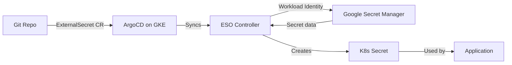

# How to Manage Secrets with ArgoCD and Google Secret Manager

Author: [nawazdhandala](https://github.com/nawazdhandala)

Tags: ArgoCD, GitOps, Kubernetes, GCP, Secret Manager

Description: Learn how to integrate Google Secret Manager with ArgoCD on GKE using Workload Identity and the External Secrets Operator for cloud-native secret management.

---

Google Secret Manager is Google Cloud's managed secret storage service. When running ArgoCD on Google Kubernetes Engine (GKE), it provides a natural integration point for managing application secrets. This guide walks through setting up the External Secrets Operator with Google Workload Identity to pull secrets from Google Secret Manager into your ArgoCD-managed applications.

## Architecture



## Prerequisites

- GKE cluster with Workload Identity enabled
- ArgoCD installed on the cluster
- Google Secret Manager API enabled
- gcloud CLI configured

### Enable Required APIs

```bash
gcloud services enable secretmanager.googleapis.com
gcloud services enable container.googleapis.com
gcloud services enable iam.googleapis.com
```

### Enable Workload Identity on GKE

```bash
# For new clusters
gcloud container clusters create my-cluster \
  --region us-central1 \
  --workload-pool=my-project.svc.id.goog

# For existing clusters
gcloud container clusters update my-cluster \
  --region us-central1 \
  --workload-pool=my-project.svc.id.goog
```

## Setting Up IAM

### Create a Google Service Account

```bash
export PROJECT_ID=$(gcloud config get-value project)

# Create a service account for ESO
gcloud iam service-accounts create eso-sa \
  --display-name="External Secrets Operator"

# Grant access to Secret Manager
gcloud projects add-iam-policy-binding $PROJECT_ID \
  --member="serviceAccount:eso-sa@${PROJECT_ID}.iam.gserviceaccount.com" \
  --role="roles/secretmanager.secretAccessor"
```

### Bind Workload Identity

```bash
# Allow the Kubernetes service account to impersonate the Google service account
gcloud iam service-accounts add-iam-policy-binding \
  eso-sa@${PROJECT_ID}.iam.gserviceaccount.com \
  --role roles/iam.workloadIdentityUser \
  --member "serviceAccount:${PROJECT_ID}.svc.id.goog[external-secrets/external-secrets]"
```

## Installing External Secrets Operator

Deploy ESO with ArgoCD:

```yaml
apiVersion: argoproj.io/v1alpha1
kind: Application
metadata:
  name: external-secrets
  namespace: argocd
spec:
  project: default
  source:
    repoURL: https://charts.external-secrets.io
    chart: external-secrets
    targetRevision: 0.10.0
    helm:
      values: |
        installCRDs: true
        serviceAccount:
          create: true
          name: external-secrets
          annotations:
            iam.gke.io/gcp-service-account: eso-sa@PROJECT_ID.iam.gserviceaccount.com
  destination:
    server: https://kubernetes.default.svc
    namespace: external-secrets
  syncPolicy:
    automated:
      prune: true
      selfHeal: true
    syncOptions:
      - CreateNamespace=true
```

## Creating the ClusterSecretStore

```yaml
apiVersion: external-secrets.io/v1beta1
kind: ClusterSecretStore
metadata:
  name: gcp-secret-manager
spec:
  provider:
    gcpsm:
      projectID: my-project-id
      auth:
        workloadIdentity:
          clusterLocation: us-central1
          clusterName: my-cluster
          clusterProjectID: my-project-id
          serviceAccountRef:
            name: external-secrets
            namespace: external-secrets
```

Verify the store:

```bash
kubectl get clustersecretstore gcp-secret-manager
# STATUS: Valid
```

## Creating Secrets in Google Secret Manager

```bash
# Create a simple secret
echo -n "super-secret-password" | gcloud secrets create production-db-password \
  --data-file=- \
  --replication-policy="automatic"

# Create a JSON secret with multiple values
echo -n '{"DB_PASSWORD":"super-secret","API_KEY":"key-12345","REDIS_URL":"redis://redis:6379"}' | \
  gcloud secrets create production-my-app \
  --data-file=- \
  --replication-policy="automatic"

# Add a version to an existing secret
echo -n "new-password" | gcloud secrets versions add production-db-password --data-file=-

# Add labels for organization
gcloud secrets update production-db-password \
  --update-labels="app=my-app,env=production"
```

## Syncing Secrets with ExternalSecrets

### Simple Secret

```yaml
apiVersion: external-secrets.io/v1beta1
kind: ExternalSecret
metadata:
  name: db-password
  namespace: app
  annotations:
    argocd.argoproj.io/sync-wave: "-1"
spec:
  refreshInterval: 1h
  secretStoreRef:
    name: gcp-secret-manager
    kind: ClusterSecretStore
  target:
    name: db-password
    creationPolicy: Owner
  data:
    - secretKey: password
      remoteRef:
        key: production-db-password
```

### JSON Secret with Property Extraction

```yaml
apiVersion: external-secrets.io/v1beta1
kind: ExternalSecret
metadata:
  name: my-app-secrets
  namespace: app
spec:
  refreshInterval: 1h
  secretStoreRef:
    name: gcp-secret-manager
    kind: ClusterSecretStore
  target:
    name: my-app-secrets
  data:
    - secretKey: DB_PASSWORD
      remoteRef:
        key: production-my-app
        property: DB_PASSWORD
    - secretKey: API_KEY
      remoteRef:
        key: production-my-app
        property: API_KEY
    - secretKey: REDIS_URL
      remoteRef:
        key: production-my-app
        property: REDIS_URL
```

### Extract All Properties

```yaml
apiVersion: external-secrets.io/v1beta1
kind: ExternalSecret
metadata:
  name: my-app-all-secrets
  namespace: app
spec:
  refreshInterval: 1h
  secretStoreRef:
    name: gcp-secret-manager
    kind: ClusterSecretStore
  target:
    name: my-app-secrets
  dataFrom:
    - extract:
        key: production-my-app
```

### Using Specific Secret Versions

Google Secret Manager supports secret versions. Pin to a specific version for stability:

```yaml
apiVersion: external-secrets.io/v1beta1
kind: ExternalSecret
metadata:
  name: pinned-secret
  namespace: app
spec:
  refreshInterval: 1h
  secretStoreRef:
    name: gcp-secret-manager
    kind: ClusterSecretStore
  target:
    name: pinned-secret
  data:
    - secretKey: DB_PASSWORD
      remoteRef:
        key: production-db-password
        version: "3"  # Pin to version 3
```

Or use `latest` (the default) to always get the newest version:

```yaml
remoteRef:
  key: production-db-password
  version: "latest"
```

## Using Find to Discover Secrets by Labels

```yaml
apiVersion: external-secrets.io/v1beta1
kind: ExternalSecret
metadata:
  name: discover-app-secrets
  namespace: app
spec:
  refreshInterval: 1h
  secretStoreRef:
    name: gcp-secret-manager
    kind: ClusterSecretStore
  target:
    name: discovered-secrets
  dataFrom:
    - find:
        name:
          regexp: "^production-my-app-.*"
```

## Multi-Environment Configuration

Use different GCP projects for different environments:

```yaml
# Production store
apiVersion: external-secrets.io/v1beta1
kind: ClusterSecretStore
metadata:
  name: gcp-sm-production
spec:
  provider:
    gcpsm:
      projectID: my-project-production
      auth:
        workloadIdentity:
          clusterLocation: us-central1
          clusterName: prod-cluster
          clusterProjectID: my-project-production
          serviceAccountRef:
            name: external-secrets
            namespace: external-secrets
---
# Staging store
apiVersion: external-secrets.io/v1beta1
kind: ClusterSecretStore
metadata:
  name: gcp-sm-staging
spec:
  provider:
    gcpsm:
      projectID: my-project-staging
      auth:
        workloadIdentity:
          clusterLocation: us-central1
          clusterName: staging-cluster
          clusterProjectID: my-project-staging
          serviceAccountRef:
            name: external-secrets
            namespace: external-secrets
```

## ArgoCD Application with ExternalSecrets

Complete ArgoCD application that includes ExternalSecrets:

```yaml
apiVersion: argoproj.io/v1alpha1
kind: Application
metadata:
  name: my-app-production
  namespace: argocd
spec:
  project: default
  source:
    repoURL: https://github.com/your-org/manifests.git
    path: my-app/overlays/production
    targetRevision: main
  destination:
    server: https://kubernetes.default.svc
    namespace: app-production
  syncPolicy:
    automated:
      prune: true
      selfHeal: true
    syncOptions:
      - CreateNamespace=true
```

## Automatic Secret Rotation

Google Secret Manager supports automatic rotation with Cloud Functions:

```bash
# Create a rotation schedule
gcloud secrets update production-db-password \
  --rotation-period="30d" \
  --next-rotation-time="2026-04-01T00:00:00Z" \
  --topics="projects/my-project/topics/secret-rotation"
```

ESO will pick up the new version on the next refresh cycle. Set a shorter refresh interval for frequently rotated secrets:

```yaml
spec:
  refreshInterval: 15m
```

## Monitoring

```bash
# Check ExternalSecret sync status
kubectl get externalsecret -n app -o wide

# View Secret Manager audit logs
gcloud logging read 'resource.type="audited_resource" AND protoPayload.serviceName="secretmanager.googleapis.com"' \
  --limit 20 \
  --format json

# Monitor ESO metrics (if Prometheus is set up)
kubectl port-forward -n external-secrets svc/external-secrets-metrics 8080:8080
```

## Conclusion

Google Secret Manager with ESO and Workload Identity provides passwordless, secure secret management for ArgoCD on GKE. The integration follows GCP's recommended practices for workload identity, eliminating the need for static credentials. Secret versioning and automatic rotation ensure your applications always have up-to-date credentials. Combined with ArgoCD's GitOps model, only secret references live in Git while actual values stay safely in Google Cloud.

For alternative cloud integrations, see our guides on [using AWS Secrets Manager with ArgoCD](https://oneuptime.com/blog/post/2026-02-26-argocd-aws-secrets-manager/view) and [using Azure Key Vault with ArgoCD](https://oneuptime.com/blog/post/2026-02-26-argocd-azure-key-vault-secrets/view).
