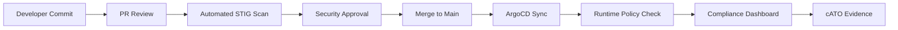

# ArgoCD for Government: FedRAMP Compliant GitOps

Author: [nawazdhandala](https://github.com/nawazdhandala)

Tags: ArgoCD, GitOps, Kubernetes, FedRAMP, Government

Description: Learn how to deploy and operate ArgoCD in government environments with FedRAMP compliance requirements, including FIPS encryption, audit logging, and strict RBAC controls.

---

Government agencies and contractors adopting Kubernetes face a unique set of compliance requirements that commercial organizations rarely encounter. FedRAMP (Federal Risk and Authorization Management Program), FISMA, NIST 800-53, and DISA STIGs all impose strict controls on how software is deployed, who can deploy it, and how every action is tracked. ArgoCD, with its declarative GitOps model, actually aligns remarkably well with these requirements - but only if you configure it correctly.

This guide walks through building a FedRAMP-compliant ArgoCD deployment from the ground up.

## Why GitOps Fits Government Compliance

Traditional deployment pipelines in government environments rely on change advisory boards, manual approvals, and extensive documentation. GitOps with ArgoCD flips this model by making Git the single source of truth. Every change is a commit. Every commit has an author. Every deployment is traceable.

This maps directly to NIST 800-53 controls:

- **CM-2 (Baseline Configuration)**: Git repositories define the baseline
- **CM-3 (Configuration Change Control)**: Pull requests enforce change control
- **AU-2 (Audit Events)**: Git history plus ArgoCD events provide comprehensive audit trails
- **AC-6 (Least Privilege)**: RBAC policies enforce minimal access

## FIPS 140-2 Compliant Deployment

Government systems operating at moderate or high impact levels must use FIPS 140-2 validated cryptographic modules. The default ArgoCD container images use standard Go crypto libraries, which are not FIPS validated.

You need to build ArgoCD with BoringCrypto (Go's FIPS-validated crypto module):

```yaml
# Dockerfile.fips for ArgoCD with FIPS-compliant crypto
FROM golang:1.22-bullseye AS builder

# Enable FIPS-compliant BoringCrypto
ENV GOEXPERIMENT=boringcrypto
ENV CGO_ENABLED=1

# Build ArgoCD from source with BoringCrypto
RUN git clone --branch v2.13.0 https://github.com/argoproj/argo-cd.git /src
WORKDIR /src
RUN make argocd-all

FROM registry.access.redhat.com/ubi9/ubi-minimal:latest
# Copy FIPS-compiled binaries
COPY --from=builder /src/dist/argocd /usr/local/bin/argocd
```

Then reference your custom image in the ArgoCD deployment:

```yaml
# argocd-server-deployment-patch.yaml
apiVersion: apps/v1
kind: Deployment
metadata:
  name: argocd-server
spec:
  template:
    spec:
      containers:
      - name: argocd-server
        image: your-registry.gov/argocd:v2.13.0-fips
        env:
        # Force TLS 1.2 minimum (FIPS requirement)
        - name: ARGOCD_TLS_MIN_VERSION
          value: "1.2"
        # Restrict to FIPS-approved cipher suites
        - name: ARGOCD_TLS_CIPHERS
          value: "TLS_ECDHE_RSA_WITH_AES_256_GCM_SHA384,TLS_ECDHE_RSA_WITH_AES_128_GCM_SHA256"
```

## Network Segmentation and Air-Gapped Operation

Most government Kubernetes clusters operate in restricted networks. ArgoCD needs access to Git repositories and container registries, but these are typically internal mirrors rather than public services.

Configure ArgoCD for air-gapped operation:

```yaml
# argocd-cm ConfigMap for air-gapped environments
apiVersion: v1
kind: ConfigMap
metadata:
  name: argocd-cm
  namespace: argocd
data:
  # Internal Git server only
  repositories: |
    - url: https://gitlab.internal.gov/platform/manifests.git
      type: git
      passwordSecret:
        name: repo-creds
        key: password
      usernameSecret:
        name: repo-creds
        key: username
      # Custom CA for internal PKI
      tlsClientCertDataSecret:
        name: repo-tls
        key: cert
      tlsClientCertKeySecret:
        name: repo-tls
        key: key

  # Disable external connectivity checks
  statusbadge.enabled: "false"

  # Use internal Helm registries
  helm.repositories: |
    - url: https://charts.internal.gov
      name: internal-charts
      type: helm
```

For the Dex identity connector, point to your agency's internal identity provider:

```yaml
# dex-config for government IdP integration
apiVersion: v1
kind: ConfigMap
metadata:
  name: argocd-cm
data:
  dex.config: |
    connectors:
    - type: ldap
      name: Agency LDAP
      id: agency-ldap
      config:
        host: ldap.agency.gov:636
        insecureNoSSL: false
        insecureSkipVerify: false
        rootCAData: <base64-encoded-ca-cert>
        bindDN: cn=argocd-svc,ou=service-accounts,dc=agency,dc=gov
        bindPW: $dex.ldap.bindPW
        userSearch:
          baseDN: ou=users,dc=agency,dc=gov
          filter: "(objectClass=person)"
          username: sAMAccountName
          idAttr: DN
          emailAttr: mail
          nameAttr: cn
        groupSearch:
          baseDN: ou=groups,dc=agency,dc=gov
          filter: "(objectClass=group)"
          userMatchers:
          - userAttr: DN
            groupAttr: member
          nameAttr: cn
```

## Strict RBAC for Separation of Duties

FedRAMP requires separation of duties - the person who writes code should not be the same person who deploys it. ArgoCD's RBAC system supports this pattern natively.

```yaml
# argocd-rbac-cm ConfigMap
apiVersion: v1
kind: ConfigMap
metadata:
  name: argocd-rbac-cm
  namespace: argocd
data:
  # Default policy: deny everything
  policy.default: role:none

  policy.csv: |
    # Developers can view applications but not sync
    p, role:developer, applications, get, */*, allow
    p, role:developer, applications, list, */*, allow
    p, role:developer, logs, get, */*, allow

    # Release managers can sync but not create/delete
    p, role:release-manager, applications, get, */*, allow
    p, role:release-manager, applications, list, */*, allow
    p, role:release-manager, applications, sync, */*, allow
    p, role:release-manager, applications, action/*, */*, allow

    # Security team can view everything, modify nothing
    p, role:security-auditor, applications, get, */*, allow
    p, role:security-auditor, applications, list, */*, allow
    p, role:security-auditor, projects, get, *, allow
    p, role:security-auditor, repositories, get, *, allow
    p, role:security-auditor, clusters, get, *, allow

    # Platform admins have full access
    p, role:platform-admin, applications, *, */*, allow
    p, role:platform-admin, projects, *, *, allow
    p, role:platform-admin, repositories, *, *, allow
    p, role:platform-admin, clusters, *, *, allow

    # Map LDAP groups to ArgoCD roles
    g, agency-developers, role:developer
    g, agency-release-mgrs, role:release-manager
    g, agency-security, role:security-auditor
    g, agency-platform, role:platform-admin
```

## Comprehensive Audit Logging

Every FedRAMP system must log authentication events, authorization decisions, and configuration changes. ArgoCD produces these logs, but you need to ensure they are captured and forwarded to your SIEM.

```yaml
# argocd-cmd-params-cm for verbose audit logging
apiVersion: v1
kind: ConfigMap
metadata:
  name: argocd-cmd-params-cm
  namespace: argocd
data:
  # Enable detailed audit logging on API server
  server.log.level: info
  server.log.format: json

  # Log RBAC enforcement decisions
  controller.log.level: info

  # Log every repo access
  reposerver.log.level: info
```

Ship these logs to your government-approved SIEM using a sidecar or DaemonSet-based log collector:

```yaml
# Fluentd sidecar for ArgoCD server pod
apiVersion: apps/v1
kind: Deployment
metadata:
  name: argocd-server
spec:
  template:
    spec:
      containers:
      - name: argocd-server
        # ... existing config ...
        volumeMounts:
        - name: audit-logs
          mountPath: /var/log/argocd
      - name: log-shipper
        image: your-registry.gov/fluentd:fips
        volumeMounts:
        - name: audit-logs
          mountPath: /var/log/argocd
          readOnly: true
        - name: fluentd-config
          mountPath: /etc/fluentd
        env:
        - name: SIEM_ENDPOINT
          value: "https://splunk.agency.gov:8088"
      volumes:
      - name: audit-logs
        emptyDir: {}
      - name: fluentd-config
        configMap:
          name: argocd-fluentd-config
```

## Automated Compliance Scanning

Integrate policy engines to enforce STIG compliance on every deployment ArgoCD manages:

```yaml
# Kyverno policy to enforce DISA STIG container requirements
apiVersion: kyverno.io/v1
kind: ClusterPolicy
metadata:
  name: disa-stig-container-requirements
spec:
  validationFailureAction: Enforce
  rules:
  - name: require-non-root
    match:
      any:
      - resources:
          kinds:
          - Pod
    validate:
      message: "STIG V-222387: Containers must run as non-root"
      pattern:
        spec:
          containers:
          - securityContext:
              runAsNonRoot: true

  - name: require-read-only-root
    match:
      any:
      - resources:
          kinds:
          - Pod
    validate:
      message: "STIG V-222388: Root filesystem must be read-only"
      pattern:
        spec:
          containers:
          - securityContext:
              readOnlyRootFilesystem: true
```

## Continuous Authority to Operate (cATO)

The real power of ArgoCD in government is enabling continuous Authority to Operate. Instead of massive ATO packages that take months to review, GitOps lets you demonstrate continuous compliance:



Every step in this pipeline generates auditable evidence. Git provides the change history. ArgoCD provides the deployment record. Policy engines provide the compliance verification. Together, they create a continuous compliance record that satisfies even the most demanding ATO reviewers.

## Production Hardening Checklist

Before going to production in a government environment, verify these settings:

1. All ArgoCD binaries compiled with FIPS-validated crypto
2. TLS 1.2 minimum enforced on all endpoints
3. Internal CA certificates configured for all connections
4. RBAC default policy set to deny
5. Separation of duties enforced through role mappings
6. All logs forwarded to approved SIEM
7. Network policies restrict ArgoCD pod communication
8. Secrets encrypted at rest using KMS
9. Container images pulled from approved internal registry
10. Policy engine enforcing STIG requirements on all managed resources

For monitoring your ArgoCD deployment and ensuring it meets uptime SLAs required by government contracts, consider integrating with [OneUptime](https://oneuptime.com/blog/post/2026-02-09-argocd-monitoring-prometheus/view) to get real-time visibility into sync failures and deployment health.

## Conclusion

ArgoCD is an excellent fit for government Kubernetes deployments because its GitOps model naturally produces the audit trails, change controls, and traceability that compliance frameworks demand. The key challenges are FIPS crypto compliance, air-gapped operation, and strict RBAC configuration - all of which are solvable with the patterns shown above. By combining ArgoCD with policy engines and proper logging infrastructure, you can build a deployment platform that satisfies FedRAMP requirements while still giving your teams the velocity of modern DevOps practices.
