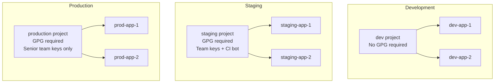

# How to Configure GPG Verification per Project in ArgoCD

Author: [nawazdhandala](https://github.com/nawazdhandala)

Tags: ArgoCD, GitOps, Kubernetes, GnuPG, Security

Description: Learn how to configure different GPG signature verification policies for different ArgoCD projects, enabling strict verification for production while keeping development flexible.

---

Not every ArgoCD project needs the same level of commit signing enforcement. Production environments demand strict GPG verification, while development and staging environments may need more flexibility. ArgoCD's project-level GPG configuration lets you set different verification policies for different projects - requiring signatures for production, recommending them for staging, and leaving them optional for development.

This guide covers implementing tiered GPG verification policies across multiple ArgoCD projects.

## Per-Project Verification Architecture

The typical setup looks like this:



## Project Configuration Examples

### Development Project - No Verification

Development projects allow rapid iteration without signing overhead:

```yaml
apiVersion: argoproj.io/v1alpha1
kind: AppProject
metadata:
  name: development
  namespace: argocd
spec:
  description: Development environment - no GPG verification
  sourceRepos:
    - https://github.com/myorg/dev-configs.git
    - https://github.com/myorg/feature-*.git
  destinations:
    - namespace: 'dev-*'
      server: https://kubernetes.default.svc
  # No signatureKeys - GPG verification is disabled
  clusterResourceWhitelist:
    - group: ''
      kind: Namespace
```

### Staging Project - Team Verification

Staging requires signatures but accepts keys from the entire development team plus CI bots:

```yaml
apiVersion: argoproj.io/v1alpha1
kind: AppProject
metadata:
  name: staging
  namespace: argocd
spec:
  description: Staging environment - team GPG verification
  sourceRepos:
    - https://github.com/myorg/staging-configs.git
  destinations:
    - namespace: 'staging-*'
      server: https://kubernetes.default.svc
  signatureKeys:
    # All developers
    - keyID: 3AA5C34371567BD2   # Alice (developer)
    - keyID: 9B2C5A6E8F3D1E7A   # Bob (developer)
    - keyID: A1B2C3D4E5F6A7B8   # Charlie (developer)
    - keyID: C1D2E3F4A5B6C7D8   # Diana (developer)
    # CI systems
    - keyID: 1C4D5E6F7A8B9C0D   # CI Bot
    - keyID: 2D3E4F5A6B7C8D9E   # Image Updater
    # Git platform
    - keyID: 4AEE18F83AFDEB23   # GitHub merge commits
```

### Production Project - Restricted Verification

Production only accepts signatures from senior engineers and the release process:

```yaml
apiVersion: argoproj.io/v1alpha1
kind: AppProject
metadata:
  name: production
  namespace: argocd
spec:
  description: Production environment - restricted GPG verification
  sourceRepos:
    - https://github.com/myorg/production-configs.git
  destinations:
    - namespace: 'prod-*'
      server: https://production-cluster:6443
  signatureKeys:
    # Only senior team members
    - keyID: 3AA5C34371567BD2   # Alice (Tech Lead)
    - keyID: 9B2C5A6E8F3D1E7A   # Bob (SRE Lead)
    # Release automation only
    - keyID: 2D3E4F5A6B7C8D9E   # Release Bot
    # GitHub merge commits (for approved PRs)
    - keyID: 4AEE18F83AFDEB23   # GitHub web-flow
  # Restrict allowed resource types in production
  clusterResourceWhitelist:
    - group: ''
      kind: Namespace
  namespaceResourceBlacklist:
    - group: ''
      kind: ResourceQuota
```

### Infrastructure Project - Highest Security

For infrastructure-level applications (monitoring, networking, security tools), use the most restrictive policy:

```yaml
apiVersion: argoproj.io/v1alpha1
kind: AppProject
metadata:
  name: infrastructure
  namespace: argocd
spec:
  description: Infrastructure - highest security GPG verification
  sourceRepos:
    - https://github.com/myorg/infrastructure.git
  destinations:
    - namespace: 'kube-system'
      server: https://kubernetes.default.svc
    - namespace: 'monitoring'
      server: https://kubernetes.default.svc
    - namespace: 'argocd'
      server: https://kubernetes.default.svc
  signatureKeys:
    # Only infrastructure team leads
    - keyID: 9B2C5A6E8F3D1E7A   # Bob (SRE Lead)
    - keyID: E1F2A3B4C5D6E7F8   # Eve (Security Lead)
    # No CI bots allowed - all changes must be human-signed
```

## Managing Keys Across Projects

### Centralized Key Import

Import all keys once into ArgoCD. They are available to all projects:

```yaml
# argocd-gpg-keys-cm.yaml - all organization keys
apiVersion: v1
kind: ConfigMap
metadata:
  name: argocd-gpg-keys-cm
  namespace: argocd
  labels:
    app.kubernetes.io/part-of: argocd
data:
  # Developer keys
  3AA5C34371567BD2: |
    -----BEGIN PGP PUBLIC KEY BLOCK-----
    ...alice's key...
    -----END PGP PUBLIC KEY BLOCK-----

  9B2C5A6E8F3D1E7A: |
    -----BEGIN PGP PUBLIC KEY BLOCK-----
    ...bob's key...
    -----END PGP PUBLIC KEY BLOCK-----

  A1B2C3D4E5F6A7B8: |
    -----BEGIN PGP PUBLIC KEY BLOCK-----
    ...charlie's key...
    -----END PGP PUBLIC KEY BLOCK-----

  # CI keys
  1C4D5E6F7A8B9C0D: |
    -----BEGIN PGP PUBLIC KEY BLOCK-----
    ...ci bot's key...
    -----END PGP PUBLIC KEY BLOCK-----

  # Platform keys
  4AEE18F83AFDEB23: |
    -----BEGIN PGP PUBLIC KEY BLOCK-----
    ...github's key...
    -----END PGP PUBLIC KEY BLOCK-----
```

The key is imported into ArgoCD's keyring, but it is only trusted for a specific project if that project lists it in `signatureKeys`. Having a key in the keyring without listing it in a project's `signatureKeys` has no effect.

### Per-Project Key Selection

Each project explicitly selects which keys from the keyring it trusts:

```
Keyring (all imported keys):
  Alice (3AA5...)   --|
  Bob (9B2C...)     --|
  Charlie (A1B2...) --|
  Diana (C1D2...)   --|
  CI Bot (1C4D...)  --|
  GitHub (4AEE...)  --|

Production project trusts:  Alice, Bob, GitHub
Staging project trusts:     Alice, Bob, Charlie, Diana, CI Bot, GitHub
Dev project trusts:         (none required)
Infrastructure trusts:      Bob only
```

## Automating Project Configuration

Use an ApplicationSet or a script to ensure consistent GPG policies:

```yaml
# Use Kustomize overlays for per-environment project configs
# base/project.yaml
apiVersion: argoproj.io/v1alpha1
kind: AppProject
metadata:
  name: placeholder
  namespace: argocd
spec:
  sourceRepos: []
  destinations: []
  signatureKeys: []

# overlays/production/project-patch.yaml
apiVersion: argoproj.io/v1alpha1
kind: AppProject
metadata:
  name: production
spec:
  signatureKeys:
    - keyID: 3AA5C34371567BD2
    - keyID: 9B2C5A6E8F3D1E7A
    - keyID: 4AEE18F83AFDEB23

# overlays/staging/project-patch.yaml
apiVersion: argoproj.io/v1alpha1
kind: AppProject
metadata:
  name: staging
spec:
  signatureKeys:
    - keyID: 3AA5C34371567BD2
    - keyID: 9B2C5A6E8F3D1E7A
    - keyID: A1B2C3D4E5F6A7B8
    - keyID: 1C4D5E6F7A8B9C0D
    - keyID: 4AEE18F83AFDEB23
```

## Validating the Configuration

### Check Which Projects Require GPG

```bash
# List all projects and their GPG configuration
kubectl get appproject -n argocd -o json | jq '.items[] | {
  name: .metadata.name,
  gpgRequired: (.spec.signatureKeys != null and (.spec.signatureKeys | length) > 0),
  trustedKeys: (.spec.signatureKeys // [] | length)
}'
```

Expected output:

```json
{"name": "default", "gpgRequired": false, "trustedKeys": 0}
{"name": "development", "gpgRequired": false, "trustedKeys": 0}
{"name": "staging", "gpgRequired": true, "trustedKeys": 5}
{"name": "production", "gpgRequired": true, "trustedKeys": 3}
{"name": "infrastructure", "gpgRequired": true, "trustedKeys": 1}
```

### Verify Keys Are Imported

```bash
# List all keys in ArgoCD's keyring
argocd gpg list

# Verify a specific key
argocd gpg get 3AA5C34371567BD2
```

### Test Verification for Each Project

```bash
# Create test apps in each project and try to sync
for project in development staging production; do
  echo "Testing $project..."
  argocd app create "test-gpg-$project" \
    --repo https://github.com/myorg/$project-configs.git \
    --path test \
    --dest-server https://kubernetes.default.svc \
    --dest-namespace test \
    --project "$project"

  argocd app sync "test-gpg-$project" 2>&1 | tail -3
  argocd app delete "test-gpg-$project" --yes
  echo "---"
done
```

## Promoting Changes Across Environments

When promoting changes from staging to production, the signing requirements may differ. Ensure the promotion process creates properly signed commits:

```bash
# Promotion script
#!/bin/bash
APP=$1
STAGING_REPO="myorg/staging-configs"
PROD_REPO="myorg/production-configs"

# Cherry-pick the change from staging to production
# The cherry-pick creates a new commit that needs to be signed
# Only production-authorized signers can do this
cd production-configs
git cherry-pick --no-commit "$STAGING_COMMIT"
git commit -S -m "promote: $APP from staging (cherry-pick of $STAGING_COMMIT)"
git push
```

This naturally enforces the policy: only people whose keys are trusted by the production project can promote changes.

## Handling the Default Project

The `default` project in ArgoCD cannot be deleted. Be careful about its GPG configuration:

```yaml
# Lock down the default project
apiVersion: argoproj.io/v1alpha1
kind: AppProject
metadata:
  name: default
  namespace: argocd
spec:
  description: Default project - restricted
  sourceRepos: []         # No repos allowed
  destinations: []        # No destinations allowed
  # Optionally require GPG even on default
  signatureKeys:
    - keyID: 9B2C5A6E8F3D1E7A
```

By restricting the default project, you force all applications into explicitly configured projects with appropriate GPG policies.

## Summary

Per-project GPG verification in ArgoCD lets you implement tiered security policies: no verification for development, team-wide verification for staging, and restricted verification for production. Import all organization GPG keys into ArgoCD's keyring centrally, then select which keys each project trusts through the `signatureKeys` field. This approach balances security with developer productivity by applying the right level of verification at each stage of your deployment pipeline.
