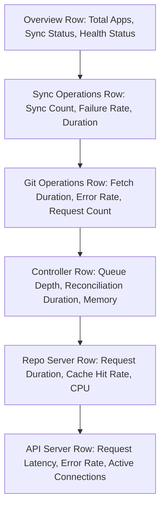

# How to Create Grafana Dashboards for ArgoCD

Author: [nawazdhandala](https://github.com/nawazdhandala)

Tags: ArgoCD, GitOps, Kubernetes, Grafana, Monitoring

Description: Learn how to create comprehensive Grafana dashboards for ArgoCD that visualize application health, sync operations, Git performance, and resource utilization across your GitOps workflow.

---

Grafana dashboards turn ArgoCD's Prometheus metrics into actionable visual insights. Instead of running PromQL queries manually, you get at-a-glance visibility into application sync status, deployment frequency, Git operation performance, and component health. A well-designed ArgoCD dashboard helps you spot problems before they affect your deployments and provides historical context for troubleshooting.

This guide walks you through building a comprehensive Grafana dashboard for ArgoCD, panel by panel.

## Dashboard Layout Overview

A good ArgoCD dashboard follows a top-down structure, starting with high-level status and drilling into component details:



## Setting Up the Data Source

Before creating dashboards, ensure Grafana has a Prometheus data source configured that scrapes ArgoCD metrics:

1. Navigate to Configuration > Data Sources in Grafana
2. Add a Prometheus data source pointing to your Prometheus server
3. Verify the connection by running a test query: `argocd_app_info`

## Overview Row: Application Status at a Glance

Start with stat panels that show the most important numbers:

**Total Applications:**

```promql
count(argocd_app_info)
```

**Healthy Applications:**

```promql
count(argocd_app_info{health_status="Healthy"})
```

**Synced Applications:**

```promql
count(argocd_app_info{sync_status="Synced"})
```

**OutOfSync Applications:**

```promql
count(argocd_app_info{sync_status="OutOfSync"})
```

**Degraded Applications:**

```promql
count(argocd_app_info{health_status="Degraded"})
```

Create these as Stat panels with the following settings:
- Color mode: Background
- Thresholds: Green for Synced/Healthy, Yellow for OutOfSync/Progressing, Red for Degraded/Failed

## Sync Status Table

Create a table panel showing every application's current status:

```promql
argocd_app_info
```

Configure the table with these field overrides:
- Show columns: name, dest_namespace, sync_status, health_status, dest_server
- Add value mappings for sync_status and health_status with color coding

## Sync Operations Row

**Sync Operations Over Time (Graph Panel):**

```promql
# Successful syncs
sum(rate(argocd_app_sync_total{phase="Succeeded"}[5m])) * 300

# Failed syncs
sum(rate(argocd_app_sync_total{phase="Failed"}[5m])) * 300

# Error syncs
sum(rate(argocd_app_sync_total{phase="Error"}[5m])) * 300
```

Use a stacked bar chart or time series panel with green for succeeded, red for failed, and orange for errors.

**Sync Failure Rate (Gauge Panel):**

```promql
sum(rate(argocd_app_sync_total{phase=~"Failed|Error"}[1h]))
/ sum(rate(argocd_app_sync_total[1h]))
* 100
```

Set thresholds at: 0-5% green, 5-20% yellow, 20-100% red.

**Sync Duration by Application (Heatmap Panel):**

```promql
sum(rate(argocd_app_sync_total{phase="Succeeded"}[5m])) by (name)
```

## Git Operations Row

**Git Request Duration (Time Series Panel):**

```promql
# 50th percentile
histogram_quantile(0.50, rate(argocd_git_request_duration_seconds_bucket[5m]))

# 95th percentile
histogram_quantile(0.95, rate(argocd_git_request_duration_seconds_bucket[5m]))

# 99th percentile
histogram_quantile(0.99, rate(argocd_git_request_duration_seconds_bucket[5m]))
```

**Git Request Rate (Time Series Panel):**

```promql
# Total requests by status
sum(rate(argocd_git_request_total[5m])) by (request_type)

# Failed requests specifically
sum(rate(argocd_git_request_total{grpc_code!="OK"}[5m])) by (grpc_code)
```

**Git Error Rate (Stat Panel):**

```promql
sum(rate(argocd_git_request_total{grpc_code!="OK"}[5m]))
/ sum(rate(argocd_git_request_total[5m]))
* 100
```

## Controller Performance Row

**Reconciliation Queue Depth (Time Series Panel):**

```promql
argocd_app_reconcile_count
```

**Reconciliation Duration (Time Series Panel):**

```promql
# 95th percentile reconciliation duration
histogram_quantile(0.95,
  rate(argocd_app_reconcile_duration_seconds_bucket[5m])
)
```

**Controller Memory Usage (Time Series Panel):**

```promql
container_memory_working_set_bytes{
  namespace="argocd",
  container="argocd-application-controller"
}
```

**Controller CPU Usage (Time Series Panel):**

```promql
rate(container_cpu_usage_seconds_total{
  namespace="argocd",
  container="argocd-application-controller"
}[5m])
```

## Repo Server Performance Row

**Repo Server Request Duration (Time Series Panel):**

```promql
histogram_quantile(0.95,
  rate(argocd_repo_server_request_duration_seconds_bucket[5m])
)
```

**Repo Server Request Rate (Time Series Panel):**

```promql
sum(rate(argocd_repo_server_request_total[5m])) by (request_type)
```

**Repo Server Memory and CPU:**

```promql
# Memory
container_memory_working_set_bytes{
  namespace="argocd",
  container="argocd-repo-server"
}

# CPU
rate(container_cpu_usage_seconds_total{
  namespace="argocd",
  container="argocd-repo-server"
}[5m])
```

## Using the Community ArgoCD Dashboard

The ArgoCD community maintains a Grafana dashboard that you can import directly. It is available on Grafana's dashboard repository:

1. Open Grafana
2. Navigate to Dashboards > Import
3. Enter the dashboard ID: **14584** (ArgoCD dashboard)
4. Select your Prometheus data source
5. Click Import

This community dashboard provides a solid starting point. You can then customize it to add panels specific to your environment.

## Dashboard Variables for Filtering

Add template variables to make the dashboard interactive:

**Application filter:**

```promql
# Variable query
label_values(argocd_app_info, name)
```

**Namespace filter:**

```promql
label_values(argocd_app_info, dest_namespace)
```

**Cluster filter:**

```promql
label_values(argocd_app_info, dest_server)
```

**Project filter:**

```promql
label_values(argocd_app_info, project)
```

Use these variables in your panels:

```promql
argocd_app_info{name=~"$application", dest_namespace=~"$namespace", project=~"$project"}
```

## Provisioning Dashboards as Code

For a GitOps-friendly approach, store your dashboards as JSON and provision them through Grafana's provisioning mechanism or a ConfigMap:

```yaml
apiVersion: v1
kind: ConfigMap
metadata:
  name: argocd-grafana-dashboard
  namespace: monitoring
  labels:
    grafana_dashboard: "true"
data:
  argocd-dashboard.json: |
    {
      "dashboard": {
        "title": "ArgoCD Overview",
        "uid": "argocd-overview",
        "panels": [
          ... (your dashboard JSON)
        ]
      }
    }
```

If you use the Grafana Helm chart or kube-prometheus-stack, dashboards in ConfigMaps with the `grafana_dashboard: "true"` label are automatically imported.

## Dashboard Best Practices

1. Keep the overview row visible without scrolling. The most important status indicators should be immediately visible.

2. Use consistent color coding across all panels. Green for healthy/synced, yellow for progressing/warning, red for failed/degraded.

3. Include time range controls and auto-refresh. A 15-second refresh interval works well for operational dashboards.

4. Add annotations for deployment events. Configure Grafana annotations from ArgoCD sync events to correlate deployments with metric changes.

5. Create separate dashboards for different audiences. An overview dashboard for management, a detailed dashboard for operations, and a troubleshooting dashboard for debugging.

Building a comprehensive Grafana dashboard for ArgoCD transforms raw metrics into operational intelligence. Start with the community dashboard, customize it for your environment, and iterate based on the questions your team asks most frequently during incidents.
