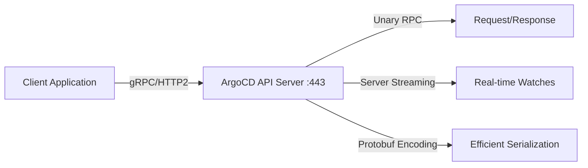

# How to Use ArgoCD gRPC API

Author: [nawazdhandala](https://github.com/nawazdhandala)

Tags: ArgoCD, GitOps, Kubernetes, GRPC, API

Description: Learn how to use the ArgoCD gRPC API for high-performance automation with streaming capabilities, type safety, and efficient binary serialization.

---

While most people interact with ArgoCD through its REST API, the API server is actually built on gRPC. The REST endpoints are generated from gRPC service definitions using grpc-gateway. Using gRPC directly gives you access to streaming endpoints, stronger type safety, and more efficient binary serialization. This is particularly valuable for building high-performance integrations and real-time monitoring tools.

## Why Use gRPC Over REST?

The gRPC API offers several advantages:

1. **Streaming** - gRPC supports server-side streaming, letting you watch for changes in real-time without polling
2. **Performance** - Protocol Buffers (protobuf) encoding is more compact and faster to serialize than JSON
3. **Type Safety** - Generated client libraries provide compile-time type checking
4. **Bidirectional Communication** - More efficient than HTTP request/response for frequent interactions



## ArgoCD gRPC Service Definitions

ArgoCD defines its gRPC services using Protocol Buffers. The main services are:

- **ApplicationService** - Manage applications (CRUD, sync, rollback)
- **ProjectService** - Manage projects
- **RepositoryService** - Manage repository connections
- **ClusterService** - Manage cluster connections
- **SessionService** - Authentication
- **AccountService** - User account management
- **SettingsService** - Server settings
- **CertificateService** - TLS certificate management

The `.proto` files live in the ArgoCD repository under `server/` directories.

## Setting Up a gRPC Client

### Using grpcurl (Command Line)

`grpcurl` is like `curl` for gRPC. Install it and start exploring the API:

```bash
# Install grpcurl
# macOS
brew install grpcurl

# Linux
go install github.com/fullstorydev/grpcurl/cmd/grpcurl@latest
```

First, authenticate to get a token:

```bash
# Get a session token via REST (easiest approach)
ARGOCD_TOKEN=$(curl -s -k https://argocd.example.com/api/v1/session \
  -d '{"username":"admin","password":"your-password"}' | jq -r '.token')
```

Now use grpcurl with the token:

```bash
# List available gRPC services
grpcurl -insecure \
  -H "Authorization: Bearer $ARGOCD_TOKEN" \
  argocd.example.com:443 list

# Output:
# application.ApplicationService
# cluster.ClusterService
# project.ProjectService
# repository.RepositoryService
# session.SessionService
# ...
```

### Describe a Service

```bash
# See all methods in the ApplicationService
grpcurl -insecure \
  -H "Authorization: Bearer $ARGOCD_TOKEN" \
  argocd.example.com:443 describe application.ApplicationService

# Output shows all RPC methods:
# application.ApplicationService is a service:
# service ApplicationService {
#   rpc Create ( .application.ApplicationCreateRequest ) returns ( .v1alpha1.Application );
#   rpc Delete ( .application.ApplicationDeleteRequest ) returns ( .application.ApplicationResponse );
#   rpc Get ( .application.ApplicationQuery ) returns ( .v1alpha1.Application );
#   rpc List ( .application.ApplicationQuery ) returns ( .v1alpha1.ApplicationList );
#   rpc Sync ( .application.ApplicationSyncRequest ) returns ( .v1alpha1.Application );
#   rpc Watch ( .application.ApplicationQuery ) returns ( stream .v1alpha1.ApplicationWatchEvent );
#   ...
# }
```

## Common gRPC Operations

### List Applications

```bash
# List all applications
grpcurl -insecure \
  -H "Authorization: Bearer $ARGOCD_TOKEN" \
  argocd.example.com:443 \
  application.ApplicationService/List

# List with a project filter
grpcurl -insecure \
  -H "Authorization: Bearer $ARGOCD_TOKEN" \
  -d '{"project": ["production"]}' \
  argocd.example.com:443 \
  application.ApplicationService/List
```

### Get a Specific Application

```bash
# Get application details
grpcurl -insecure \
  -H "Authorization: Bearer $ARGOCD_TOKEN" \
  -d '{"name": "my-app"}' \
  argocd.example.com:443 \
  application.ApplicationService/Get
```

### Sync an Application

```bash
# Trigger a sync via gRPC
grpcurl -insecure \
  -H "Authorization: Bearer $ARGOCD_TOKEN" \
  -d '{
    "name": "my-app",
    "prune": true,
    "strategy": {
      "apply": {"force": false}
    }
  }' \
  argocd.example.com:443 \
  application.ApplicationService/Sync
```

### Watch Applications (Streaming)

This is where gRPC really shines. The Watch endpoint sends events as they happen:

```bash
# Watch a specific application for changes
grpcurl -insecure \
  -H "Authorization: Bearer $ARGOCD_TOKEN" \
  -d '{"name": "my-app"}' \
  argocd.example.com:443 \
  application.ApplicationService/Watch

# Watch all applications (no filter)
grpcurl -insecure \
  -H "Authorization: Bearer $ARGOCD_TOKEN" \
  -d '{}' \
  argocd.example.com:443 \
  application.ApplicationService/Watch
```

The stream outputs one JSON object per event, making it easy to pipe into processing scripts:

```bash
# Stream events and process them
grpcurl -insecure \
  -H "Authorization: Bearer $ARGOCD_TOKEN" \
  -d '{}' \
  argocd.example.com:443 \
  application.ApplicationService/Watch | \
  while read -r line; do
    # Each line is a JSON event
    APP=$(echo "$line" | jq -r '.result.application.metadata.name // empty')
    HEALTH=$(echo "$line" | jq -r '.result.application.status.health.status // empty')
    SYNC=$(echo "$line" | jq -r '.result.application.status.sync.status // empty')

    if [ -n "$APP" ]; then
      echo "[$(date +%H:%M:%S)] $APP - Health: $HEALTH, Sync: $SYNC"
    fi
  done
```

## Building a Go gRPC Client

For production use, build a typed client in Go using the ArgoCD client library:

```go
package main

import (
    "context"
    "fmt"
    "log"

    "github.com/argoproj/argo-cd/v2/pkg/apiclient"
    "github.com/argoproj/argo-cd/v2/pkg/apiclient/application"
)

func main() {
    // Create an ArgoCD API client
    opts := apiclient.ClientOptions{
        ServerAddr: "argocd.example.com:443",
        AuthToken:  "your-token-here",
        Insecure:   true, // Set false in production
    }

    conn, appClient := opts.NewClientOrDie().NewApplicationClientOrDie()
    defer conn.Close()

    // List applications
    apps, err := appClient.List(context.Background(), &application.ApplicationQuery{})
    if err != nil {
        log.Fatal(err)
    }

    for _, app := range apps.Items {
        fmt.Printf("%-30s Health: %-12s Sync: %s\n",
            app.Name,
            app.Status.Health.Status,
            app.Status.Sync.Status)
    }

    // Watch for changes using server streaming
    stream, err := appClient.Watch(context.Background(), &application.ApplicationQuery{})
    if err != nil {
        log.Fatal(err)
    }

    fmt.Println("\nWatching for application changes...")
    for {
        event, err := stream.Recv()
        if err != nil {
            log.Fatal(err)
        }

        app := event.Application
        fmt.Printf("[%s] %s - Health: %s, Sync: %s\n",
            event.Type,
            app.Name,
            app.Status.Health.Status,
            app.Status.Sync.Status)
    }
}
```

## Python gRPC Client

Use the `grpcio` library for Python:

```python
import grpc
from google.protobuf import json_format

# You need to generate Python stubs from ArgoCD proto files
# or use grpclib for dynamic invocation

# Using the requests library for gRPC-Web (simpler approach)
import requests

class ArgoCDGRPCClient:
    """Simplified gRPC client using grpcurl subprocess."""
    import subprocess
    import json

    def __init__(self, server, token):
        self.server = server
        self.token = token

    def _call(self, service, method, data=None):
        """Make a gRPC call using grpcurl."""
        cmd = [
            "grpcurl", "-insecure",
            "-H", f"Authorization: Bearer {self.token}",
        ]
        if data:
            cmd.extend(["-d", json.dumps(data)])

        cmd.extend([self.server, f"{service}/{method}"])

        result = subprocess.run(cmd, capture_output=True, text=True)
        if result.returncode != 0:
            raise Exception(f"gRPC error: {result.stderr}")
        return json.loads(result.stdout) if result.stdout else {}

    def list_apps(self, project=None):
        data = {"project": [project]} if project else {}
        return self._call("application.ApplicationService", "List", data)

    def sync_app(self, name, prune=True):
        return self._call(
            "application.ApplicationService", "Sync",
            {"name": name, "prune": prune}
        )
```

## gRPC vs REST: When to Choose Which

| Factor | REST | gRPC |
|--------|------|------|
| Ease of use | Easier with curl | Requires grpcurl or client library |
| Streaming | Requires SSE workaround | Native server streaming |
| Performance | JSON overhead | Efficient protobuf encoding |
| Type safety | None (JSON) | Strong (generated stubs) |
| Browser support | Native | Requires gRPC-Web proxy |
| Debugging | Easy with browser/curl | Needs specialized tools |
| CI/CD scripts | REST is simpler | gRPC adds complexity |

**Use REST when**: Writing quick scripts, CI/CD pipelines, or integrating with tools that speak HTTP natively.

**Use gRPC when**: Building real-time monitoring, high-frequency polling, or typed client libraries for production services.

## Connection and Security

For production gRPC connections, always use TLS:

```bash
# Use TLS with a custom CA certificate
grpcurl -cacert /path/to/ca.pem \
  -H "Authorization: Bearer $ARGOCD_TOKEN" \
  argocd.example.com:443 \
  application.ApplicationService/List

# Use mTLS with client certificate
grpcurl -cacert /path/to/ca.pem \
  -cert /path/to/client.pem \
  -key /path/to/client-key.pem \
  argocd.example.com:443 \
  application.ApplicationService/List
```

The ArgoCD gRPC API is the high-performance backbone behind all ArgoCD operations. While the REST API covers most use cases, gRPC shines for streaming, real-time monitoring, and building typed client libraries. Choose the approach that fits your use case - or use both, since they share the same backend.
