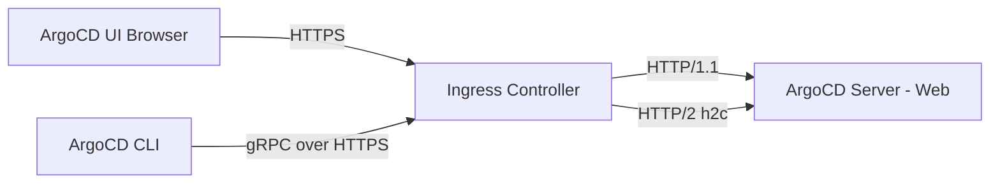

# How to Configure ArgoCD with gRPC and HTTPS Ingress

Author: [nawazdhandala](https://github.com/nawazdhandala)

Tags: ArgoCD, GitOps, Kubernetes, GRPC, Networking

Description: Master configuring ArgoCD ingress to handle both gRPC for the CLI and HTTPS for the web UI simultaneously with various ingress controllers.

---

ArgoCD serves two types of traffic on the same server: HTTPS for the web UI and gRPC for the CLI. This dual-protocol setup is one of the trickiest parts of exposing ArgoCD through an ingress. If you have been struggling with "transport is closing" errors or a working UI but broken CLI, this guide explains exactly what is happening and how to fix it.

## Understanding the Problem

ArgoCD server listens on a single port and serves both protocols. When a request comes in, it checks the `Content-Type` header. If it is `application/grpc`, the request is handled as gRPC. Everything else is handled as HTTP.

This works perfectly with port-forwarding, but becomes complicated with ingress controllers because:

1. Most ingress controllers default to HTTP/1.1, but gRPC requires HTTP/2
2. TLS termination at the ingress can break gRPC if not configured properly
3. Some ingress controllers need separate backend configurations for each protocol

Here is how the traffic flow looks:



## Option 1: Single Host with grpc-web

The simplest approach is to use `--grpc-web` flag with the CLI. This makes the CLI send gRPC requests wrapped in standard HTTP/1.1, which every ingress controller handles without special configuration:

```bash
# Login using grpc-web (works with any ingress controller)
argocd login argocd.example.com --grpc-web

# All subsequent commands use grpc-web automatically
argocd app list
argocd app sync my-app
```

The ingress configuration is straightforward:

```yaml
apiVersion: networking.k8s.io/v1
kind: Ingress
metadata:
  name: argocd-server-ingress
  namespace: argocd
  annotations:
    nginx.ingress.kubernetes.io/backend-protocol: "HTTP"
    nginx.ingress.kubernetes.io/force-ssl-redirect: "true"
spec:
  ingressClassName: nginx
  rules:
    - host: argocd.example.com
      http:
        paths:
          - path: /
            pathType: Prefix
            backend:
              service:
                name: argocd-server
                port:
                  number: 80
  tls:
    - hosts:
        - argocd.example.com
      secretName: argocd-tls
```

The downside is that `--grpc-web` must be specified every time (or set in the ArgoCD config file), and it is slightly slower than native gRPC.

## Option 2: Two Separate Hosts

Use one hostname for the UI and another for gRPC. This is the cleanest separation:

```yaml
# UI Ingress - standard HTTPS
apiVersion: networking.k8s.io/v1
kind: Ingress
metadata:
  name: argocd-server-http
  namespace: argocd
  annotations:
    nginx.ingress.kubernetes.io/backend-protocol: "HTTP"
    nginx.ingress.kubernetes.io/force-ssl-redirect: "true"
    nginx.ingress.kubernetes.io/proxy-buffer-size: "64k"
spec:
  ingressClassName: nginx
  rules:
    - host: argocd.example.com
      http:
        paths:
          - path: /
            pathType: Prefix
            backend:
              service:
                name: argocd-server
                port:
                  number: 80
  tls:
    - hosts:
        - argocd.example.com
      secretName: argocd-http-tls
---
# gRPC Ingress - for CLI access
apiVersion: networking.k8s.io/v1
kind: Ingress
metadata:
  name: argocd-server-grpc
  namespace: argocd
  annotations:
    nginx.ingress.kubernetes.io/backend-protocol: "GRPC"
spec:
  ingressClassName: nginx
  rules:
    - host: grpc.argocd.example.com
      http:
        paths:
          - path: /
            pathType: Prefix
            backend:
              service:
                name: argocd-server
                port:
                  number: 443
  tls:
    - hosts:
        - grpc.argocd.example.com
      secretName: argocd-grpc-tls
```

Configure the CLI to use the gRPC host:

```bash
# Login with the gRPC endpoint
argocd login grpc.argocd.example.com
```

## Option 3: SSL Passthrough

With TLS passthrough, the ingress does not terminate TLS. Traffic goes encrypted directly to ArgoCD, which handles both protocols on its own port. This is the simplest configuration but gives up ingress-level features like rate limiting:

```yaml
apiVersion: networking.k8s.io/v1
kind: Ingress
metadata:
  name: argocd-server-ingress
  namespace: argocd
  annotations:
    nginx.ingress.kubernetes.io/ssl-passthrough: "true"
spec:
  ingressClassName: nginx
  rules:
    - host: argocd.example.com
      http:
        paths:
          - path: /
            pathType: Prefix
            backend:
              service:
                name: argocd-server
                port:
                  number: 443
```

Do NOT set `server.insecure: "true"` when using passthrough. ArgoCD needs its own TLS.

Enable SSL passthrough on the Nginx controller:

```bash
helm upgrade ingress-nginx ingress-nginx/ingress-nginx \
  --namespace ingress-nginx \
  --set controller.extraArgs.enable-ssl-passthrough=""
```

## Option 4: Header-Based Routing

Some ingress controllers support routing based on the `Content-Type` header. This lets you use a single hostname for both protocols:

With Traefik IngressRoute:

```yaml
apiVersion: traefik.io/v1alpha1
kind: IngressRoute
metadata:
  name: argocd-server
  namespace: argocd
spec:
  entryPoints:
    - websecure
  routes:
    # gRPC route (higher priority)
    - kind: Rule
      match: Host(`argocd.example.com`) && Headers(`Content-Type`, `application/grpc`)
      priority: 11
      services:
        - name: argocd-server
          port: 80
          scheme: h2c
    # HTTP route for UI
    - kind: Rule
      match: Host(`argocd.example.com`)
      priority: 10
      services:
        - name: argocd-server
          port: 80
  tls:
    certResolver: letsencrypt
```

## ArgoCD CLI Configuration File

To avoid typing `--grpc-web` every time, set it in your ArgoCD CLI config:

```bash
# Set the server with grpc-web permanently
argocd login argocd.example.com --grpc-web

# Or manually edit ~/.config/argocd/config
```

```yaml
# ~/.config/argocd/config
contexts:
  - name: argocd.example.com
    server: argocd.example.com
    user: argocd.example.com
    config:
      grpc-web: true
```

## Testing Both Protocols

After setting up your ingress, verify both HTTP and gRPC:

```bash
# Test HTTPS (UI)
curl -I https://argocd.example.com
# Expected: HTTP/2 200 or HTTP/1.1 200

# Test gRPC with grpcurl
grpcurl -insecure argocd.example.com:443 list
# Expected: list of gRPC services

# Test ArgoCD CLI
argocd login argocd.example.com --grpc-web
argocd app list

# Test native gRPC (if using separate host or passthrough)
argocd login grpc.argocd.example.com
argocd app list
```

## Common Errors and Fixes

**"transport is closing"**: The ingress is not forwarding HTTP/2 to the backend. Either enable HTTP/2 backend or use `--grpc-web`.

**"rpc error: code = Internal"**: TLS mismatch between what the ingress expects and what ArgoCD serves. If the ingress terminates TLS, ArgoCD must be in insecure mode. If using passthrough, ArgoCD must have TLS enabled.

**"upstream connect error or disconnect/reset before headers"**: The ingress timeout is too short. Increase timeout annotations to at least 300 seconds.

**UI Works But CLI Fails**: The ingress is handling HTTP fine but not gRPC. Use `--grpc-web` flag or set up a dedicated gRPC route.

**CLI Works But UI Shows Blank Page**: The ingress proxy buffer is too small for ArgoCD's large responses. Increase `proxy-buffer-size`.

For detailed guides on specific ingress controllers, see [Nginx Ingress for ArgoCD](https://oneuptime.com/blog/post/2026-02-26-argocd-nginx-ingress/view), [Traefik for ArgoCD](https://oneuptime.com/blog/post/2026-02-26-argocd-traefik-ingress/view), and [AWS ALB for ArgoCD](https://oneuptime.com/blog/post/2026-02-26-argocd-aws-alb-ingress/view).
