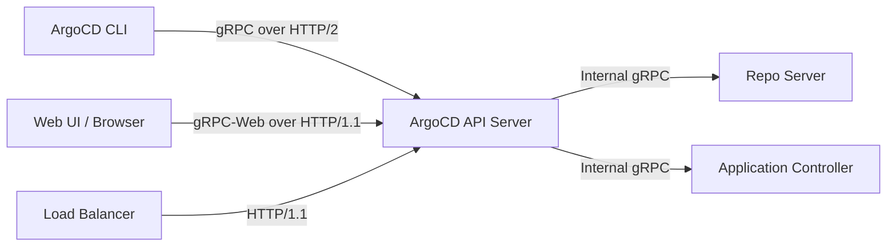
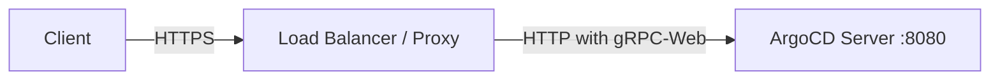

# How to Configure ArgoCD Server for gRPC-Web

Author: [nawazdhandala](https://github.com/nawazdhandala)

Tags: ArgoCD, GitOps, Kubernetes, gRPC, Networking

Description: Learn how to configure ArgoCD's API server for gRPC-Web to enable browser-based clients and work through load balancers that do not support HTTP/2.

---

ArgoCD uses gRPC as its primary communication protocol between the CLI, the web UI, and the API server. While gRPC offers excellent performance and strong typing through Protocol Buffers, it relies on HTTP/2 - which creates challenges when deploying behind load balancers, CDNs, or reverse proxies that only support HTTP/1.1. This is where gRPC-Web comes in.

gRPC-Web is a protocol that adapts gRPC calls to work over HTTP/1.1, making them compatible with standard web infrastructure. ArgoCD's API server has built-in support for gRPC-Web, and configuring it properly can solve a wide range of connectivity issues.

## Why You Need gRPC-Web with ArgoCD

Several common scenarios require gRPC-Web configuration:

- Your load balancer (like AWS ALB or classic ELB) does not support HTTP/2 end-to-end
- You are deploying ArgoCD behind a CDN like CloudFront that needs HTTP/1.1
- Corporate proxies strip HTTP/2 upgrade headers
- Browser-based tools need to communicate directly with the ArgoCD API
- You want a single port for both the web UI and API traffic

## Understanding ArgoCD's Dual-Port Architecture

By default, ArgoCD's API server listens on two ports:

- Port 8080: Serves both the web UI (HTTP) and the API (gRPC)
- Port 8083: Serves metrics

The server uses content-type negotiation to determine whether an incoming request is a gRPC call or a regular HTTP request. When gRPC-Web is enabled, the server also accepts `application/grpc-web` content types and translates them into native gRPC calls internally.



## Enabling gRPC-Web on the ArgoCD Server

ArgoCD supports gRPC-Web out of the box. The key configuration flag is `--grpc-web`. You can set this in the argocd-server deployment.

Here is how to configure it via the deployment manifest:

```yaml
# argocd-server-deployment-patch.yaml
# Patch to enable gRPC-Web on the ArgoCD API server
apiVersion: apps/v1
kind: Deployment
metadata:
  name: argocd-server
  namespace: argocd
spec:
  template:
    spec:
      containers:
        - name: argocd-server
          command:
            - argocd-server
            - --grpc-web
```

If you are using Helm to deploy ArgoCD, set the value in your values file:

```yaml
# values.yaml for ArgoCD Helm chart
# Enable gRPC-Web support on the server
server:
  extraArgs:
    - --grpc-web
```

Apply the Helm upgrade:

```bash
# Upgrade ArgoCD with gRPC-Web enabled
helm upgrade argocd argo/argo-cd \
  --namespace argocd \
  -f values.yaml
```

## Configuring gRPC-Web with a Root Path

If you are serving ArgoCD under a subpath (for example, `/argocd`), you need to set the root path alongside gRPC-Web:

```yaml
# Enable gRPC-Web with a custom root path
server:
  extraArgs:
    - --grpc-web
    - --rootpath=/argocd
```

This ensures that both the web UI and gRPC-Web endpoints are correctly routed under the specified path prefix.

## Configuring Ingress for gRPC-Web

When gRPC-Web is enabled, you can use a single ingress resource since all traffic flows over HTTP/1.1. This simplifies your ingress configuration significantly.

Here is an example using NGINX Ingress:

```yaml
# Ingress resource for ArgoCD with gRPC-Web
apiVersion: networking.k8s.io/v1
kind: Ingress
metadata:
  name: argocd-server-ingress
  namespace: argocd
  annotations:
    # Use HTTPS backend protocol since ArgoCD terminates TLS by default
    nginx.ingress.kubernetes.io/backend-protocol: "HTTPS"
    # Increase proxy buffer size for gRPC-Web responses
    nginx.ingress.kubernetes.io/proxy-buffer-size: "16k"
    # Set reasonable timeouts for long-running gRPC-Web streams
    nginx.ingress.kubernetes.io/proxy-read-timeout: "600"
    nginx.ingress.kubernetes.io/proxy-send-timeout: "600"
spec:
  ingressClassName: nginx
  tls:
    - hosts:
        - argocd.example.com
      secretName: argocd-tls
  rules:
    - host: argocd.example.com
      http:
        paths:
          - path: /
            pathType: Prefix
            backend:
              service:
                name: argocd-server
                port:
                  number: 443
```

For AWS ALB Ingress (which does not support HTTP/2 to backends), gRPC-Web is particularly useful:

```yaml
# AWS ALB Ingress for ArgoCD with gRPC-Web
apiVersion: networking.k8s.io/v1
kind: Ingress
metadata:
  name: argocd-server-ingress
  namespace: argocd
  annotations:
    alb.ingress.kubernetes.io/scheme: internet-facing
    alb.ingress.kubernetes.io/target-type: ip
    alb.ingress.kubernetes.io/listen-ports: '[{"HTTPS":443}]'
    alb.ingress.kubernetes.io/certificate-arn: arn:aws:acm:us-east-1:123456789:certificate/abc-123
    # Backend protocol is HTTP since gRPC-Web runs over HTTP/1.1
    alb.ingress.kubernetes.io/backend-protocol: HTTPS
    alb.ingress.kubernetes.io/healthcheck-path: /healthz
spec:
  ingressClassName: alb
  rules:
    - host: argocd.example.com
      http:
        paths:
          - path: /
            pathType: Prefix
            backend:
              service:
                name: argocd-server
                port:
                  number: 443
```

## Configuring the ArgoCD CLI to Use gRPC-Web

The ArgoCD CLI also supports gRPC-Web. This is useful when your network only allows HTTP/1.1 traffic:

```bash
# Login using gRPC-Web transport
argocd login argocd.example.com --grpc-web

# You can also set this as a permanent option
argocd login argocd.example.com --grpc-web --grpc-web-root-path /argocd
```

To make gRPC-Web the default for all CLI operations, set the environment variable:

```bash
# Set gRPC-Web as the default transport for all ArgoCD CLI commands
export ARGOCD_GRPC_WEB=true

# Now all commands automatically use gRPC-Web
argocd app list
argocd app get my-app
```

## Disabling TLS for gRPC-Web Behind a TLS-Terminating Proxy

If your load balancer handles TLS termination, you should disable TLS on the ArgoCD server to avoid double encryption:

```yaml
# Disable TLS on ArgoCD server when proxy handles termination
server:
  extraArgs:
    - --grpc-web
    - --insecure
```

With this configuration, the traffic flow looks like:



## Troubleshooting gRPC-Web Issues

If you are having trouble with gRPC-Web, here are common issues and their solutions.

**Connection resets or timeouts**: Increase the proxy timeout values. gRPC-Web streams can be long-lived, especially for watch operations:

```bash
# Test connectivity to the ArgoCD server with gRPC-Web
curl -v -H "Content-Type: application/grpc-web+proto" \
  https://argocd.example.com/api/v1/session
```

**Mixed content errors in the browser**: Ensure your ArgoCD server URL uses HTTPS. The web UI will not make gRPC-Web calls over plain HTTP if the page was loaded over HTTPS.

**404 errors on gRPC-Web endpoints**: Verify that the `--grpc-web` flag is actually set on the server. Check the running arguments:

```bash
# Check if gRPC-Web is enabled on the running server
kubectl get deploy argocd-server -n argocd -o jsonpath='{.spec.template.spec.containers[0].command}'
```

**Large response failures**: Some proxies have default body size limits that can interfere with large gRPC-Web responses. Increase buffer sizes in your proxy configuration.

## Performance Considerations

gRPC-Web adds minimal overhead compared to native gRPC. The main difference is that binary gRPC frames are base64-encoded for HTTP/1.1 compatibility, which adds roughly 33% to the payload size. For most ArgoCD operations, this overhead is negligible.

However, server-side streaming (used for live application watching) works differently with gRPC-Web. Instead of true bidirectional streaming, gRPC-Web uses server-sent events or chunked transfer encoding. This means watch operations may have slightly higher latency compared to native gRPC connections.

For environments where performance is critical and HTTP/2 is available end-to-end, consider using native gRPC instead of gRPC-Web. But for the vast majority of deployments, gRPC-Web provides the right balance of compatibility and performance.

## Summary

Configuring ArgoCD for gRPC-Web is straightforward and solves real-world networking challenges. Enable the `--grpc-web` flag on the server, configure your ingress to pass HTTP/1.1 traffic, and optionally configure the CLI to use gRPC-Web transport. This approach works well with AWS ALB, CloudFront, corporate proxies, and any infrastructure that does not support HTTP/2 end-to-end.

For more on ArgoCD networking topics, check out our guide on [configuring ArgoCD with HTTP/2](https://oneuptime.com/blog/post/2026-02-26-argocd-http2-configuration/view) and [setting up proxy configurations](https://oneuptime.com/blog/post/2026-02-26-argocd-proxy-settings/view).
