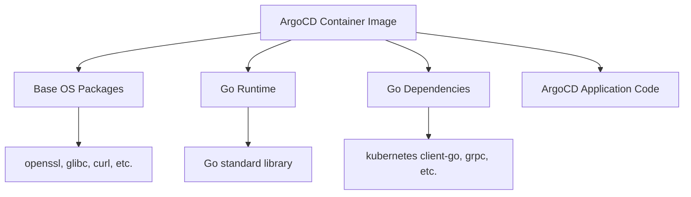

# How to Handle CVE Vulnerabilities in ArgoCD Images

Author: [nawazdhandala](https://github.com/nawazdhandala)

Tags: ArgoCD, GitOps, Kubernetes, Security, CVE

Description: A practical guide to detecting, assessing, and remediating CVE vulnerabilities in ArgoCD container images and dependencies for production security.

---

ArgoCD container images, like any software, can contain known vulnerabilities. CVEs (Common Vulnerabilities and Exposures) are publicly disclosed security flaws that may affect ArgoCD's base images, Go runtime, or third-party dependencies. This guide covers how to detect, assess, and remediate these vulnerabilities in your ArgoCD deployment.

## Understanding the Risk

ArgoCD images are based on a minimal Linux distribution and include the Go binary, various system libraries, and the ArgoCD application code. Vulnerabilities can exist at any layer:



A CVE in any of these layers could potentially be exploited. The severity depends on whether ArgoCD actually uses the vulnerable code path and whether the vulnerability is reachable from the network.

## Scanning ArgoCD Images

### Using Trivy

Trivy is the most popular open-source vulnerability scanner for container images:

```bash
# Scan the ArgoCD image
trivy image quay.io/argoproj/argocd:v2.13.0

# Scan with only HIGH and CRITICAL severities
trivy image --severity HIGH,CRITICAL quay.io/argoproj/argocd:v2.13.0

# Output as JSON for programmatic processing
trivy image --format json --output argocd-scan.json quay.io/argoproj/argocd:v2.13.0

# Scan with a specific vulnerability database
trivy image --skip-db-update --db-repository ghcr.io/aquasecurity/trivy-db \
  quay.io/argoproj/argocd:v2.13.0
```

### Using Grype

Grype is another excellent scanner from Anchore:

```bash
# Scan ArgoCD image
grype quay.io/argoproj/argocd:v2.13.0

# Only show fixable vulnerabilities
grype quay.io/argoproj/argocd:v2.13.0 --only-fixed

# Output as JSON
grype quay.io/argoproj/argocd:v2.13.0 -o json > argocd-grype.json
```

### Using Docker Scout

If you use Docker Desktop:

```bash
docker scout cves quay.io/argoproj/argocd:v2.13.0
docker scout recommendations quay.io/argoproj/argocd:v2.13.0
```

## Assessing CVE Impact on ArgoCD

Not all CVEs in the image are actually exploitable. Here is how to assess impact:

### Step 1: Check the CVE Details

```bash
# Get detailed CVE information from Trivy
trivy image --format json quay.io/argoproj/argocd:v2.13.0 | \
  jq '.Results[].Vulnerabilities[] | select(.Severity == "CRITICAL") | {
    VulnerabilityID: .VulnerabilityID,
    PkgName: .PkgName,
    InstalledVersion: .InstalledVersion,
    FixedVersion: .FixedVersion,
    Description: .Description
  }'
```

### Step 2: Check if ArgoCD Uses the Vulnerable Package

```bash
# Check if a specific library is loaded by ArgoCD processes
kubectl exec -n argocd deployment/argocd-server -- ls -la /usr/lib/ | grep libssl

# Check Go dependencies
kubectl exec -n argocd deployment/argocd-server -- argocd version --short
```

### Step 3: Check ArgoCD Security Advisories

ArgoCD publishes security advisories for vulnerabilities that affect the application:

```bash
# Check the ArgoCD GitHub security advisories
gh api repos/argoproj/argo-cd/security-advisories --jq '.[].summary'
```

## Remediation Strategies

### Strategy 1: Upgrade ArgoCD

The simplest fix is upgrading to the latest ArgoCD version, which typically includes patched base images:

```bash
# Check available versions
helm search repo argo/argo-cd --versions | head -10

# Upgrade ArgoCD
helm upgrade argocd argo/argo-cd \
  --namespace argocd \
  --reuse-values \
  --version <latest-version>
```

For kubectl-based installations:

```bash
# Apply the latest manifests
kubectl apply -n argocd -f https://raw.githubusercontent.com/argoproj/argo-cd/v2.13.1/manifests/install.yaml
```

### Strategy 2: Rebuild with Patched Base Image

If the CVE is in the base OS packages and a new ArgoCD release is not available yet, rebuild the image with updated packages:

```dockerfile
# Dockerfile.patched
FROM quay.io/argoproj/argocd:v2.13.0

USER root
# Update base packages to fix CVEs
RUN apt-get update && \
    apt-get upgrade -y && \
    apt-get clean && \
    rm -rf /var/lib/apt/lists/*
USER argocd
```

Build and push:

```bash
docker build -t your-registry.example.com/argocd-patched:v2.13.0 -f Dockerfile.patched .
docker push your-registry.example.com/argocd-patched:v2.13.0
```

Update your ArgoCD deployment to use the patched image:

```yaml
# values-patched.yaml
global:
  image:
    repository: your-registry.example.com/argocd-patched
    tag: v2.13.0
```

### Strategy 3: Accept the Risk

Some CVEs are not exploitable in the ArgoCD context. Document your risk acceptance:

```yaml
# Create an exception file for Trivy
# .trivyignore
# CVE-XXXX-YYYY - Not exploitable: ArgoCD does not use libXXX for network operations
CVE-XXXX-YYYY
# CVE-XXXX-ZZZZ - Low risk: Only affects local file parsing, which is sandboxed
CVE-XXXX-ZZZZ
```

## Automated Scanning in CI/CD

Set up automated scanning to catch vulnerabilities before they reach production:

```yaml
# GitHub Actions workflow
name: ArgoCD Image Scan
on:
  schedule:
    - cron: '0 6 * * *'  # Daily at 6 AM
  workflow_dispatch:

jobs:
  scan:
    runs-on: ubuntu-latest
    steps:
      - name: Scan ArgoCD image
        uses: aquasecurity/trivy-action@master
        with:
          image-ref: quay.io/argoproj/argocd:v2.13.0
          format: sarif
          output: trivy-results.sarif
          severity: HIGH,CRITICAL

      - name: Upload scan results
        uses: github/codeql-action/upload-sarif@v2
        with:
          sarif_file: trivy-results.sarif

      - name: Fail on critical vulnerabilities
        uses: aquasecurity/trivy-action@master
        with:
          image-ref: quay.io/argoproj/argocd:v2.13.0
          exit-code: 1
          severity: CRITICAL
```

## Continuous Monitoring in Kubernetes

Deploy a scanner that continuously monitors running images:

### Using Trivy Operator

```bash
# Install Trivy Operator
helm install trivy-operator aquasecurity/trivy-operator \
  --namespace trivy-system \
  --create-namespace \
  --set trivy.severity=HIGH,CRITICAL
```

Check ArgoCD vulnerability reports:

```bash
# Get vulnerability reports for ArgoCD pods
kubectl get vulnerabilityreports -n argocd

# Get detailed results
kubectl get vulnerabilityreports -n argocd -o json | \
  jq '.items[] | {
    name: .metadata.name,
    criticalCount: .report.summary.criticalCount,
    highCount: .report.summary.highCount
  }'
```

### Prometheus Alerting on Vulnerabilities

```yaml
apiVersion: monitoring.coreos.com/v1
kind: PrometheusRule
metadata:
  name: argocd-cve-alerts
  namespace: monitoring
spec:
  groups:
    - name: argocd-vulnerabilities
      rules:
        - alert: ArgoCDCriticalCVE
          expr: trivy_image_vulnerabilities{namespace="argocd", severity="Critical"} > 0
          for: 1h
          labels:
            severity: critical
          annotations:
            summary: "Critical CVE found in ArgoCD image"
            description: "{{ $labels.image_ref }} has {{ $value }} critical vulnerabilities"
```

## Emergency CVE Response Playbook

When a critical CVE is announced:

```bash
#!/bin/bash
# Emergency CVE Response Script

CVE_ID="${1:?Usage: $0 <CVE-ID>}"
echo "=== CVE Response: $CVE_ID ==="

# Step 1: Check if our ArgoCD images are affected
echo "Scanning current images..."
for pod in $(kubectl get pods -n argocd -o jsonpath='{.items[*].spec.containers[*].image}' | tr ' ' '\n' | sort -u); do
  echo "Scanning: $pod"
  trivy image --severity CRITICAL "$pod" 2>/dev/null | grep "$CVE_ID" && echo "AFFECTED: $pod" || echo "NOT AFFECTED: $pod"
done

# Step 2: Check ArgoCD advisory
echo ""
echo "Checking ArgoCD security advisories..."
gh api repos/argoproj/argo-cd/security-advisories --jq ".[] | select(.cve_id == \"$CVE_ID\") | .summary"

# Step 3: Check available patches
echo ""
echo "Available ArgoCD versions:"
helm search repo argo/argo-cd --versions | head -5
```

## Conclusion

CVE management for ArgoCD is an ongoing responsibility, not a one-time task. Set up automated scanning to detect vulnerabilities early. Assess each CVE's actual impact on your deployment before panicking. Upgrade ArgoCD regularly to get patched base images. For zero-day situations, have a playbook ready to quickly rebuild images with patched packages. The goal is to reduce your vulnerability window while avoiding unnecessary disruption from low-risk CVEs.

For related security topics, see our guides on [verifying ArgoCD release signatures](https://oneuptime.com/blog/post/2026-02-26-argocd-verify-release-signatures-checksums/view) and [hardening ArgoCD for production](https://oneuptime.com/blog/post/2026-02-26-argocd-harden-server-production/view).
