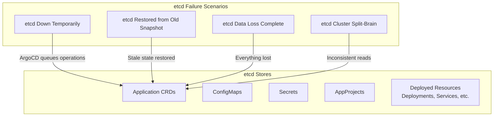

# How to Handle ArgoCD After etcd Failure

Author: [nawazdhandala](https://github.com/nawazdhandala)

Tags: ArgoCD, GitOps, Kubernetes, Etcd, Disaster Recovery

Description: Learn how to recover ArgoCD after an etcd failure or restore, including re-establishing application state, fixing orphaned resources, and handling data inconsistencies between etcd and Git.

---

etcd is the backbone of Kubernetes - it stores all cluster state including ArgoCD's Application CRDs, ConfigMaps, Secrets, and AppProjects. When etcd fails or needs to be restored from a snapshot, ArgoCD can end up in an inconsistent state where what it thinks exists does not match reality. This guide walks through recovering ArgoCD after every type of etcd failure scenario.

## Understanding the Impact on ArgoCD



## Scenario 1: etcd Temporarily Down

When etcd is temporarily unavailable, ArgoCD components will log errors but will recover automatically once etcd comes back.

```bash
# While etcd is down, you will see these errors in ArgoCD logs
kubectl logs -n argocd deploy/argocd-application-controller --tail=50
# "etcdserver: leader changed"
# "context deadline exceeded"
# "connection refused"

# After etcd recovers, verify ArgoCD is working
kubectl get pods -n argocd

# Check if the controller has resumed processing
kubectl logs -n argocd deploy/argocd-application-controller --tail=20 | \
  grep -i "reconcil"
```

Usually no manual intervention is needed. ArgoCD will resume normal operations once etcd is healthy again. However, check for:

```bash
# Applications that may have been mid-sync when etcd went down
kubectl get applications -n argocd -o json | \
  jq '.items[] | select(.status.operationState.phase == "Running") | .metadata.name'

# If syncs are stuck, terminate them
kubectl get applications -n argocd -o json | \
  jq -r '.items[] | select(.status.operationState.phase == "Running") | .metadata.name' | \
  while read app; do
    echo "Terminating stuck sync: $app"
    kubectl patch application "$app" -n argocd --type json \
      -p '[{"op": "remove", "path": "/operation"}]' 2>/dev/null
  done
```

## Scenario 2: etcd Restored from Older Snapshot

This is the most complex scenario. The etcd snapshot contains state from a point in time, but the actual cluster resources may have changed since then.

### What Happens

If etcd is restored from a snapshot taken 2 hours ago:
- ArgoCD Application resources revert to their state from 2 hours ago
- But actual deployed resources (Deployments, Services, etc.) may be at a newer state
- Repository credentials may have been rotated since the snapshot
- New applications created after the snapshot are gone
- Applications deleted after the snapshot are back

### Recovery Steps

```bash
# Step 1: Assess the situation
echo "=== etcd Restore Recovery ==="

# Check ArgoCD pods are running
kubectl get pods -n argocd

# Count applications
echo "Applications in etcd: $(kubectl get applications -n argocd --no-headers | wc -l)"

# Step 2: Flush ArgoCD cache (etcd state changed under it)
kubectl exec -n argocd deploy/argocd-redis -- redis-cli flushall

# Step 3: Restart all ArgoCD components to force re-read from etcd
kubectl rollout restart deployment -n argocd \
  argocd-server argocd-application-controller argocd-repo-server argocd-dex-server

# Wait for restart
kubectl rollout status deployment argocd-application-controller -n argocd --timeout=120s
```

### Reconcile Application State

After etcd restore, ArgoCD will detect differences between its restored Application definitions and the actual cluster state:

```bash
# Hard refresh all applications to force state comparison
for app in $(kubectl get applications -n argocd -o jsonpath='{.items[*].metadata.name}'); do
  argocd app get "$app" --hard-refresh >/dev/null 2>&1 &
done
wait

# Check which applications are out of sync
kubectl get applications -n argocd \
  -o custom-columns=NAME:.metadata.name,SYNC:.status.sync.status,HEALTH:.status.health.status | \
  grep -v "Synced.*Healthy"
```

If auto-sync is enabled, ArgoCD will automatically reconcile the differences. If manual sync is required, you may need to decide case by case whether the Git state or the live state is correct.

### Handle Ghost Applications

Applications that were deleted after the snapshot but are now back in etcd:

```bash
# These will appear as OutOfSync if the deployed resources were already cleaned up
# Check for applications whose target resources no longer exist
kubectl get applications -n argocd -o json | \
  jq -r '.items[] | select(.status.health.status == "Missing") | .metadata.name'

# Delete ghost applications that should not exist
# Only do this if you are sure these were intentionally deleted before
kubectl delete application ghost-app -n argocd
```

### Handle Missing Applications

Applications created after the snapshot are now gone from etcd:

```bash
# If you use declarative application management (recommended),
# re-apply your application definitions from Git
kubectl apply -f https://raw.githubusercontent.com/your-org/argocd-config/main/applications/

# If you use app-of-apps pattern, just re-apply the root app
kubectl apply -f root-application.yaml
# The root app will recreate all child applications
```

## Scenario 3: Complete etcd Data Loss

Everything in etcd is gone. Kubernetes API works but all resources are lost.

```bash
# Step 1: Reinstall ArgoCD
kubectl create namespace argocd 2>/dev/null
kubectl apply -n argocd -f https://raw.githubusercontent.com/argoproj/argo-cd/stable/manifests/install.yaml

# Step 2: Wait for pods
kubectl wait --for=condition=ready pod -l app.kubernetes.io/part-of=argocd \
  -n argocd --timeout=300s

# Step 3: Restore from ArgoCD backup (if available)
argocd admin import --namespace argocd < argocd-export-backup.yaml

# Step 4: If no ArgoCD backup, restore configuration manually
# Apply ConfigMaps
kubectl apply -f argocd-cm-backup.yaml
kubectl apply -f argocd-rbac-cm-backup.yaml

# Re-add repositories
argocd repo add https://github.com/your-org/your-repo.git \
  --username your-username --password your-token

# Re-add clusters
argocd cluster add your-cluster-context

# Step 5: Restore applications from Git
kubectl apply -f applications/
```

### The GitOps Advantage

This is where GitOps shines. Since all your desired state is in Git, recovery from complete data loss means:
1. Reinstall ArgoCD
2. Point it at your Git repositories
3. Let it reconcile everything back to the desired state

```bash
# If applications are managed declaratively in Git
# Just apply the root application and everything cascades
kubectl apply -f - <<EOF
apiVersion: argoproj.io/v1alpha1
kind: Application
metadata:
  name: root-app
  namespace: argocd
spec:
  project: default
  source:
    repoURL: https://github.com/your-org/argocd-config.git
    path: applications
    targetRevision: HEAD
  destination:
    server: https://kubernetes.default.svc
    namespace: argocd
  syncPolicy:
    automated:
      prune: true
      selfHeal: true
EOF
```

## Scenario 4: etcd Split-Brain

In a split-brain scenario, different etcd nodes have different data. This can cause ArgoCD to see inconsistent state.

```bash
# Symptoms: ArgoCD shows different app status on different refreshes
# The controller may process stale data

# Fix: Resolve the etcd split-brain first (etcd admin task)
# Then flush ArgoCD cache
kubectl exec -n argocd deploy/argocd-redis -- redis-cli flushall

# Restart controller to force re-read
kubectl rollout restart deployment argocd-application-controller -n argocd
```

## Post-Recovery Verification

After any etcd recovery, run a comprehensive verification:

```bash
#!/bin/bash
# post-etcd-recovery-verify.sh

NS="argocd"
echo "=== Post-etcd Recovery Verification ==="

# Component health
echo -e "\n--- Component Health ---"
kubectl get pods -n $NS -o custom-columns=NAME:.metadata.name,STATUS:.status.phase,READY:.status.containerStatuses[0].ready,RESTARTS:.status.containerStatuses[0].restartCount

# Application status
echo -e "\n--- Application Status ---"
TOTAL=$(kubectl get applications -n $NS --no-headers | wc -l)
SYNCED=$(kubectl get applications -n $NS -o json | jq '[.items[] | select(.status.sync.status == "Synced")] | length')
HEALTHY=$(kubectl get applications -n $NS -o json | jq '[.items[] | select(.status.health.status == "Healthy")] | length')
ERRORS=$(kubectl get applications -n $NS -o json | jq '[.items[] | select(.status.conditions != null and (.status.conditions | length > 0))] | length')

echo "Total: $TOTAL"
echo "Synced: $SYNCED"
echo "Healthy: $HEALTHY"
echo "With errors: $ERRORS"

# Repository access
echo -e "\n--- Repository Access ---"
argocd repo list 2>/dev/null | while read line; do
  echo "  $line"
done

# Cluster access
echo -e "\n--- Cluster Access ---"
argocd cluster list 2>/dev/null | while read line; do
  echo "  $line"
done

# Applications with issues
if [ "$ERRORS" -gt 0 ]; then
  echo -e "\n--- Applications with Issues ---"
  kubectl get applications -n $NS -o json | \
    jq -r '.items[] | select(.status.conditions != null and (.status.conditions | length > 0)) | "\(.metadata.name): \(.status.conditions[0].message)"' | head -20
fi

echo -e "\n=== Verification Complete ==="

if [ "$SYNCED" -eq "$TOTAL" ] && [ "$HEALTHY" -eq "$TOTAL" ]; then
  echo "STATUS: All applications are synced and healthy"
else
  echo "STATUS: Some applications need attention"
fi
```

## Prevention: Regular Backups

The best defense against etcd failures is regular ArgoCD backups:

```bash
# Add to your cron/scheduler
# Daily ArgoCD export
0 2 * * * argocd admin export --namespace argocd > /backups/argocd/export-$(date +\%Y\%m\%d).yaml

# Keep Application definitions in Git (declarative management)
# This is the most reliable backup strategy
```

## Summary

ArgoCD recovery after etcd failure depends on the scenario: temporary outages resolve themselves, snapshot restores require cache flushing and reconciliation, and complete data loss requires reinstallation. The key advantage of GitOps is that your desired state is always in Git, so even total data loss is recoverable. Always maintain declarative Application definitions in Git, run regular `argocd admin export` backups, and test your recovery procedures before you need them. For monitoring etcd health and ArgoCD state consistency, consider using [OneUptime](https://oneuptime.com) to detect issues before they become critical.
