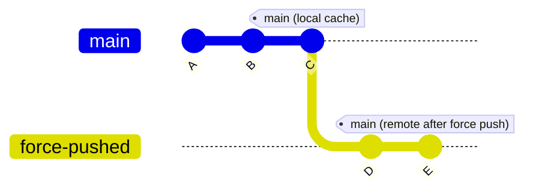

# How to Handle Force-Pushed Branches in ArgoCD

Author: [nawazdhandala](https://github.com/nawazdhandala)

Tags: ArgoCD, GitOps, Kubernetes, Git, Troubleshooting

Description: Learn how to handle force-pushed branches in ArgoCD, understand why force pushes cause sync issues, and configure ArgoCD to recover gracefully from rewritten Git history.

---

Force pushing to a Git branch rewrites the commit history. The branch pointer moves to a completely new commit that is not a descendant of the previous HEAD. This breaks a fundamental assumption that Git clients make - that history only moves forward. When ArgoCD encounters a force-pushed branch, its local cached repository becomes inconsistent with the remote, leading to fetch failures, sync errors, and confusing OutOfSync states.

This guide covers how to configure ArgoCD to handle force pushes gracefully and what happens behind the scenes when history gets rewritten.

## What Happens When a Branch Is Force-Pushed

ArgoCD's repo server maintains a local clone of each repository. When it performs a `git fetch`, it expects the remote branch to be a descendant of the local branch. A force push breaks this expectation:



After the force push, the remote `main` branch points to commit E, which has a completely different history from commit C. ArgoCD's local clone still has the old history A-B-C, and a normal `git fetch` might fail or produce unexpected results.

## Common Error Messages from Force Pushes

When ArgoCD encounters a force-pushed branch, you typically see errors like:

```text
ComparisonError: rpc error: code = Internal desc = Failed to fetch
default/my-app: `git fetch origin main` result error: exit status 128

fatal: refusing to merge unrelated histories
```

Or:

```text
Unable to resolve 'main' to a commit SHA
```

Or the application shows as OutOfSync even though you know the manifests match, because ArgoCD is comparing against the old (pre-force-push) commit.

## Configuring ArgoCD to Handle Force Pushes

The primary fix is to ensure ArgoCD uses `--force` when fetching from remote repositories. This tells Git to accept non-fast-forward updates to branch references.

Configure the repo server's Git behavior:

```yaml
apiVersion: v1
kind: ConfigMap
metadata:
  name: argocd-repo-server-gitconfig
  namespace: argocd
data:
  gitconfig: |
    [remote "origin"]
      fetch = +refs/heads/*:refs/remotes/origin/*

    [fetch]
      prune = true
      pruneTags = true
```

The `+` prefix in the fetch refspec tells Git to allow forced updates. The `prune` settings remove local references that no longer exist on the remote. Mount this configuration into the repo server:

```yaml
apiVersion: apps/v1
kind: Deployment
metadata:
  name: argocd-repo-server
  namespace: argocd
spec:
  template:
    spec:
      containers:
      - name: argocd-repo-server
        volumeMounts:
        - name: gitconfig
          mountPath: /home/argocd/.gitconfig
          subPath: gitconfig
      volumes:
      - name: gitconfig
        configMap:
          name: argocd-repo-server-gitconfig
```

## Forcing a Repository Refresh

When a force push has already caused issues, you need to force ArgoCD to drop its cached repository and re-clone:

```bash
# Hard refresh the application
argocd app get my-app --hard-refresh

# Or use the CLI to manually refresh
argocd app diff my-app --hard-refresh

# Force refresh via the API
curl -X POST "https://argocd.example.com/api/v1/applications/my-app?refresh=hard" \
  -H "Authorization: Bearer $ARGOCD_TOKEN"
```

The `--hard-refresh` flag tells ArgoCD to delete the cached repository and perform a fresh clone. This resolves any inconsistency caused by the force push.

## Automating Recovery from Force Pushes

Instead of manually hard-refreshing after every force push, configure a webhook that triggers a hard refresh when the Git server reports a force push event.

For GitHub, create a webhook that listens for push events:

```yaml
# GitHub webhook payload includes a "forced" field
# Example webhook handler as a Kubernetes Job
apiVersion: batch/v1
kind: Job
metadata:
  name: force-push-handler
  namespace: argocd
spec:
  template:
    spec:
      containers:
      - name: handler
        image: bitnami/kubectl
        command:
        - /bin/sh
        - -c
        - |
          # Parse the webhook payload to detect force push
          # Then trigger hard refresh for affected applications
          argocd app list -o name | while read app; do
            argocd app get "$app" --hard-refresh
          done
      restartPolicy: OnFailure
```

A more targeted approach is to use ArgoCD's webhook integration. Configure the Git webhook in ArgoCD, and it will automatically re-fetch the repository when push events are received:

```yaml
apiVersion: v1
kind: ConfigMap
metadata:
  name: argocd-cm
  namespace: argocd
data:
  # Webhook secret for GitHub
  webhook.github.secret: "your-webhook-secret"
```

When ArgoCD receives the webhook, it triggers a repository refresh. For force pushes, the fetch might still fail with the cached state, so combining webhooks with the Git configuration fix (force fetch refspec) is the most robust approach.

## Preventing Force Push Issues

The best way to handle force pushes is to avoid them in the first place. Here are strategies to minimize force push incidents:

**Protect your main branch:**

Configure branch protection rules in your Git provider to prevent force pushes to branches that ArgoCD tracks:

- GitHub: Settings > Branches > Branch protection rules > Do not allow force pushes
- GitLab: Settings > Repository > Protected branches > No one allowed to force push
- Bitbucket: Repository settings > Branch restrictions > Prevent rewrite history

**Use merge commits instead of rebasing:**

Force pushes most commonly happen when developers rebase feature branches onto main. If your workflow requires rebasing, make sure ArgoCD tracks the merge target (main) rather than feature branches.

**Track tags instead of branches:**

Tags are less likely to be force-pushed (though it is technically possible):

```yaml
spec:
  source:
    targetRevision: v1.5.0  # Tag - rarely force-pushed
```

**Pin to specific commit SHAs:**

For production environments, pin applications to specific commit SHAs:

```yaml
spec:
  source:
    targetRevision: abc123def456  # Specific commit - immutable
```

Commit SHAs are immutable. Even if the branch is force-pushed, the SHA still references the exact state you deployed.

## Handling Force Pushes in Multi-Application Setups

If you use the App-of-Apps pattern or ApplicationSets, a force push to the parent repository affects all child applications simultaneously. This can cause a cascade of sync failures.

To mitigate this:

```yaml
# Use separate repos for app definitions and actual manifests
apiVersion: argoproj.io/v1alpha1
kind: Application
metadata:
  name: app-of-apps
spec:
  source:
    # App definitions repo - kept stable, rarely force-pushed
    repoURL: https://github.com/myorg/argocd-apps.git
    path: apps/
    targetRevision: main
```

Keep your ArgoCD application definitions in a separate, stable repository that is never force-pushed. The individual applications can point to their own repositories where force pushes might occasionally happen, limiting the blast radius.

## Monitoring for Force Push Events

Set up monitoring to detect when force pushes affect your ArgoCD installation:

```promql
# Track Git fetch failures - spikes may indicate force push issues
rate(argocd_git_request_total{grpc_code!="OK"}[5m])

# Track application sync errors
argocd_app_sync_total{phase="Error"}
```

Create an alert that fires when multiple applications simultaneously enter error state, which is a strong signal of a force push to a shared repository:

```yaml
groups:
- name: argocd-force-push
  rules:
  - alert: ArgocdMassSyncFailure
    expr: |
      count(argocd_app_info{sync_status="Unknown"}) > 5
    for: 5m
    labels:
      severity: critical
    annotations:
      summary: "Multiple ArgoCD apps in Unknown state"
      description: "More than 5 applications are in Unknown sync state. This may indicate a force push to a shared repository."
```

Force pushes are a reality of Git workflows. Configure ArgoCD to handle them gracefully with force-fetch refspecs and automatic hard refresh on webhook events, while also implementing organizational policies to minimize their occurrence on production-tracked branches.
