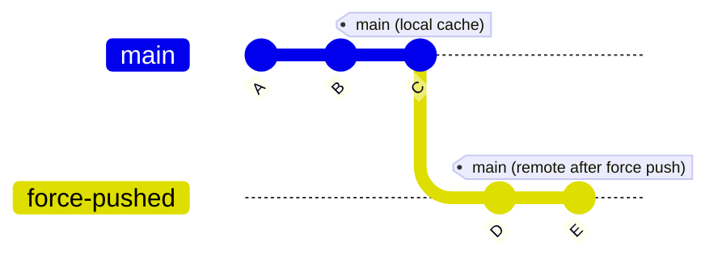

# How to Handle Force-Pushed Branches in ArgoCD

Author: [nawazdhandala](https://github.com/nawazdhandala)

Tags: ArgoCD, GitOps, Kubernetes, Git, Troubleshooting

Description: Learn how to handle force-pushed branches in ArgoCD, understand why force pushes cause sync issues, and configure ArgoCD to recover gracefully from rewritten Git history.

---

Force pushing to a Git branch rewrites the commit history. The branch pointer moves to a new commit that may not be a descendant of the previous HEAD. Modern ArgoCD releases fetch with force updates enabled, so the branch reference itself can move backward or sideways. Problems usually appear when an application is pinned to a commit that was removed from the remote, when a webhook or refresh has not yet updated ArgoCD's cache, or when the repo-server's local working tree is otherwise stale.

This guide covers how to configure ArgoCD to handle force pushes gracefully and what happens behind the scenes when history gets rewritten.

## What Happens When a Branch Is Force-Pushed

ArgoCD's repo server maintains local Git state for each repository. In current releases, its native Git client fetches from origin with `--tags --force --prune`, so it can accept non-fast-forward updates to remote-tracking references. A force push still changes what a branch name resolves to:


```mermaid
gitGraph
    commit id: "A"
    commit id: "B"
    commit id: "C" tag: "main (local cache)"
    branch force-pushed
    checkout force-pushed
    commit id: "D"
    commit id: "E" tag: "main (remote after force push)"
```

After the force push, the remote `main` branch points to commit E, which has a different history from commit C. Once ArgoCD refreshes, the branch target should resolve to E. If an application, webhook, or automation still references C and the Git server no longer advertises that commit, ArgoCD may be unable to resolve or fetch it.

## Common Error Messages from Force Pushes

When ArgoCD is asked to render a commit that disappeared after a force push, you may see errors like:

```text
ComparisonError: rpc error: code = Internal desc = Failed to fetch
default/my-app: `git fetch origin <commit-sha> --tags --force --prune` failed exit status 128

fatal: remote error: upload-pack: not our ref <commit-sha>
```

Or:

```text
Unable to resolve 'main' to a commit SHA
```

Or the application shows as Unknown or OutOfSync until ArgoCD refreshes and compares against the new branch tip.

## Configuring ArgoCD to Handle Force Pushes

The primary fix is to run a current ArgoCD release and let the repo server perform its normal forced fetch. ArgoCD's native Git client already fetches with:

```text
git fetch origin <revision> --tags --force --prune
```

The `--force` flag tells Git to accept non-fast-forward updates to references, and `--prune` removes remote-tracking references that no longer exist on the remote. You do not need to mount a custom `.gitconfig` just to add a force-fetch refspec.

## Forcing a Repository Refresh

When a force push has already caused issues, force ArgoCD to refresh application data and the target manifest cache:

```bash
# Hard refresh the application

argocd app get my-app --hard-refresh

# Or use the CLI to manually refresh
argocd app diff my-app --hard-refresh

# Force refresh via the API
curl -X GET "https://argocd.example.com/api/v1/applications/my-app?refresh=hard" \
  -H "Authorization: Bearer $ARGOCD_TOKEN"
```

The `--hard-refresh` flag refreshes application data as well as the target manifests cache. This resolves stale comparison data caused by the force push.

## Automating Recovery from Force Pushes

Instead of manually hard-refreshing after every force push, configure ArgoCD's webhook integration. Configure the Git webhook in ArgoCD, and it will automatically refresh matching applications when push events are received:

```yaml
apiVersion: v1
kind: Secret
metadata:
  name: argocd-secret
  namespace: argocd
type: Opaque
stringData:
  # Webhook secret for GitHub
  webhook.github.secret: "your-webhook-secret"
```

When ArgoCD receives the webhook at `/api/webhook`, it triggers a refresh for applications related to the Git repository. For force pushes, this removes the polling delay and lets the repo server perform its normal forced fetch promptly.

## Preventing Force Push Issues

The best way to handle force pushes is to avoid them in the first place. Here are strategies to minimize force push incidents:

**Protect your main branch:**

Configure branch protection rules in your Git provider to prevent force pushes to branches that ArgoCD tracks:

- GitHub: Settings > Branches > Branch protection rules > Do not allow force pushes
- GitLab: Settings > Repository > Protected branches > No one allowed to force push
- Bitbucket: Repository settings > Branch restrictions > Prevent rewrite history

**Use merge commits instead of rebasing:**

Force pushes most commonly happen when developers rebase feature branches onto main. If your workflow requires rebasing, make sure ArgoCD tracks the merge target (main) rather than feature branches.

**Track tags instead of branches:**

Tags are less likely to be force-pushed (though it is technically possible):

```yaml
spec:
  source:
    targetRevision: v1.5.0  # Tag - rarely force-pushed
```

**Pin to specific commit SHAs:**

For production environments, pin applications to specific commit SHAs:

```yaml
spec:
  source:
    targetRevision: abc123def456  # Specific commit - immutable
```

Full commit SHAs identify an exact Git object, so they avoid ambiguity when a branch is rewritten. The commit still needs to remain reachable or otherwise fetchable from the remote; if a force push removes it and the Git server will not advertise it, ArgoCD may not be able to fetch it later.

## Handling Force Pushes in Multi-Application Setups

If you use the App-of-Apps pattern or ApplicationSets, a force push to the parent repository affects all child applications simultaneously. This can cause a cascade of sync failures.

To mitigate this:

```yaml
# Use separate repos for app definitions and actual manifests
apiVersion: argoproj.io/v1alpha1
kind: Application
metadata:
  name: app-of-apps
spec:
  source:
    # App definitions repo - kept stable, rarely force-pushed
    repoURL: https://github.com/myorg/argocd-apps.git
    path: apps/
    targetRevision: main
```

Keep your ArgoCD application definitions in a separate, stable repository that is never force-pushed. The individual applications can point to their own repositories where force pushes might occasionally happen, limiting the blast radius.

## Monitoring for Force Push Events

Set up monitoring to detect when force pushes affect your ArgoCD installation:

```promql
# Track Git fetch failures - spikes may indicate force push issues
rate(argocd_git_fetch_fail_total[5m])

# Track application sync errors
argocd_app_sync_total{phase="Error"}
```

Create an alert that fires when multiple applications simultaneously enter error state, which is a strong signal of a force push to a shared repository:

```yaml
groups:
- name: argocd-force-push
  rules:
  - alert: ArgocdMassSyncFailure
    expr: |
      count(argocd_app_info{sync_status="Unknown"}) > 5
    for: 5m
    labels:
      severity: critical
    annotations:
      summary: "Multiple ArgoCD apps in Unknown state"
      description: "More than 5 applications are in Unknown sync state. This may indicate a force push to a shared repository."
```

Force pushes are a reality of Git workflows. Keep ArgoCD current so the repo server uses its built-in forced fetch behavior, use webhooks to remove polling delays, and implement organizational policies to minimize force pushes on production-tracked branches.
