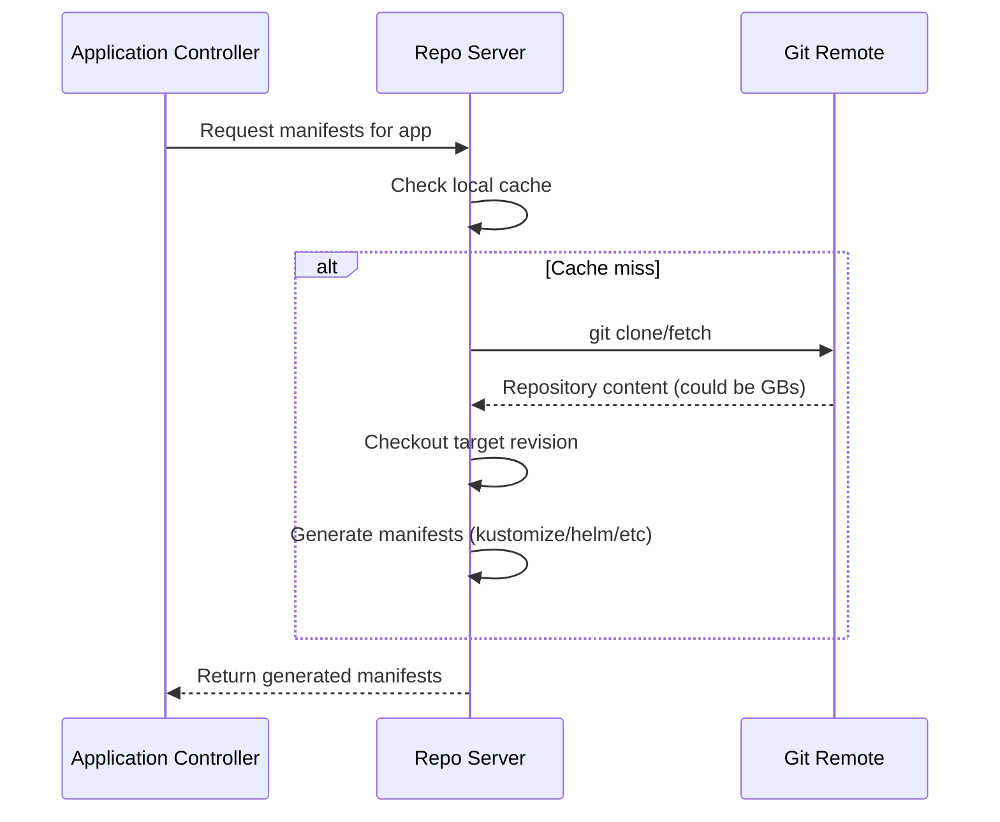
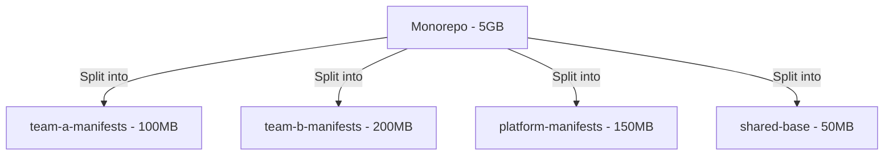

# How to Handle Large Git Repositories in ArgoCD

Author: [nawazdhandala](https://github.com/nawazdhandala)

Tags: ArgoCD, GitOps, Kubernetes, Git, Performance

Description: Learn how to optimize ArgoCD for large Git repositories with strategies for reducing clone times, managing memory usage, and improving sync performance.

---

As organizations grow, their Git repositories grow too. Monorepos containing thousands of manifests, repositories with long histories spanning years, and repos with large binary assets can all cause performance problems in ArgoCD. The repo-server is the component that suffers most, as it clones and processes repositories on every sync. This guide covers practical strategies for handling large repositories without degrading ArgoCD performance.

## Understanding the Problem

When ArgoCD syncs an application, the repo-server performs several operations:



For large repositories, the clone/fetch step is the bottleneck. A 5 GB repository with 100,000 commits can take minutes to clone, and each ArgoCD application pointing to that repository may trigger its own clone operation.

## Strategy 1: Shallow Clones

Shallow clones fetch only recent history instead of the entire repository. This dramatically reduces clone time and disk usage.

ArgoCD does not expose a direct "shallow clone" setting, but you can configure it by adjusting the Git fetch depth through environment variables:

```yaml
apiVersion: apps/v1
kind: Deployment
metadata:
  name: argocd-repo-server
  namespace: argocd
spec:
  template:
    spec:
      containers:
        - name: argocd-repo-server
          env:
            # Fetch only the last commit (depth=1)
            - name: ARGOCD_GIT_SHALLOW_CLONE
              value: "true"
```

With shallow clones, ArgoCD fetches only the specific commit it needs rather than the full history. This can reduce clone time from minutes to seconds for large repositories.

## Strategy 2: Sparse Checkout

If your monorepo contains many applications but each ArgoCD Application only needs a specific subdirectory, you do not need to check out the entire repository tree. While ArgoCD does not natively support sparse checkout, you can work around this by structuring your applications to reference specific paths:

```yaml
# ArgoCD Application pointing to a specific subdirectory
apiVersion: argoproj.io/v1alpha1
kind: Application
metadata:
  name: team-a-service
  namespace: argocd
spec:
  source:
    repoURL: https://github.com/company/monorepo.git
    targetRevision: main
    path: teams/team-a/services/api  # Only this path is processed
  destination:
    server: https://kubernetes.default.svc
    namespace: team-a
```

ArgoCD still clones the entire repository, but it only processes manifests from the specified path. The clone itself is cached, so multiple applications pointing to the same repository share one clone.

## Strategy 3: Increase Repo Server Cache

ArgoCD caches repository clones. Increasing the cache duration reduces how often full clones happen:

```yaml
apiVersion: v1
kind: ConfigMap
metadata:
  name: argocd-cm
  namespace: argocd
data:
  # Default is 180s (3 minutes). Increase for large repos.
  timeout.reconciliation: 600s
```

You can also increase the repo cache expiration:

```yaml
apiVersion: apps/v1
kind: Deployment
metadata:
  name: argocd-repo-server
  namespace: argocd
spec:
  template:
    spec:
      containers:
        - name: argocd-repo-server
          env:
            - name: ARGOCD_REPO_CACHE_EXPIRATION
              value: "24h"
```

## Strategy 4: Increase Repo Server Resources

Large repositories need more memory and CPU on the repo-server:

```yaml
apiVersion: apps/v1
kind: Deployment
metadata:
  name: argocd-repo-server
  namespace: argocd
spec:
  template:
    spec:
      containers:
        - name: argocd-repo-server
          resources:
            requests:
              memory: "1Gi"
              cpu: "500m"
            limits:
              memory: "4Gi"
              cpu: "2"
```

Also increase the temporary storage volume for repository clones:

```yaml
      volumes:
        - name: tmp
          emptyDir:
            sizeLimit: 20Gi  # Default may be too small for large repos
```

## Strategy 5: Scale Repo Server Horizontally

For teams with many large repositories, a single repo-server instance may not be enough. Scale it horizontally:

```yaml
apiVersion: apps/v1
kind: Deployment
metadata:
  name: argocd-repo-server
  namespace: argocd
spec:
  replicas: 3  # Scale based on your workload
  template:
    spec:
      containers:
        - name: argocd-repo-server
          env:
            # Configure parallel operations per server
            - name: ARGOCD_EXEC_TIMEOUT
              value: "300s"
```

Each repo-server replica maintains its own cache, so you want sticky sessions or consistent hashing for optimal cache hit rates.

## Strategy 6: Split Monorepos

If performance is still an issue after tuning, consider splitting your monorepo into smaller repositories. This is often the best long-term solution:



Each smaller repository clones faster, uses less memory, and can have its own sync schedule. The trade-off is managing more repositories, but tools like ApplicationSets make this manageable:

```yaml
apiVersion: argoproj.io/v1alpha1
kind: ApplicationSet
metadata:
  name: team-apps
  namespace: argocd
spec:
  generators:
    - list:
        elements:
          - team: team-a
            repo: https://github.com/company/team-a-manifests.git
          - team: team-b
            repo: https://github.com/company/team-b-manifests.git
  template:
    metadata:
      name: "{{team}}-app"
    spec:
      source:
        repoURL: "{{repo}}"
        targetRevision: main
        path: production
      destination:
        server: https://kubernetes.default.svc
        namespace: "{{team}}"
```

## Strategy 7: Use Webhooks Instead of Polling

Polling large repositories is wasteful. Configure webhooks so ArgoCD only fetches when changes actually occur:

```yaml
apiVersion: v1
kind: ConfigMap
metadata:
  name: argocd-cm
  namespace: argocd
data:
  # Increase polling interval since webhooks handle change detection
  timeout.reconciliation: 1800s  # 30 minutes
  webhook.github.secret: your-webhook-secret
```

With webhooks, ArgoCD only clones when a push event is received, drastically reducing the number of clone operations.

## Strategy 8: Tune Git Operations

Several Git-level settings can improve performance:

```yaml
apiVersion: apps/v1
kind: Deployment
metadata:
  name: argocd-repo-server
  namespace: argocd
spec:
  template:
    spec:
      containers:
        - name: argocd-repo-server
          env:
            # Increase Git operation timeout
            - name: ARGOCD_EXEC_TIMEOUT
              value: "300s"
            # Number of parallel manifest generation operations
            - name: ARGOCD_REPO_SERVER_PARALLELISM_LIMIT
              value: "5"
```

## Monitoring Repository Performance

Track clone and manifest generation times to identify bottlenecks:

```bash
# Check repo-server metrics
kubectl port-forward svc/argocd-repo-server -n argocd 8084:8084

# View Prometheus metrics
curl http://localhost:8084/metrics | grep argocd_repo

# Key metrics to watch:
# argocd_repo_server_git_request_total - Total Git requests
# argocd_repo_server_git_request_duration_seconds - Clone/fetch duration
```

For comprehensive monitoring of your ArgoCD instance including repo-server performance, consider integrating with [OneUptime](https://oneuptime.com/blog/post/2026-01-25-gitops-argocd-kubernetes/view) for alerting on slow syncs and repository timeouts.

## Troubleshooting Performance Issues

### Clone Timeouts

```bash
# Check for timeout errors in logs
kubectl logs -n argocd deployment/argocd-repo-server --tail=200 | grep -i "timeout\|deadline"

# Increase the execution timeout
kubectl set env deployment/argocd-repo-server -n argocd ARGOCD_EXEC_TIMEOUT=600s
```

### Out of Memory Kills

```bash
# Check for OOMKilled events
kubectl get events -n argocd --field-selector reason=OOMKilling

# Check current memory usage
kubectl top pod -n argocd -l app.kubernetes.io/name=argocd-repo-server

# Increase memory limits
kubectl patch deployment argocd-repo-server -n argocd --type json -p '[
  {"op": "replace", "path": "/spec/template/spec/containers/0/resources/limits/memory", "value": "4Gi"}
]'
```

### Disk Space Issues

```bash
# Check disk usage in the repo-server pod
kubectl exec -n argocd deployment/argocd-repo-server -- df -h /tmp

# If /tmp is full, increase the emptyDir size limit or clean cached repos
```

Large Git repositories are one of the most common performance bottlenecks in ArgoCD. The right combination of shallow clones, caching, resource allocation, and repository architecture will keep your GitOps pipeline running smoothly as your organization scales.
