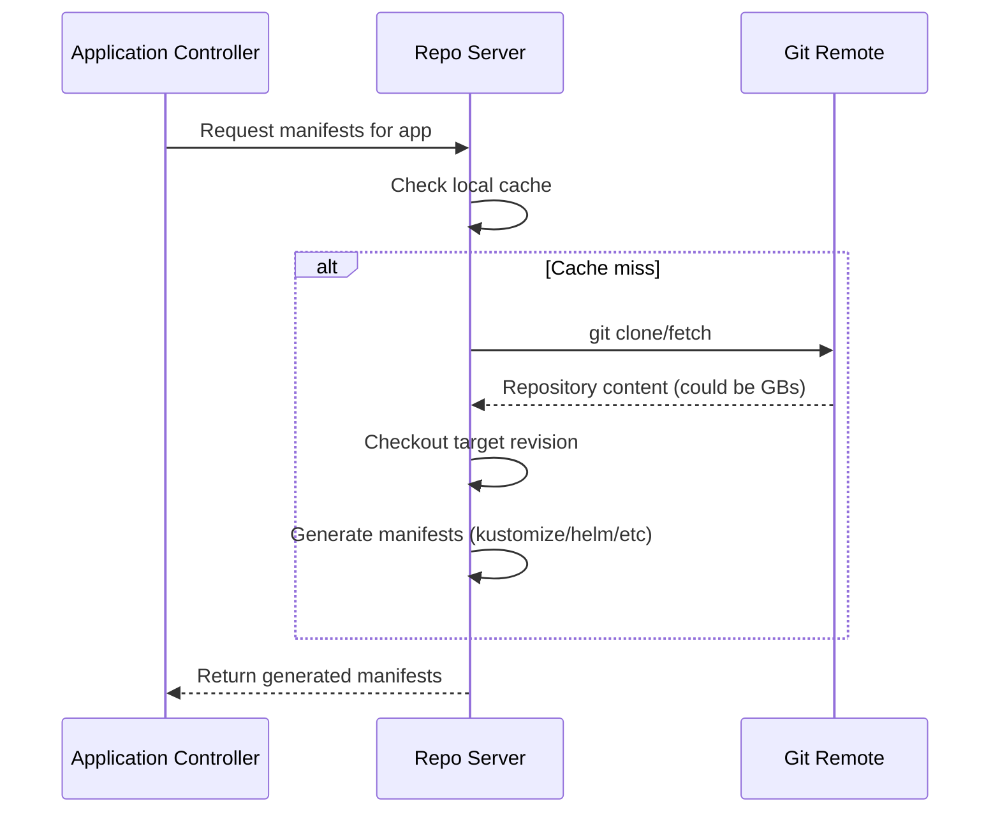
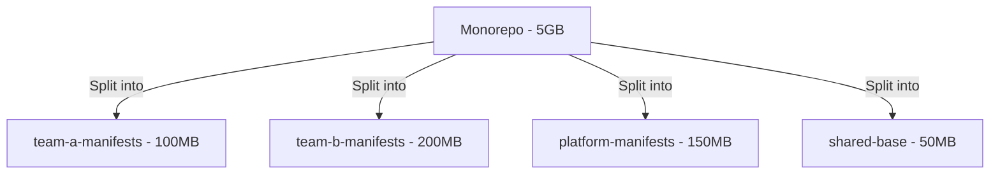

# How to Handle Large Git Repositories in ArgoCD

Author: [nawazdhandala](https://github.com/nawazdhandala)

Tags: ArgoCD, GitOps, Kubernetes, Git, Performance

Description: Learn how to optimize ArgoCD for large Git repositories with strategies for reducing clone times, managing memory usage, and improving sync performance.

---

As organizations grow, their Git repositories grow too. Monorepos containing thousands of manifests, repositories with long histories spanning years, and repos with large binary assets can all cause performance problems in ArgoCD. The repo-server is the component that suffers most, as it clones or fetches repositories and generates manifests during reconciliation. This guide covers practical strategies for handling large repositories without degrading ArgoCD performance.

## Understanding the Problem

When ArgoCD syncs an application, the repo-server performs several operations:


```mermaid
sequenceDiagram
    participant App as Application Controller
    participant RS as Repo Server
    participant Git as Git Remote

    App->>RS: Request manifests for app
    RS->>RS: Check local cache
    alt Cache miss
        RS->>Git: git clone/fetch
        Git-->>RS: Repository content (could be GBs)
        RS->>RS: Checkout target revision
        RS->>RS: Generate manifests (kustomize/helm/etc)
    end
    RS-->>App: Return generated manifests
```

For large repositories, the clone/fetch step is the bottleneck. A 5 GB repository with 100,000 commits can take minutes to clone. The repo-server maintains a local repository clone and reuses it for manifest generation, but cache misses, new repo-server replicas, and new revisions still require Git network operations.

## Strategy 1: Shallow Clones

Shallow clones fetch only recent history instead of the entire repository. This dramatically reduces clone time and disk usage.

ArgoCD supports shallow clones by setting a repository depth. For repositories managed declaratively, add `depth: "1"` to the repository Secret:

```yaml
apiVersion: v1
kind: Secret
metadata:
  name: my-repo
  namespace: argocd
  labels:
    argocd.argoproj.io/secret-type: repository
  annotations:
    managed-by: argocd.argoproj.io
type: Opaque
stringData:
  type: git
  url: https://github.com/company/monorepo.git
  depth: "1"
```

You can also configure this with the CLI:

```bash
argocd repo add https://github.com/company/monorepo.git --depth 1
```

With shallow clones, ArgoCD clones with depth 1 rather than the full history. This can reduce clone time from minutes to seconds for repositories with large histories.

## Strategy 2: Sparse Checkout

If your monorepo contains many applications but each ArgoCD Application only needs a specific subdirectory, you do not need to process the entire repository tree. While ArgoCD does not natively support sparse checkout, you can structure your applications to reference specific paths:

```yaml
# ArgoCD Application pointing to a specific subdirectory

apiVersion: argoproj.io/v1alpha1
kind: Application
metadata:
  name: team-a-service
  namespace: argocd
spec:
  source:
    repoURL: https://github.com/company/monorepo.git
    targetRevision: main
    path: teams/team-a/services/api  # Only this path is processed
  destination:
    server: https://kubernetes.default.svc
    namespace: team-a
```

ArgoCD still clones the entire repository, but it only processes manifests from the specified path. The clone itself is cached, so multiple applications pointing to the same repository share one clone.

## Strategy 3: Increase Repo Server Cache

ArgoCD caches repository state and generated manifests. Increasing the reconciliation interval reduces how often ArgoCD polls repositories for changes when you are not relying on webhooks:

```yaml
apiVersion: v1
kind: ConfigMap
metadata:
  name: argocd-cm
  namespace: argocd
data:
  # The default polling interval is about 3 minutes, including jitter.
  timeout.reconciliation: 600s
```

You can also tune the repo cache expiration in `argocd-cmd-params-cm`:

```yaml
apiVersion: v1
kind: ConfigMap
metadata:
  name: argocd-cmd-params-cm
  namespace: argocd
data:
  # Cache expiration for repo state, app details, manifest generation, and revision metadata.
  reposerver.repo.cache.expiration: "24h0m0s"
```

## Strategy 4: Increase Repo Server Resources

Large repositories need more memory and CPU on the repo-server:

```yaml
apiVersion: apps/v1
kind: Deployment
metadata:
  name: argocd-repo-server
  namespace: argocd
spec:
  template:
    spec:
      containers:
        - name: argocd-repo-server
          resources:
            requests:
              memory: "1Gi"
              cpu: "500m"
            limits:
              memory: "4Gi"
              cpu: "2"
```

Also make sure the temporary storage volume for repository clones is large enough. The repo-server clones repositories into `/tmp` by default, or into the path set by `TMPDIR`:

```yaml
      volumes:
        - name: tmp
          emptyDir:
            sizeLimit: 20Gi
```

## Strategy 5: Scale Repo Server Horizontally

For teams with many large repositories, a single repo-server instance may not be enough. Scale it horizontally:

```yaml
apiVersion: apps/v1
kind: Deployment
metadata:
  name: argocd-repo-server
  namespace: argocd
spec:
  replicas: 3  # Scale based on your workload
  template:
    spec:
      containers:
        - name: argocd-repo-server
          env:
            # Limit concurrent manifest generation operations per server
            - name: ARGOCD_REPO_SERVER_PARALLELISM_LIMIT
              value: "5"
```

Each repo-server replica maintains its own local repository clone cache, so new replicas may need to clone repositories before their caches warm up.

## Strategy 6: Split Monorepos

If performance is still an issue after tuning, consider splitting your monorepo into smaller repositories. This is often the best long-term solution:


```mermaid
graph TD
    A[Monorepo - 5GB] -->|Split into| B[team-a-manifests - 100MB]
    A -->|Split into| C[team-b-manifests - 200MB]
    A -->|Split into| D[platform-manifests - 150MB]
    A -->|Split into| E[shared-base - 50MB]
```

Each smaller repository clones faster, uses less memory, and can have its own sync schedule. The trade-off is managing more repositories, but tools like ApplicationSets make this manageable:

```yaml
apiVersion: argoproj.io/v1alpha1
kind: ApplicationSet
metadata:
  name: team-apps
  namespace: argocd
spec:
  generators:
    - list:
        elements:
          - team: team-a
            repo: https://github.com/company/team-a-manifests.git
          - team: team-b
            repo: https://github.com/company/team-b-manifests.git
  template:
    metadata:
      name: "{{team}}-app"
    spec:
      source:
        repoURL: "{{repo}}"
        targetRevision: main
        path: production
      destination:
        server: https://kubernetes.default.svc
        namespace: "{{team}}"
```

## Strategy 7: Use Webhooks Instead of Polling

Polling large repositories is wasteful. Configure webhooks so ArgoCD only fetches when changes actually occur:

```yaml
apiVersion: v1
kind: ConfigMap
metadata:
  name: argocd-cm
  namespace: argocd
data:
  # Increase polling interval since webhooks handle change detection
  timeout.reconciliation: 1800s  # 30 minutes
```

The webhook shared secret is configured in `argocd-secret`, not `argocd-cm`:

```yaml
apiVersion: v1
kind: Secret
metadata:
  name: argocd-secret
  namespace: argocd
type: Opaque
stringData:
  webhook.github.secret: your-webhook-secret
```

With webhooks, ArgoCD receives repository change notifications instead of waiting for the next polling interval, reducing unnecessary repository checks.

## Strategy 8: Tune Git Operations

Several repo-server settings can improve performance:

```yaml
apiVersion: v1
kind: ConfigMap
metadata:
  name: argocd-cmd-params-cm
  namespace: argocd
data:
  # Increase Git request timeout
  reposerver.git.request.timeout: "300s"
  # Number of parallel manifest generation operations
  reposerver.parallelism.limit: "5"
```

## Monitoring Repository Performance

Track clone and manifest generation times to identify bottlenecks:

```bash
# Check repo-server metrics
kubectl port-forward svc/argocd-repo-server -n argocd 8084:8084

# View Prometheus metrics
curl http://localhost:8084/metrics | grep -E 'argocd_git|argocd_repo_pending'

# Key metrics to watch:
# argocd_git_request_total - Total Git requests
# argocd_git_request_duration_seconds - Git request duration
# argocd_repo_pending_request_total - Pending requests requiring a repository lock
```

For comprehensive monitoring of your ArgoCD instance including repo-server performance, consider integrating with [OneUptime](https://oneuptime.com/blog/post/2026-01-25-gitops-argocd-kubernetes/view) for alerting on slow syncs and repository timeouts.

## Troubleshooting Performance Issues

### Clone Timeouts

```bash
# Check for timeout errors in logs
kubectl logs -n argocd deployment/argocd-repo-server --tail=200 | grep -i "timeout\|deadline"

# Increase the Git request timeout in argocd-cmd-params-cm
kubectl patch configmap argocd-cmd-params-cm -n argocd --type merge -p '{"data":{"reposerver.git.request.timeout":"600s"}}'
kubectl rollout restart deployment/argocd-repo-server -n argocd
```

### Out of Memory Kills

```bash
# Check for OOMKilled events
kubectl get events -n argocd --field-selector reason=OOMKilling

# Check current memory usage
kubectl top pod -n argocd -l app.kubernetes.io/name=argocd-repo-server

# Increase memory limits
kubectl patch deployment argocd-repo-server -n argocd --type json -p '[
  {"op": "replace", "path": "/spec/template/spec/containers/0/resources/limits/memory", "value": "4Gi"}
]'
```

### Disk Space Issues

```bash
# Check disk usage in the repo-server pod
kubectl exec -n argocd deployment/argocd-repo-server -- df -h /tmp

# If /tmp is full, increase the emptyDir size limit or clean cached repos
```

Large Git repositories are one of the most common performance bottlenecks in ArgoCD. The right combination of shallow clones, caching, resource allocation, and repository architecture will keep your GitOps pipeline running smoothly as your organization scales.
