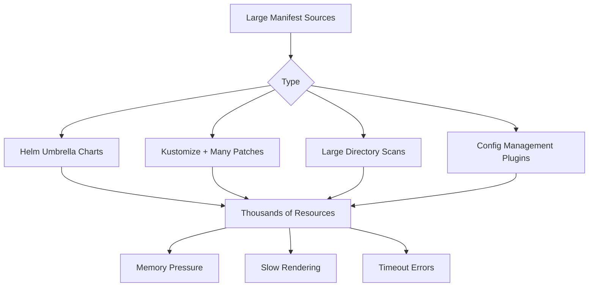

# How to Handle Large Manifest Generation in ArgoCD

Author: [nawazdhandala](https://github.com/nawazdhandala)

Tags: ArgoCD, GitOps, Kubernetes, Performance, Manifest Generation

Description: Learn how to handle large manifest generation in ArgoCD when Helm charts, Kustomize overlays, or directory scans produce thousands of resources or megabytes of YAML output.

---

Some ArgoCD applications generate massive volumes of Kubernetes manifests. A Helm umbrella chart might produce 500+ resources. A Kustomize overlay with dozens of patches might output megabytes of YAML. A directory scan of a large config repository might find thousands of files. When manifest generation produces large outputs, ArgoCD can hit memory limits, timeouts, and performance degradation. This guide covers how to handle these scenarios effectively.

## When Manifest Generation Becomes a Problem

Manifest generation becomes "large" when:

- The generated YAML exceeds 10MB
- The manifest contains 200+ individual Kubernetes resources
- Helm template rendering takes more than 30 seconds
- Kustomize build takes more than 30 seconds
- The repo server runs out of memory during generation



## Strategy 1: Split Large Applications

The most effective solution is to break large applications into smaller, focused ones:

```yaml
# Before: One massive application
apiVersion: argoproj.io/v1alpha1
kind: Application
metadata:
  name: entire-platform
spec:
  source:
    path: platform/  # Contains everything - networking, monitoring, rbac, apps

# After: Multiple focused applications
---
apiVersion: argoproj.io/v1alpha1
kind: Application
metadata:
  name: platform-networking
spec:
  source:
    path: platform/networking/
---
apiVersion: argoproj.io/v1alpha1
kind: Application
metadata:
  name: platform-monitoring
spec:
  source:
    path: platform/monitoring/
---
apiVersion: argoproj.io/v1alpha1
kind: Application
metadata:
  name: platform-rbac
spec:
  source:
    path: platform/rbac/
```

Use an App-of-Apps to manage the split:

```yaml
apiVersion: argoproj.io/v1alpha1
kind: Application
metadata:
  name: platform
spec:
  source:
    path: platform-apps/  # Contains Application YAMLs, not resources
  destination:
    namespace: argocd
```

## Strategy 2: Increase Repo Server Resources

For applications that cannot be split, give the repo server more resources:

```yaml
apiVersion: apps/v1
kind: Deployment
metadata:
  name: argocd-repo-server
  namespace: argocd
spec:
  template:
    spec:
      containers:
        - name: argocd-repo-server
          resources:
            requests:
              cpu: "2"
              memory: "4Gi"
            limits:
              cpu: "4"
              memory: "8Gi"
          env:
            # Increase Go garbage collection threshold
            - name: GOGC
              value: "50"
            # Set Go memory limit
            - name: GOMEMLIMIT
              value: "6GiB"
```

## Strategy 3: Increase Manifest Generation Timeout

Large manifests take longer to generate. Increase the timeout to prevent premature failures:

```yaml
# argocd-cmd-params-cm ConfigMap
apiVersion: v1
kind: ConfigMap
metadata:
  name: argocd-cmd-params-cm
  namespace: argocd
data:
  # Timeout for manifest generation (default: 60s)
  controller.repo.server.timeout.seconds: "180"

  # Also increase the repo server's own timeout
  reposerver.git.request.timeout: "120"
```

## Strategy 4: Optimize Helm Umbrella Charts

Helm umbrella charts (charts that depend on multiple sub-charts) are a common source of large manifests.

### Pin Sub-chart Versions

```yaml
# Chart.yaml
dependencies:
  - name: nginx-ingress
    version: "4.7.1"     # Pin exact version
    repository: "https://kubernetes.github.io/ingress-nginx"
  - name: cert-manager
    version: "1.13.0"    # Pin exact version
    repository: "https://charts.jetstack.io"
```

### Disable Unnecessary Components

```yaml
# values.yaml - disable components you do not need
nginx-ingress:
  controller:
    metrics:
      enabled: false      # Disable if not needed
    admissionWebhooks:
      enabled: false      # Disable if using a separate webhook

cert-manager:
  installCRDs: false      # Install CRDs separately
  prometheus:
    enabled: false
```

### Pre-render to YAML

For charts that rarely change, render once and commit the YAML:

```bash
# Render the chart to YAML
helm template my-release ./umbrella-chart \
  --values values-production.yaml \
  --output-dir rendered/

# Commit the rendered YAML
git add rendered/
git commit -m "Pre-render umbrella chart manifests"
```

Then point ArgoCD at the rendered directory instead of the Helm chart:

```yaml
apiVersion: argoproj.io/v1alpha1
kind: Application
metadata:
  name: platform
spec:
  source:
    repoURL: https://github.com/org/infra
    path: rendered/  # Pre-rendered YAML, no Helm processing needed
```

## Strategy 5: Optimize Kustomize Builds

### Reduce Patch Count

Consolidate multiple small patches into fewer, larger ones:

```yaml
# Before: Many small patches
patches:
  - target:
      kind: Deployment
      name: api
    patch: |
      - op: replace
        path: /spec/replicas
        value: 3
  - target:
      kind: Deployment
      name: api
    patch: |
      - op: replace
        path: /spec/template/spec/containers/0/resources/limits/memory
        value: 1Gi

# After: Consolidated patch
patches:
  - target:
      kind: Deployment
      name: api
    patch: |
      - op: replace
        path: /spec/replicas
        value: 3
      - op: replace
        path: /spec/template/spec/containers/0/resources/limits/memory
        value: 1Gi
```

### Avoid Remote Bases

Remote bases add network latency and can fail:

```yaml
# Slow: Remote base fetched during build
resources:
  - https://github.com/org/base-configs//manifests?ref=v1.0

# Fast: Local copy
resources:
  - ../../base/manifests
```

### Use Components for Shared Functionality

```yaml
# kustomization.yaml
components:
  - ../../components/monitoring
  - ../../components/networking
```

Components are assembled at build time and are more efficient than multiple overlays.

## Strategy 6: Use Server-Side Apply for Large Resources

Server-side apply handles large resources more efficiently:

```yaml
apiVersion: argoproj.io/v1alpha1
kind: Application
metadata:
  name: large-app
spec:
  syncPolicy:
    syncOptions:
      - ServerSideApply=true
```

Server-side apply also helps with CRDs and other large resources that hit the `kubectl.kubernetes.io/last-applied-configuration` annotation size limit (262,144 bytes).

## Strategy 7: Limit Directory Recursion

When using directory-type sources, limit recursion and file types:

```yaml
apiVersion: argoproj.io/v1alpha1
kind: Application
metadata:
  name: config-repo
spec:
  source:
    repoURL: https://github.com/org/configs
    path: production/
    directory:
      recurse: true
      include: "*.yaml"
      exclude: "{test/**,scripts/**,docs/**,README.md,*.j2,*.tmpl}"
```

## Strategy 8: Use Config Management Plugins Efficiently

If you use custom config management plugins (CMPs), optimize their output:

```yaml
# CMP ConfigMap
apiVersion: v1
kind: ConfigMap
metadata:
  name: cmp-plugin
  namespace: argocd
data:
  plugin.yaml: |
    apiVersion: argoproj.io/v1alpha1
    kind: ConfigManagementPlugin
    metadata:
      name: my-plugin
    spec:
      generate:
        command:
          - /bin/sh
          - -c
          - |
            # Generate only necessary manifests
            # Avoid generating commented-out or unused resources
            my-generator --production-only --no-comments
```

## Monitoring Manifest Generation

Track manifest generation performance:

```bash
# Check manifest generation duration
kubectl logs -n argocd deployment/argocd-repo-server --tail=200 | \
  grep -E "manifest.*generat|render.*complet|duration"

# Check for timeout errors
kubectl logs -n argocd deployment/argocd-application-controller --tail=200 | \
  grep -E "timeout|deadline|exceeded"

# Check repo server memory during generation
kubectl top pod -n argocd -l app.kubernetes.io/name=argocd-repo-server
```

Set up alerts:

```yaml
groups:
  - name: argocd-manifest-generation
    rules:
      - alert: ArgocdManifestGenerationSlow
        expr: |
          argocd_app_reconcile_duration_seconds_bucket{le="30"} == 0
        for: 10m
        labels:
          severity: warning
        annotations:
          summary: "ArgoCD manifest generation taking >30 seconds"

      - alert: ArgocdRepoServerOOM
        expr: |
          container_memory_working_set_bytes{
            namespace="argocd",
            container="argocd-repo-server"
          }
          /
          container_spec_memory_limit_bytes{
            namespace="argocd",
            container="argocd-repo-server"
          }
          > 0.9
        for: 5m
        labels:
          severity: critical
        annotations:
          summary: "ArgoCD repo server using >90% memory"
```

For comprehensive monitoring of manifest generation performance and ArgoCD resource health, [OneUptime](https://oneuptime.com) provides dashboards and alerting that help you catch performance issues before they affect your deployments.

## Key Takeaways

- Split applications with 200+ resources into smaller, focused applications
- Increase repo server memory and CPU for applications that cannot be split
- Increase manifest generation timeout from the default 60s
- Pin Helm sub-chart versions and disable unnecessary chart components
- Consolidate Kustomize patches and avoid remote bases
- Use server-side apply for large resources to avoid annotation size limits
- Limit directory recursion and exclude non-manifest files
- Pre-render complex Helm charts to YAML for the fastest generation time
- Monitor manifest generation duration and repo server memory to catch issues early
