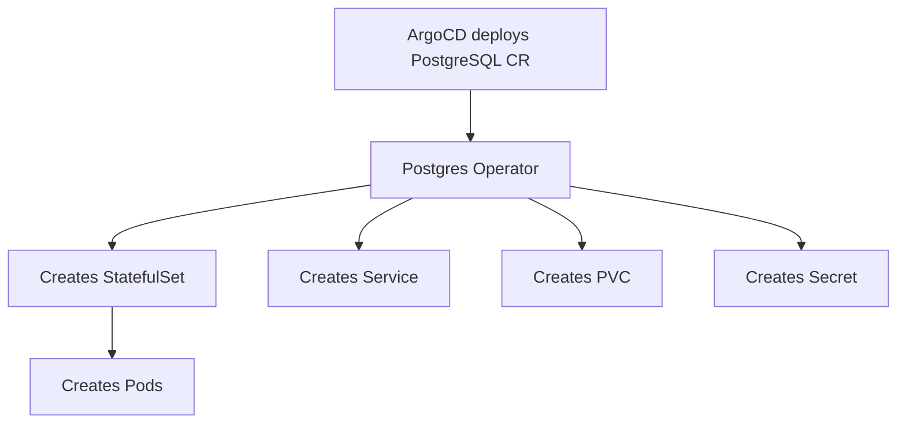

# How to Handle Resources Created by Operators in ArgoCD

Author: [nawazdhandala](https://github.com/nawazdhandala)

Tags: ArgoCD, GitOps, Kubernetes, Operator, Resource Management

Description: Learn how to handle Kubernetes resources dynamically created by operators in ArgoCD, including tracking, health checks, and avoiding sync conflicts with operator-managed resources.

---

Kubernetes operators create, modify, and delete resources as part of their reconciliation loops. When you deploy an operator through ArgoCD and that operator creates additional resources, ArgoCD does not automatically know about those secondary resources. This creates a gap in your GitOps visibility and can lead to confusing diff results, incorrect health statuses, and sync conflicts. This guide covers how to handle operator-created resources properly in ArgoCD.

## Understanding the Operator Resource Problem

When you deploy a Custom Resource (CR) through ArgoCD, the operator watching that CR creates secondary resources. For example:



ArgoCD manages the PostgreSQL CR, but the StatefulSet, Service, PVC, Secret, and Pods are created by the operator. ArgoCD does not track these secondary resources, which means:

- They do not appear in ArgoCD's resource tree (unless the operator sets owner references)
- Their health is not monitored by ArgoCD
- ArgoCD may show "Unknown" health for the parent CR

## Strategy 1: Let Kubernetes Owner References Handle It

When operators set proper owner references on secondary resources, Kubernetes and ArgoCD can follow the ownership chain. Well-written operators do this automatically.

```yaml
# Example: The operator creates a StatefulSet with ownerReferences
apiVersion: apps/v1
kind: StatefulSet
metadata:
  name: my-postgres
  namespace: databases
  ownerReferences:
    - apiVersion: postgres-operator.crunchydata.com/v1beta1
      kind: PostgresCluster
      name: my-postgres
      uid: abc-123-def
```

When owner references are set, ArgoCD's resource tree will show the secondary resources as children of the CR. Check if your operator sets owner references:

```bash
# Check if operator-created resources have ownerReferences
kubectl get statefulset my-postgres -n databases \
  -o jsonpath='{.metadata.ownerReferences[*].kind}'

# List all resources owned by a specific CR
kubectl get all -n databases \
  -o jsonpath='{range .items[?(@.metadata.ownerReferences)]}{.kind}/{.metadata.name} owned by {.metadata.ownerReferences[0].kind}/{.metadata.ownerReferences[0].name}{"\n"}{end}'
```

## Strategy 2: Custom Health Checks for CRDs

ArgoCD does not know how to check the health of custom resources by default. You need to write custom health check scripts in Lua to tell ArgoCD what "healthy" means for your CRDs.

```yaml
# argocd-cm ConfigMap - custom health check for PostgresCluster
apiVersion: v1
kind: ConfigMap
metadata:
  name: argocd-cm
  namespace: argocd
data:
  resource.customizations.health.postgres-operator.crunchydata.com_PostgresCluster: |
    hs = {}
    if obj.status ~= nil then
      if obj.status.conditions ~= nil then
        for i, condition in ipairs(obj.status.conditions) do
          if condition.type == "PostgresClusterProgressing" and condition.status == "True" then
            hs.status = "Progressing"
            hs.message = condition.message or "Cluster is being set up"
            return hs
          end
          if condition.type == "PostgresClusterProgressing" and condition.status == "False" and condition.reason == "PostgresClusterHealthy" then
            hs.status = "Healthy"
            hs.message = "PostgreSQL cluster is healthy"
            return hs
          end
        end
      end
    end
    hs.status = "Progressing"
    hs.message = "Waiting for status"
    return hs
```

Here is another example for the cert-manager Certificate CRD:

```yaml
  resource.customizations.health.cert-manager.io_Certificate: |
    hs = {}
    if obj.status ~= nil then
      if obj.status.conditions ~= nil then
        for i, condition in ipairs(obj.status.conditions) do
          if condition.type == "Ready" then
            if condition.status == "True" then
              hs.status = "Healthy"
              hs.message = condition.message
            else
              hs.status = "Degraded"
              hs.message = condition.message
            end
            return hs
          end
        end
      end
    end
    hs.status = "Progressing"
    hs.message = "Waiting for certificate"
    return hs
```

## Strategy 3: Ignore Operator-Managed Fields in Diffs

Operators often modify resources that ArgoCD also manages. For example, an operator might add annotations, update status fields, or inject sidecar configurations. These changes cause ArgoCD to show the resource as OutOfSync.

```yaml
# Application-level ignore for operator-modified fields
apiVersion: argoproj.io/v1alpha1
kind: Application
metadata:
  name: my-app
spec:
  ignoreDifferences:
    # Ignore status fields (operators update these)
    - group: apps
      kind: Deployment
      jsonPointers:
        - /spec/replicas  # HPA operator modifies this
    # Ignore annotations added by operators
    - group: ""
      kind: Service
      jqPathExpressions:
        - .metadata.annotations["operator.example.com/last-reconciled"]
    # Ignore all status fields on CRDs
    - group: postgres-operator.crunchydata.com
      kind: PostgresCluster
      jsonPointers:
        - /status
```

For system-wide ignoring of operator-managed fields:

```yaml
# argocd-cm ConfigMap
apiVersion: v1
kind: ConfigMap
metadata:
  name: argocd-cm
  namespace: argocd
data:
  resource.customizations.ignoreDifferences.all: |
    managedFieldsManagers:
      - kube-controller-manager
      - cluster-autoscaler
```

## Strategy 4: Resource Exclusions for Operator Internals

Some operator-created resources are internal implementation details that should not appear in ArgoCD at all. Use resource exclusions to hide them.

```yaml
# argocd-cm ConfigMap
apiVersion: v1
kind: ConfigMap
metadata:
  name: argocd-cm
  namespace: argocd
data:
  resource.exclusions: |
    # Exclude operator-internal resources
    - apiGroups:
        - "internal.operator.example.com"
      kinds:
        - "*"
      clusters:
        - "*"
    # Exclude operator leader election resources
    - apiGroups:
        - "coordination.k8s.io"
      kinds:
        - Lease
      clusters:
        - "*"
```

## Strategy 5: Handling HPA and VPA Operator Conflicts

The Horizontal Pod Autoscaler (HPA) and Vertical Pod Autoscaler (VPA) are built-in Kubernetes operators that modify replica counts and resource requests. This is one of the most common operator conflicts with ArgoCD.

```yaml
# Deploy the HPA through ArgoCD
apiVersion: autoscaling/v2
kind: HorizontalPodAutoscaler
metadata:
  name: my-app-hpa
spec:
  scaleTargetRef:
    apiVersion: apps/v1
    kind: Deployment
    name: my-app
  minReplicas: 2
  maxReplicas: 10
  metrics:
    - type: Resource
      resource:
        name: cpu
        target:
          type: Utilization
          averageUtilization: 70
```

Tell ArgoCD to ignore the replica field that HPA controls:

```yaml
apiVersion: argoproj.io/v1alpha1
kind: Application
metadata:
  name: my-app
spec:
  ignoreDifferences:
    - group: apps
      kind: Deployment
      jsonPointers:
        - /spec/replicas
  syncPolicy:
    syncOptions:
      - RespectIgnoreDifferences=true  # Honor ignore rules during sync too
```

The `RespectIgnoreDifferences=true` sync option is critical here. Without it, ArgoCD still applies the replica count from Git during sync, overriding the HPA.

## Strategy 6: Deploying Operators and Their CRs Together

When deploying both an operator and its custom resources through ArgoCD, use sync waves to ensure the operator is ready before creating CRs.

```yaml
# Operator deployment - sync wave 0
apiVersion: apps/v1
kind: Deployment
metadata:
  name: postgres-operator
  annotations:
    argocd.argoproj.io/sync-wave: "0"
spec:
  # ... operator deployment spec
---
# Wait for CRD to be established
apiVersion: apiextensions.k8s.io/v1
kind: CustomResourceDefinition
metadata:
  name: postgresclusters.postgres-operator.crunchydata.com
  annotations:
    argocd.argoproj.io/sync-wave: "0"
---
# Create the CR after operator is ready - sync wave 1
apiVersion: postgres-operator.crunchydata.com/v1beta1
kind: PostgresCluster
metadata:
  name: my-database
  annotations:
    argocd.argoproj.io/sync-wave: "1"
spec:
  postgresVersion: 15
  instances:
    - replicas: 3
```

Or better yet, separate the operator and its CRs into different applications:

```yaml
# App 1: The operator itself
apiVersion: argoproj.io/v1alpha1
kind: Application
metadata:
  name: postgres-operator
spec:
  source:
    repoURL: https://github.com/org/operators
    path: postgres-operator/
  destination:
    namespace: postgres-system
---
# App 2: The custom resources
apiVersion: argoproj.io/v1alpha1
kind: Application
metadata:
  name: postgres-instances
spec:
  source:
    repoURL: https://github.com/org/databases
    path: postgres-instances/
  destination:
    namespace: databases
```

## Strategy 7: Custom Resource Actions for Operator Resources

Create custom ArgoCD resource actions that interact with operator-managed resources:

```yaml
# argocd-cm ConfigMap - custom action for PostgresCluster
apiVersion: v1
kind: ConfigMap
metadata:
  name: argocd-cm
  namespace: argocd
data:
  resource.customizations.actions.postgres-operator.crunchydata.com_PostgresCluster: |
    discovery.lua: |
      actions = {}
      actions["trigger-backup"] = {}
      actions["restart-cluster"] = {}
      return actions
    definitions:
      - name: trigger-backup
        action.lua: |
          obj.metadata.annotations = obj.metadata.annotations or {}
          obj.metadata.annotations["postgres-operator.crunchydata.com/pgbackrest-backup"] = "trigger"
          return obj
      - name: restart-cluster
        action.lua: |
          obj.metadata.annotations = obj.metadata.annotations or {}
          obj.metadata.annotations["postgres-operator.crunchydata.com/restart"] = os.date("!%Y-%m-%dT%H:%M:%SZ")
          return obj
```

## Monitoring Operator-Created Resources

Even though ArgoCD does not directly manage operator-created resources, you should still monitor them. Set up monitoring that covers both the ArgoCD-managed CRs and their operator-created children:

```bash
# Check operator-created resources health
kubectl get postgrescluster -n databases -o wide

# Check the secondary resources the operator created
kubectl get statefulset,service,pvc -n databases \
  -l postgres-operator.crunchydata.com/cluster=my-database
```

For comprehensive monitoring across both ArgoCD-managed and operator-managed resources, [OneUptime](https://oneuptime.com) provides observability that spans your entire Kubernetes stack, not just the GitOps layer.

## Key Takeaways

Working with operators in ArgoCD requires explicit configuration at several levels:

- Write custom health checks in Lua for every CRD you deploy through ArgoCD
- Use `ignoreDifferences` with `RespectIgnoreDifferences=true` for fields that operators modify
- Separate operator deployments from their CRs using different applications or sync waves
- Use resource exclusions to hide operator-internal resources
- Check that your operators set proper owner references for secondary resources
- Create custom resource actions for common operator operations
- Monitor both the CRs and their operator-created secondary resources
