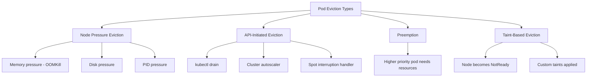

# How to Handle Pod Evictions with ArgoCD

Author: [nawazdhandala](https://github.com/nawazdhandala)

Tags: ArgoCD, GitOps, Kubernetes, Pod Eviction, Cluster Management

Description: Learn how to configure ArgoCD to handle pod evictions gracefully, including node pressure evictions, preemption, and API-initiated evictions.

---

Pod evictions happen in every Kubernetes cluster. Nodes run out of memory, disk pressure triggers eviction, spot instances get reclaimed, and cluster autoscaler drains nodes. When these evictions affect ArgoCD-managed applications, you need to understand how ArgoCD responds and what configurations help maintain application availability.

In this guide, I will cover the different types of pod evictions, how ArgoCD handles each one, and what you can do to minimize their impact.

## Types of Pod Evictions

Kubernetes has several eviction mechanisms, and ArgoCD interacts differently with each.



## How ArgoCD Responds to Evictions

When pods are evicted, ArgoCD's behavior depends on your sync configuration.

With **self-healing enabled**, ArgoCD detects the drift between desired state (Deployment with 3 replicas) and actual state (only 2 pods running) and triggers a sync. However, the Deployment controller in Kubernetes actually handles pod recreation, not ArgoCD. ArgoCD's role is to ensure the Deployment spec has not changed.

With **self-healing disabled**, ArgoCD shows the application as Degraded but does not take action. The Kubernetes Deployment controller still recreates pods, but if any configuration drift occurs during the process, ArgoCD will not correct it.

```yaml
# Recommended configuration for eviction resilience
spec:
  syncPolicy:
    automated:
      selfHeal: true  # Correct any drift caused by evictions
      prune: false     # Don't delete unexpected resources during recovery
    retry:
      limit: 5
      backoff:
        duration: 5s
        factor: 2
        maxDuration: 3m
```

## Configuring PodDisruptionBudgets

PDBs are your primary defense against disruptive evictions. They tell Kubernetes how many pods must remain available during voluntary disruptions.

```yaml
# pdb-for-web-app.yaml
apiVersion: policy/v1
kind: PodDisruptionBudget
metadata:
  name: web-app-pdb
spec:
  # Option 1: Minimum available
  minAvailable: 2
  # Option 2: Maximum unavailable (use one, not both)
  # maxUnavailable: 1
  selector:
    matchLabels:
      app: web-app
```

Include PDBs in your ArgoCD-managed manifests so they are always in sync with your Deployments.

```yaml
# In your Kustomize base or Helm template
# deployment.yaml
apiVersion: apps/v1
kind: Deployment
metadata:
  name: web-app
spec:
  replicas: 3
  template:
    spec:
      containers:
        - name: web
          resources:
            requests:
              cpu: "250m"
              memory: "256Mi"
            limits:
              cpu: "500m"
              memory: "512Mi"
---
# pdb.yaml (same directory, synced together)
apiVersion: policy/v1
kind: PodDisruptionBudget
metadata:
  name: web-app-pdb
spec:
  maxUnavailable: 1
  selector:
    matchLabels:
      app: web-app
```

## Handling OOM-Kill Evictions

OOM-kills are the most common eviction type in production. They happen when a container exceeds its memory limit.

ArgoCD sees OOM-killed pods as CrashLoopBackOff, which makes the application show as Degraded. The fix is not in ArgoCD but in proper resource limits.

```yaml
# Common pattern: set memory limit with headroom
spec:
  containers:
    - name: app
      resources:
        requests:
          memory: "256Mi"   # Actual usage baseline
        limits:
          memory: "512Mi"   # 2x headroom for spikes
```

Set up ArgoCD custom health checks to distinguish between OOM issues and other problems.

```yaml
# argocd-cm.yaml
data:
  resource.customizations.health.apps_Deployment: |
    hs = {}
    if obj.status.unavailableReplicas ~= nil and obj.status.unavailableReplicas > 0 then
      -- Check if pods are OOM-killed
      hs.status = "Degraded"
      hs.message = "Unavailable replicas: " .. obj.status.unavailableReplicas
    elseif obj.status.availableReplicas == obj.spec.replicas then
      hs.status = "Healthy"
    else
      hs.status = "Progressing"
    end
    return hs
```

## Handling Node Drain Evictions

When nodes are drained (for upgrades, scaling down, or maintenance), pods receive a SIGTERM signal followed by a grace period.

Configure proper graceful shutdown in your deployments.

```yaml
spec:
  template:
    spec:
      terminationGracePeriodSeconds: 60
      containers:
        - name: app
          lifecycle:
            preStop:
              exec:
                command:
                  - /bin/sh
                  - -c
                  - |
                    # Stop accepting new connections
                    /app/shutdown-hook
                    # Wait for in-flight requests
                    sleep 10
```

## Priority Classes for Critical Applications

Use PriorityClasses to protect critical ArgoCD-managed applications from preemption.

```yaml
# priority-classes.yaml (managed by ArgoCD)
apiVersion: scheduling.k8s.io/v1
kind: PriorityClass
metadata:
  name: critical-production
value: 1000000
globalDefault: false
description: "For critical production services that should not be preempted"
---
apiVersion: scheduling.k8s.io/v1
kind: PriorityClass
metadata:
  name: standard-production
value: 100000
globalDefault: true
description: "Default priority for production workloads"
---
apiVersion: scheduling.k8s.io/v1
kind: PriorityClass
metadata:
  name: batch-processing
value: 10000
description: "For batch jobs that can be preempted"
```

Apply priority classes in your deployments.

```yaml
spec:
  template:
    spec:
      priorityClassName: critical-production
```

## ArgoCD Notification for Eviction Events

Set up alerts when pods are evicted from ArgoCD-managed applications.

```yaml
# argocd-notifications-cm.yaml
data:
  template.app-degraded: |
    message: |
      Application {{.app.metadata.name}} is Degraded.
      Health: {{.app.status.health.status}}
      Sync: {{.app.status.sync.status}}
      This may be caused by pod evictions. Check node conditions and pod events.
  trigger.on-degraded: |
    - when: app.status.health.status == 'Degraded'
      send: [app-degraded]
```

## Preventing ArgoCD Component Evictions

ArgoCD components themselves should be protected from eviction.

```yaml
# Assign high priority to ArgoCD components
apiVersion: scheduling.k8s.io/v1
kind: PriorityClass
metadata:
  name: argocd-critical
value: 999999
description: "Critical priority for ArgoCD components"
---
# In ArgoCD component deployments
spec:
  template:
    spec:
      priorityClassName: argocd-critical
      containers:
        - name: argocd-application-controller
          resources:
            requests:
              cpu: "500m"
              memory: "1Gi"
            limits:
              cpu: "2"
              memory: "4Gi"
```

Also set proper resource requests on all ArgoCD components. Pods without resource requests are classified as BestEffort QoS and are evicted first under memory pressure.

## Handling Cluster Autoscaler Scale-Down

Cluster Autoscaler scales down underutilized nodes by draining and terminating them. Protect pods that should not be moved.

```yaml
# Annotation to prevent cluster autoscaler from evicting
metadata:
  annotations:
    cluster-autoscaler.kubernetes.io/safe-to-evict: "false"
```

Use this sparingly - only for stateful workloads or applications with long startup times. For most ArgoCD-managed applications, let the autoscaler do its job and rely on PDBs for availability.

## Monitoring Eviction Patterns

Track evictions to identify recurring issues.

```bash
# Find recently evicted pods
kubectl get events --all-namespaces --field-selector reason=Evicted \
  --sort-by='.lastTimestamp' | tail -20

# Check node conditions
kubectl get nodes -o json | jq '.items[] | {
  name: .metadata.name,
  conditions: [.status.conditions[] | select(.status == "True") | .type]
}'
```

## Conclusion

Pod evictions are a normal part of Kubernetes operations, not emergencies. With proper ArgoCD configuration - self-healing enabled, retry policies with backoff, PodDisruptionBudgets, appropriate PriorityClasses, and proper resource requests - evictions become non-events that the system handles automatically. The key is preparation: include PDBs in your ArgoCD manifests, protect ArgoCD components from eviction, and monitor eviction patterns to catch systemic issues like persistent memory pressure before they cause outages.
