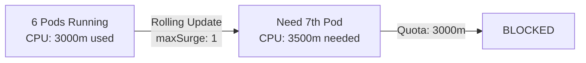

# How to Handle Resource Quota During Deployment

Author: [nawazdhandala](https://github.com/nawazdhandala)

Tags: ArgoCD, GitOps, Kubernetes, Resource Quota, Deployment

Description: Learn how to handle Kubernetes resource quotas during ArgoCD deployments including surge capacity planning, quota management, and strategies for quota-constrained environments.

---

Resource quotas are essential for multi-tenant Kubernetes clusters, but they create challenges during deployments. When a rolling update creates surge pods, the temporary increase in resource consumption can hit quota limits, causing the deployment to stall. This guide covers strategies for managing resource quotas during ArgoCD deployments.

## The Problem

During a rolling update with `maxSurge: 1`, Kubernetes temporarily runs more pods than the steady-state count. If your resource quota is set to match the steady-state exactly, the surge pods cannot be created:

```text
Events:
  Type     Reason            Message
  ----     ------            -------
  Warning  FailedCreate      Error creating: pods "api-server-xyz" is
           forbidden: exceeded quota: compute-quota, requested: cpu=500m,
           used: cpu=3000m, limited: cpu=3000m
```



## Understanding Resource Quota Math

Let us do the math for a typical deployment:

- Service: 6 replicas
- Each pod requests: 500m CPU, 512Mi memory
- Steady-state: 3000m CPU, 3072Mi memory
- Rolling update with `maxSurge: 1`: needs 3500m CPU, 3584Mi memory temporarily

If your quota matches the steady-state, the deployment fails. You need headroom.

## Strategy 1: Quota with Surge Headroom

The simplest fix is to account for surge capacity in your quota:

```yaml
# namespace-quota.yaml
apiVersion: v1
kind: ResourceQuota
metadata:
  name: team-a-quota
  namespace: team-a
spec:
  hard:
    # Steady state: 6 pods x 500m = 3000m
    # Surge headroom: 2 extra pods = 1000m
    # Total: 4000m
    requests.cpu: "4"
    requests.memory: "4Gi"
    limits.cpu: "8"
    limits.memory: "8Gi"
    pods: "10"  # 6 steady + 2 surge + 2 buffer
```

The general formula is:

```text
quota = (replicas * request) + (maxSurge * request) + buffer
```

## Strategy 2: Adjust Rolling Update Strategy

If you cannot increase quotas, reduce the surge requirement:

```yaml
apiVersion: apps/v1
kind: Deployment
metadata:
  name: api-server
spec:
  replicas: 6
  strategy:
    type: RollingUpdate
    rollingUpdate:
      maxSurge: 0        # No extra pods
      maxUnavailable: 1  # Remove one old pod before creating new one
```

With `maxSurge: 0` and `maxUnavailable: 1`, the deployment:

1. Terminates one old pod
2. Creates one new pod in the freed space
3. Waits for it to be ready
4. Terminates the next old pod
5. Repeats

This works within the existing quota but is slower and briefly reduces capacity.

## Strategy 3: Temporary Quota Increase with ArgoCD Hooks

Use a pre-sync hook to temporarily increase the quota before deployment:

```yaml
# pre-sync-quota-increase.yaml
apiVersion: batch/v1
kind: Job
metadata:
  name: increase-quota-for-deploy
  annotations:
    argocd.argoproj.io/hook: PreSync
    argocd.argoproj.io/hook-delete-policy: HookSucceeded
spec:
  template:
    spec:
      serviceAccountName: quota-manager
      restartPolicy: Never
      containers:
        - name: quota-increase
          image: bitnami/kubectl:1.28
          command:
            - /bin/sh
            - -c
            - |
              # Increase quota temporarily for deployment surge
              kubectl patch resourcequota team-a-quota \
                -n team-a \
                --type='json' \
                -p='[
                  {"op": "replace", "path": "/spec/hard/requests.cpu", "value": "5"},
                  {"op": "replace", "path": "/spec/hard/requests.memory", "value": "5Gi"},
                  {"op": "replace", "path": "/spec/hard/pods", "value": "12"}
                ]'
              echo "Quota increased for deployment"
---
# post-sync-quota-restore.yaml
apiVersion: batch/v1
kind: Job
metadata:
  name: restore-quota-after-deploy
  annotations:
    argocd.argoproj.io/hook: PostSync
    argocd.argoproj.io/hook-delete-policy: HookSucceeded
spec:
  template:
    spec:
      serviceAccountName: quota-manager
      restartPolicy: Never
      containers:
        - name: quota-restore
          image: bitnami/kubectl:1.28
          command:
            - /bin/sh
            - -c
            - |
              # Restore quota to steady-state levels
              kubectl patch resourcequota team-a-quota \
                -n team-a \
                --type='json' \
                -p='[
                  {"op": "replace", "path": "/spec/hard/requests.cpu", "value": "4"},
                  {"op": "replace", "path": "/spec/hard/requests.memory", "value": "4Gi"},
                  {"op": "replace", "path": "/spec/hard/pods", "value": "10"}
                ]'
              echo "Quota restored after deployment"
```

## Strategy 4: Namespace-per-Deployment with LimitRange

Instead of per-namespace quotas, use LimitRange to control individual pod sizes:

```yaml
# limit-range.yaml
apiVersion: v1
kind: LimitRange
metadata:
  name: pod-limits
  namespace: team-a
spec:
  limits:
    - type: Pod
      max:
        cpu: "4"
        memory: "8Gi"
    - type: Container
      default:
        cpu: "500m"
        memory: "512Mi"
      defaultRequest:
        cpu: "250m"
        memory: "256Mi"
      max:
        cpu: "2"
        memory: "4Gi"
      min:
        cpu: "100m"
        memory: "64Mi"
```

LimitRange does not block deployments due to total namespace resource consumption. It only enforces per-pod and per-container limits.

## Strategy 5: Right-Size Resources Before Deployment

Use VPA recommendations to right-size pods before deployment:

```yaml
# vpa.yaml
apiVersion: autoscaling.k8s.io/v1
kind: VerticalPodAutoscaler
metadata:
  name: api-server-vpa
spec:
  targetRef:
    apiVersion: apps/v1
    kind: Deployment
    name: api-server
  updatePolicy:
    updateMode: "Off"  # Only recommend, don't auto-apply
  resourcePolicy:
    containerPolicies:
      - containerName: api
        minAllowed:
          cpu: "100m"
          memory: "128Mi"
        maxAllowed:
          cpu: "2"
          memory: "4Gi"
```

Check VPA recommendations before deployment:

```bash
kubectl get vpa api-server-vpa -o jsonpath='{.status.recommendation}' | jq
```

If pods are over-provisioned, reducing their requests frees up quota headroom for surge.

## Strategy 6: Priority-Based Resource Management

Use PriorityClasses to ensure deployment surge pods can preempt lower-priority workloads:

```yaml
# priority-classes.yaml
apiVersion: scheduling.k8s.io/v1
kind: PriorityClass
metadata:
  name: production-critical
value: 1000000
globalDefault: false
description: "Production critical workloads"
---
apiVersion: scheduling.k8s.io/v1
kind: PriorityClass
metadata:
  name: production-standard
value: 100000
globalDefault: true
description: "Standard production workloads"
---
apiVersion: scheduling.k8s.io/v1
kind: PriorityClass
metadata:
  name: batch-workload
value: 10000
preemptionPolicy: Never
description: "Batch workloads - can be preempted"
```

Assign priorities to your deployments:

```yaml
apiVersion: apps/v1
kind: Deployment
metadata:
  name: api-server
spec:
  template:
    spec:
      priorityClassName: production-critical
      containers:
        - name: api
          # ...
```

When quota is tight, higher-priority pods can preempt lower-priority ones.

## ArgoCD Application with Retry for Quota Issues

Configure ArgoCD to retry when quota issues occur:

```yaml
apiVersion: argoproj.io/v1alpha1
kind: Application
metadata:
  name: api-server
  namespace: argocd
spec:
  project: production
  source:
    repoURL: https://github.com/myorg/api-server.git
    targetRevision: main
    path: k8s/production
  destination:
    server: https://kubernetes.default.svc
    namespace: team-a
  syncPolicy:
    automated:
      prune: true
      selfHeal: true
    retry:
      limit: 10
      backoff:
        duration: 30s
        factor: 2
        maxDuration: 10m
```

With generous retry settings, ArgoCD will keep trying even if the initial sync fails due to quota limits. As old pods terminate during the rolling update, quota frees up for new pods.

## Monitoring Quota Usage

Track quota usage to prevent deployment issues:

```yaml
apiVersion: monitoring.coreos.com/v1
kind: PrometheusRule
metadata:
  name: quota-alerts
spec:
  groups:
    - name: resource_quotas
      rules:
        - alert: QuotaNearlyFull
          expr: |
            (kube_resourcequota{type="used"} / kube_resourcequota{type="hard"}) > 0.85
          for: 10m
          labels:
            severity: warning
          annotations:
            summary: "Resource quota {{ $labels.resourcequota }} in {{ $labels.namespace }} is {{ $value | humanizePercentage }} full"

        - alert: QuotaBlocking
          expr: |
            (kube_resourcequota{type="used"} / kube_resourcequota{type="hard"}) >= 1.0
          for: 5m
          labels:
            severity: critical
          annotations:
            summary: "Resource quota {{ $labels.resourcequota }} in {{ $labels.namespace }} is at capacity - deployments may be blocked"
```

## Best Practices

1. **Always account for surge in quotas** - Set quotas at least 20-30% above steady-state to accommodate rolling updates.

2. **Use `maxSurge: 0, maxUnavailable: 1` for tight quotas** - This trades deployment speed for guaranteed quota compliance.

3. **Monitor quota usage proactively** - Alert at 85% quota usage before it blocks deployments.

4. **Right-size pod requests** - Over-provisioned pods waste quota headroom. Use VPA recommendations to right-size.

5. **Use LimitRange as a complement** - LimitRange controls per-pod sizing, while ResourceQuota controls total namespace consumption.

6. **Configure ArgoCD retries** - Generous retry settings let ArgoCD work through temporary quota constraints during rolling updates.

Resource quotas and deployments are in natural tension - quotas want to limit resources while deployments temporarily need more. The strategies in this guide help you manage this tension so deployments succeed reliably in quota-constrained environments.
