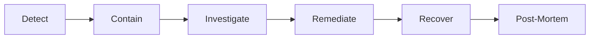

# How to Handle Security Incidents in ArgoCD

Author: [nawazdhandala](https://github.com/nawazdhandala)

Tags: ArgoCD, GitOps, Kubernetes, Incident Response, Security

Description: Learn how to detect, respond to, and recover from security incidents in ArgoCD including credential compromise, unauthorized deployments, and supply chain attacks.

---

Security incidents in ArgoCD are different from regular application incidents. When your GitOps deployment tool is compromised, the attacker has a direct path to every cluster it manages. Quick detection and a clear response playbook are critical to limiting the damage. This guide walks through common incident scenarios and the exact steps to contain and remediate each one.

## Incident Response Framework

Every ArgoCD security incident follows the same general framework:



Before an incident happens, you should have detection, containment procedures, and a recovery plan already documented and tested.

## Setting Up Detection

### Monitor for Suspicious Activity

Configure ArgoCD notifications to alert on suspicious events:

```yaml
# argocd-notifications-cm ConfigMap
# Alert on sync from unknown users
trigger.on-suspicious-sync: |
  - when: >-
      app.status.operationState.operation.initiatedBy.username not in
      ['ci-bot', 'argocd-image-updater', 'admin']
      and app.status.operationState.operation.initiatedBy.automated != true
    send: [security-alert]

# Alert on any app deployed outside sync windows
trigger.on-off-hours-sync: |
  - when: app.status.operationState.phase in ['Succeeded'] and time.Now().Hour() < 6
    send: [security-alert]

template.security-alert: |
  slack:
    attachments: |
      [{
        "color": "#E96D76",
        "title": "SECURITY ALERT: {{ .app.metadata.name }}",
        "fields": [
          {"title": "Application", "value": "{{ .app.metadata.name }}", "short": true},
          {"title": "Initiated By", "value": "{{ .app.status.operationState.operation.initiatedBy.username }}", "short": true},
          {"title": "Cluster", "value": "{{ .app.spec.destination.server }}", "short": true},
          {"title": "Namespace", "value": "{{ .app.spec.destination.namespace }}", "short": true},
          {"title": "Revision", "value": "{{ .app.status.sync.revision }}", "short": true}
        ]
      }]
```

### Log Aggregation Alerts

Set up alerts in your logging platform:

```yaml
# Example: ElasticSearch/Kibana alert
# Alert on: Multiple failed auth attempts from same IP
# Query: kubernetes.labels.app == "argocd-server" AND "authentication failed"
# Threshold: > 5 in 5 minutes

# Alert on: New cluster registrations
# Query: kubernetes.labels.app == "argocd-server" AND "cluster" AND "added"

# Alert on: Repository credential changes
# Query: kubernetes.labels.app == "argocd-server" AND "repository" AND ("created" OR "updated")
```

### Kubernetes Audit Log Monitoring

```yaml
# Alert on suspicious Kubernetes API calls from ArgoCD
# Watch for: Creating ClusterRoles, ClusterRoleBindings, or namespaces
# Watch for: Accessing secrets outside the ArgoCD namespace
# Watch for: Creating pods with privileged security context
```

## Incident Scenario 1: Compromised Repository Credentials

### Symptoms
- Unknown applications appearing in ArgoCD
- Unexpected sync operations
- New repositories added to ArgoCD

### Containment Steps

```bash
# Step 1: Immediately disable auto-sync on all applications
argocd app list -o name | xargs -I{} argocd app set {} --sync-policy none

# Step 2: List all configured repositories
argocd repo list

# Step 3: Remove suspicious repositories
argocd repo rm https://suspicious-repo.example.com

# Step 4: Rotate ALL repository credentials
# First, remove existing credentials
kubectl get secrets -n argocd -l argocd.argoproj.io/secret-type=repository -o name | \
  xargs kubectl delete -n argocd

kubectl get secrets -n argocd -l argocd.argoproj.io/secret-type=repo-creds -o name | \
  xargs kubectl delete -n argocd

# Step 5: Re-add repositories with new credentials
argocd repo add https://github.com/org/config-repo.git \
  --ssh-private-key-path ~/.ssh/new_key

# Step 6: Revoke old credentials at the Git provider level
# Revoke the compromised deploy key, token, or GitHub App
```

### Investigation

```bash
# Check recent sync operations for all apps
argocd app list -o json | jq '.[] | {
  name: .metadata.name,
  syncBy: .status.operationState.operation.initiatedBy,
  revision: .status.sync.revision,
  syncTime: .status.operationState.finishedAt
}' | sort -t'"' -k10

# Check ArgoCD server logs for suspicious activity
kubectl logs -n argocd deployment/argocd-server --since=24h | \
  grep -i "repository\|credential\|repo" | head -50

# Check if any new applications were created recently
kubectl get applications -n argocd --sort-by=.metadata.creationTimestamp
```

## Incident Scenario 2: Unauthorized Deployment to Production

### Symptoms
- Application synced with unexpected changes
- Unknown container images deployed
- Resources created in restricted namespaces

### Containment Steps

```bash
# Step 1: Immediately stop the application sync
argocd app terminate-op <app-name>

# Step 2: Disable auto-sync
argocd app set <app-name> --sync-policy none

# Step 3: Check what was deployed
argocd app get <app-name> --show-operation

# Step 4: Roll back to the last known good revision
argocd app history <app-name>
argocd app rollback <app-name> <previous-id>

# Step 5: If the live cluster has been compromised, isolate the namespace
kubectl annotate namespace <namespace> \
  "security-incident=true" \
  "incident-time=$(date -u +%Y-%m-%dT%H:%M:%SZ)"

# Step 6: Block all egress from the compromised namespace
cat <<EOF | kubectl apply -f -
apiVersion: networking.k8s.io/v1
kind: NetworkPolicy
metadata:
  name: emergency-block-egress
  namespace: <namespace>
spec:
  podSelector: {}
  policyTypes:
    - Egress
  egress: []
EOF
```

### Investigation

```bash
# Who initiated the sync?
argocd app get <app-name> -o json | jq '.status.operationState.operation.initiatedBy'

# What revision was deployed?
BAD_REVISION=$(argocd app get <app-name> -o json | jq -r '.status.sync.revision')

# Check the Git commit
cd /path/to/config-repo
git log --format=full $BAD_REVISION -1
git diff $BAD_REVISION^..$BAD_REVISION

# Check what images are running
kubectl get pods -n <namespace> -o json | jq '.items[].spec.containers[].image'

# Compare with expected images
argocd app manifests <app-name> --source git | grep "image:"
```

## Incident Scenario 3: ArgoCD Admin Account Compromised

### Containment Steps

```bash
# Step 1: Immediately rotate the admin password
BCRYPT_HASH=$(htpasswd -bnBC 10 "" "$(openssl rand -base64 32)" | tr -d ':\n')
kubectl patch secret argocd-secret -n argocd -p \
  "{\"stringData\":{\"admin.password\":\"$BCRYPT_HASH\",\"admin.passwordMtime\":\"$(date -u +%Y-%m-%dT%H:%M:%SZ)\"}}"

# Step 2: Disable the admin account
kubectl patch configmap argocd-cm -n argocd -p '{"data":{"admin.enabled":"false"}}'

# Step 3: Invalidate all sessions by rotating the server secret key
NEW_KEY=$(openssl rand -base64 32)
kubectl patch secret argocd-secret -n argocd -p \
  "{\"stringData\":{\"server.secretkey\":\"$NEW_KEY\"}}"

# Step 4: Restart ArgoCD server to apply changes
kubectl rollout restart deployment argocd-server -n argocd

# Step 5: Revoke all API tokens
# List accounts
argocd account list
# Delete all tokens for each account
argocd account delete-token <account> <token-id>

# Step 6: Disable auto-sync on all applications while investigating
argocd app list -o name | xargs -I{} argocd app set {} --sync-policy none
```

### Investigation

```bash
# Check server logs for the compromised session
kubectl logs -n argocd deployment/argocd-server --since=72h | \
  grep -E "admin|token|session|login" | head -100

# Check what actions were taken
kubectl logs -n argocd deployment/argocd-server --since=72h | \
  grep -E "create|update|delete|sync" | head -100

# Check for new accounts created
argocd account list

# Check for RBAC policy changes
kubectl get configmap argocd-rbac-cm -n argocd -o yaml

# Check for new clusters added
argocd cluster list

# Check for new repositories added
argocd repo list
```

## Incident Scenario 4: Supply Chain Attack (Compromised Helm Chart or Image)

### Containment Steps

```bash
# Step 1: Identify all applications using the compromised chart/image
argocd app list -o json | jq '.[] | select(.spec.source.repoURL | contains("compromised-chart-repo"))' | jq '.metadata.name'

# Or for images
kubectl get pods --all-namespaces -o json | jq '.items[] | select(.spec.containers[].image | contains("compromised-image")) | {namespace: .metadata.namespace, name: .metadata.name}'

# Step 2: Disable auto-sync on affected applications
# (use the list from step 1)

# Step 3: Roll back to the last known good version
argocd app rollback <app-name> <last-good-id>

# Step 4: Pin to known good versions
# Update your config repo to pin specific, verified versions
# Do NOT use floating tags

# Step 5: Block the compromised source
# Add Kyverno/OPA policy to block the compromised image
cat <<EOF | kubectl apply -f -
apiVersion: kyverno.io/v1
kind: ClusterPolicy
metadata:
  name: block-compromised-image
spec:
  validationFailureAction: enforce
  rules:
    - name: block-image
      match:
        resources:
          kinds:
            - Pod
      validate:
        message: "This image has been flagged as compromised"
        pattern:
          spec:
            containers:
              - image: "!compromised-registry.io/*"
EOF
```

## Recovery Procedures

After containing and investigating, recover systematically:

```bash
# Step 1: Verify the config repo is clean
# Review all recent commits
cd /path/to/config-repo
git log --oneline --since="3 days ago"
# Revert any unauthorized commits

# Step 2: Re-enable auto-sync gradually
# Start with non-production environments
argocd app set <app-name-dev> --sync-policy automated --self-heal

# Step 3: Verify each application is healthy
argocd app list -o json | jq '.[] | {name: .metadata.name, health: .status.health.status, sync: .status.sync.status}'

# Step 4: Re-enable production auto-sync only after verification
argocd app set <app-name-prod> --sync-policy automated --self-heal
```

## Post-Mortem Template

After every security incident, conduct a post-mortem:

```
## Security Incident Post-Mortem

**Date:** 2026-02-26
**Severity:** P1/P2/P3
**Duration:** Detection to resolution

### Timeline
- HH:MM - Incident detected by [how]
- HH:MM - Containment actions taken
- HH:MM - Root cause identified
- HH:MM - Remediation complete
- HH:MM - Full recovery confirmed

### Root Cause
[What happened and why]

### Impact
- Applications affected: [list]
- Clusters affected: [list]
- Data exposure: [yes/no, details]
- Duration of unauthorized access: [time]

### Detection
- How was it detected? [alert, manual, audit]
- How long was the window between compromise and detection?

### Response
- What containment actions were taken?
- Were the response procedures adequate?
- What could have been done faster?

### Remediation
- What was fixed?
- What credentials were rotated?
- What policies were added?

### Prevention
- What changes prevent this from happening again?
- What monitoring improvements are needed?
- What access control changes are required?

### Action Items
- [ ] [Action item 1] - Owner: [name] - Due: [date]
- [ ] [Action item 2] - Owner: [name] - Due: [date]
```

## Incident Response Runbook

Keep this readily accessible:

1. **Detect** - Alert fires or suspicious activity reported
2. **Page** - Notify the on-call security engineer and platform team lead
3. **Contain** - Disable auto-sync, rotate compromised credentials, isolate affected namespaces
4. **Investigate** - Check logs, Git history, audit trails
5. **Remediate** - Fix the root cause, rotate all potentially compromised secrets
6. **Recover** - Gradually re-enable syncing, verify health
7. **Communicate** - Update stakeholders on impact and resolution
8. **Post-mortem** - Document lessons learned, assign action items

Preparation is everything. Practice these procedures before you need them. For more on securing ArgoCD, see our guides on [securing the GitOps pipeline](https://oneuptime.com/blog/post/2026-02-26-argocd-secure-gitops-pipeline/view) and [preventing unauthorized configuration changes](https://oneuptime.com/blog/post/2026-02-26-argocd-prevent-unauthorized-configuration-changes/view).
