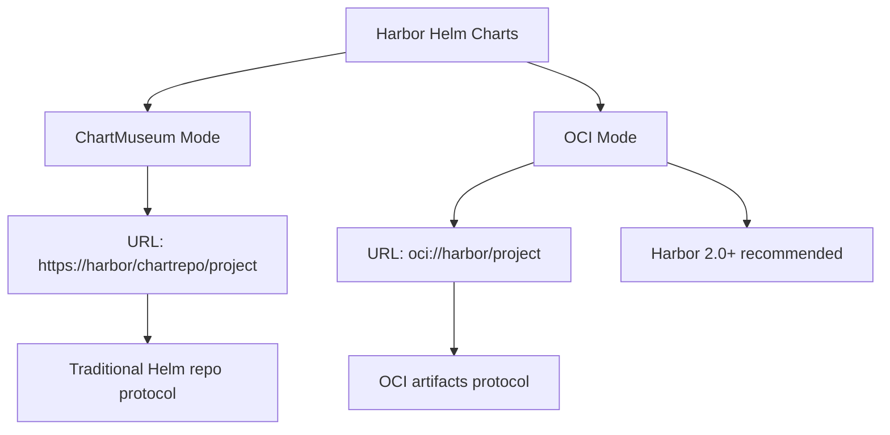

# How to Add Harbor as a Helm Repository in ArgoCD

Author: [nawazdhandala](https://github.com/nawazdhandala)

Tags: ArgoCD, GitOps, Kubernetes, Helm, Harbor

Description: Learn how to configure ArgoCD to pull Helm charts from Harbor registry, including both ChartMuseum-based and OCI-based chart storage in Harbor projects.

---

Harbor is an open-source container registry that also serves as a Helm chart repository. Many organizations use Harbor as a unified registry for both container images and Helm charts. Harbor supports two ways of storing Helm charts: the legacy ChartMuseum integration and the newer OCI-based approach. This guide covers connecting ArgoCD to both.

## Understanding Harbor's Helm Chart Storage

Harbor has evolved its Helm chart storage over different versions:



- **ChartMuseum mode**: Harbor v1.x to v2.7 included a built-in ChartMuseum. This is being deprecated.
- **OCI mode**: Harbor 2.0+ supports storing Helm charts as OCI artifacts. This is the recommended approach going forward.

Check your Harbor version to determine which mode to use.

## Method 1: ChartMuseum Mode (Legacy)

If your Harbor instance still has ChartMuseum enabled, the Helm repository URL follows this pattern:

```
https://harbor.company.com/chartrepo/{project-name}
```

### Add via CLI

```bash
argocd repo add https://harbor.company.com/chartrepo/platform \
  --type helm \
  --name harbor-platform \
  --username argocd-reader \
  --password your-harbor-password
```

### Add Declaratively

```yaml
# harbor-chartrepo.yaml
apiVersion: v1
kind: Secret
metadata:
  name: harbor-chartrepo-platform
  namespace: argocd
  labels:
    argocd.argoproj.io/secret-type: repository
stringData:
  type: helm
  name: harbor-platform
  url: https://harbor.company.com/chartrepo/platform
  username: argocd-reader
  password: your-harbor-password
```

```bash
kubectl apply -f harbor-chartrepo.yaml
```

### Deploy a Chart (ChartMuseum Mode)

```yaml
apiVersion: argoproj.io/v1alpha1
kind: Application
metadata:
  name: internal-service
  namespace: argocd
spec:
  project: default
  source:
    repoURL: https://harbor.company.com/chartrepo/platform
    chart: internal-service
    targetRevision: 2.0.1
    helm:
      releaseName: internal-service
      values: |
        replicaCount: 3
        image:
          repository: harbor.company.com/platform/internal-service
          tag: v2.0.1
  destination:
    server: https://kubernetes.default.svc
    namespace: internal-service
  syncPolicy:
    automated:
      prune: true
      selfHeal: true
    syncOptions:
      - CreateNamespace=true
```

## Method 2: OCI Mode (Recommended)

Harbor 2.0+ stores Helm charts as OCI artifacts alongside container images. This is the modern approach and does not require the ChartMuseum component.

### Add via CLI

```bash
argocd repo add harbor.company.com \
  --type helm \
  --name harbor-oci \
  --enable-oci \
  --username argocd-reader \
  --password your-harbor-password
```

### Add Declaratively

```yaml
# harbor-oci-repo.yaml
apiVersion: v1
kind: Secret
metadata:
  name: harbor-oci-platform
  namespace: argocd
  labels:
    argocd.argoproj.io/secret-type: repository
stringData:
  type: helm
  name: harbor-oci
  url: harbor.company.com
  enableOCI: "true"
  username: argocd-reader
  password: your-harbor-password
```

```bash
kubectl apply -f harbor-oci-repo.yaml
```

### Deploy a Chart (OCI Mode)

When using OCI, the Application spec uses the full OCI reference:

```yaml
apiVersion: argoproj.io/v1alpha1
kind: Application
metadata:
  name: internal-service-oci
  namespace: argocd
spec:
  project: default
  source:
    repoURL: harbor.company.com/platform
    chart: internal-service
    targetRevision: 2.0.1
    helm:
      releaseName: internal-service
      values: |
        replicaCount: 3
        image:
          repository: harbor.company.com/platform/internal-service
          tag: v2.0.1
  destination:
    server: https://kubernetes.default.svc
    namespace: internal-service
  syncPolicy:
    automated:
      prune: true
      selfHeal: true
    syncOptions:
      - CreateNamespace=true
```

Note the difference in `repoURL`. For OCI mode, it is `harbor.company.com/platform` (no `https://`, no `/chartrepo/`).

## Harbor Authentication Methods

### Robot Accounts (Recommended)

Harbor robot accounts are designed for automated systems like ArgoCD. They have scoped permissions and do not count against user licenses.

Create a robot account in Harbor:
1. Go to your Harbor project
2. Navigate to Robot Accounts
3. Click "New Robot Account"
4. Set permissions: Pull only (for chart access)
5. Set an expiry or make it permanent

```yaml
apiVersion: v1
kind: Secret
metadata:
  name: harbor-robot-creds
  namespace: argocd
  labels:
    argocd.argoproj.io/secret-type: repository
stringData:
  type: helm
  name: harbor-platform
  url: https://harbor.company.com/chartrepo/platform
  username: robot$argocd-reader
  password: robot-secret-token
```

Note: Harbor robot account usernames typically start with `robot$`.

### LDAP/AD Users

If Harbor is connected to LDAP or Active Directory:

```yaml
stringData:
  username: argocd-svc@company.com
  password: ldap-password
```

### OIDC Token

If Harbor uses OIDC authentication, you can use CLI secrets:

```yaml
stringData:
  username: argocd-oidc-user
  password: oidc-cli-secret
```

## Multiple Harbor Projects

Organizations often organize charts across Harbor projects:

```yaml
# Platform team charts
apiVersion: v1
kind: Secret
metadata:
  name: harbor-platform
  namespace: argocd
  labels:
    argocd.argoproj.io/secret-type: repository
stringData:
  type: helm
  name: platform
  url: https://harbor.company.com/chartrepo/platform
  username: robot$platform-reader
  password: platform-robot-token
---
# Application team charts
apiVersion: v1
kind: Secret
metadata:
  name: harbor-applications
  namespace: argocd
  labels:
    argocd.argoproj.io/secret-type: repository
stringData:
  type: helm
  name: applications
  url: https://harbor.company.com/chartrepo/applications
  username: robot$apps-reader
  password: apps-robot-token
---
# Shared/library charts
apiVersion: v1
kind: Secret
metadata:
  name: harbor-shared
  namespace: argocd
  labels:
    argocd.argoproj.io/secret-type: repository
stringData:
  type: helm
  name: shared
  url: https://harbor.company.com/chartrepo/shared
  username: robot$shared-reader
  password: shared-robot-token
```

## Handling Harbor TLS Certificates

Self-hosted Harbor typically uses internal CA certificates:

```yaml
apiVersion: v1
kind: ConfigMap
metadata:
  name: argocd-tls-certs-cm
  namespace: argocd
data:
  harbor.company.com: |
    -----BEGIN CERTIFICATE-----
    MIIFjTCCA3WgAwIBAgIUK...
    -----END CERTIFICATE-----
```

```bash
kubectl apply -f argocd-tls-certs.yaml
kubectl rollout restart deployment/argocd-repo-server -n argocd
```

## Publishing Charts to Harbor

### ChartMuseum Mode

```bash
# Using Helm push plugin
helm plugin install https://github.com/chartmuseum/helm-push
helm repo add harbor https://harbor.company.com/chartrepo/platform \
  --username admin --password password
helm cm-push my-chart-1.0.0.tgz harbor
```

### OCI Mode

```bash
# Login to Harbor OCI registry
helm registry login harbor.company.com \
  --username admin --password password

# Package the chart
helm package my-chart/

# Push as OCI artifact
helm push my-chart-1.0.0.tgz oci://harbor.company.com/platform
```

## CI/CD Integration

A typical CI pipeline that publishes to Harbor and triggers ArgoCD:

```yaml
# GitLab CI example
publish-chart:
  stage: publish
  image: alpine/helm:3.14
  script:
    - helm registry login $HARBOR_HOST -u $HARBOR_USER -p $HARBOR_PASS
    - helm package charts/my-service
    - helm push my-service-*.tgz oci://$HARBOR_HOST/platform
  only:
    - tags

update-deployment:
  stage: deploy
  image: alpine/git
  script:
    - git clone $DEPLOY_REPO deploy-repo
    - cd deploy-repo
    # Update the chart version in the ArgoCD Application manifest
    - "sed -i 's/targetRevision: .*/targetRevision: ${CI_COMMIT_TAG}/' apps/my-service.yaml"
    - git add . && git commit -m "Bump my-service to ${CI_COMMIT_TAG}"
    - git push
  only:
    - tags
```

## Troubleshooting

### "unauthorized: unauthorized to access repository"

```bash
# Test credentials directly
curl -u "robot\$argocd-reader:token" https://harbor.company.com/v2/platform/internal-service/tags/list

# Check the robot account has not expired
# Harbor UI > Project > Robot Accounts
```

### "chart not found in repository"

```bash
# List charts in Harbor
curl -u admin:password https://harbor.company.com/api/v2.0/projects/platform/repositories

# For ChartMuseum mode
curl -u admin:password https://harbor.company.com/api/chartrepo/platform/charts
```

### OCI Pull Errors

```bash
# Test OCI access from the repo-server
kubectl exec -n argocd deployment/argocd-repo-server -- \
  helm registry login harbor.company.com -u argocd-reader -p token

# Check repo-server logs
kubectl logs -n argocd deployment/argocd-repo-server --tail=100 | grep -i "harbor\|oci\|helm"
```

### Harbor ChartMuseum Deprecation

If upgrading Harbor and ChartMuseum is no longer available, migrate to OCI:

```bash
# Pull chart from old ChartMuseum
helm pull harbor-old/my-chart --version 1.0.0

# Push as OCI artifact to new Harbor
helm push my-chart-1.0.0.tgz oci://harbor.company.com/platform

# Update ArgoCD Application to use OCI URL
```

Harbor provides a unified registry experience for both container images and Helm charts. Using it with ArgoCD gives you a complete, self-hosted GitOps toolchain. For more on deploying Helm charts with ArgoCD, see the [Helm deployment guide](https://oneuptime.com/blog/post/2026-01-25-deploy-helm-charts-argocd/view).
