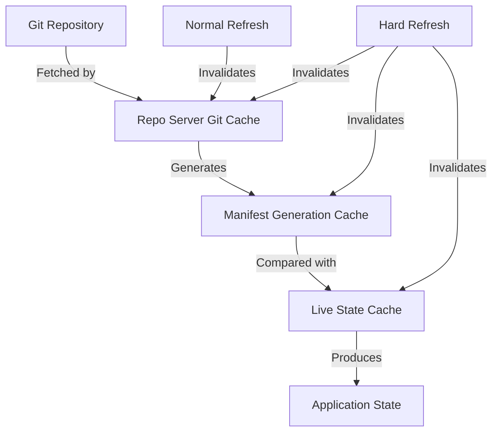

# How to Hard Refresh Application in ArgoCD

Author: [nawazdhandala](https://github.com/nawazdhandala)

Tags: ArgoCD, GitOps, Kubernetes, Application Management, Cache Management

Description: Learn how to perform a hard refresh in ArgoCD to invalidate all caches and force a complete re-computation of application state from scratch.

---

ArgoCD maintains several layers of caching to keep operations fast. The repo server caches Git repository content and generated manifests. The application controller caches the live state of cluster resources. Normally, a regular refresh is enough to pick up changes. But sometimes these caches get stale or corrupted, and you need ArgoCD to throw everything away and recompute the application state from scratch.

That is what a hard refresh does. It invalidates all caches for the application and forces ArgoCD to re-fetch the Git repository content, re-generate manifests, re-read the live cluster state, and re-compute the diff from scratch.

## Hard Refresh vs Normal Refresh

A **normal refresh** triggers ArgoCD to:
1. Check Git for new commits (using the existing repo cache)
2. Re-generate manifests if the commit changed (using the manifest cache if unchanged)
3. Compare against the cached live state
4. Update the sync and health status

A **hard refresh** forces ArgoCD to:
1. Invalidate the Git repo cache for this application
2. Re-clone or re-fetch the repository content
3. Re-generate all manifests from scratch (ignoring the manifest cache)
4. Re-read the live cluster state directly from the Kubernetes API
5. Compute a fresh diff
6. Update the sync and health status

The hard refresh is more expensive but catches issues that a normal refresh misses.

## Hard Refresh via CLI

```bash
# Hard refresh the application
argocd app get my-app --hard-refresh
```

This command triggers the cache invalidation, waits for the refresh to complete, and returns the updated application state.

## Hard Refresh via UI

In the ArgoCD web UI:

1. Navigate to your application
2. Click the "Refresh" button in the top toolbar
3. Select "Hard Refresh" from the dropdown
4. Wait for the refresh to complete (this takes longer than a normal refresh)
5. The application state updates with fresh data

## Hard Refresh via API

```bash
# Hard refresh via API
ARGOCD_SERVER="argocd.example.com"
ARGOCD_TOKEN="your-token"

curl -X GET "https://${ARGOCD_SERVER}/api/v1/applications/my-app?refresh=hard" \
  -H "Authorization: Bearer ${ARGOCD_TOKEN}"
```

## When You Need a Hard Refresh

### Manifest Generation Changes

If you changed how manifests are generated - for example, by updating Helm values files, Kustomize overlays, or Jsonnet parameters - a normal refresh might use the cached generated manifests. A hard refresh forces re-generation:

```bash
# After updating a Helm values file that affects template output
git commit -am "Update Helm values for production"
git push

# Hard refresh to force manifest re-generation
argocd app get my-app --hard-refresh
```

### Config Management Plugin Changes

If you are using a custom Config Management Plugin (CMP) and you updated the plugin itself or its configuration:

```bash
# After updating the CMP ConfigMap
kubectl apply -f cmp-config.yaml -n argocd

# Hard refresh to use the updated plugin
argocd app get my-app --hard-refresh
```

### Stale Cache After ArgoCD Upgrade

After upgrading ArgoCD, the cache format might have changed. A hard refresh ensures clean state:

```bash
# After ArgoCD upgrade, refresh all applications
argocd app list -o name | xargs -I {} argocd app get {} --hard-refresh
```

### Suspected Cache Corruption

If an application shows incorrect state that does not match reality:

```bash
# Application shows Synced but resources are clearly different
argocd app get my-app --hard-refresh

# Check if the state corrects itself
argocd app diff my-app
```

### After Repo Server Restart

When the ArgoCD repo server restarts, its in-memory cache is cleared. But the application controller might still have stale data:

```bash
# Repo server was restarted, hard refresh to sync everything
argocd app get my-app --hard-refresh
```

## Practical Scenario: Helm Chart with External Dependencies

Consider a Helm chart that uses external chart dependencies. If an upstream chart published a new version and your chart references a range:

```yaml
# Chart.yaml
dependencies:
  - name: postgresql
    version: ">=12.0.0"
    repository: https://charts.bitnami.com/bitnami
```

The repo server caches the resolved dependency. A normal refresh does not re-resolve it. A hard refresh forces ArgoCD to re-fetch dependencies:

```bash
# Force ArgoCD to re-resolve Helm dependencies
argocd app get my-helm-app --hard-refresh
```

## Hard Refreshing Multiple Applications

For bulk operations, stagger the hard refreshes to avoid overwhelming the repo server:

```bash
#!/bin/bash
# hard-refresh-all.sh - Staggered hard refresh for all apps

for app in $(argocd app list -o name); do
  echo "Hard refreshing: $app"
  argocd app get "$app" --hard-refresh &

  # Limit concurrent refreshes
  if (( $(jobs -r | wc -l) >= 3 )); then
    wait -n
  fi
done
wait
echo "All applications hard refreshed"
```

Limiting to 3 concurrent hard refreshes prevents the repo server from being overwhelmed.

## Performance Considerations

Hard refresh is significantly more expensive than normal refresh:

- **Git operations**: Full fetch instead of incremental check
- **Manifest generation**: Full render instead of using cache
- **API calls**: Fresh read of all application resources from the cluster
- **CPU/memory**: Higher resource usage on the repo server and application controller

For an application with 100+ resources and a complex Helm chart, a hard refresh might take 30 seconds to a minute. A normal refresh of the same application takes a few seconds.

## The ArgoCD Cache Architecture

Understanding the cache layers helps you know when hard refresh is necessary:



Normal refresh primarily invalidates the Git cache, triggering a new fetch. Hard refresh invalidates all three cache layers, forcing a complete recomputation.

## Configuring Cache Behavior

You can tune the repo server cache settings to reduce the need for hard refreshes:

```yaml
# argocd-cmd-params-cm ConfigMap
apiVersion: v1
kind: ConfigMap
metadata:
  name: argocd-cmd-params-cm
  namespace: argocd
data:
  # Reduce cache duration (default is 24h)
  reposerver.repo.cache.expiration: "1h"

  # Set parallelism limit for manifest generation
  reposerver.parallelism.limit: "10"
```

With a shorter cache expiration, stale cache issues resolve themselves faster.

## Clearing All Caches

In extreme cases, you might need to clear all ArgoCD caches. The nuclear option is restarting the repo server:

```bash
# Restart the repo server to clear all cached data
kubectl rollout restart deployment argocd-repo-server -n argocd

# Wait for it to come back
kubectl rollout status deployment argocd-repo-server -n argocd

# Then hard refresh your applications
argocd app get my-app --hard-refresh
```

The Redis cache used by ArgoCD can also be cleared:

```bash
# Clear Redis cache (careful - affects all applications)
kubectl exec -n argocd $(kubectl get pods -n argocd -l app.kubernetes.io/name=argocd-redis -o name) -- redis-cli FLUSHALL
```

Only do this in situations where you are confident the cache is corrupted. It forces all applications to recompute their state.

## Best Practices

1. **Start with normal refresh.** Most of the time, a normal refresh is sufficient. Only escalate to hard refresh if the normal refresh does not resolve your issue.

2. **Do not hard refresh on a schedule.** Hard refresh should be an on-demand operation, not something you run periodically. If you find yourself needing regular hard refreshes, something else is wrong.

3. **Stagger bulk operations.** When hard-refreshing many applications, do not fire them all at once. Stagger them to avoid overwhelming the repo server.

4. **Monitor repo server resources.** If hard refreshes are slow, the repo server might need more CPU or memory.

## Summary

Hard refresh is ArgoCD's "clear all caches and start fresh" operation. Use it when normal refresh does not pick up changes, after ArgoCD upgrades, when cache corruption is suspected, or when manifest generation configuration changes. It is more expensive than a normal refresh, so use it selectively rather than routinely.

For regular refresh operations, see our guide on [how to force refresh application state in ArgoCD](https://oneuptime.com/blog/post/2026-02-26-argocd-force-refresh-application/view).
