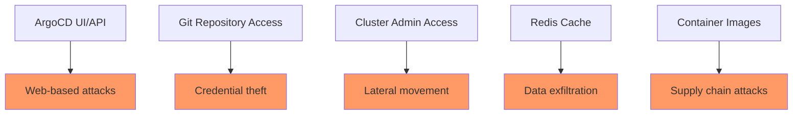

# How to Harden ArgoCD Server for Production

Author: [nawazdhandala](https://github.com/nawazdhandala)

Tags: ArgoCD, GitOps, Kubernetes, Security, Production

Description: A comprehensive security hardening guide for ArgoCD in production environments covering network security, RBAC, container security, and audit logging.

---

Running ArgoCD in production means it becomes a critical piece of your infrastructure. It has access to your Kubernetes clusters, your Git repositories, and your secrets. A compromised ArgoCD instance means an attacker has the keys to your entire deployment pipeline. This guide covers every aspect of hardening ArgoCD for production use.

## The Attack Surface

Before hardening, understand what you are protecting. ArgoCD has several attack vectors:



## Disable the Admin Account

The default admin account is the first thing to disable after setting up SSO:

```yaml
apiVersion: v1
kind: ConfigMap
metadata:
  name: argocd-cm
  namespace: argocd
data:
  # Disable the admin account
  admin.enabled: "false"
```

Before disabling, make sure you have at least one other way to access ArgoCD (SSO, local user accounts, or API tokens).

If you need to keep the admin account for emergency access, at minimum change the password and enforce strong password policy:

```bash
# Change admin password
argocd account update-password \
  --current-password <old-password> \
  --new-password <new-strong-password>
```

## Configure Strict RBAC

The default RBAC policy is too permissive for production. Start with a deny-all policy and add specific permissions:

```yaml
apiVersion: v1
kind: ConfigMap
metadata:
  name: argocd-rbac-cm
  namespace: argocd
data:
  # Default policy: deny everything
  policy.default: role:none
  policy.csv: |
    # Define custom roles
    p, role:developer, applications, get, */*, allow
    p, role:developer, applications, sync, */*, allow
    p, role:developer, logs, get, */*, allow

    p, role:ops, applications, *, */*, allow
    p, role:ops, clusters, get, *, allow
    p, role:ops, repositories, get, *, allow
    p, role:ops, projects, get, *, allow

    # Map SSO groups to roles
    g, dev-team, role:developer
    g, ops-team, role:ops

    # No role for role:none - everything is denied
    p, role:none, *, *, */*, deny
```

Verify your RBAC configuration:

```bash
# Test what a specific user can do
argocd admin settings rbac can developer get applications '*/*' \
  --policy-file policy.csv

# Test what they cannot do
argocd admin settings rbac can developer delete applications '*/*' \
  --policy-file policy.csv
```

## Restrict Network Access

### Network Policies

Limit network communication to only what ArgoCD needs:

```yaml
apiVersion: networking.k8s.io/v1
kind: NetworkPolicy
metadata:
  name: argocd-server-netpol
  namespace: argocd
spec:
  podSelector:
    matchLabels:
      app.kubernetes.io/name: argocd-server
  policyTypes:
    - Ingress
    - Egress
  ingress:
    # Allow traffic from ingress controller
    - from:
        - namespaceSelector:
            matchLabels:
              name: ingress-nginx
      ports:
        - port: 8080
          protocol: TCP
        - port: 8083
          protocol: TCP
  egress:
    # Allow DNS
    - to:
        - namespaceSelector: {}
      ports:
        - port: 53
          protocol: UDP
        - port: 53
          protocol: TCP
    # Allow HTTPS to Git repos and API servers
    - to:
        - ipBlock:
            cidr: 0.0.0.0/0
      ports:
        - port: 443
          protocol: TCP
    # Allow communication with repo-server
    - to:
        - podSelector:
            matchLabels:
              app.kubernetes.io/name: argocd-repo-server
      ports:
        - port: 8081
          protocol: TCP
    # Allow communication with Redis
    - to:
        - podSelector:
            matchLabels:
              app.kubernetes.io/name: argocd-redis
      ports:
        - port: 6379
          protocol: TCP
---
# Lock down Redis
apiVersion: networking.k8s.io/v1
kind: NetworkPolicy
metadata:
  name: argocd-redis-netpol
  namespace: argocd
spec:
  podSelector:
    matchLabels:
      app.kubernetes.io/name: argocd-redis
  policyTypes:
    - Ingress
  ingress:
    # Only allow ArgoCD components to access Redis
    - from:
        - podSelector:
            matchLabels:
              app.kubernetes.io/part-of: argocd
      ports:
        - port: 6379
          protocol: TCP
```

## Container Security

### Run as Non-Root

Ensure all ArgoCD containers run as non-root:

```yaml
apiVersion: apps/v1
kind: Deployment
metadata:
  name: argocd-server
  namespace: argocd
spec:
  template:
    spec:
      securityContext:
        runAsNonRoot: true
        runAsUser: 999
        fsGroup: 999
        seccompProfile:
          type: RuntimeDefault
      containers:
        - name: argocd-server
          securityContext:
            allowPrivilegeEscalation: false
            readOnlyRootFilesystem: true
            capabilities:
              drop:
                - ALL
```

### Read-Only Root Filesystem

Configure containers with read-only root filesystems and mount writable volumes only where needed:

```yaml
containers:
  - name: argocd-repo-server
    securityContext:
      readOnlyRootFilesystem: true
    volumeMounts:
      - name: tmp
        mountPath: /tmp
      - name: plugins
        mountPath: /home/argocd/cmp-server/plugins
volumes:
  - name: tmp
    emptyDir: {}
  - name: plugins
    emptyDir: {}
```

## Enable Audit Logging

ArgoCD logs API access, but you should ensure these logs are captured and forwarded to your SIEM:

```yaml
apiVersion: v1
kind: ConfigMap
metadata:
  name: argocd-cmd-params-cm
  namespace: argocd
data:
  # Enable detailed audit logging
  server.log.level: "info"
  server.log.format: "json"
  controller.log.level: "info"
  controller.log.format: "json"
```

Forward logs to your centralized logging system:

```yaml
# Fluentd sidecar for ArgoCD audit logs
apiVersion: v1
kind: ConfigMap
metadata:
  name: argocd-fluentd-config
  namespace: argocd
data:
  fluent.conf: |
    <source>
      @type tail
      path /var/log/argocd/*.log
      pos_file /var/log/fluentd/argocd.pos
      tag argocd.audit
      <parse>
        @type json
      </parse>
    </source>
    <match argocd.**>
      @type elasticsearch
      host elasticsearch.logging.svc
      port 9200
      index_name argocd-audit
    </match>
```

## Secure Redis

Redis is used for caching and does not have authentication by default. Enable password authentication:

```yaml
apiVersion: v1
kind: Secret
metadata:
  name: argocd-redis
  namespace: argocd
type: Opaque
data:
  auth: <base64-encoded-password>
```

Configure ArgoCD to use the password:

```yaml
apiVersion: v1
kind: ConfigMap
metadata:
  name: argocd-cmd-params-cm
  namespace: argocd
data:
  redis.server: "argocd-redis:6379"
```

For high-security environments, enable Redis TLS:

```yaml
data:
  redis.tls.enabled: "true"
```

## Restrict Cluster Permissions

ArgoCD's application controller runs with cluster-admin by default. Restrict it to only the namespaces and resources it needs:

```yaml
apiVersion: rbac.authorization.k8s.io/v1
kind: ClusterRole
metadata:
  name: argocd-application-controller
rules:
  # Only allow management of specific resource types
  - apiGroups: [""]
    resources: ["pods", "services", "configmaps", "secrets", "serviceaccounts"]
    verbs: ["get", "list", "watch", "create", "update", "patch", "delete"]
  - apiGroups: ["apps"]
    resources: ["deployments", "daemonsets", "statefulsets", "replicasets"]
    verbs: ["get", "list", "watch", "create", "update", "patch", "delete"]
  - apiGroups: ["networking.k8s.io"]
    resources: ["ingresses"]
    verbs: ["get", "list", "watch", "create", "update", "patch", "delete"]
```

## Enable Resource Whitelisting in Projects

Use ArgoCD projects to restrict what resources can be deployed:

```yaml
apiVersion: argoproj.io/v1alpha1
kind: AppProject
metadata:
  name: production
  namespace: argocd
spec:
  # Only allow deployments to specific clusters and namespaces
  destinations:
    - server: https://production-cluster.example.com
      namespace: "app-*"
  # Only allow specific resource types
  clusterResourceWhitelist:
    - group: ""
      kind: Namespace
  namespaceResourceWhitelist:
    - group: ""
      kind: ConfigMap
    - group: ""
      kind: Secret
    - group: apps
      kind: Deployment
    - group: ""
      kind: Service
  # Deny dangerous resources
  namespaceResourceBlacklist:
    - group: ""
      kind: ResourceQuota
    - group: rbac.authorization.k8s.io
      kind: "*"
```

## Secure the API

### Rate Limiting

Protect against brute force and denial of service:

```yaml
apiVersion: v1
kind: ConfigMap
metadata:
  name: argocd-cmd-params-cm
  namespace: argocd
data:
  server.login.attempts.max: "5"
  server.login.attempts.reset: "300"
```

### Disable Anonymous Access

```yaml
apiVersion: v1
kind: ConfigMap
metadata:
  name: argocd-cm
  namespace: argocd
data:
  users.anonymous.enabled: "false"
```

## Production Hardening Checklist

Use this checklist to verify your ArgoCD hardening:

```bash
#!/bin/bash
echo "=== ArgoCD Production Hardening Checklist ==="

# Check admin disabled
ADMIN=$(kubectl get configmap argocd-cm -n argocd -o jsonpath='{.data.admin\.enabled}')
echo "Admin account disabled: $([ "$ADMIN" = "false" ] && echo 'YES' || echo 'NO - FIX THIS')"

# Check anonymous access
ANON=$(kubectl get configmap argocd-cm -n argocd -o jsonpath='{.data.users\.anonymous\.enabled}')
echo "Anonymous access disabled: $([ "$ANON" != "true" ] && echo 'YES' || echo 'NO - FIX THIS')"

# Check TLS
TLS=$(kubectl get secret argocd-server-tls -n argocd 2>/dev/null && echo "yes" || echo "no")
echo "TLS configured: $([ "$TLS" = "yes" ] && echo 'YES' || echo 'NO - FIX THIS')"

# Check network policies
NP=$(kubectl get networkpolicy -n argocd --no-headers 2>/dev/null | wc -l)
echo "Network policies: $NP configured"

# Check containers running as non-root
kubectl get pods -n argocd -o jsonpath='{range .items[*]}{.metadata.name}{": runAsNonRoot="}{.spec.securityContext.runAsNonRoot}{"\n"}{end}'
```

## Conclusion

Hardening ArgoCD for production is not optional - it is essential. Start with the highest impact items: disable the admin account, configure strict RBAC, and enable network policies. Then work through container security, audit logging, and Redis hardening. Review your configuration regularly and test it against your security requirements. A secure ArgoCD installation is the foundation of a trustworthy GitOps pipeline.

For related security topics, see our guides on [configuring RBAC policies in ArgoCD](https://oneuptime.com/blog/post/2026-02-26-argocd-rbac-policies/view) and [content security policy headers](https://oneuptime.com/blog/post/2026-02-26-argocd-content-security-policy-headers/view).
