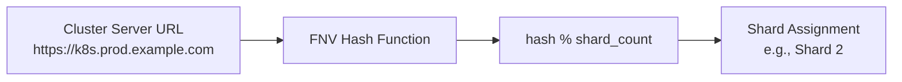

# How to Use Hash-Based Sharding for ArgoCD Controllers

Author: [nawazdhandala](https://github.com/nawazdhandala)

Tags: ArgoCD, GitOps, Kubernetes, Sharding, Scaling

Description: Learn how hash-based sharding works in ArgoCD controllers to automatically distribute cluster management across multiple replicas for better performance.

---

When you need to scale ArgoCD's application controller across multiple replicas, hash-based sharding is the algorithm that decides which controller instance manages which cluster. Understanding how this algorithm works helps you predict cluster assignments, troubleshoot uneven distributions, and plan capacity effectively.

## What Is Hash-Based Sharding?

Hash-based sharding is a technique where a hash function maps each cluster to a specific controller shard. The cluster's server URL is hashed to produce a number, and that number is divided by the total shard count to determine the assignment.



The formula is straightforward:

```text
shard_id = fnv32a(cluster.server) % controller_replicas
```

ArgoCD uses the FNV-1a (Fowler-Noll-Vo) 32-bit hash function, which is fast and produces a reasonably uniform distribution for typical URL inputs.

## How ArgoCD Implements Hash-Based Sharding

Under the hood, the sharding logic lives in the application controller's cluster filtering code. When a controller pod starts up, it calculates which clusters it should manage based on its own shard ID (derived from the StatefulSet ordinal) and the total replica count.

Here is a simplified version of the logic:

```go
// Pseudocode for ArgoCD's sharding logic
func getShardForCluster(clusterServer string, replicas int) int {
    h := fnv.New32a()
    h.Write([]byte(clusterServer))
    return int(h.Sum32()) % replicas
}

// Each controller pod filters clusters
func (c *Controller) getAssignedClusters(allClusters []Cluster) []Cluster {
    var assigned []Cluster
    for _, cluster := range allClusters {
        if getShardForCluster(cluster.Server, c.replicas) == c.shardID {
            assigned = append(assigned, cluster)
        }
    }
    return assigned
}
```

Each controller pod knows its own shard ID from the StatefulSet pod name. Pod `argocd-application-controller-0` has shard ID 0, pod `argocd-application-controller-1` has shard ID 1, and so on.

## Configuring Hash-Based Sharding

To use hash-based sharding, you need to:

1. Deploy the application controller as a StatefulSet
2. Set the replica count
3. Enable dynamic cluster distribution

Here is the complete configuration:

```yaml
# ConfigMap to enable dynamic distribution
apiVersion: v1
kind: ConfigMap
metadata:
  name: argocd-cmd-params-cm
  namespace: argocd
data:
  controller.dynamic.cluster.distribution.enabled: "true"
  # Optional: set the sharding algorithm explicitly
  controller.sharding.algorithm: "legacy"  # or "round-robin"
---
# StatefulSet with multiple replicas
apiVersion: apps/v1
kind: StatefulSet
metadata:
  name: argocd-application-controller
  namespace: argocd
spec:
  replicas: 3
  serviceName: argocd-application-controller
  selector:
    matchLabels:
      app.kubernetes.io/name: argocd-application-controller
  template:
    metadata:
      labels:
        app.kubernetes.io/name: argocd-application-controller
    spec:
      containers:
        - name: argocd-application-controller
          image: quay.io/argoproj/argocd:v2.12.0
          command:
            - argocd-application-controller
          env:
            - name: ARGOCD_CONTROLLER_REPLICAS
              value: "3"
```

### Sharding Algorithm Options

ArgoCD supports two sharding algorithms:

**Legacy (hash-based)** - The default. Uses FNV-1a hashing on the cluster server URL:

```yaml
controller.sharding.algorithm: "legacy"
```

**Round-robin** - Assigns clusters sequentially based on their creation order:

```yaml
controller.sharding.algorithm: "round-robin"
```

The legacy hash-based approach is generally preferred because it is deterministic. The same cluster always maps to the same shard regardless of when other clusters were added or removed. Round-robin can produce better balance but is sensitive to cluster ordering.

## Predicting Shard Assignments

You can predict which shard a cluster will be assigned to using a simple script. This is useful when planning capacity or debugging distribution issues:

```python
#!/usr/bin/env python3
"""Predict ArgoCD shard assignments using FNV-1a hash."""

import sys

def fnv1a_32(data: bytes) -> int:
    """FNV-1a 32-bit hash."""
    FNV_OFFSET = 0x811c9dc5
    FNV_PRIME = 0x01000193
    hash_value = FNV_OFFSET
    for byte in data:
        hash_value ^= byte
        hash_value = (hash_value * FNV_PRIME) & 0xFFFFFFFF
    return hash_value

def get_shard(server_url: str, replicas: int) -> int:
    """Calculate shard for a cluster server URL."""
    return fnv1a_32(server_url.encode()) % replicas

# Example: predict assignments for your clusters
clusters = [
    "https://kubernetes.prod-us.example.com",
    "https://kubernetes.prod-eu.example.com",
    "https://kubernetes.staging.example.com",
    "https://kubernetes.dev.example.com",
    "https://kubernetes.prod-apac.example.com",
]

replicas = 3
for cluster in clusters:
    shard = get_shard(cluster, replicas)
    print(f"Shard {shard}: {cluster}")
```

Running this script helps you see the distribution before deploying changes.

## Handling Uneven Distribution

Hash functions do not guarantee perfect distribution, especially with small cluster counts. If you have 10 clusters and 3 shards, you might get a 4-3-3 split or a 5-3-2 split. Here are ways to handle imbalances.

### Option 1: Adjust the Replica Count

Sometimes changing from 3 to 4 replicas produces a more even distribution. Use the prediction script above to test different replica counts:

```bash
# Test with different shard counts
for replicas in 2 3 4 5; do
    echo "=== $replicas shards ==="
    python3 predict_shards.py $replicas
done
```

### Option 2: Use Static Overrides for Outliers

Even with dynamic sharding, you can override specific clusters with static assignments:

```yaml
apiVersion: v1
kind: Secret
metadata:
  name: heavy-cluster
  namespace: argocd
  annotations:
    # Force this cluster to shard 2 regardless of hash
    argocd.argoproj.io/shard: "2"
  labels:
    argocd.argoproj.io/secret-type: cluster
```

This is useful when one cluster has significantly more applications than others and you want to dedicate a shard to it.

### Option 3: Use Round-Robin Algorithm

If hash-based sharding consistently produces uneven results for your cluster set, switch to round-robin:

```yaml
# In argocd-cmd-params-cm
controller.sharding.algorithm: "round-robin"
```

## What Happens During Scaling Events

When you change the replica count, the hash modulo changes, which means clusters get reassigned. Here is what happens step by step:

1. You scale from 3 to 4 replicas
2. The new pod `argocd-application-controller-3` starts
3. All pods recalculate their cluster assignments using `hash % 4` instead of `hash % 3`
4. Roughly 25% of clusters move to the new shard
5. The old shards stop watching moved clusters
6. The new shard starts watching its assigned clusters
7. There is a brief period (30 to 60 seconds) where moved clusters show as Unknown

To minimize disruption during scaling:

```bash
# Scale up gradually and monitor
kubectl scale statefulset argocd-application-controller \
  -n argocd --replicas=4

# Watch for all pods to become ready
kubectl rollout status statefulset/argocd-application-controller \
  -n argocd --timeout=120s

# Verify all applications recover healthy status
argocd app list --output json | jq '.[].status.health.status' | sort | uniq -c
```

## Monitoring Hash-Based Distribution

Track these metrics to ensure your hash-based sharding is working well:

```promql
# Application count per controller pod
sum(argocd_app_info) by (pod)

# Reconciliation latency per shard
histogram_quantile(0.95,
  sum(rate(argocd_app_reconcile_bucket[5m])) by (le, pod)
)

# Memory per shard - indicates cache size
container_memory_working_set_bytes{
  container="argocd-application-controller"
}
```

If one shard consistently shows higher latency or memory usage than others, consider using a static override to move one of its clusters to a less loaded shard.

Hash-based sharding provides a solid foundation for scaling ArgoCD. It is deterministic, requires minimal configuration, and handles cluster additions and removals gracefully. For most deployments, it is the right default choice.
