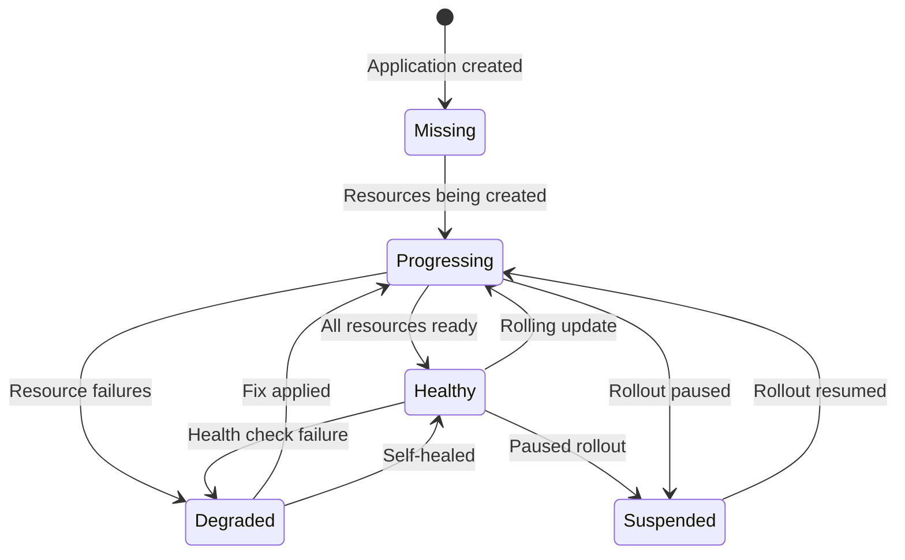

# How to Handle Application Health Changed Events

Author: [nawazdhandala](https://github.com/nawazdhandala)

Tags: ArgoCD, GitOps, Kubernetes, Health Monitoring, Automation

Description: Learn how to detect and respond to application health status changes in ArgoCD for automated incident response, alerting, and self-healing workflows.

---

ArgoCD continuously monitors the health of every application it manages. When an application's health transitions from Healthy to Degraded, Progressing to Healthy, or any other state change, it represents a significant operational event. Capturing these health transitions enables automated incident response, proactive alerting, and self-healing workflows.

This guide covers how to detect health changes in ArgoCD, route them to the right systems, and build automation around common health transitions.

## Understanding ArgoCD Health States

ArgoCD defines several health states for applications:



- **Healthy**: All resources are running and passing health checks
- **Progressing**: Resources are being created, updated, or rolling out
- **Degraded**: One or more resources are in a failed state
- **Suspended**: A rollout is paused (often used with Argo Rollouts)
- **Missing**: Expected resources do not exist in the cluster
- **Unknown**: Health status could not be determined

## Setting Up Health Change Notifications

Configure ArgoCD Notifications to fire on each health transition.

```yaml
# argocd-notifications-cm ConfigMap
apiVersion: v1
kind: ConfigMap
metadata:
  name: argocd-notifications-cm
  namespace: argocd
data:
  # Trigger on health degraded
  trigger.on-health-degraded: |
    - description: Application health has degraded
      when: app.status.health.status == 'Degraded'
      send:
        - health-degraded-alert
        - health-degraded-incident

  # Trigger when health recovers
  trigger.on-health-recovered: |
    - description: Application health recovered
      when: app.status.health.status == 'Healthy' and
            time.Now().Sub(time.Parse(app.status.reconciledAt)).Minutes() < 5
      send:
        - health-recovered-notification

  # Trigger on progressing (deployment in progress)
  trigger.on-health-progressing: |
    - description: Application is progressing
      when: app.status.health.status == 'Progressing'
      send:
        - health-progressing-notification

  # Trigger on suspended (paused rollout)
  trigger.on-health-suspended: |
    - description: Application rollout is suspended
      when: app.status.health.status == 'Suspended'
      send:
        - health-suspended-alert

  # Alert template for degraded health
  template.health-degraded-alert: |
    slack:
      channel: "{{index .app.metadata.labels "alert-channel" | default "platform-alerts"}}"
      title: "DEGRADED: {{.app.metadata.name}}"
      text: |
        *Application*: {{.app.metadata.name}}
        *Health Status*: {{.app.status.health.status}}
        *Message*: {{.app.status.health.message | default "No message"}}
        *Namespace*: {{.app.spec.destination.namespace}}
        *Last Synced*: {{.app.status.operationState.finishedAt}}
        *Revision*: `{{.app.status.sync.revision | truncate 8}}`

        {{range .app.status.resources}}
        {{if eq .health.status "Degraded"}}
        - {{.kind}}/{{.name}}: {{.health.message}}
        {{end}}
        {{end}}
      color: "#FF0000"

  # Webhook for incident creation
  template.health-degraded-incident: |
    webhook:
      incident-api:
        method: POST
        body: |
          {
            "title": "ArgoCD Application Degraded: {{.app.metadata.name}}",
            "severity": "{{index .app.metadata.labels "severity" | default "warning"}}",
            "source": "argocd",
            "application": "{{.app.metadata.name}}",
            "namespace": "{{.app.spec.destination.namespace}}",
            "health_status": "{{.app.status.health.status}}",
            "health_message": "{{.app.status.health.message}}",
            "team": "{{index .app.metadata.labels "team" | default "platform"}}",
            "degraded_resources": [
              {{$first := true}}
              {{range .app.status.resources}}
              {{if eq .health.status "Degraded"}}
              {{if not $first}},{{end}}
              {"kind": "{{.kind}}", "name": "{{.name}}", "message": "{{.health.message}}"}
              {{$first = false}}
              {{end}}
              {{end}}
            ]
          }

  # Recovery notification
  template.health-recovered-notification: |
    slack:
      channel: "{{index .app.metadata.labels "alert-channel" | default "platform-alerts"}}"
      title: "RECOVERED: {{.app.metadata.name}}"
      text: |
        *Application*: {{.app.metadata.name}}
        *Health Status*: Healthy
        *Namespace*: {{.app.spec.destination.namespace}}
        Application health has been restored.
      color: "#36a64f"

  # Progressing notification
  template.health-progressing-notification: |
    slack:
      channel: deployments
      title: "DEPLOYING: {{.app.metadata.name}}"
      text: |
        *Application*: {{.app.metadata.name}}
        *Status*: Deployment in progress
        *Revision*: `{{.app.status.sync.revision | truncate 8}}`
      color: "#FFA500"

  # Suspended alert
  template.health-suspended-alert: |
    slack:
      channel: deployments
      title: "SUSPENDED: {{.app.metadata.name}}"
      text: |
        *Application*: {{.app.metadata.name}}
        *Status*: Rollout paused - manual intervention may be required
        *Namespace*: {{.app.spec.destination.namespace}}
      color: "#9C27B0"

  # Webhook services
  service.webhook.incident-api: |
    url: https://oneuptime.com/api/incident
    headers:
      - name: Content-Type
        value: application/json
      - name: Authorization
        value: $oneuptime-api-key
```

## Subscribing Applications to Health Notifications

Add annotations to your applications to subscribe to health events:

```yaml
apiVersion: argoproj.io/v1alpha1
kind: Application
metadata:
  name: payment-service
  labels:
    team: payments
    severity: critical
    alert-channel: payments-alerts
  annotations:
    notifications.argoproj.io/subscribe.on-health-degraded.slack: ""
    notifications.argoproj.io/subscribe.on-health-degraded.incident-api: ""
    notifications.argoproj.io/subscribe.on-health-recovered.slack: ""
    notifications.argoproj.io/subscribe.on-health-progressing.slack: ""
```

## Building a Self-Healing Workflow

When an application goes degraded, you can trigger automatic remediation.

```yaml
# platform/self-healer/deployment.yaml
apiVersion: apps/v1
kind: Deployment
metadata:
  name: argocd-self-healer
  namespace: argocd
spec:
  replicas: 1
  selector:
    matchLabels:
      app: argocd-self-healer
  template:
    spec:
      containers:
        - name: healer
          image: your-org/argocd-self-healer:latest
          env:
            - name: ARGOCD_SERVER
              value: argocd-server.argocd.svc:443
            - name: ARGOCD_TOKEN
              valueFrom:
                secretKeyRef:
                  name: argocd-self-healer-token
                  key: token
```

The self-healer logic:

```python
# self-healer logic (simplified)
import time
import requests

def handle_degraded_event(app_name, degraded_resources):
    """Handle application health degradation."""

    for resource in degraded_resources:
        if resource['kind'] == 'Deployment':
            # Check if it is a CrashLoopBackOff
            if 'CrashLoopBackOff' in resource.get('message', ''):
                # Wait for a grace period
                time.sleep(300)  # 5 minutes

                # Check if still degraded
                if is_still_degraded(app_name):
                    # Rollback to last successful revision
                    rollback_to_last_healthy(app_name)
                    notify(f"Auto-rolled back {app_name} due to CrashLoopBackOff")

        elif resource['kind'] == 'Pod':
            if 'ImagePullBackOff' in resource.get('message', ''):
                # This is likely a bad image tag - rollback
                rollback_to_last_healthy(app_name)
                notify(f"Auto-rolled back {app_name} due to ImagePullBackOff")


def rollback_to_last_healthy(app_name):
    """Rollback application to the last known healthy revision."""
    # Get application history
    response = requests.get(
        f'{ARGOCD_SERVER}/api/v1/applications/{app_name}',
        headers={'Authorization': f'Bearer {ARGOCD_TOKEN}'}
    )
    app = response.json()

    # Find the previous revision
    history = app.get('status', {}).get('history', [])
    if len(history) >= 2:
        previous_revision = history[-2]['revision']

        # Trigger sync to previous revision
        requests.post(
            f'{ARGOCD_SERVER}/api/v1/applications/{app_name}/sync',
            json={'revision': previous_revision},
            headers={'Authorization': f'Bearer {ARGOCD_TOKEN}'}
        )
```

## Health Check Customization

ArgoCD's health assessment depends on its understanding of each resource type. Customize health checks for your custom resources:

```yaml
# argocd-cm ConfigMap
data:
  resource.customizations.health.apps_Deployment: |
    hs = {}
    if obj.status ~= nil then
      if obj.status.availableReplicas ~= nil and
         obj.status.availableReplicas == obj.spec.replicas then
        hs.status = "Healthy"
      elseif obj.status.unavailableReplicas ~= nil and
             obj.status.unavailableReplicas > 0 then
        hs.status = "Degraded"
        hs.message = obj.status.unavailableReplicas ..
          " replicas unavailable"
      else
        hs.status = "Progressing"
      end
    end
    return hs
```

## Severity-Based Routing

Route health events based on application criticality:

```yaml
trigger.on-critical-degraded: |
  - description: Critical application degraded
    when: >-
      app.status.health.status == 'Degraded' and
      app.metadata.labels.severity == 'critical'
    send:
      - pagerduty-critical
      - slack-urgent

trigger.on-standard-degraded: |
  - description: Standard application degraded
    when: >-
      app.status.health.status == 'Degraded' and
      app.metadata.labels.severity != 'critical'
    send:
      - slack-warning
```

## Monitoring Health Transitions with Metrics

Export health transitions as Prometheus metrics for dashboarding:

```yaml
template.health-change-metric: |
  webhook:
    metrics-collector:
      method: POST
      body: |
        {
          "metric": "argocd_app_health_transition",
          "labels": {
            "application": "{{.app.metadata.name}}",
            "from_status": "unknown",
            "to_status": "{{.app.status.health.status}}",
            "team": "{{index .app.metadata.labels "team"}}"
          },
          "value": 1
        }
```

## Conclusion

Health changed events are the operational heartbeat of your ArgoCD deployment. By routing degraded events to incident management systems like [OneUptime](https://oneuptime.com), sending recovery notifications to reduce alert fatigue, and building self-healing workflows for common failures, you transform ArgoCD from a deployment tool into a complete operational platform. Use severity labels for routing, customize health checks for accurate status reporting, and always pair degraded alerts with recovery notifications so teams know when issues resolve.
