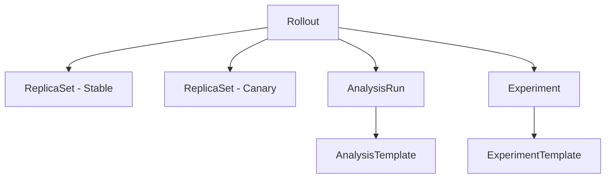
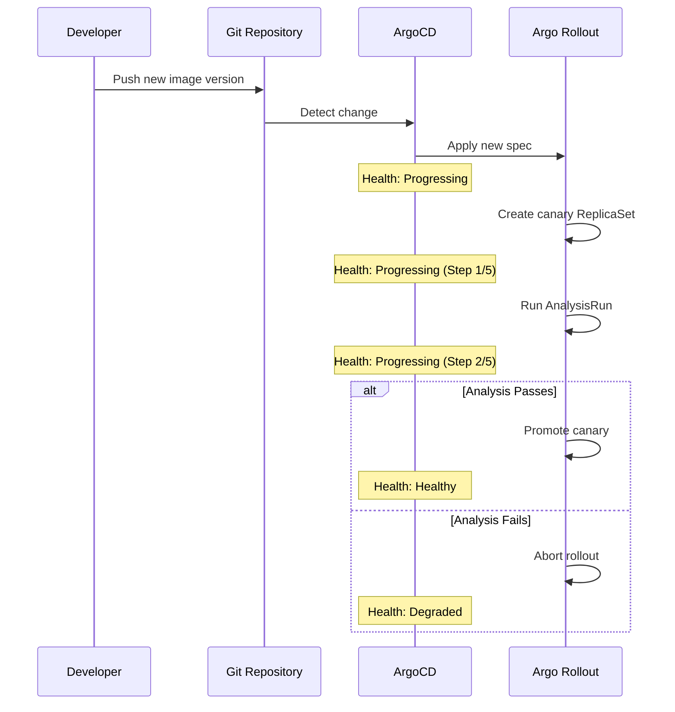

# How to Configure Health Checks for Argo Rollouts in ArgoCD

Author: [nawazdhandala](https://github.com/nawazdhandala)

Tags: ArgoCD, GitOps, Kubernetes, Argo Rollouts, Progressive Delivery

Description: Learn how to configure ArgoCD health checks for Argo Rollouts resources to accurately reflect canary and blue-green deployment health status.

---

Argo Rollouts extends Kubernetes Deployments with progressive delivery strategies like canary and blue-green deployments. When you manage Rollouts with ArgoCD, the health status must accurately reflect the rollout's state - whether it is in the middle of a canary analysis, waiting for a manual promotion, paused at a step, or fully healthy.

ArgoCD includes built-in health checks for Argo Rollouts starting from ArgoCD 2.4, but you may need to customize them for your specific workflow. This guide covers both the built-in behavior and custom health configurations.

## Argo Rollouts Resource Types

Argo Rollouts introduces several custom resource types:



Each of these resource types needs appropriate health assessment:

- **Rollout**: The main resource replacing Deployment
- **AnalysisRun**: Executes analysis during rollout (metrics, web hooks)
- **AnalysisTemplate**: Defines analysis parameters
- **Experiment**: Runs experiments during rollout

## Built-in Rollout Health Check

ArgoCD's built-in health check for Rollouts evaluates:

1. Whether the rollout is fully promoted (stable)
2. Whether it is in the middle of a progressive rollout
3. Whether it has failed or is degraded
4. Whether it is paused (waiting for manual promotion)

The mapping is:

| Rollout State | ArgoCD Health Status |
|---------------|---------------------|
| Healthy (fully promoted) | Healthy |
| Progressing (canary in flight) | Progressing |
| Paused (manual gate) | Suspended |
| Degraded (analysis failed) | Degraded |
| Aborted | Degraded |
| ScaledDown | Suspended |

## Installing the Argo Rollouts Extension

If your ArgoCD version does not include Argo Rollouts health checks, or you want the latest health check logic, install the resource customization:

```yaml
apiVersion: v1
kind: ConfigMap
metadata:
  name: argocd-cm
  namespace: argocd
data:
  resource.customizations.health.argoproj.io_Rollout: |
    hs = {}
    if obj.status == nil then
      hs.status = "Progressing"
      hs.message = "Waiting for rollout status"
      return hs
    end

    -- Check for paused state
    if obj.status.phase == "Paused" then
      hs.status = "Suspended"
      hs.message = obj.status.message or "Rollout is paused"
      return hs
    end

    -- Check for degraded state
    if obj.status.phase == "Degraded" then
      hs.status = "Degraded"
      hs.message = obj.status.message or "Rollout is degraded"
      return hs
    end

    -- Check for abort
    if obj.status.abort == true then
      hs.status = "Degraded"
      hs.message = "Rollout was aborted"
      if obj.status.message ~= nil then
        hs.message = hs.message .. ": " .. obj.status.message
      end
      return hs
    end

    -- Check for healthy state
    if obj.status.phase == "Healthy" then
      hs.status = "Healthy"
      hs.message = "Rollout is fully promoted"
      return hs
    end

    -- Check for progressing
    if obj.status.phase == "Progressing" then
      hs.status = "Progressing"
      -- Include step info if available
      if obj.status.currentStepIndex ~= nil then
        local totalSteps = 0
        if obj.spec.strategy ~= nil then
          if obj.spec.strategy.canary ~= nil and obj.spec.strategy.canary.steps ~= nil then
            totalSteps = #obj.spec.strategy.canary.steps
          end
        end
        hs.message = "Step " .. obj.status.currentStepIndex .. "/" .. totalSteps
      else
        hs.message = obj.status.message or "Rollout is progressing"
      end
      return hs
    end

    hs.status = "Progressing"
    hs.message = "Phase: " .. (obj.status.phase or "unknown")
    return hs
```

## AnalysisRun Health Check

AnalysisRuns execute metric checks during canary rollouts. Their health directly affects whether the rollout continues or aborts:

```yaml
resource.customizations.health.argoproj.io_AnalysisRun: |
  hs = {}
  if obj.status == nil or obj.status.phase == nil then
    hs.status = "Progressing"
    hs.message = "Analysis starting"
    return hs
  end

  if obj.status.phase == "Successful" then
    hs.status = "Healthy"
    hs.message = "Analysis passed"
  elseif obj.status.phase == "Running" then
    hs.status = "Progressing"
    -- Include metric results if available
    if obj.status.metricResults ~= nil then
      local running = 0
      local success = 0
      local total = #obj.status.metricResults
      for i, metric in ipairs(obj.status.metricResults) do
        if metric.phase == "Running" then
          running = running + 1
        elseif metric.phase == "Successful" then
          success = success + 1
        end
      end
      hs.message = success .. "/" .. total .. " metrics passed, " .. running .. " running"
    else
      hs.message = "Analysis is running"
    end
  elseif obj.status.phase == "Failed" then
    hs.status = "Degraded"
    hs.message = obj.status.message or "Analysis failed"
  elseif obj.status.phase == "Error" then
    hs.status = "Degraded"
    hs.message = obj.status.message or "Analysis encountered an error"
  elseif obj.status.phase == "Inconclusive" then
    hs.status = "Progressing"
    hs.message = "Analysis results are inconclusive"
  elseif obj.status.phase == "Pending" then
    hs.status = "Progressing"
    hs.message = "Analysis is pending"
  else
    hs.status = "Progressing"
    hs.message = "Phase: " .. obj.status.phase
  end
  return hs
```

## Experiment Health Check

Experiments run temporary ReplicaSets for comparison during analysis:

```yaml
resource.customizations.health.argoproj.io_Experiment: |
  hs = {}
  if obj.status == nil or obj.status.phase == nil then
    hs.status = "Progressing"
    hs.message = "Experiment initializing"
    return hs
  end

  if obj.status.phase == "Successful" then
    hs.status = "Healthy"
    hs.message = "Experiment completed successfully"
  elseif obj.status.phase == "Running" then
    hs.status = "Progressing"
    hs.message = "Experiment is running"
  elseif obj.status.phase == "Failed" then
    hs.status = "Degraded"
    hs.message = obj.status.message or "Experiment failed"
  elseif obj.status.phase == "Error" then
    hs.status = "Degraded"
    hs.message = obj.status.message or "Experiment error"
  else
    hs.status = "Progressing"
    hs.message = "Phase: " .. obj.status.phase
  end
  return hs
```

## Canary Deployment Health Visualization

During a canary rollout, the ArgoCD UI shows the following progression:



## Blue-Green Deployment Health

For blue-green rollouts, the health states are:

```yaml
resource.customizations.health.argoproj.io_Rollout: |
  hs = {}
  if obj.status == nil then
    hs.status = "Progressing"
    hs.message = "Initializing"
    return hs
  end

  -- Handle blue-green specific states
  if obj.spec.strategy ~= nil and obj.spec.strategy.blueGreen ~= nil then
    if obj.status.blueGreen ~= nil then
      -- Check if preview service is active
      if obj.status.blueGreen.previewSelector ~= nil then
        if obj.status.phase == "Paused" then
          hs.status = "Suspended"
          hs.message = "Preview is active. Waiting for manual promotion."
          return hs
        end
      end
    end
  end

  -- Fall through to standard phase checking
  if obj.status.phase == "Healthy" then
    hs.status = "Healthy"
    hs.message = "Active version is healthy"
  elseif obj.status.phase == "Paused" then
    hs.status = "Suspended"
    hs.message = obj.status.message or "Waiting for promotion"
  elseif obj.status.phase == "Degraded" then
    hs.status = "Degraded"
    hs.message = obj.status.message or "Rollout is degraded"
  else
    hs.status = "Progressing"
    hs.message = obj.status.message or "Rollout in progress"
  end
  return hs
```

## Handling Paused Rollouts in ArgoCD

When a rollout is paused (waiting for manual promotion or at a pause step), ArgoCD shows it as Suspended. This is important for teams that use manual gates:

```yaml
# Rollout with manual promotion gate
apiVersion: argoproj.io/v1alpha1
kind: Rollout
metadata:
  name: my-app
spec:
  strategy:
    canary:
      steps:
        - setWeight: 20
        - pause: {}          # Manual gate - ArgoCD shows Suspended
        - setWeight: 50
        - pause: {duration: 30s}  # Timed pause - ArgoCD shows Progressing
        - setWeight: 100
```

The health check should distinguish between:
- **Manual pause** (`pause: {}`) - Shows as Suspended (needs human action)
- **Timed pause** (`pause: {duration: 30s}`) - Shows as Progressing (will auto-continue)

## Troubleshooting Rollout Health

### Rollout Stuck in Progressing

```bash
# Check the rollout status
kubectl argo rollouts status my-app -n production

# Check the current step
kubectl argo rollouts get rollout my-app -n production

# Check if analysis is failing
kubectl get analysisrun -n production -l rollouts-pod-template-hash
```

### Rollout Shows Degraded

```bash
# Check the abort reason
kubectl get rollout my-app -n production -o json | jq '.status'

# Check the failed AnalysisRun
kubectl get analysisrun -n production --sort-by='.metadata.creationTimestamp' | tail -5
kubectl describe analysisrun <failed-run-name> -n production
```

### Health Check Not Updating

```bash
# Force refresh in ArgoCD
argocd app get my-app --hard-refresh

# Check controller logs for health assessment
kubectl logs -n argocd deployment/argocd-application-controller | \
  grep "Rollout" | tail -20
```

## Best Practices

1. **Use the latest ArgoCD version** - Newer versions include improved Argo Rollouts health checks
2. **Monitor AnalysisRun health separately** - A failing AnalysisRun should alert your team before the rollout is aborted
3. **Handle Suspended state in notifications** - Set up alerts for Suspended rollouts so manual gates are not forgotten
4. **Include step information in messages** - Show "Step 3/5" so operators know the rollout progress
5. **Test health checks with rollout failures** - Simulate failed analyses to verify Degraded status displays correctly

For more on Lua health checks, see [How to Write Custom Health Check Scripts in Lua](https://oneuptime.com/blog/post/2026-02-26-argocd-custom-health-check-lua/view). For general health assessment, see [How to Understand Built-in Health Checks in ArgoCD](https://oneuptime.com/blog/post/2026-02-26-argocd-built-in-health-checks/view).
