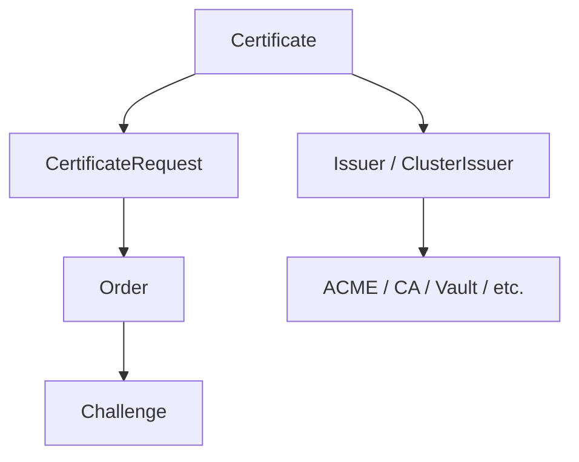

# How to Configure Health Checks for Cert-Manager Certificates in ArgoCD

Author: [nawazdhandala](https://github.com/nawazdhandala)

Tags: ArgoCD, GitOps, Kubernetes, cert-manager, Health Checks

Description: Learn how to configure ArgoCD health checks for cert-manager Certificate and Issuer resources so expired or failed certificates show as Degraded.

---

Cert-manager automates TLS certificate management in Kubernetes. When you manage cert-manager resources through ArgoCD, you need accurate health reporting. A Certificate resource that exists but has a failed ACME challenge is not healthy. An Issuer that cannot connect to its CA is not healthy. Without custom health checks, ArgoCD shows these as green, hiding critical TLS failures.

This guide provides ready-to-use health check configurations for all cert-manager resource types.

## Cert-Manager Resource Types

Cert-manager introduces several CRDs:



The health of a Certificate depends on the entire chain working correctly.

## Certificate Health Check

The Certificate resource is the most important one to monitor. It has conditions that indicate whether the certificate is issued, expiring, or failed:

```yaml
apiVersion: v1
kind: ConfigMap
metadata:
  name: argocd-cm
  namespace: argocd
data:
  resource.customizations.health.cert-manager.io_Certificate: |
    hs = {}
    if obj.status == nil or obj.status.conditions == nil then
      hs.status = "Progressing"
      hs.message = "Certificate is being provisioned"
      return hs
    end

    -- Check for Ready condition
    for i, condition in ipairs(obj.status.conditions) do
      if condition.type == "Ready" then
        if condition.status == "True" then
          -- Certificate is valid and ready
          hs.status = "Healthy"
          -- Include expiry info if available
          if obj.status.notAfter ~= nil then
            hs.message = "Certificate is valid. Expires: " .. obj.status.notAfter
          else
            hs.message = "Certificate is ready"
          end
          return hs
        elseif condition.status == "False" then
          -- Certificate is not ready - check the reason
          if condition.reason == "Issuing" then
            hs.status = "Progressing"
            hs.message = condition.message or "Certificate is being issued"
          elseif condition.reason == "Pending" then
            hs.status = "Progressing"
            hs.message = condition.message or "Certificate issuance is pending"
          else
            hs.status = "Degraded"
            hs.message = condition.message or "Certificate is not ready: " .. (condition.reason or "unknown")
          end
          return hs
        end
      end
    end

    -- Check for Issuing condition
    for i, condition in ipairs(obj.status.conditions) do
      if condition.type == "Issuing" then
        if condition.status == "True" then
          hs.status = "Progressing"
          hs.message = condition.message or "Certificate is being issued"
          return hs
        end
      end
    end

    hs.status = "Progressing"
    hs.message = "Waiting for certificate status"
    return hs
```

## Issuer Health Check

Issuers need to be healthy for certificates to be issued:

```yaml
  resource.customizations.health.cert-manager.io_Issuer: |
    hs = {}
    if obj.status == nil or obj.status.conditions == nil then
      hs.status = "Progressing"
      hs.message = "Issuer initializing"
      return hs
    end
    for i, condition in ipairs(obj.status.conditions) do
      if condition.type == "Ready" then
        if condition.status == "True" then
          hs.status = "Healthy"
          hs.message = "Issuer is ready"
        else
          hs.status = "Degraded"
          hs.message = condition.message or "Issuer is not ready"
        end
        return hs
      end
    end
    hs.status = "Progressing"
    hs.message = "Waiting for Ready condition"
    return hs
```

## ClusterIssuer Health Check

ClusterIssuers work the same as Issuers but are cluster-scoped:

```yaml
  resource.customizations.health.cert-manager.io_ClusterIssuer: |
    hs = {}
    if obj.status == nil or obj.status.conditions == nil then
      hs.status = "Progressing"
      hs.message = "ClusterIssuer initializing"
      return hs
    end
    for i, condition in ipairs(obj.status.conditions) do
      if condition.type == "Ready" then
        if condition.status == "True" then
          hs.status = "Healthy"
          hs.message = "ClusterIssuer is ready"
        else
          hs.status = "Degraded"
          hs.message = condition.message or "ClusterIssuer is not ready"
        end
        return hs
      end
    end
    hs.status = "Progressing"
    hs.message = "Waiting for Ready condition"
    return hs
```

## CertificateRequest Health Check

CertificateRequests are created automatically by cert-manager when processing a Certificate. Monitoring their health helps debug issuance failures:

```yaml
  resource.customizations.health.cert-manager.io_CertificateRequest: |
    hs = {}
    if obj.status == nil or obj.status.conditions == nil then
      hs.status = "Progressing"
      hs.message = "CertificateRequest is being processed"
      return hs
    end
    for i, condition in ipairs(obj.status.conditions) do
      if condition.type == "Ready" then
        if condition.status == "True" then
          hs.status = "Healthy"
          hs.message = "CertificateRequest approved and signed"
        elseif condition.status == "False" then
          if condition.reason == "Pending" then
            hs.status = "Progressing"
            hs.message = condition.message or "Waiting for approval"
          elseif condition.reason == "Failed" then
            hs.status = "Degraded"
            hs.message = condition.message or "CertificateRequest failed"
          elseif condition.reason == "Denied" then
            hs.status = "Degraded"
            hs.message = condition.message or "CertificateRequest was denied"
          else
            hs.status = "Progressing"
            hs.message = condition.message or condition.reason or "Processing"
          end
        end
        return hs
      end
    end
    hs.status = "Progressing"
    hs.message = "Waiting for status"
    return hs
```

## ACME Order Health Check

For ACME-based issuers (Let's Encrypt), Orders track the certificate order process:

```yaml
  resource.customizations.health.acme.cert-manager.io_Order: |
    hs = {}
    if obj.status == nil then
      hs.status = "Progressing"
      hs.message = "Order created"
      return hs
    end
    if obj.status.state == "valid" then
      hs.status = "Healthy"
      hs.message = "Order is valid"
    elseif obj.status.state == "ready" then
      hs.status = "Healthy"
      hs.message = "Order is ready for finalization"
    elseif obj.status.state == "pending" then
      hs.status = "Progressing"
      hs.message = "Order is pending challenge validation"
    elseif obj.status.state == "processing" then
      hs.status = "Progressing"
      hs.message = "Order is being processed"
    elseif obj.status.state == "invalid" then
      hs.status = "Degraded"
      hs.message = obj.status.reason or "Order validation failed"
    elseif obj.status.state == "errored" then
      hs.status = "Degraded"
      hs.message = obj.status.reason or "Order encountered an error"
    else
      hs.status = "Progressing"
      hs.message = "State: " .. (obj.status.state or "unknown")
    end
    return hs
```

## ACME Challenge Health Check

Challenges represent individual domain validation attempts:

```yaml
  resource.customizations.health.acme.cert-manager.io_Challenge: |
    hs = {}
    if obj.status == nil then
      hs.status = "Progressing"
      hs.message = "Challenge created"
      return hs
    end
    if obj.status.state == "valid" then
      hs.status = "Healthy"
      hs.message = "Challenge validated successfully"
    elseif obj.status.state == "pending" then
      hs.status = "Progressing"
      hs.message = obj.status.reason or "Challenge is pending validation"
    elseif obj.status.state == "processing" then
      hs.status = "Progressing"
      hs.message = "Challenge solver is running"
    elseif obj.status.state == "invalid" then
      hs.status = "Degraded"
      hs.message = obj.status.reason or "Challenge validation failed"
    elseif obj.status.state == "errored" then
      hs.status = "Degraded"
      hs.message = obj.status.reason or "Challenge error"
    else
      hs.status = "Progressing"
      hs.message = "State: " .. (obj.status.state or "unknown")
    end
    return hs
```

## Complete ConfigMap Example

Here is a complete `argocd-cm` configuration with all cert-manager health checks:

```yaml
apiVersion: v1
kind: ConfigMap
metadata:
  name: argocd-cm
  namespace: argocd
data:
  resource.customizations.health.cert-manager.io_Certificate: |
    hs = {}
    if obj.status == nil or obj.status.conditions == nil then
      hs.status = "Progressing"
      hs.message = "Certificate is being provisioned"
      return hs
    end
    for i, condition in ipairs(obj.status.conditions) do
      if condition.type == "Ready" then
        if condition.status == "True" then
          hs.status = "Healthy"
          hs.message = "Certificate is valid"
        elseif condition.reason == "Issuing" or condition.reason == "Pending" then
          hs.status = "Progressing"
          hs.message = condition.message or "Issuing"
        else
          hs.status = "Degraded"
          hs.message = condition.message or "Not ready"
        end
        return hs
      end
    end
    hs.status = "Progressing"
    return hs

  resource.customizations.health.cert-manager.io_Issuer: |
    hs = {}
    if obj.status == nil or obj.status.conditions == nil then
      hs.status = "Progressing"
      hs.message = "Initializing"
      return hs
    end
    for i, condition in ipairs(obj.status.conditions) do
      if condition.type == "Ready" then
        if condition.status == "True" then
          hs.status = "Healthy"
        else
          hs.status = "Degraded"
          hs.message = condition.message or "Not ready"
        end
        return hs
      end
    end
    hs.status = "Progressing"
    return hs

  resource.customizations.health.cert-manager.io_ClusterIssuer: |
    hs = {}
    if obj.status == nil or obj.status.conditions == nil then
      hs.status = "Progressing"
      hs.message = "Initializing"
      return hs
    end
    for i, condition in ipairs(obj.status.conditions) do
      if condition.type == "Ready" then
        if condition.status == "True" then
          hs.status = "Healthy"
        else
          hs.status = "Degraded"
          hs.message = condition.message or "Not ready"
        end
        return hs
      end
    end
    hs.status = "Progressing"
    return hs
```

## Debugging Cert-Manager Health Issues

### Certificate Stuck in Progressing

```bash
# Check the Certificate status
kubectl get certificate my-cert -n production -o yaml

# Check the latest CertificateRequest
kubectl get certificaterequests -n production --sort-by='.metadata.creationTimestamp' | tail -5

# Check for ACME Orders and Challenges
kubectl get orders -n production
kubectl get challenges -n production

# Check cert-manager logs
kubectl logs -n cert-manager deployment/cert-manager | tail -50
```

### Certificate Shows Degraded

```bash
# Get the detailed error message
kubectl describe certificate my-cert -n production

# Check events
kubectl events -n production --for certificate/my-cert

# Common causes:
# - DNS challenge failed (DNS propagation, missing DNS records)
# - HTTP challenge failed (Ingress misconfiguration, firewall blocking)
# - Issuer not ready (CA certificate missing, Vault connection failed)
# - Rate limited by Let's Encrypt
```

### Verifying Health in ArgoCD

```bash
# Check how ArgoCD reports the health
argocd app get my-app -o json | \
  jq '.status.resources[] | select(.kind == "Certificate") | .health'

# Force refresh
argocd app get my-app --hard-refresh
```

## Best Practices

1. **Monitor Issuer health first** - If the Issuer is degraded, all its Certificates will fail
2. **Include expiry information** - The health message should show when the certificate expires
3. **Set up notifications for Degraded certificates** - TLS failures can cause outages
4. **Treat Progressing as temporary** - If a Certificate stays in Progressing for more than 15 minutes, investigate
5. **Monitor CertificateRequests for debugging** - They provide the most detailed failure information

For the Lua scripting fundamentals, see [How to Write Custom Health Check Scripts in Lua](https://oneuptime.com/blog/post/2026-02-26-argocd-custom-health-check-lua/view). For other health checks, see [How to Configure Health Checks for External Secrets](https://oneuptime.com/blog/post/2026-02-26-argocd-health-checks-external-secrets/view).
