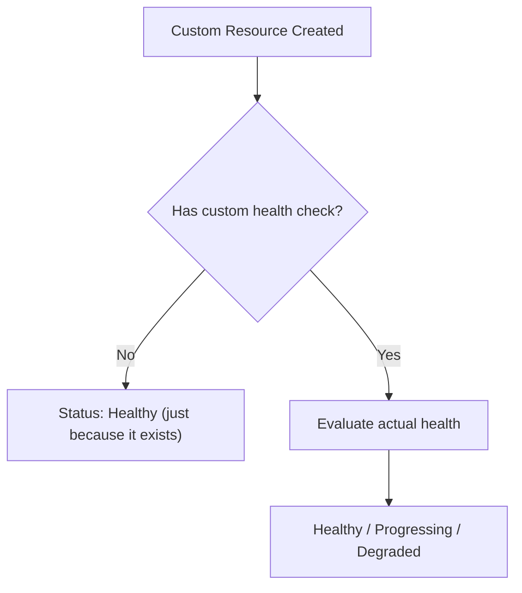

# How to Configure Custom Health Checks for CRDs in ArgoCD

Author: [nawazdhandala](https://github.com/nawazdhandala)

Tags: ArgoCD, GitOps, Kubernetes, CRD, Health Check

Description: Learn how to configure ArgoCD health checks for Custom Resource Definitions so custom resources report accurate health status instead of defaulting to Healthy.

---

When you deploy custom resources managed by Kubernetes operators, ArgoCD has no idea whether those resources are actually healthy. By default, if a custom resource exists in the cluster, ArgoCD reports it as Healthy. That means a failed database provisioning, a broken certificate, or a misconfigured queue all show green in your ArgoCD dashboard. This defeats the purpose of health monitoring.

This guide shows you how to write targeted health checks for your CRDs so ArgoCD accurately reflects the real state of every resource it manages.

## The Default CRD Health Problem

Without custom health checks:



This means your ArgoCD dashboard shows all green even when:
- A PostgreSQL cluster provisioned by Zalando Postgres Operator has a failed replica
- A Crossplane managed resource cannot provision cloud infrastructure
- A Strimzi Kafka cluster has brokers in error state
- A Vault secret sync is failing silently

## Setting Up CRD Health Checks

Health checks for CRDs are configured in the `argocd-cm` ConfigMap using Lua scripts:

```yaml
apiVersion: v1
kind: ConfigMap
metadata:
  name: argocd-cm
  namespace: argocd
data:
  resource.customizations.health.<api-group>_<kind>: |
    -- Lua script that returns health status
```

## Identifying CRD Status Patterns

Before writing a health check, examine the CRD's status structure:

```bash
# Get a sample resource to see its status fields
kubectl get <crd-kind> <name> -o json | jq '.status'

# Check the CRD's OpenAPI schema for status fields
kubectl get crd <crd-name> -o json | jq '.spec.versions[0].schema.openAPIV3Schema.properties.status'
```

Most CRDs follow one of these patterns:

### Pattern 1: Status Phase

```json
{
  "status": {
    "phase": "Running"
  }
}
```

### Pattern 2: Status Conditions

```json
{
  "status": {
    "conditions": [
      {
        "type": "Ready",
        "status": "True",
        "message": "All replicas are available"
      }
    ]
  }
}
```

### Pattern 3: Status State

```json
{
  "status": {
    "state": "active",
    "message": "Cluster is operational"
  }
}
```

### Pattern 4: Combined Phase and Conditions

```json
{
  "status": {
    "phase": "Running",
    "conditions": [
      {"type": "Ready", "status": "True"},
      {"type": "Initialized", "status": "True"}
    ]
  }
}
```

## Health Check Examples by CRD Type

### Zalando Postgres Operator (postgresql)

```yaml
resource.customizations.health.acid.zalan.do_postgresql: |
  hs = {}
  if obj.status == nil then
    hs.status = "Progressing"
    hs.message = "Waiting for PostgreSQL cluster status"
    return hs
  end
  if obj.status.PostgresClusterStatus == "Running" then
    hs.status = "Healthy"
    hs.message = "PostgreSQL cluster is running"
  elseif obj.status.PostgresClusterStatus == "Creating" or obj.status.PostgresClusterStatus == "Updating" then
    hs.status = "Progressing"
    hs.message = "PostgreSQL cluster is " .. obj.status.PostgresClusterStatus
  elseif obj.status.PostgresClusterStatus == "CreateFailed" or obj.status.PostgresClusterStatus == "UpdateFailed" then
    hs.status = "Degraded"
    hs.message = "PostgreSQL cluster failed: " .. (obj.status.PostgresClusterStatus or "unknown")
  else
    hs.status = "Progressing"
    hs.message = "PostgreSQL status: " .. (obj.status.PostgresClusterStatus or "unknown")
  end
  return hs
```

### Strimzi Kafka Cluster

```yaml
resource.customizations.health.kafka.strimzi.io_Kafka: |
  hs = {}
  if obj.status == nil or obj.status.conditions == nil then
    hs.status = "Progressing"
    hs.message = "Kafka cluster initializing"
    return hs
  end
  for i, condition in ipairs(obj.status.conditions) do
    if condition.type == "Ready" then
      if condition.status == "True" then
        hs.status = "Healthy"
        hs.message = "Kafka cluster is ready"
      else
        hs.status = "Degraded"
        hs.message = condition.message or "Kafka cluster is not ready"
      end
      return hs
    end
    if condition.type == "NotReady" then
      if condition.status == "True" then
        hs.status = "Progressing"
        hs.message = condition.message or "Kafka cluster is not yet ready"
        return hs
      end
    end
  end
  hs.status = "Progressing"
  hs.message = "Waiting for Ready condition"
  return hs
```

### Crossplane Managed Resources

Crossplane resources use a standard condition pattern across all providers:

```yaml
resource.customizations.health.database.aws.crossplane.io_RDSInstance: |
  hs = {}
  if obj.status == nil or obj.status.conditions == nil then
    hs.status = "Progressing"
    hs.message = "Waiting for resource conditions"
    return hs
  end
  local ready = false
  local synced = false
  local msg = ""
  for i, condition in ipairs(obj.status.conditions) do
    if condition.type == "Ready" then
      if condition.status == "True" then
        ready = true
      else
        msg = condition.message or "Not ready"
      end
    end
    if condition.type == "Synced" then
      if condition.status == "True" then
        synced = true
      else
        msg = condition.message or "Not synced"
      end
    end
  end
  if ready and synced then
    hs.status = "Healthy"
    hs.message = "Resource is ready and synced"
  elseif msg ~= "" then
    hs.status = "Degraded"
    hs.message = msg
  else
    hs.status = "Progressing"
    hs.message = "Waiting for Ready and Synced conditions"
  end
  return hs
```

### KEDA ScaledObject

```yaml
resource.customizations.health.keda.sh_ScaledObject: |
  hs = {}
  if obj.status == nil then
    hs.status = "Progressing"
    hs.message = "ScaledObject initializing"
    return hs
  end
  if obj.status.conditions ~= nil then
    for i, condition in ipairs(obj.status.conditions) do
      if condition.type == "Ready" then
        if condition.status == "True" then
          hs.status = "Healthy"
          hs.message = "ScaledObject is active"
        elseif condition.status == "False" then
          hs.status = "Degraded"
          hs.message = condition.message or "ScaledObject is not ready"
        else
          hs.status = "Progressing"
          hs.message = "ScaledObject status unknown"
        end
        return hs
      end
    end
  end
  -- Check for paused state
  if obj.metadata.annotations ~= nil then
    if obj.metadata.annotations["autoscaling.keda.sh/paused"] == "true" then
      hs.status = "Suspended"
      hs.message = "ScaledObject is paused"
      return hs
    end
  end
  hs.status = "Progressing"
  hs.message = "Waiting for status"
  return hs
```

### Flux Kustomization (for mixed GitOps)

If you use Flux alongside ArgoCD:

```yaml
resource.customizations.health.kustomize.toolkit.fluxcd.io_Kustomization: |
  hs = {}
  if obj.status == nil or obj.status.conditions == nil then
    hs.status = "Progressing"
    hs.message = "Reconciling"
    return hs
  end
  for i, condition in ipairs(obj.status.conditions) do
    if condition.type == "Ready" then
      if condition.status == "True" then
        hs.status = "Healthy"
        hs.message = "Reconciliation succeeded"
      elseif condition.status == "False" then
        if condition.reason == "Progressing" then
          hs.status = "Progressing"
        else
          hs.status = "Degraded"
        end
        hs.message = condition.message or "Not ready"
      end
      return hs
    end
  end
  hs.status = "Progressing"
  return hs
```

## Generic Health Check for Condition-Based CRDs

If you have many CRDs that all use the standard conditions pattern, you can create a generic check:

```yaml
# Apply this pattern for each CRD kind
resource.customizations.health.<group>_<kind>: |
  hs = {}
  if obj.status == nil or obj.status.conditions == nil then
    hs.status = "Progressing"
    hs.message = "Waiting for status"
    return hs
  end
  for i, condition in ipairs(obj.status.conditions) do
    if condition.type == "Ready" or condition.type == "Available" then
      if condition.status == "True" then
        hs.status = "Healthy"
        hs.message = condition.message or "Ready"
        return hs
      end
    end
  end
  -- Check for explicit failure conditions
  for i, condition in ipairs(obj.status.conditions) do
    if condition.status == "False" and condition.type ~= "Progressing" then
      hs.status = "Degraded"
      hs.message = condition.type .. ": " .. (condition.message or "failed")
      return hs
    end
  end
  hs.status = "Progressing"
  hs.message = "Waiting for Ready condition"
  return hs
```

## Overriding Built-in Health Checks

You can override ArgoCD's built-in health checks if they do not work for your use case:

```yaml
# Override the built-in Deployment health check
resource.customizations.health.apps_Deployment: |
  hs = {}
  if obj.status == nil then
    hs.status = "Progressing"
    return hs
  end
  -- Custom logic here
  -- For example, consider 0 replicas as Suspended instead of Healthy
  if obj.spec.replicas ~= nil and obj.spec.replicas == 0 then
    hs.status = "Suspended"
    hs.message = "Scaled to zero"
    return hs
  end
  -- Fall through to standard checks
  if obj.status.availableReplicas == obj.spec.replicas then
    hs.status = "Healthy"
  else
    hs.status = "Progressing"
  end
  hs.message = (obj.status.availableReplicas or 0) .. "/" .. (obj.spec.replicas or 0) .. " available"
  return hs
```

## Testing Health Checks

```bash
# Get a resource's current status
kubectl get myresource test -o json | jq '.status'

# After applying the health check, verify ArgoCD sees the correct health
argocd app get my-app -o json | \
  jq '.status.resources[] | select(.kind == "MyResource") | .health'

# Check for Lua errors in controller logs
kubectl logs -n argocd deployment/argocd-application-controller | \
  grep -i "error.*lua\|lua.*error" | tail -10
```

## Best Practices

1. **Start with the resource's actual status fields** - Always examine `kubectl get <resource> -o json | jq '.status'` first
2. **Handle nil safely** - Resources may not have status immediately
3. **Check observed generation** - Ensure the operator has processed the latest spec
4. **Use meaningful messages** - Include the actual error message from the resource status
5. **Test edge cases** - New resources with no status, resources in error, resources being deleted
6. **Document your health checks** - Add comments in the Lua script explaining the logic

For the Lua scripting fundamentals, see [How to Write Custom Health Check Scripts in Lua](https://oneuptime.com/blog/post/2026-02-26-argocd-custom-health-check-lua/view). For specific resource health checks, see the health check guides for [Argo Rollouts](https://oneuptime.com/blog/post/2026-02-26-argocd-health-checks-argo-rollouts/view) and [cert-manager](https://oneuptime.com/blog/post/2026-02-26-argocd-health-checks-cert-manager/view).
