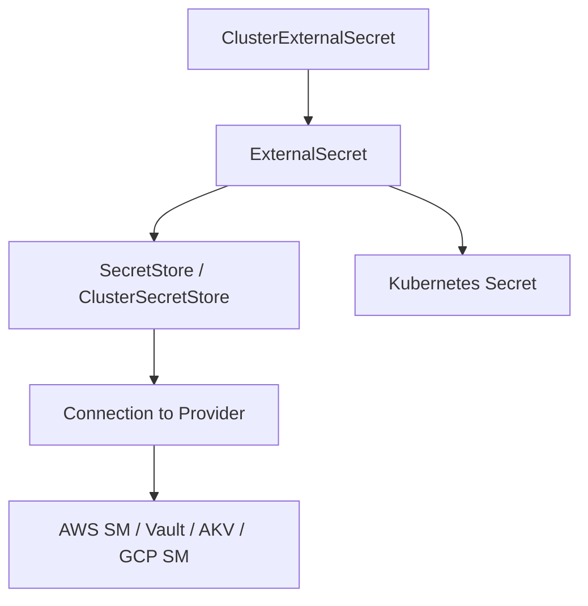

# How to Configure Health Checks for External Secrets in ArgoCD

Author: [nawazdhandala](https://github.com/nawazdhandala)

Tags: ArgoCD, GitOps, Kubernetes, External Secrets, Health Check

Description: Learn how to configure ArgoCD health checks for External Secrets Operator resources to detect secret sync failures and provider connectivity issues.

---

The External Secrets Operator (ESO) synchronizes secrets from external providers like AWS Secrets Manager, HashiCorp Vault, Azure Key Vault, and Google Secret Manager into Kubernetes Secrets. When an ExternalSecret fails to sync, your applications may start with stale or missing credentials. Without a proper health check, ArgoCD shows the ExternalSecret as healthy while your pods crash because the secret they reference does not exist or contains outdated data.

This guide provides health check configurations for all External Secrets Operator resource types.

## External Secrets Resource Types



The key resources to monitor:
- **SecretStore / ClusterSecretStore**: Connection to the external secrets provider
- **ExternalSecret**: Individual secret sync configuration
- **ClusterExternalSecret**: Cluster-wide external secret syncing to multiple namespaces

## ExternalSecret Health Check

This is the most important health check. It tells you whether secrets are syncing correctly:

```yaml
apiVersion: v1
kind: ConfigMap
metadata:
  name: argocd-cm
  namespace: argocd
data:
  resource.customizations.health.external-secrets.io_ExternalSecret: |
    hs = {}
    if obj.status == nil or obj.status.conditions == nil then
      hs.status = "Progressing"
      hs.message = "ExternalSecret is initializing"
      return hs
    end

    for i, condition in ipairs(obj.status.conditions) do
      if condition.type == "Ready" then
        if condition.status == "True" then
          hs.status = "Healthy"
          -- Include sync time if available
          if obj.status.refreshTime ~= nil then
            hs.message = "Secret synced successfully. Last refresh: " .. obj.status.refreshTime
          else
            hs.message = "Secret is synced"
          end
          return hs
        elseif condition.status == "False" then
          -- Check the reason for failure
          if condition.reason == "SecretSyncedError" then
            hs.status = "Degraded"
            hs.message = "Failed to sync secret: " .. (condition.message or "unknown error")
          elseif condition.reason == "SecretDeleted" then
            hs.status = "Degraded"
            hs.message = "Target secret was deleted"
          elseif condition.reason == "ProviderError" then
            hs.status = "Degraded"
            hs.message = "Provider error: " .. (condition.message or "cannot reach provider")
          else
            hs.status = "Degraded"
            hs.message = condition.message or "ExternalSecret is not ready"
          end
          return hs
        end
      end
    end

    hs.status = "Progressing"
    hs.message = "Waiting for sync status"
    return hs
```

## SecretStore Health Check

SecretStores define the connection to the external provider. If the SecretStore is unhealthy, all ExternalSecrets using it will fail:

```yaml
  resource.customizations.health.external-secrets.io_SecretStore: |
    hs = {}
    if obj.status == nil or obj.status.conditions == nil then
      hs.status = "Progressing"
      hs.message = "SecretStore is initializing"
      return hs
    end

    for i, condition in ipairs(obj.status.conditions) do
      if condition.type == "Ready" then
        if condition.status == "True" then
          hs.status = "Healthy"
          hs.message = "SecretStore is connected to provider"
          return hs
        elseif condition.status == "False" then
          hs.status = "Degraded"
          hs.message = condition.message or "SecretStore cannot connect to provider"
          return hs
        end
      end
    end

    hs.status = "Progressing"
    hs.message = "Validating provider connection"
    return hs
```

## ClusterSecretStore Health Check

Identical logic to SecretStore but for the cluster-scoped version:

```yaml
  resource.customizations.health.external-secrets.io_ClusterSecretStore: |
    hs = {}
    if obj.status == nil or obj.status.conditions == nil then
      hs.status = "Progressing"
      hs.message = "ClusterSecretStore is initializing"
      return hs
    end

    for i, condition in ipairs(obj.status.conditions) do
      if condition.type == "Ready" then
        if condition.status == "True" then
          hs.status = "Healthy"
          hs.message = "ClusterSecretStore is connected to provider"
          return hs
        elseif condition.status == "False" then
          hs.status = "Degraded"
          hs.message = condition.message or "ClusterSecretStore cannot connect to provider"
          return hs
        end
      end
    end

    hs.status = "Progressing"
    hs.message = "Validating provider connection"
    return hs
```

## ClusterExternalSecret Health Check

ClusterExternalSecrets create ExternalSecrets across multiple namespaces:

```yaml
  resource.customizations.health.external-secrets.io_ClusterExternalSecret: |
    hs = {}
    if obj.status == nil then
      hs.status = "Progressing"
      hs.message = "ClusterExternalSecret initializing"
      return hs
    end

    if obj.status.conditions ~= nil then
      for i, condition in ipairs(obj.status.conditions) do
        if condition.type == "Ready" then
          if condition.status == "True" then
            hs.status = "Healthy"
            hs.message = "All namespaced ExternalSecrets are synced"
            return hs
          else
            hs.status = "Degraded"
            hs.message = condition.message or "Some ExternalSecrets failed"
            return hs
          end
        end
      end
    end

    -- Check provisioned vs failed status
    if obj.status.provisionedCount ~= nil then
      local provisioned = obj.status.provisionedCount or 0
      local failed = obj.status.failedCount or 0
      if failed > 0 then
        hs.status = "Degraded"
        hs.message = provisioned .. " provisioned, " .. failed .. " failed"
      elseif provisioned > 0 then
        hs.status = "Healthy"
        hs.message = provisioned .. " ExternalSecrets provisioned"
      else
        hs.status = "Progressing"
        hs.message = "No ExternalSecrets provisioned yet"
      end
      return hs
    end

    hs.status = "Progressing"
    hs.message = "Waiting for status"
    return hs
```

## PushSecret Health Check

PushSecrets push Kubernetes secrets to external providers (reverse of ExternalSecret):

```yaml
  resource.customizations.health.external-secrets.io_PushSecret: |
    hs = {}
    if obj.status == nil or obj.status.conditions == nil then
      hs.status = "Progressing"
      hs.message = "PushSecret initializing"
      return hs
    end

    for i, condition in ipairs(obj.status.conditions) do
      if condition.type == "Ready" then
        if condition.status == "True" then
          hs.status = "Healthy"
          hs.message = "Secret pushed to provider"
        else
          hs.status = "Degraded"
          hs.message = condition.message or "Failed to push secret"
        end
        return hs
      end
    end

    hs.status = "Progressing"
    hs.message = "Pushing secret to provider"
    return hs
```

## Common ExternalSecret Failure Scenarios

### Provider Authentication Failure

The SecretStore cannot authenticate with the provider:

```bash
# Check SecretStore status
kubectl get secretstore my-store -n production -o yaml

# Common causes:
# - Expired credentials
# - Wrong IAM role
# - Network connectivity (VPC, firewall)
# - Provider API rate limiting
```

When this happens, the SecretStore health check returns Degraded, and all dependent ExternalSecrets also show Degraded.

### Secret Not Found in Provider

The external secret path does not exist:

```bash
# Check ExternalSecret events
kubectl events -n production --for externalsecret/my-secret

# Common causes:
# - Wrong secret path
# - Secret deleted from provider
# - Permission denied on specific secret
```

### Refresh Interval Issues

ExternalSecrets refresh on a schedule. If the refresh fails, the health degrades:

```yaml
apiVersion: external-secrets.io/v1beta1
kind: ExternalSecret
metadata:
  name: my-secret
spec:
  refreshInterval: 1h  # Syncs every hour
  secretStoreRef:
    name: my-store
    kind: SecretStore
  target:
    name: my-k8s-secret
  data:
    - secretKey: api-key
      remoteRef:
        key: /production/api-key
```

If the provider is temporarily unavailable, the health check shows Degraded until the next successful refresh.

## Monitoring ExternalSecret Health

### ArgoCD Dashboard

With health checks configured, the ArgoCD dashboard shows:
- Green heart: All secrets are synced
- Red broken heart: One or more secrets failed to sync
- Yellow spinner: Initial sync in progress

### Prometheus Alerts

External Secrets Operator exposes metrics you can alert on:

```yaml
apiVersion: monitoring.coreos.com/v1
kind: PrometheusRule
metadata:
  name: external-secrets-alerts
spec:
  groups:
    - name: external-secrets
      rules:
        - alert: ExternalSecretSyncFailed
          expr: externalsecret_sync_calls_total{status="error"} > 0
          for: 5m
          labels:
            severity: critical
          annotations:
            summary: "ExternalSecret sync failed for {{ $labels.name }}"
```

## Debugging ExternalSecret Health

```bash
# Check the ExternalSecret status
kubectl get externalsecret -n production -o wide

# Check the target Kubernetes Secret exists
kubectl get secret my-k8s-secret -n production

# Check ESO controller logs
kubectl logs -n external-secrets deployment/external-secrets | tail -50

# Check ArgoCD health reporting
argocd app get my-app -o json | \
  jq '.status.resources[] | select(.kind == "ExternalSecret") | .health'

# Force ArgoCD refresh
argocd app get my-app --hard-refresh
```

## Best Practices

1. **Monitor SecretStore health as a priority** - If the store is down, all dependent secrets fail
2. **Set up alerts for Degraded ExternalSecrets** - Secret sync failures can cause application outages
3. **Include refresh time in health messages** - Know when the last successful sync happened
4. **Use ClusterSecretStore for shared credentials** - Reduces the number of SecretStores to monitor
5. **Test with provider outages** - Verify your health checks correctly show Degraded when the provider is unreachable

For the Lua scripting reference, see [How to Write Custom Health Check Scripts in Lua](https://oneuptime.com/blog/post/2026-02-26-argocd-custom-health-check-lua/view). For other health checks, see [How to Configure Health Checks for Sealed Secrets](https://oneuptime.com/blog/post/2026-02-26-argocd-health-checks-sealed-secrets/view).
