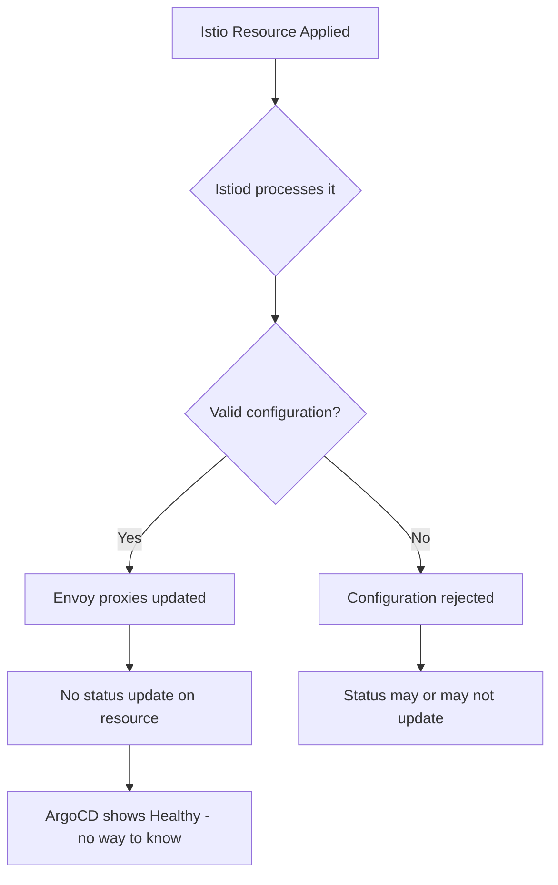

# How to Configure Health Checks for Istio VirtualService in ArgoCD

Author: [nawazdhandala](https://github.com/nawazdhandala)

Tags: ArgoCD, GitOps, Kubernetes, Istio, Health Checks

Description: Learn how to configure ArgoCD health checks for Istio VirtualService, Gateway, DestinationRule, and other Istio networking resources.

---

Istio's traffic management resources like VirtualService, Gateway, and DestinationRule do not have standard health status fields like Deployments do. By default, ArgoCD considers them healthy as long as they exist. This means a VirtualService with an invalid route configuration, a Gateway referencing a non-existent TLS secret, or a DestinationRule pointing to a service that does not exist all show as green in your ArgoCD dashboard.

This guide shows you how to write health checks for Istio resources that provide meaningful health information.

## The Istio Resource Health Challenge

Unlike most Kubernetes operators, Istio does not consistently populate status conditions on its networking resources. The Istiod control plane validates and processes configurations, but the feedback loop to resource status varies by Istio version and configuration.



Starting with Istio 1.17+, status reporting has improved with the `status.validationMessages` and `status.conditions` fields on some resources.

## VirtualService Health Check

For Istio versions that support status reporting:

```yaml
apiVersion: v1
kind: ConfigMap
metadata:
  name: argocd-cm
  namespace: argocd
data:
  resource.customizations.health.networking.istio.io_VirtualService: |
    hs = {}

    -- If status is nil, the resource exists but Istio may not report status
    -- In older Istio versions, this is normal
    if obj.status == nil then
      hs.status = "Healthy"
      hs.message = "VirtualService exists (no status reporting)"
      return hs
    end

    -- Check for validation messages (Istio 1.17+)
    if obj.status.validationMessages ~= nil then
      local hasErrors = false
      local errorMsg = ""
      for i, msg in ipairs(obj.status.validationMessages) do
        if msg.level == "ERROR" or msg.level == "WARNING" then
          hasErrors = true
          if errorMsg ~= "" then
            errorMsg = errorMsg .. "; "
          end
          errorMsg = errorMsg .. (msg.message or msg.type or "validation issue")
        end
      end
      if hasErrors then
        hs.status = "Degraded"
        hs.message = errorMsg
        return hs
      end
    end

    -- Check conditions (Istio 1.22+)
    if obj.status.conditions ~= nil then
      for i, condition in ipairs(obj.status.conditions) do
        if condition.type == "Reconciled" then
          if condition.status == "True" then
            hs.status = "Healthy"
            hs.message = "VirtualService is reconciled"
            return hs
          elseif condition.status == "False" then
            hs.status = "Degraded"
            hs.message = condition.message or "Reconciliation failed"
            return hs
          end
        end
      end
    end

    -- Check observedGeneration
    if obj.status.observedGeneration ~= nil and obj.metadata.generation ~= nil then
      if obj.status.observedGeneration == obj.metadata.generation then
        hs.status = "Healthy"
        hs.message = "VirtualService processed by Istiod"
      else
        hs.status = "Progressing"
        hs.message = "Waiting for Istiod to process changes"
      end
      return hs
    end

    hs.status = "Healthy"
    hs.message = "VirtualService exists"
    return hs
```

## Gateway Health Check

```yaml
  resource.customizations.health.networking.istio.io_Gateway: |
    hs = {}

    if obj.status == nil then
      hs.status = "Healthy"
      hs.message = "Gateway exists (no status reporting)"
      return hs
    end

    -- Check for validation messages
    if obj.status.validationMessages ~= nil then
      for i, msg in ipairs(obj.status.validationMessages) do
        if msg.level == "ERROR" then
          hs.status = "Degraded"
          hs.message = msg.message or "Gateway has validation errors"
          return hs
        end
      end
    end

    -- Check conditions
    if obj.status.conditions ~= nil then
      for i, condition in ipairs(obj.status.conditions) do
        if condition.type == "Reconciled" or condition.type == "Ready" then
          if condition.status == "True" then
            hs.status = "Healthy"
            hs.message = "Gateway is reconciled"
            return hs
          else
            hs.status = "Degraded"
            hs.message = condition.message or "Gateway is not ready"
            return hs
          end
        end
      end
    end

    hs.status = "Healthy"
    hs.message = "Gateway exists"
    return hs
```

## DestinationRule Health Check

```yaml
  resource.customizations.health.networking.istio.io_DestinationRule: |
    hs = {}

    if obj.status == nil then
      hs.status = "Healthy"
      hs.message = "DestinationRule exists"
      return hs
    end

    -- Check for validation issues
    if obj.status.validationMessages ~= nil then
      for i, msg in ipairs(obj.status.validationMessages) do
        if msg.level == "ERROR" then
          hs.status = "Degraded"
          hs.message = msg.message or "DestinationRule has validation errors"
          return hs
        end
      end
    end

    -- Check conditions
    if obj.status.conditions ~= nil then
      for i, condition in ipairs(obj.status.conditions) do
        if condition.type == "Reconciled" then
          if condition.status == "True" then
            hs.status = "Healthy"
            hs.message = "DestinationRule reconciled"
          else
            hs.status = "Degraded"
            hs.message = condition.message or "Reconciliation issue"
          end
          return hs
        end
      end
    end

    hs.status = "Healthy"
    hs.message = "DestinationRule exists"
    return hs
```

## ServiceEntry Health Check

```yaml
  resource.customizations.health.networking.istio.io_ServiceEntry: |
    hs = {}

    if obj.status == nil then
      hs.status = "Healthy"
      hs.message = "ServiceEntry exists"
      return hs
    end

    if obj.status.validationMessages ~= nil then
      for i, msg in ipairs(obj.status.validationMessages) do
        if msg.level == "ERROR" then
          hs.status = "Degraded"
          hs.message = msg.message or "ServiceEntry has validation errors"
          return hs
        end
      end
    end

    hs.status = "Healthy"
    hs.message = "ServiceEntry configured"
    return hs
```

## PeerAuthentication Health Check

```yaml
  resource.customizations.health.security.istio.io_PeerAuthentication: |
    hs = {}

    if obj.status == nil then
      hs.status = "Healthy"
      hs.message = "PeerAuthentication exists"
      return hs
    end

    if obj.status.conditions ~= nil then
      for i, condition in ipairs(obj.status.conditions) do
        if condition.type == "Reconciled" then
          if condition.status == "True" then
            hs.status = "Healthy"
            hs.message = "PeerAuthentication reconciled"
          else
            hs.status = "Degraded"
            hs.message = condition.message or "Not reconciled"
          end
          return hs
        end
      end
    end

    hs.status = "Healthy"
    hs.message = "PeerAuthentication configured"
    return hs
```

## AuthorizationPolicy Health Check

```yaml
  resource.customizations.health.security.istio.io_AuthorizationPolicy: |
    hs = {}

    if obj.status == nil then
      hs.status = "Healthy"
      hs.message = "AuthorizationPolicy exists"
      return hs
    end

    if obj.status.conditions ~= nil then
      for i, condition in ipairs(obj.status.conditions) do
        if condition.type == "Reconciled" then
          if condition.status == "True" then
            hs.status = "Healthy"
            hs.message = "AuthorizationPolicy reconciled"
          else
            hs.status = "Degraded"
            hs.message = condition.message or "Not reconciled"
          end
          return hs
        end
      end
    end

    hs.status = "Healthy"
    hs.message = "AuthorizationPolicy configured"
    return hs
```

## Kubernetes Gateway API Resources

If you use Istio with the Kubernetes Gateway API (replacing the Istio Gateway resource), the health checks are different:

```yaml
  resource.customizations.health.gateway.networking.k8s.io_Gateway: |
    hs = {}
    if obj.status == nil or obj.status.conditions == nil then
      hs.status = "Progressing"
      hs.message = "Gateway initializing"
      return hs
    end

    for i, condition in ipairs(obj.status.conditions) do
      if condition.type == "Accepted" then
        if condition.status == "True" then
          -- Check if also programmed
          for j, cond2 in ipairs(obj.status.conditions) do
            if cond2.type == "Programmed" and cond2.status == "True" then
              hs.status = "Healthy"
              hs.message = "Gateway is accepted and programmed"
              return hs
            end
          end
          hs.status = "Progressing"
          hs.message = "Gateway accepted, waiting for programming"
          return hs
        else
          hs.status = "Degraded"
          hs.message = condition.message or "Gateway not accepted"
          return hs
        end
      end
    end

    hs.status = "Progressing"
    hs.message = "Waiting for status"
    return hs

  resource.customizations.health.gateway.networking.k8s.io_HTTPRoute: |
    hs = {}
    if obj.status == nil or obj.status.parents == nil then
      hs.status = "Progressing"
      hs.message = "HTTPRoute initializing"
      return hs
    end

    local allAccepted = true
    local errorMsg = ""
    for i, parent in ipairs(obj.status.parents) do
      if parent.conditions ~= nil then
        for j, condition in ipairs(parent.conditions) do
          if condition.type == "Accepted" and condition.status ~= "True" then
            allAccepted = false
            errorMsg = condition.message or "Not accepted by parent"
          end
        end
      end
    end

    if allAccepted then
      hs.status = "Healthy"
      hs.message = "HTTPRoute accepted by all parent gateways"
    else
      hs.status = "Degraded"
      hs.message = errorMsg
    end
    return hs
```

## Supplementing Health Checks with Istio Analysis

Since Istio's status reporting is not always comprehensive, supplement health checks with `istioctl analyze`:

```bash
# Analyze Istio configuration for problems
istioctl analyze -n production

# Common issues detected:
# - VirtualService routing to non-existent Service
# - Gateway referencing non-existent Secret for TLS
# - DestinationRule with subset referencing non-existent labels
# - Conflicting VirtualServices
```

Consider running `istioctl analyze` as a PostSync hook in ArgoCD:

```yaml
apiVersion: batch/v1
kind: Job
metadata:
  name: istio-analyze
  annotations:
    argocd.argoproj.io/hook: PostSync
    argocd.argoproj.io/hook-delete-policy: BeforeHookCreation
spec:
  template:
    spec:
      containers:
        - name: analyze
          image: istio/istioctl:1.22
          command:
            - istioctl
            - analyze
            - -n
            - production
            - --failure-threshold
            - Error
      restartPolicy: Never
```

## Best Practices

1. **Accept limitations** - Older Istio versions have minimal status reporting; health checks may be limited to existence checks
2. **Upgrade Istio for better status** - Istio 1.17+ has improved validation messages and status conditions
3. **Use istioctl analyze** - Supplement ArgoCD health checks with Istio's built-in analysis tool
4. **Monitor envoy proxy health** - VirtualService health does not tell you if the actual proxy routing is working
5. **Test with invalid configurations** - Verify your health checks correctly catch misconfigurations

For the Lua scripting reference, see [How to Write Custom Health Check Scripts in Lua](https://oneuptime.com/blog/post/2026-02-26-argocd-custom-health-check-lua/view). For health checks for other CRDs, see [How to Configure Health Checks for CRDs](https://oneuptime.com/blog/post/2026-02-26-argocd-health-checks-crds/view).
