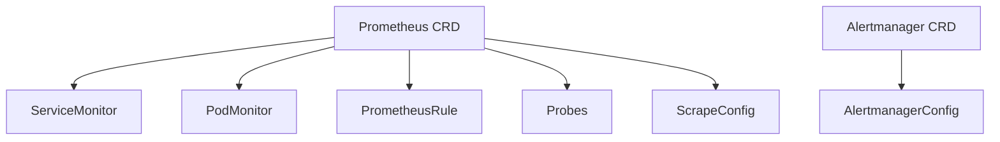

# How to Configure Health Checks for Prometheus ServiceMonitor in ArgoCD

Author: [nawazdhandala](https://github.com/nawazdhandala)

Tags: ArgoCD, GitOps, Kubernetes, Prometheus, Health Check

Description: Learn how to configure ArgoCD health checks for Prometheus Operator resources including ServiceMonitor, PodMonitor, PrometheusRule, and Alertmanager.

---

The Prometheus Operator manages Prometheus instances, alerting rules, and monitoring targets through Kubernetes custom resources. ServiceMonitors, PodMonitors, PrometheusRules, and Alertmanager configurations are all CRDs that ArgoCD manages but cannot assess health for by default. A ServiceMonitor that targets a non-existent service, a PrometheusRule with invalid PromQL, or an Alertmanager with broken configuration all show as healthy in ArgoCD simply because they exist.

This guide provides health check configurations for Prometheus Operator resources and strategies for detecting monitoring configuration problems.

## Prometheus Operator Resource Types



## The ServiceMonitor Health Challenge

ServiceMonitors do not have a status subresource in most versions of the Prometheus Operator. The Prometheus server discovers ServiceMonitors through label selectors and configures scrape targets, but it does not write back status to the ServiceMonitor resource.

This means health checks for ServiceMonitors are fundamentally limited. However, we can still add some value.

## ServiceMonitor Health Check

Since ServiceMonitors lack status fields, we check for basic validity indicators:

```yaml
apiVersion: v1
kind: ConfigMap
metadata:
  name: argocd-cm
  namespace: argocd
data:
  resource.customizations.health.monitoring.coreos.com_ServiceMonitor: |
    hs = {}

    -- ServiceMonitors don't have status in most Prometheus Operator versions
    -- We can check if the resource spec looks valid

    if obj.spec == nil then
      hs.status = "Degraded"
      hs.message = "ServiceMonitor has no spec"
      return hs
    end

    -- Check if endpoints are defined
    if obj.spec.endpoints == nil or #obj.spec.endpoints == 0 then
      hs.status = "Degraded"
      hs.message = "ServiceMonitor has no endpoints defined"
      return hs
    end

    -- Check if selector is defined
    if obj.spec.selector == nil then
      hs.status = "Degraded"
      hs.message = "ServiceMonitor has no selector - cannot match any Service"
      return hs
    end

    -- If status exists (newer Prometheus Operator versions)
    if obj.status ~= nil then
      if obj.status.conditions ~= nil then
        for i, condition in ipairs(obj.status.conditions) do
          if condition.type == "Reconciled" or condition.type == "Available" then
            if condition.status == "True" then
              hs.status = "Healthy"
              hs.message = "ServiceMonitor is reconciled by Prometheus"
              return hs
            else
              hs.status = "Degraded"
              hs.message = condition.message or "Reconciliation issue"
              return hs
            end
          end
        end
      end
    end

    -- Default: resource exists with valid spec
    hs.status = "Healthy"
    hs.message = "ServiceMonitor configured with " .. #obj.spec.endpoints .. " endpoint(s)"
    return hs
```

## PodMonitor Health Check

PodMonitors have the same limitations as ServiceMonitors:

```yaml
  resource.customizations.health.monitoring.coreos.com_PodMonitor: |
    hs = {}

    if obj.spec == nil then
      hs.status = "Degraded"
      hs.message = "PodMonitor has no spec"
      return hs
    end

    if obj.spec.podMetricsEndpoints == nil or #obj.spec.podMetricsEndpoints == 0 then
      hs.status = "Degraded"
      hs.message = "PodMonitor has no pod metrics endpoints defined"
      return hs
    end

    if obj.spec.selector == nil then
      hs.status = "Degraded"
      hs.message = "PodMonitor has no selector - cannot match any Pod"
      return hs
    end

    -- Check for status if available
    if obj.status ~= nil and obj.status.conditions ~= nil then
      for i, condition in ipairs(obj.status.conditions) do
        if condition.type == "Reconciled" then
          if condition.status == "True" then
            hs.status = "Healthy"
            hs.message = "PodMonitor reconciled"
            return hs
          else
            hs.status = "Degraded"
            hs.message = condition.message or "Not reconciled"
            return hs
          end
        end
      end
    end

    hs.status = "Healthy"
    hs.message = "PodMonitor configured with " .. #obj.spec.podMetricsEndpoints .. " endpoint(s)"
    return hs
```

## PrometheusRule Health Check

PrometheusRules define alerting and recording rules. Invalid PromQL in a rule group can cause Prometheus to reject the entire rule file:

```yaml
  resource.customizations.health.monitoring.coreos.com_PrometheusRule: |
    hs = {}

    if obj.spec == nil then
      hs.status = "Degraded"
      hs.message = "PrometheusRule has no spec"
      return hs
    end

    if obj.spec.groups == nil or #obj.spec.groups == 0 then
      hs.status = "Degraded"
      hs.message = "PrometheusRule has no rule groups"
      return hs
    end

    -- Count rules for informative message
    local totalRules = 0
    for i, group in ipairs(obj.spec.groups) do
      if group.rules ~= nil then
        totalRules = totalRules + #group.rules
      end
    end

    -- Check status if available (newer operator versions)
    if obj.status ~= nil and obj.status.conditions ~= nil then
      for i, condition in ipairs(obj.status.conditions) do
        if condition.type == "Available" or condition.type == "Reconciled" then
          if condition.status == "True" then
            hs.status = "Healthy"
            hs.message = totalRules .. " rules in " .. #obj.spec.groups .. " group(s) - reconciled"
            return hs
          else
            hs.status = "Degraded"
            hs.message = condition.message or "Rules not reconciled"
            return hs
          end
        end
      end
    end

    hs.status = "Healthy"
    hs.message = totalRules .. " rules in " .. #obj.spec.groups .. " group(s)"
    return hs
```

## Prometheus Instance Health Check

The Prometheus CRD itself has better status reporting:

```yaml
  resource.customizations.health.monitoring.coreos.com_Prometheus: |
    hs = {}
    if obj.status == nil then
      hs.status = "Progressing"
      hs.message = "Prometheus instance initializing"
      return hs
    end

    -- Check conditions
    if obj.status.conditions ~= nil then
      for i, condition in ipairs(obj.status.conditions) do
        if condition.type == "Available" then
          if condition.status == "True" then
            hs.status = "Healthy"
            -- Include replica info
            local replicas = obj.status.availableReplicas or 0
            hs.message = "Prometheus available with " .. replicas .. " replica(s)"
            return hs
          else
            hs.status = "Degraded"
            hs.message = condition.message or "Prometheus not available"
            return hs
          end
        end
        if condition.type == "Reconciled" and condition.status == "False" then
          hs.status = "Degraded"
          hs.message = condition.message or "Reconciliation failed"
          return hs
        end
      end
    end

    -- Fall back to replica count
    if obj.status.availableReplicas ~= nil and obj.status.availableReplicas > 0 then
      hs.status = "Healthy"
      hs.message = obj.status.availableReplicas .. " replica(s) available"
    elseif obj.status.updatedReplicas ~= nil and obj.status.updatedReplicas > 0 then
      hs.status = "Progressing"
      hs.message = "Replicas updating"
    else
      hs.status = "Progressing"
      hs.message = "Waiting for replicas"
    end
    return hs
```

## Alertmanager Instance Health Check

```yaml
  resource.customizations.health.monitoring.coreos.com_Alertmanager: |
    hs = {}
    if obj.status == nil then
      hs.status = "Progressing"
      hs.message = "Alertmanager initializing"
      return hs
    end

    -- Check conditions
    if obj.status.conditions ~= nil then
      for i, condition in ipairs(obj.status.conditions) do
        if condition.type == "Available" then
          if condition.status == "True" then
            hs.status = "Healthy"
            local replicas = obj.status.availableReplicas or 0
            hs.message = "Alertmanager available with " .. replicas .. " replica(s)"
            return hs
          else
            hs.status = "Degraded"
            hs.message = condition.message or "Alertmanager not available"
            return hs
          end
        end
      end
    end

    -- Fall back to replica count
    if obj.status.availableReplicas ~= nil and obj.status.availableReplicas > 0 then
      hs.status = "Healthy"
      hs.message = obj.status.availableReplicas .. " replica(s) available"
    else
      hs.status = "Progressing"
      hs.message = "Waiting for replicas"
    end
    return hs
```

## AlertmanagerConfig Health Check

```yaml
  resource.customizations.health.monitoring.coreos.com_AlertmanagerConfig: |
    hs = {}
    if obj.spec == nil then
      hs.status = "Degraded"
      hs.message = "AlertmanagerConfig has no spec"
      return hs
    end

    -- Check status if available
    if obj.status ~= nil and obj.status.conditions ~= nil then
      for i, condition in ipairs(obj.status.conditions) do
        if condition.type == "Ready" or condition.type == "Reconciled" then
          if condition.status == "True" then
            hs.status = "Healthy"
            hs.message = "AlertmanagerConfig reconciled"
            return hs
          else
            hs.status = "Degraded"
            hs.message = condition.message or "Config not reconciled"
            return hs
          end
        end
      end
    end

    -- Count receivers for informative message
    local receiverCount = 0
    if obj.spec.receivers ~= nil then
      receiverCount = #obj.spec.receivers
    end

    hs.status = "Healthy"
    hs.message = receiverCount .. " receiver(s) configured"
    return hs
```

## Supplementing Health Checks with Validation

Since ServiceMonitors and PrometheusRules have limited status reporting, add validation as a sync hook:

```yaml
apiVersion: batch/v1
kind: Job
metadata:
  name: validate-prometheus-rules
  annotations:
    argocd.argoproj.io/hook: PostSync
    argocd.argoproj.io/hook-delete-policy: BeforeHookCreation
spec:
  template:
    spec:
      containers:
        - name: validate
          image: prom/prometheus:latest
          command:
            - sh
            - -c
            - |
              # Validate all PrometheusRule resources
              for rule_file in /tmp/rules/*.yaml; do
                promtool check rules "$rule_file" || exit 1
              done
              echo "All rules validated successfully"
          volumeMounts:
            - name: rules
              mountPath: /tmp/rules
      volumes:
        - name: rules
          configMap:
            name: prometheus-rules-export
      restartPolicy: Never
```

## Verifying ServiceMonitor Targets in Prometheus

Even with health checks, you should verify that ServiceMonitors are actually producing scrape targets:

```bash
# Port-forward to Prometheus
kubectl port-forward -n monitoring svc/prometheus-operated 9090:9090

# Check targets in Prometheus UI
# Navigate to http://localhost:9090/targets

# Or query the API
curl -s http://localhost:9090/api/v1/targets | jq '.data.activeTargets[] | {
  scrapePool: .scrapePool,
  health: .health,
  lastScrape: .lastScrape,
  lastError: .lastError
}'
```

## Debugging Prometheus Operator Health

```bash
# Check if Prometheus has picked up the ServiceMonitor
kubectl get prometheus -n monitoring -o json | jq '.items[0].status'

# Check Prometheus operator logs for configuration errors
kubectl logs -n monitoring deployment/prometheus-operator | tail -50

# Check Prometheus server logs for scrape errors
kubectl logs -n monitoring prometheus-prometheus-0 -c prometheus | grep "error" | tail -20

# Verify ArgoCD health reporting
argocd app get my-monitoring -o json | \
  jq '.status.resources[] | select(.kind == "ServiceMonitor" or .kind == "PrometheusRule") | {kind, name, health}'
```

## Best Practices

1. **Accept the limitations** - ServiceMonitors and PodMonitors have minimal status reporting in most Prometheus Operator versions
2. **Validate PromQL** - Use promtool to validate PrometheusRules before deployment
3. **Monitor Prometheus targets** - The real health signal comes from the Prometheus targets endpoint
4. **Upgrade the Prometheus Operator** - Newer versions have better status reporting
5. **Use informative messages** - Even if health is always "Healthy," include useful information like rule count and endpoint count
6. **Set up meta-monitoring** - Monitor your monitoring. Alert if Prometheus cannot scrape its own targets

For the Lua scripting fundamentals, see [How to Write Custom Health Check Scripts in Lua](https://oneuptime.com/blog/post/2026-02-26-argocd-custom-health-check-lua/view). For health checks for other Kubernetes tools, see [How to Configure Health Checks for CRDs](https://oneuptime.com/blog/post/2026-02-26-argocd-health-checks-crds/view).
