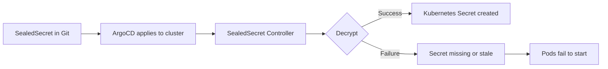
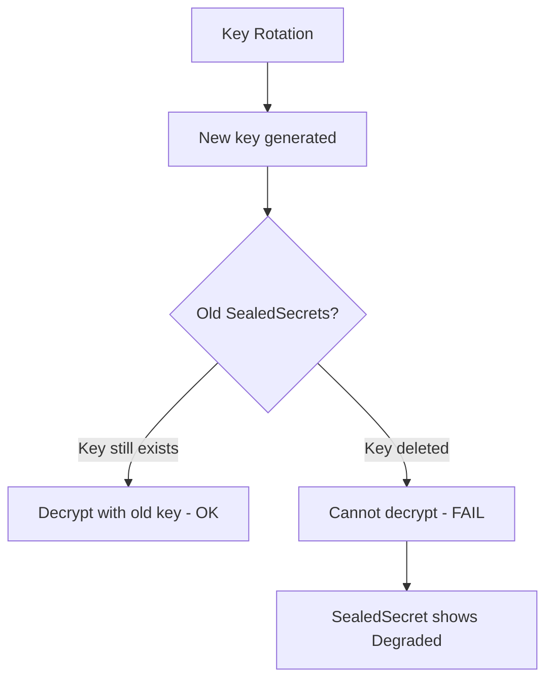

# How to Configure Health Checks for Sealed Secrets in ArgoCD

Author: [nawazdhandala](https://github.com/nawazdhandala)

Tags: ArgoCD, GitOps, Kubernetes, Sealed Secrets, Health Check

Description: Learn how to configure ArgoCD health checks for Bitnami Sealed Secrets to detect decryption failures and key rotation issues before they cause outages.

---

Bitnami Sealed Secrets lets you store encrypted secrets in Git. The SealedSecret controller decrypts them in the cluster and creates regular Kubernetes Secrets. When decryption fails - because of key rotation, wrong encryption key, or corrupted data - the resulting Kubernetes Secret is either missing or stale. Without a health check, ArgoCD reports the SealedSecret as healthy even when decryption has failed completely.

This guide provides health check configurations for SealedSecret resources and strategies for monitoring the decryption pipeline.

## How Sealed Secrets Work



The SealedSecret resource has a status section that indicates whether decryption succeeded or failed.

## SealedSecret Health Check

```yaml
apiVersion: v1
kind: ConfigMap
metadata:
  name: argocd-cm
  namespace: argocd
data:
  resource.customizations.health.bitnami.com_SealedSecret: |
    hs = {}
    if obj.status == nil or obj.status.conditions == nil then
      hs.status = "Progressing"
      hs.message = "SealedSecret is being decrypted"
      return hs
    end

    for i, condition in ipairs(obj.status.conditions) do
      if condition.type == "Synced" then
        if condition.status == "True" then
          hs.status = "Healthy"
          hs.message = "SealedSecret decrypted and synced successfully"
          return hs
        elseif condition.status == "False" then
          hs.status = "Degraded"
          hs.message = condition.message or "Failed to decrypt SealedSecret"
          return hs
        end
      end
    end

    -- If no Synced condition yet, check for other indicators
    -- Some versions use different condition formats
    for i, condition in ipairs(obj.status.conditions) do
      if condition.status == "False" then
        hs.status = "Degraded"
        hs.message = condition.type .. ": " .. (condition.message or "failed")
        return hs
      end
    end

    hs.status = "Progressing"
    hs.message = "Waiting for decryption status"
    return hs
```

## Understanding SealedSecret Status

The SealedSecret controller updates the status after processing:

### Successful Decryption

```yaml
status:
  conditions:
    - type: Synced
      status: "True"
      lastTransitionTime: "2026-02-26T10:00:00Z"
      reason: ""
      message: ""
  observedGeneration: 1
```

### Failed Decryption

```yaml
status:
  conditions:
    - type: Synced
      status: "False"
      lastTransitionTime: "2026-02-26T10:00:00Z"
      reason: "UnsealFailed"
      message: "no key could decrypt secret"
```

## Common Sealed Secret Failure Scenarios

### Wrong Encryption Key

The SealedSecret was encrypted with a key that the controller does not have:

```bash
# Check controller logs for decryption errors
kubectl logs -n kube-system deployment/sealed-secrets-controller | grep "error\|unseal"

# List available sealing keys
kubectl get secret -n kube-system -l sealedsecrets.bitnami.com/sealed-secrets-key

# Common causes:
# - SealedSecret created with a key from a different cluster
# - Key was rotated and old key was removed
# - SealedSecret was not re-encrypted after key rotation
```

### Key Rotation Issues

When the sealed-secrets controller rotates keys:



### Corrupted SealedSecret

If the encrypted data is corrupted (bad base64, truncated, etc.):

```bash
# Validate the SealedSecret locally
kubeseal --validate --controller-name sealed-secrets \
  --controller-namespace kube-system < sealed-secret.yaml
```

## Enhanced Health Check with Generation Tracking

A more sophisticated health check that also verifies the controller has processed the latest generation:

```yaml
  resource.customizations.health.bitnami.com_SealedSecret: |
    hs = {}
    if obj.status == nil then
      hs.status = "Progressing"
      hs.message = "SealedSecret waiting for controller processing"
      return hs
    end

    -- Check if controller has observed the latest generation
    if obj.status.observedGeneration ~= nil and obj.metadata.generation ~= nil then
      if obj.status.observedGeneration < obj.metadata.generation then
        hs.status = "Progressing"
        hs.message = "Controller has not processed the latest version"
        return hs
      end
    end

    if obj.status.conditions == nil then
      hs.status = "Progressing"
      hs.message = "Waiting for conditions"
      return hs
    end

    for i, condition in ipairs(obj.status.conditions) do
      if condition.type == "Synced" then
        if condition.status == "True" then
          hs.status = "Healthy"
          hs.message = "Decrypted and synced"
        else
          hs.status = "Degraded"
          if condition.reason == "UnsealFailed" then
            hs.message = "Decryption failed: " .. (condition.message or "no matching key")
          elseif condition.reason == "UpdateFailed" then
            hs.message = "Failed to update Secret: " .. (condition.message or "update error")
          else
            hs.message = condition.message or "Sync failed"
          end
        end
        return hs
      end
    end

    hs.status = "Progressing"
    hs.message = "Processing"
    return hs
```

## Verifying the Secret Was Created

The health check tells you if decryption succeeded, but you should also verify the resulting Kubernetes Secret exists:

```bash
# Check if the SealedSecret created its target Secret
kubectl get sealedsecret my-sealed-secret -n production -o jsonpath='{.metadata.name}'
kubectl get secret my-sealed-secret -n production

# If the Secret does not exist but the SealedSecret shows Synced: True,
# something else deleted the Secret
```

## Handling SealedSecret in ArgoCD Diff

SealedSecrets create Kubernetes Secrets that are not in your Git repo (the SealedSecret is in Git, not the decrypted Secret). You may want to ignore the generated Secret in ArgoCD's diff:

```yaml
# The generated Secret is managed by the SealedSecret controller
# ArgoCD should track the SealedSecret, not the resulting Secret
# If both are tracked, you may see diff warnings
```

## Monitoring SealedSecret Health at Scale

### Batch Health Check

```bash
# Check all SealedSecrets across the cluster
kubectl get sealedsecrets --all-namespaces -o json | jq '
  .items[] |
  {
    namespace: .metadata.namespace,
    name: .metadata.name,
    synced: (
      if .status.conditions != null then
        [.status.conditions[] | select(.type == "Synced")] | .[0].status
      else
        "Unknown"
      end
    )
  }'
```

### Prometheus Alerts

```yaml
apiVersion: monitoring.coreos.com/v1
kind: PrometheusRule
metadata:
  name: sealed-secrets-alerts
spec:
  groups:
    - name: sealed-secrets
      rules:
        - alert: SealedSecretUnsealFailed
          expr: sealed_secrets_controller_unseal_errors_total > 0
          for: 5m
          labels:
            severity: critical
          annotations:
            summary: "SealedSecret decryption failures detected"
```

## Re-encrypting After Key Rotation

When keys are rotated, re-encrypt all SealedSecrets:

```bash
# Fetch the latest public key
kubeseal --fetch-cert \
  --controller-name sealed-secrets \
  --controller-namespace kube-system > pub-cert.pem

# Re-encrypt each secret
for file in sealed-secrets/*.yaml; do
  # Extract the original secret data
  kubectl get sealedsecret $(basename $file .yaml) -n production -o json | \
    kubeseal --recovery-unseal --recovery-private-key backup-key.pem | \
    kubeseal --cert pub-cert.pem -o yaml > "$file"
done

# Commit and push
git add sealed-secrets/
git commit -m "Re-encrypt SealedSecrets with new key"
git push
```

## Debugging SealedSecret Health

```bash
# Check SealedSecret status
kubectl get sealedsecret my-secret -n production -o yaml

# Check controller logs
kubectl logs -n kube-system deployment/sealed-secrets-controller --tail=50

# Check events
kubectl events -n production --for sealedsecret/my-secret

# Verify ArgoCD health reporting
argocd app get my-app -o json | \
  jq '.status.resources[] | select(.kind == "SealedSecret") | .health'

# Force ArgoCD refresh
argocd app get my-app --hard-refresh
```

## Best Practices

1. **Always configure the health check** - Default "Healthy if exists" is dangerous for secrets
2. **Monitor decryption failures immediately** - Failed secrets cause pod startup failures
3. **Keep old keys during rotation** - Do not delete old keys until all SealedSecrets are re-encrypted
4. **Test key rotation in staging** - Verify all SealedSecrets can be decrypted with the new key
5. **Set up alerts for Degraded status** - Secret failures are critical and need immediate attention
6. **Backup sealing keys** - Store key backups securely outside the cluster

For the Lua scripting reference, see [How to Write Custom Health Check Scripts in Lua](https://oneuptime.com/blog/post/2026-02-26-argocd-custom-health-check-lua/view). For other secret management health checks, see [How to Configure Health Checks for External Secrets](https://oneuptime.com/blog/post/2026-02-26-argocd-health-checks-external-secrets/view).
