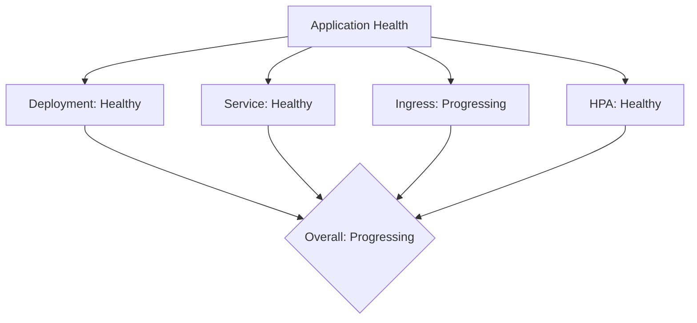

# How to Get Application Health Status in CI Scripts

Author: [nawazdhandala](https://github.com/nawazdhandala)

Tags: ArgoCD, GitOps, Kubernetes, CI/CD, Monitoring

Description: Learn how to retrieve and interpret ArgoCD application health status in CI scripts using the CLI and REST API for deployment gates and automated decisions.

---

Knowing the health status of your ArgoCD applications is critical for CI/CD automation. You might need to gate a production deployment on the health of staging, run integration tests only when the app is healthy, or send status updates to pull requests. This guide shows you how to programmatically retrieve and use ArgoCD health information in CI scripts.

## Understanding ArgoCD Health Statuses

ArgoCD reports these health statuses for applications:

| Status | Meaning |
|--------|---------|
| **Healthy** | All resources are running correctly |
| **Progressing** | Resources are being updated (e.g., rollout in progress) |
| **Degraded** | One or more resources have failed |
| **Suspended** | Application is suspended (e.g., paused rollout) |
| **Missing** | Resources are not yet created |
| **Unknown** | Health cannot be determined |

Each resource within the application also has its own health status. The application-level health is an aggregate of all resource health statuses.



## Getting Health Status with ArgoCD CLI

### Basic Health Check

```bash
# Get application status in a format suitable for scripting
argocd app get my-app \
  --server $ARGOCD_SERVER \
  --auth-token $ARGOCD_TOKEN \
  --grpc-web \
  -o json | jq -r '.status.health.status'
```

Output: `Healthy`, `Progressing`, `Degraded`, etc.

### Detailed Health with Resource Breakdown

```bash
# Get health status of each resource in the application
argocd app get my-app \
  --server $ARGOCD_SERVER \
  --auth-token $ARGOCD_TOKEN \
  --grpc-web \
  -o json | jq -r '
    .status.resources[] |
    "\(.kind)/\(.name): \(.health.status // "N/A") - \(.health.message // "OK")"
  '
```

Example output:

```text
Deployment/my-app: Healthy - OK
Service/my-app: Healthy - OK
Ingress/my-app: Healthy - OK
ConfigMap/my-app-config: N/A - OK
HorizontalPodAutoscaler/my-app: Healthy - OK
```

## Getting Health Status via REST API

### Simple Health Check

```bash
#!/bin/bash
# get-health.sh - Get application health status

APP_NAME="${1:?Usage: $0 <app-name>}"

HEALTH=$(curl -sf \
  -H "Authorization: Bearer $ARGOCD_TOKEN" \
  "https://$ARGOCD_SERVER/api/v1/applications/$APP_NAME" | \
  jq -r '.status.health.status')

echo "$HEALTH"
```

### Comprehensive Status Report

```bash
#!/bin/bash
# app-status-report.sh - Generate a comprehensive status report for CI

APP_NAME="${1:?Usage: $0 <app-name>}"

RESPONSE=$(curl -sf \
  -H "Authorization: Bearer $ARGOCD_TOKEN" \
  "https://$ARGOCD_SERVER/api/v1/applications/$APP_NAME")

# Extract all relevant status fields
SYNC_STATUS=$(echo "$RESPONSE" | jq -r '.status.sync.status')
HEALTH_STATUS=$(echo "$RESPONSE" | jq -r '.status.health.status')
SYNC_REVISION=$(echo "$RESPONSE" | jq -r '.status.sync.revision')
OP_PHASE=$(echo "$RESPONSE" | jq -r '.status.operationState.phase // "N/A"')
OP_MESSAGE=$(echo "$RESPONSE" | jq -r '.status.operationState.message // "N/A"')
STARTED_AT=$(echo "$RESPONSE" | jq -r '.status.operationState.startedAt // "N/A"')
FINISHED_AT=$(echo "$RESPONSE" | jq -r '.status.operationState.finishedAt // "N/A"')

# Count resources by health status
HEALTHY_COUNT=$(echo "$RESPONSE" | jq '[.status.resources[] | select(.health.status == "Healthy")] | length')
DEGRADED_COUNT=$(echo "$RESPONSE" | jq '[.status.resources[] | select(.health.status == "Degraded")] | length')
PROGRESSING_COUNT=$(echo "$RESPONSE" | jq '[.status.resources[] | select(.health.status == "Progressing")] | length')
TOTAL_COUNT=$(echo "$RESPONSE" | jq '.status.resources | length')

echo "=== Application Status Report: $APP_NAME ==="
echo "Sync Status:     $SYNC_STATUS"
echo "Health Status:   $HEALTH_STATUS"
echo "Git Revision:    ${SYNC_REVISION:0:7}"
echo "Operation:       $OP_PHASE"
echo "Started:         $STARTED_AT"
echo "Finished:        $FINISHED_AT"
echo "Message:         $OP_MESSAGE"
echo ""
echo "Resources: $TOTAL_COUNT total"
echo "  Healthy:       $HEALTHY_COUNT"
echo "  Degraded:      $DEGRADED_COUNT"
echo "  Progressing:   $PROGRESSING_COUNT"

# List degraded resources if any
if [ "$DEGRADED_COUNT" -gt 0 ]; then
  echo ""
  echo "Degraded Resources:"
  echo "$RESPONSE" | jq -r '
    .status.resources[] |
    select(.health.status == "Degraded") |
    "  - \(.kind)/\(.name): \(.health.message // "Unknown reason")"
  '
fi
```

## Using Health Status as CI Gates

### Deployment Gate Script

Use health status to gate deployments. For example, only deploy to production if staging is healthy.

```bash
#!/bin/bash
# deployment-gate.sh - Gate production deployment on staging health

STAGING_APP="my-app-staging"
PRODUCTION_APP="my-app-production"

echo "Checking staging health before production deployment..."

STAGING_HEALTH=$(curl -sf \
  -H "Authorization: Bearer $ARGOCD_TOKEN" \
  "https://$ARGOCD_SERVER/api/v1/applications/$STAGING_APP" | \
  jq -r '.status.health.status')

case "$STAGING_HEALTH" in
  "Healthy")
    echo "Staging is healthy. Proceeding with production deployment."
    argocd app sync $PRODUCTION_APP \
      --server $ARGOCD_SERVER \
      --auth-token $ARGOCD_TOKEN \
      --grpc-web
    ;;
  "Progressing")
    echo "Staging is still progressing. Waiting..."
    argocd app wait $STAGING_APP \
      --server $ARGOCD_SERVER \
      --auth-token $ARGOCD_TOKEN \
      --grpc-web \
      --health \
      --timeout 300
    # Retry the gate check
    exec "$0"
    ;;
  *)
    echo "Staging is $STAGING_HEALTH. Blocking production deployment."
    exit 1
    ;;
esac
```

### GitHub Actions Health Gate

```yaml
name: Production Deploy
on:
  workflow_dispatch:

jobs:
  check-staging:
    runs-on: ubuntu-latest
    outputs:
      staging-health: ${{ steps.check.outputs.health }}
    steps:
      - name: Check staging health
        id: check
        env:
          ARGOCD_SERVER: ${{ secrets.ARGOCD_SERVER }}
          ARGOCD_TOKEN: ${{ secrets.ARGOCD_TOKEN }}
        run: |
          HEALTH=$(curl -sf \
            -H "Authorization: Bearer $ARGOCD_TOKEN" \
            "https://$ARGOCD_SERVER/api/v1/applications/my-app-staging" | \
            jq -r '.status.health.status')
          echo "health=$HEALTH" >> $GITHUB_OUTPUT
          echo "Staging health: $HEALTH"

  deploy-production:
    needs: check-staging
    if: needs.check-staging.outputs.staging-health == 'Healthy'
    runs-on: ubuntu-latest
    steps:
      - name: Deploy to production
        run: |
          echo "Staging is healthy, deploying to production..."
          # deployment steps here
```

## Monitoring Multiple Applications

When you manage many applications, you might want to check them all at once.

```bash
#!/bin/bash
# check-all-apps.sh - Check health of all applications in a project

PROJECT="${1:-default}"

# Get all applications in the project
APPS=$(curl -sf \
  -H "Authorization: Bearer $ARGOCD_TOKEN" \
  "https://$ARGOCD_SERVER/api/v1/applications?project=$PROJECT" | \
  jq -r '.items[].metadata.name')

UNHEALTHY=0
for app in $APPS; do
  HEALTH=$(curl -sf \
    -H "Authorization: Bearer $ARGOCD_TOKEN" \
    "https://$ARGOCD_SERVER/api/v1/applications/$app" | \
    jq -r '.status.health.status')

  if [ "$HEALTH" != "Healthy" ]; then
    echo "WARN: $app is $HEALTH"
    UNHEALTHY=$((UNHEALTHY + 1))
  else
    echo "OK:   $app is $HEALTH"
  fi
done

echo ""
echo "Summary: $UNHEALTHY unhealthy application(s) in project $PROJECT"
[ $UNHEALTHY -eq 0 ] || exit 1
```

## Posting Health Status to Pull Requests

You can post the deployment status back to GitHub pull requests using the GitHub API.

```bash
#!/bin/bash
# post-status-to-pr.sh - Post ArgoCD health to GitHub PR

HEALTH=$(curl -sf \
  -H "Authorization: Bearer $ARGOCD_TOKEN" \
  "https://$ARGOCD_SERVER/api/v1/applications/my-app-preview-$PR_NUMBER" | \
  jq -r '.status.health.status')

# Map ArgoCD health to GitHub status
case "$HEALTH" in
  "Healthy") STATE="success"; DESC="Deployment is healthy" ;;
  "Progressing") STATE="pending"; DESC="Deployment in progress" ;;
  *) STATE="failure"; DESC="Deployment health: $HEALTH" ;;
esac

# Post status to GitHub
curl -X POST \
  -H "Authorization: token $GITHUB_TOKEN" \
  -H "Content-Type: application/json" \
  "https://api.github.com/repos/$REPO/statuses/$COMMIT_SHA" \
  -d "{
    \"state\": \"$STATE\",
    \"description\": \"$DESC\",
    \"context\": \"argocd/health\",
    \"target_url\": \"https://$ARGOCD_SERVER/applications/my-app-preview-$PR_NUMBER\"
  }"
```

## Error Handling Patterns

Always handle network failures and unexpected responses:

```bash
# Robust health check with retries
get_health() {
  local app="$1"
  local retries=3
  local attempt=0

  while [ $attempt -lt $retries ]; do
    RESPONSE=$(curl -sf \
      -H "Authorization: Bearer $ARGOCD_TOKEN" \
      "https://$ARGOCD_SERVER/api/v1/applications/$app" 2>/dev/null)

    if [ $? -eq 0 ]; then
      echo "$RESPONSE" | jq -r '.status.health.status'
      return 0
    fi

    attempt=$((attempt + 1))
    echo "Retry $attempt/$retries..." >&2
    sleep 5
  done

  echo "Unknown"
  return 1
}
```

For a complete view of your application health across all environments, consider integrating with OneUptime monitoring to track health status over time and get alerted on degradations.

Health status checks are the foundation of reliable CI/CD automation with ArgoCD. By integrating these checks into your pipelines, you can build deployment workflows that are both automated and safe.
