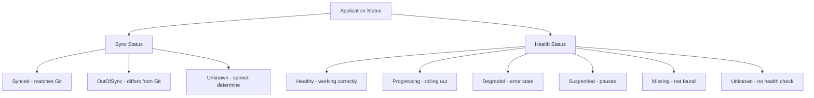
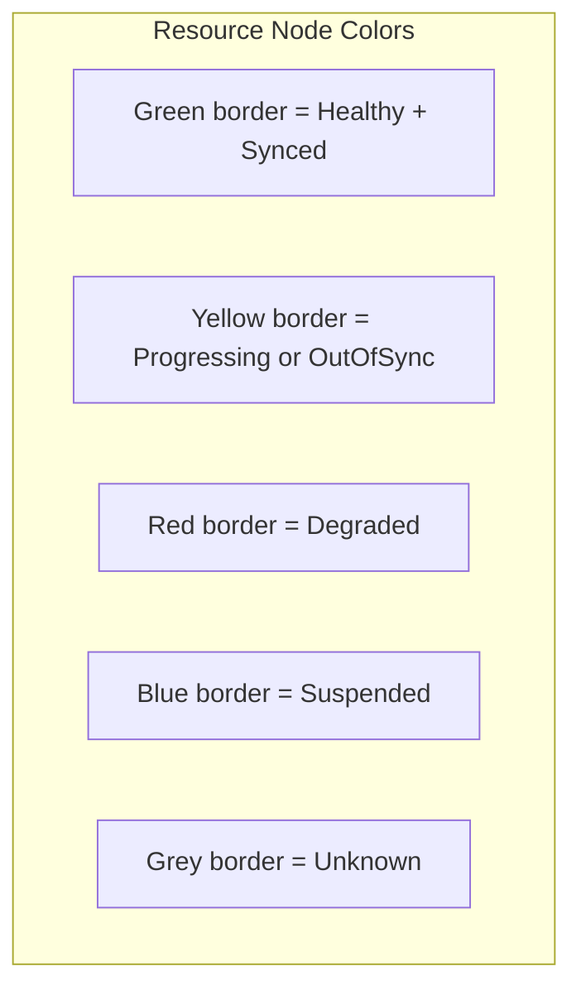
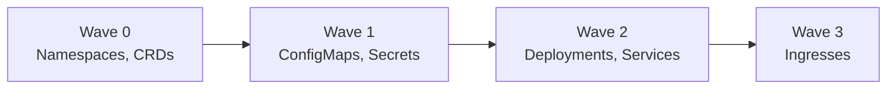

# How to Read Health Status Icons in ArgoCD UI

Author: [nawazdhandala](https://github.com/nawazdhandala)

Tags: ArgoCD, GitOps, Kubernetes, UI, Health Checks

Description: Learn how to interpret the health and sync status icons in the ArgoCD UI dashboard to quickly assess application state and identify problems.

---

The ArgoCD UI communicates a lot of information through icons, colors, and badges. For new users, the dashboard can feel overwhelming. What does the yellow circle mean? Why is there a red heart? What is the difference between the sync icon and the health icon? Understanding these visual indicators is essential for quickly assessing application health and catching problems before they escalate.

This guide maps every icon and color combination to its meaning, so you can read the ArgoCD dashboard at a glance.

## The Two Status Dimensions

Every ArgoCD application has two independent status dimensions:



These two statuses are independent. An application can be:
- **Synced + Healthy**: Everything matches Git and is working (ideal state)
- **Synced + Degraded**: Matches Git but something is broken (bad config in Git)
- **OutOfSync + Healthy**: Running fine but does not match Git (pending changes)
- **OutOfSync + Degraded**: Does not match Git and is broken (needs immediate attention)

## Application List View Icons

In the main application list, each application shows:

### Sync Status Icons

| Icon | Color | Status | Meaning |
|------|-------|--------|---------|
| Check mark (circle) | Green | Synced | Live state matches Git desired state |
| Circular arrows | Yellow | OutOfSync | Live state differs from Git desired state |
| Question mark | Grey | Unknown | Cannot determine sync status |

### Health Status Icons

| Icon | Color | Status | Meaning |
|------|-------|--------|---------|
| Heart | Green | Healthy | All resources are healthy |
| Spinning circle | Yellow | Progressing | Resources are being updated |
| Broken heart | Red | Degraded | One or more resources are in error state |
| Pause symbol | Blue | Suspended | Resources are paused (e.g., scaled to zero) |
| Warning triangle | Yellow | Missing | Resources are missing from the cluster |
| Question mark | Grey | Unknown | Cannot determine health |

## Application Detail View

When you click into an application, you see the resource tree. Each resource node shows its own health and sync status.

### Resource Tree Node Colors



### Resource Tree Layout

The resource tree shows parent-child relationships:

```
Application (my-app)
  |-- Deployment (my-app)
  |     |-- ReplicaSet (my-app-7d8f9)
  |           |-- Pod (my-app-7d8f9-abc12)
  |           |-- Pod (my-app-7d8f9-def34)
  |-- Service (my-app)
  |     |-- Endpoints (my-app)
  |-- ConfigMap (my-app-config)
```

Each node in the tree has its own health icon and sync badge.

## Sync Operation Status

During a sync operation, additional icons appear:

| Icon | Meaning |
|------|---------|
| Spinning blue circle | Sync in progress |
| Green check | Sync succeeded |
| Red X | Sync failed |
| Yellow clock | Sync pending (waiting for wave or hook) |

### Sync Phase Icons

When using sync phases (PreSync, Sync, PostSync):

```
PreSync Phase:  [Hook running] -> [Hook succeeded] or [Hook failed]
Sync Phase:     [Resources applying] -> [Resources applied]
PostSync Phase: [Hook running] -> [Hook succeeded] or [Hook failed]
```

## Sync Wave Visualization

When resources use sync waves, the UI shows them in order:



Resources in earlier waves must be healthy before later waves begin.

## The Conditions Panel

The application detail view includes a conditions panel that shows warnings and errors:

| Condition | Color | Meaning |
|-----------|-------|---------|
| SyncError | Red | Sync operation failed |
| InvalidSpecError | Red | Application spec has errors |
| ComparisonError | Yellow | Cannot compare live vs desired state |
| OrphanedResourceWarning | Yellow | Orphaned resources detected |
| ExcludedResourceWarning | Yellow | Resources excluded from sync |

## Reading the Summary Badges

At the top of the application detail page, summary badges show:

- **Sync Status**: Large badge showing Synced/OutOfSync with the target revision
- **Health Status**: Large badge showing the overall health
- **Last Sync**: Timestamp and result of the last sync operation
- **Revision**: The Git commit SHA or tag currently deployed

## Operation State Indicators

The operation state shows what happened during the last sync:

| State | Meaning |
|-------|---------|
| Succeeded | Last sync completed successfully |
| Failed | Last sync encountered errors |
| Running | Sync is currently in progress |
| Terminating | Sync is being cancelled |

## Diff View Indicators

When viewing resource diffs:

| Color | Meaning |
|-------|---------|
| Green background | Lines added (exist in Git but not in live) |
| Red background | Lines removed (exist in live but not in Git) |
| Yellow background | Lines modified (different between Git and live) |

## Practical Dashboard Reading

### Scenario 1: All Green

Everything is synced and healthy. This is the target state. No action needed.

### Scenario 2: Green Hearts, Yellow Sync

Applications are healthy but out of sync. New changes in Git have not been deployed yet. If auto-sync is off, this is expected. Review the pending changes and sync when ready.

### Scenario 3: Red Hearts, Green Sync

Applications are synced but unhealthy. The configuration in Git is correct (matches the cluster), but something is broken. Check:
- Pod logs for crash reasons
- Events for scheduling failures
- Resource limits for OOM kills

### Scenario 4: Yellow Spinning

Applications are progressing. A deployment is rolling out. Wait for it to complete. If it stays yellow for more than your `progressDeadlineSeconds`, it will turn red.

### Scenario 5: Mixed Colors

Different resources have different statuses. Click into the application and look at the resource tree to identify which specific resources are having problems.

## Filtering and Sorting by Status

The application list supports filtering:

```
# Filter by health status
Health: Degraded     -> Shows only unhealthy applications
Health: Progressing  -> Shows only rolling out applications

# Filter by sync status
Sync: OutOfSync      -> Shows only applications with pending changes

# Combine filters
Health: Degraded AND Sync: OutOfSync  -> Shows the most urgent issues
```

## CLI Equivalent of UI Status

You can get the same information from the CLI:

```bash
# List all applications with health and sync status
argocd app list

# Get detailed status for one application
argocd app get my-app

# Get status in JSON for scripting
argocd app get my-app -o json | jq '{
  health: .status.health.status,
  sync: .status.sync.status,
  resources: [.status.resources[] | {kind, name, health: .health.status, sync: .status}]
}'

# Filter for degraded applications
argocd app list -o json | \
  jq '.[] | select(.status.health.status == "Degraded") | .metadata.name'
```

## Customizing the Dashboard

### Setting Up Favorites

Pin frequently monitored applications by clicking the star icon. Pinned applications appear at the top of the list.

### Using Labels for Organization

Organize applications with labels and use the label filter in the UI:

```yaml
metadata:
  labels:
    team: platform
    environment: production
    tier: critical
```

Then filter by `team=platform` or `tier=critical` in the dashboard.

### Refreshing the View

The UI auto-refreshes periodically, but you can force a refresh:
- Click the refresh button for the application list
- Click "Refresh" on an individual application
- Use "Hard Refresh" to clear the cache entirely

## Best Practices

1. **Check the dashboard daily** - A quick glance catches problems early
2. **Address Degraded status immediately** - Red means something is broken in production
3. **Do not ignore Progressing for too long** - If an app stays yellow for more than 15 minutes, investigate
4. **Use filters effectively** - In large environments, filter to what matters most
5. **Correlate sync and health** - OutOfSync+Degraded is the most urgent combination

For more on health assessment, see [How to Understand Built-in Health Checks in ArgoCD](https://oneuptime.com/blog/post/2026-02-26-argocd-built-in-health-checks/view) and [How to Write Custom Health Check Scripts in Lua](https://oneuptime.com/blog/post/2026-02-26-argocd-custom-health-check-lua/view).
