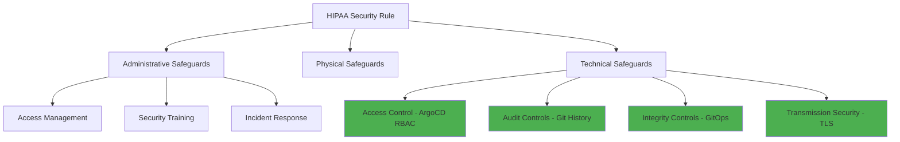

# ArgoCD for Healthcare: HIPAA-Compliant GitOps

Author: [nawazdhandala](https://github.com/nawazdhandala)

Tags: ArgoCD, GitOps, Kubernetes, Healthcare, HIPAA

Description: Configure ArgoCD for HIPAA-compliant healthcare deployments with proper access controls, encryption, audit trails, and PHI protection in Kubernetes environments.

---

Healthcare organizations deploying applications on Kubernetes face the challenge of maintaining HIPAA compliance while moving at the speed modern healthcare demands. HIPAA (Health Insurance Portability and Accountability Act) mandates strict controls around Protected Health Information (PHI), requiring comprehensive audit trails, access controls, and data protection measures. ArgoCD's GitOps model provides a strong foundation for HIPAA compliance because it inherently creates the documented, traceable, and controlled deployment process that regulators require.

## HIPAA Requirements Mapped to ArgoCD

HIPAA's Security Rule has three categories of safeguards: administrative, physical, and technical. ArgoCD primarily addresses technical safeguards, but its workflow supports administrative safeguards as well.



## Access Controls (164.312(a))

HIPAA requires unique user identification, emergency access procedures, automatic logoff, and encryption.

### Unique User Identification

Configure ArgoCD with SSO so every user has a unique, traceable identity.

```yaml
# argocd-cm ConfigMap - OIDC SSO Configuration
apiVersion: v1
kind: ConfigMap
metadata:
  name: argocd-cm
  namespace: argocd
data:
  url: https://argocd.healthcare-org.com
  oidc.config: |
    name: Okta
    issuer: https://healthcare-org.okta.com/oauth2/default
    clientID: $oidc.clientID
    clientSecret: $oidc.clientSecret
    requestedScopes:
      - openid
      - profile
      - email
      - groups
    # Map organizational groups for RBAC
    requestedIDTokenClaims:
      groups:
        essential: true
```

### Role-Based Access Control

Define roles that align with HIPAA's minimum necessary standard - users should only access what they need for their job function.

```yaml
# argocd-rbac-cm - HIPAA-aligned RBAC
apiVersion: v1
kind: ConfigMap
metadata:
  name: argocd-rbac-cm
  namespace: argocd
data:
  policy.default: role:readonly
  policy.csv: |
    # Clinical Systems Team - manages patient-facing applications
    p, role:clinical-deployer, applications, get, hipaa-clinical/*, allow
    p, role:clinical-deployer, applications, sync, hipaa-clinical/*, allow
    p, role:clinical-deployer, applications, create, hipaa-clinical/*, allow

    # Infrastructure Team - manages platform components
    p, role:infra-deployer, applications, get, hipaa-infrastructure/*, allow
    p, role:infra-deployer, applications, sync, hipaa-infrastructure/*, allow
    p, role:infra-deployer, applications, create, hipaa-infrastructure/*, allow

    # Compliance Officers - read-only audit access
    p, role:compliance, applications, get, */*, allow
    p, role:compliance, logs, get, */*, allow
    p, role:compliance, projects, get, *, allow

    # Emergency Access - break-glass with full permissions
    # Requires documented justification
    p, role:emergency-access, applications, *, */*, allow
    p, role:emergency-access, clusters, *, *, allow

    # Group mappings
    g, clinical-engineering, role:clinical-deployer
    g, platform-engineering, role:infra-deployer
    g, hipaa-compliance, role:compliance
    g, incident-commanders, role:emergency-access

  scopes: '[groups]'
```

### Emergency Access Procedures

HIPAA requires emergency access procedures. Configure a break-glass mechanism.

```yaml
# Break-glass ArgoCD account for emergencies
apiVersion: v1
kind: ConfigMap
metadata:
  name: argocd-cm
  namespace: argocd
data:
  # Emergency account - disabled by default
  accounts.emergency-break-glass: apiKey,login
  accounts.emergency-break-glass.enabled: "false"
```

```bash
# Emergency activation procedure (documented in runbooks)
# Step 1: Enable the emergency account
kubectl patch configmap argocd-cm -n argocd \
  --type merge \
  -p '{"data":{"accounts.emergency-break-glass.enabled":"true"}}'

# Step 2: Generate a temporary token
argocd account generate-token --account emergency-break-glass --expires-in 4h

# Step 3: Document the emergency in the incident management system
# Step 4: Disable after emergency is resolved
kubectl patch configmap argocd-cm -n argocd \
  --type merge \
  -p '{"data":{"accounts.emergency-break-glass.enabled":"false"}}'
```

## Audit Controls (164.312(b))

HIPAA requires mechanisms to record and examine activity in systems that contain or use PHI.

### Comprehensive Audit Logging

```yaml
# Configure ArgoCD for detailed audit logging
apiVersion: v1
kind: ConfigMap
metadata:
  name: argocd-cmd-params-cm
  namespace: argocd
data:
  server.log.level: "info"
  server.log.format: "json"
  controller.log.level: "info"
  controller.log.format: "json"
  reposerver.log.level: "info"
  reposerver.log.format: "json"
```

### Forward Audit Events to SIEM

```yaml
# ArgoCD Notifications for HIPAA audit events
apiVersion: v1
kind: ConfigMap
metadata:
  name: argocd-notifications-cm
  namespace: argocd
data:
  # Track all deployment activities
  trigger.on-deployed: |
    - when: app.status.operationState.phase in ['Succeeded']
      send: [hipaa-audit-log]

  trigger.on-sync-failed: |
    - when: app.status.operationState.phase in ['Failed', 'Error']
      send: [hipaa-audit-log, security-alert]

  trigger.on-health-degraded: |
    - when: app.status.health.status == 'Degraded'
      send: [hipaa-audit-log, ops-alert]

  template.hipaa-audit-log: |
    webhook:
      splunk-hec:
        method: POST
        headers:
          Authorization: Splunk $splunk-hec-token
        body: |
          {
            "event": {
              "type": "deployment-change",
              "application": "{{.app.metadata.name}}",
              "project": "{{.app.spec.project}}",
              "phase": "{{.app.status.operationState.phase}}",
              "user": "{{.app.status.operationState.operation.initiatedBy.username}}",
              "revision": "{{.app.status.sync.revision}}",
              "timestamp": "{{.app.status.operationState.startedAt}}",
              "destination_cluster": "{{.app.spec.destination.server}}",
              "destination_namespace": "{{.app.spec.destination.namespace}}",
              "sync_status": "{{.app.status.sync.status}}",
              "health_status": "{{.app.status.health.status}}"
            },
            "sourcetype": "argocd:deployment",
            "index": "hipaa_audit"
          }
```

### Git-Based Audit Trail

The GitOps repo itself serves as an audit trail. Configure branch protection to ensure this trail is immutable.

```bash
# GitHub branch protection for the GitOps repository
# Via GitHub CLI
gh api repos/org/healthcare-gitops/branches/main/protection \
  --method PUT \
  --field required_status_checks='{"strict":true,"contexts":["ci/validate-manifests"]}' \
  --field enforce_admins=true \
  --field required_pull_request_reviews='{"required_approving_review_count":2,"require_code_owner_reviews":true}' \
  --field restrictions=null \
  --field required_linear_history=true
```

## Integrity Controls (164.312(c))

HIPAA requires mechanisms to ensure PHI is not improperly altered or destroyed.

### Drift Detection and Self-Healing

```yaml
# Ensure production systems match the approved state in Git
apiVersion: argoproj.io/v1alpha1
kind: Application
metadata:
  name: patient-portal
  namespace: argocd
spec:
  project: hipaa-clinical
  source:
    repoURL: https://github.com/org/healthcare-gitops.git
    path: clinical/patient-portal/production
    targetRevision: main
  destination:
    server: https://hipaa-cluster.internal
    namespace: patient-portal
  syncPolicy:
    automated:
      # Automatically revert unauthorized changes
      selfHeal: true
      # Remove resources not in Git
      prune: true
    syncOptions:
      - Validate=true
```

### Signed Commits

Require GPG-signed commits on the GitOps repository to ensure code provenance.

```bash
# Configure Git to sign commits
git config --global commit.gpgsign true
git config --global user.signingkey YOUR_GPG_KEY_ID

# Verify signed commits
git log --show-signature
```

## Transmission Security (164.312(e))

All data in transit must be encrypted. Configure ArgoCD to use TLS everywhere.

```yaml
# ArgoCD server TLS configuration
apiVersion: v1
kind: ConfigMap
metadata:
  name: argocd-cmd-params-cm
  namespace: argocd
data:
  # Force TLS for all connections
  server.insecure: "false"

  # TLS for repo server communication
  reposerver.tls.cert: /app/config/reposerver/tls/tls.crt
  reposerver.tls.key: /app/config/reposerver/tls/tls.key

---
# Ingress with TLS
apiVersion: networking.k8s.io/v1
kind: Ingress
metadata:
  name: argocd-server
  namespace: argocd
  annotations:
    nginx.ingress.kubernetes.io/ssl-redirect: "true"
    nginx.ingress.kubernetes.io/backend-protocol: "HTTPS"
    # HSTS header
    nginx.ingress.kubernetes.io/configuration-snippet: |
      more_set_headers "Strict-Transport-Security: max-age=31536000; includeSubDomains";
spec:
  tls:
    - hosts:
        - argocd.healthcare-org.com
      secretName: argocd-tls
  rules:
    - host: argocd.healthcare-org.com
      http:
        paths:
          - path: /
            pathType: Prefix
            backend:
              service:
                name: argocd-server
                port:
                  number: 443
```

## PHI Protection in Deployments

Never store PHI in Git or ArgoCD configuration. Use external secret management.

```yaml
# External Secrets for database connections that access PHI
apiVersion: external-secrets.io/v1beta1
kind: ExternalSecret
metadata:
  name: ehr-database-credentials
  namespace: patient-portal
spec:
  refreshInterval: 30m
  secretStoreRef:
    name: aws-secrets-manager
    kind: ClusterSecretStore
  target:
    name: ehr-database-credentials
  data:
    - secretKey: connection-string
      remoteRef:
        key: /hipaa/production/ehr-database
        property: connection_string
    - secretKey: encryption-key
      remoteRef:
        key: /hipaa/production/ehr-database
        property: encryption_key
```

## Deployment Windows for Healthcare

Healthcare systems often have specific maintenance windows to minimize impact on patient care.

```yaml
# Sync windows aligned with hospital operations
spec:
  syncWindows:
    # Allow deployments during low-activity periods
    - kind: allow
      schedule: '0 2 * * 2,4'  # Tuesday and Thursday at 2 AM
      duration: 4h
      applications:
        - '*'
    # Block deployments during peak clinical hours
    - kind: deny
      schedule: '0 6 * * *'    # 6 AM daily
      duration: 16h             # Until 10 PM
      applications:
        - 'patient-*'           # Clinical applications
    # Emergency deployments always allowed with manual sync
    - kind: allow
      schedule: '* * * * *'
      duration: 24h
      applications:
        - '*'
      manualSync: true
```

## Compliance Reporting

Generate compliance reports from your GitOps data.

```bash
# Generate a compliance report for a specific time period
# Who deployed what, when, and with whose approval

# List all deployments in the audit period
git log --since="2024-01-01" --until="2024-03-31" \
  --format="Date: %ai | Author: %an | Change: %s" \
  -- clinical/ > quarterly-deployment-report.txt

# Count deployments per application
git log --since="2024-01-01" --until="2024-03-31" \
  --format="%s" -- clinical/ | sort | uniq -c | sort -rn
```

HIPAA compliance is not a one-time configuration - it is an ongoing process. ArgoCD's GitOps model provides the technical foundation, but you also need documented procedures, regular training, and periodic audits. The key advantage of GitOps is that compliance evidence is generated automatically as part of your normal deployment workflow, rather than being an afterthought. For monitoring HIPAA-compliant systems, see our guide on [ArgoCD for fintech compliance](https://oneuptime.com/blog/post/2026-02-26-argocd-fintech-compliance/view) which covers similar regulatory deployment patterns.
