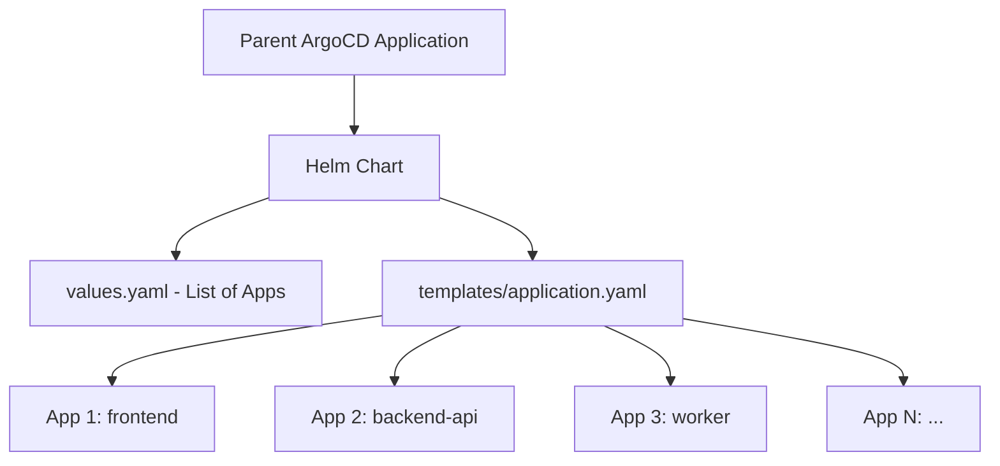

# How to Use Helm with ArgoCD Application of Applications Pattern

Author: [nawazdhandala](https://github.com/nawazdhandala)

Tags: ArgoCD, GitOps, Kubernetes, Helm, App of Apps

Description: Learn how to combine Helm charts with the ArgoCD App of Apps pattern to manage dozens of applications from a single parent Helm chart with templated child applications.

---

Managing a handful of ArgoCD applications is straightforward. Managing fifty or a hundred gets painful fast. The App of Apps pattern solves this by letting a single parent application generate all your child applications. When you combine this pattern with Helm, you get templating power on top of the orchestration - meaning you can loop over values to generate child applications dynamically instead of writing each one by hand.

This guide walks through building a Helm-based App of Apps setup from scratch, covering the parent chart structure, child application templating, values-driven configuration, and production patterns.

## Why Helm for App of Apps

The App of Apps pattern works with plain YAML manifests, Kustomize, or Helm. But Helm brings a specific advantage: templating loops. Instead of writing an ArgoCD Application manifest for every microservice, you define them as entries in a values file and let Helm generate the manifests.

Here is the comparison:



Without Helm, you would need a separate YAML file for each child application. With Helm, you maintain a single template and a values file.

## Parent Chart Structure

Create a Helm chart that serves as the parent application. This chart does not deploy workloads - it deploys ArgoCD Application resources.

```
argocd-apps/
  Chart.yaml
  values.yaml
  templates/
    application.yaml
```

The `Chart.yaml` is minimal:

```yaml
# Chart.yaml - parent chart metadata
apiVersion: v2
name: argocd-apps
description: Parent chart that generates ArgoCD child applications
version: 1.0.0
```

## The Application Template

The core of this pattern is a template that loops over your applications list:

```yaml
# templates/application.yaml
{{- range $app := .Values.applications }}
---
apiVersion: argoproj.io/v1alpha1
kind: Application
metadata:
  name: {{ $app.name }}
  namespace: argocd
  # Ensure the parent can clean up children on deletion
  finalizers:
    - resources-finalizer.argocd.argoproj.io
spec:
  project: {{ $app.project | default "default" }}
  source:
    repoURL: {{ $app.repoURL | default $.Values.defaults.repoURL }}
    targetRevision: {{ $app.targetRevision | default $.Values.defaults.targetRevision }}
    path: {{ $app.path }}
    {{- if $app.helm }}
    helm:
      valueFiles:
        {{- range $app.helm.valueFiles }}
        - {{ . }}
        {{- end }}
      {{- if $app.helm.parameters }}
      parameters:
        {{- range $app.helm.parameters }}
        - name: {{ .name }}
          value: {{ .value | quote }}
        {{- end }}
      {{- end }}
    {{- end }}
  destination:
    server: {{ $app.destinationServer | default $.Values.defaults.destinationServer }}
    namespace: {{ $app.namespace }}
  syncPolicy:
    automated:
      prune: {{ $app.prune | default true }}
      selfHeal: {{ $app.selfHeal | default true }}
    syncOptions:
      - CreateNamespace=true
{{- end }}
```

This single template generates one ArgoCD Application for every entry in the `applications` list.

## Values File Configuration

The values file defines defaults and the list of applications:

```yaml
# values.yaml
defaults:
  repoURL: https://github.com/myorg/k8s-deployments.git
  targetRevision: main
  destinationServer: https://kubernetes.default.svc

applications:
  - name: frontend
    path: apps/frontend
    namespace: production
    helm:
      valueFiles:
        - values.yaml
        - values-prod.yaml

  - name: backend-api
    path: apps/backend-api
    namespace: production
    helm:
      valueFiles:
        - values.yaml
        - values-prod.yaml
      parameters:
        - name: replicaCount
          value: "3"

  - name: worker
    path: apps/worker
    namespace: production

  - name: monitoring-stack
    path: apps/monitoring
    namespace: monitoring
    project: infrastructure
```

## Deploying the Parent Application

Create the parent ArgoCD Application that points to this Helm chart:

```yaml
# parent-application.yaml
apiVersion: argoproj.io/v1alpha1
kind: Application
metadata:
  name: app-of-apps
  namespace: argocd
spec:
  project: default
  source:
    repoURL: https://github.com/myorg/k8s-deployments.git
    targetRevision: main
    path: argocd-apps
    helm:
      valueFiles:
        - values.yaml
  destination:
    server: https://kubernetes.default.svc
    namespace: argocd
  syncPolicy:
    automated:
      prune: true
      selfHeal: true
```

Apply it:

```bash
# Deploy the parent application
kubectl apply -f parent-application.yaml
```

ArgoCD syncs the parent, which renders the Helm templates and creates all child Application resources. Each child then syncs independently.

## Environment-Specific Overrides

For multiple environments, use separate values files:

```yaml
# values-staging.yaml
defaults:
  targetRevision: develop
  destinationServer: https://staging-cluster.example.com

applications:
  - name: frontend-staging
    path: apps/frontend
    namespace: staging
    helm:
      valueFiles:
        - values.yaml
        - values-staging.yaml

  - name: backend-api-staging
    path: apps/backend-api
    namespace: staging
    helm:
      valueFiles:
        - values.yaml
        - values-staging.yaml
      parameters:
        - name: replicaCount
          value: "1"
```

Create a separate parent for each environment:

```yaml
# parent-staging.yaml
apiVersion: argoproj.io/v1alpha1
kind: Application
metadata:
  name: app-of-apps-staging
  namespace: argocd
spec:
  project: default
  source:
    repoURL: https://github.com/myorg/k8s-deployments.git
    targetRevision: main
    path: argocd-apps
    helm:
      valueFiles:
        - values-staging.yaml
  destination:
    server: https://kubernetes.default.svc
    namespace: argocd
```

## Adding Sync Waves

Control the order child applications are created by adding sync wave annotations in the template:

```yaml
# templates/application.yaml (with sync waves)
{{- range $app := .Values.applications }}
---
apiVersion: argoproj.io/v1alpha1
kind: Application
metadata:
  name: {{ $app.name }}
  namespace: argocd
  annotations:
    argocd.argoproj.io/sync-wave: "{{ $app.syncWave | default 0 }}"
  finalizers:
    - resources-finalizer.argocd.argoproj.io
spec:
  # ... rest of spec
{{- end }}
```

Then in values:

```yaml
applications:
  - name: namespaces
    path: apps/namespaces
    namespace: default
    syncWave: -2  # Deploy first

  - name: crds
    path: apps/crds
    namespace: default
    syncWave: -1  # Deploy second

  - name: backend-api
    path: apps/backend-api
    namespace: production
    syncWave: 0   # Deploy with main wave
```

## Handling Helm Sub-Charts as Children

When child applications are themselves Helm charts from external repositories, adjust the template to support chart-based sources:

```yaml
# templates/application.yaml (extended for chart sources)
{{- range $app := .Values.applications }}
---
apiVersion: argoproj.io/v1alpha1
kind: Application
metadata:
  name: {{ $app.name }}
  namespace: argocd
spec:
  project: {{ $app.project | default "default" }}
  source:
    {{- if $app.chart }}
    # Helm chart from a repository
    repoURL: {{ $app.repoURL }}
    chart: {{ $app.chart }}
    targetRevision: {{ $app.chartVersion }}
    helm:
      values: |
        {{- $app.helmValues | nindent 8 }}
    {{- else }}
    # Git-based source
    repoURL: {{ $app.repoURL | default $.Values.defaults.repoURL }}
    targetRevision: {{ $app.targetRevision | default $.Values.defaults.targetRevision }}
    path: {{ $app.path }}
    {{- end }}
  destination:
    server: {{ $app.destinationServer | default $.Values.defaults.destinationServer }}
    namespace: {{ $app.namespace }}
{{- end }}
```

Use it to deploy third-party charts:

```yaml
applications:
  - name: ingress-nginx
    repoURL: https://kubernetes.github.io/ingress-nginx
    chart: ingress-nginx
    chartVersion: 4.8.3
    namespace: ingress-nginx
    syncWave: -1
    helmValues: |
      controller:
        replicaCount: 2
        service:
          type: LoadBalancer
```

## Debugging Tips

When the parent chart renders incorrectly, preview the output locally:

```bash
# Render the templates locally to check output
helm template argocd-apps ./argocd-apps -f values.yaml

# Render for a specific environment
helm template argocd-apps ./argocd-apps -f values-staging.yaml
```

Check that each rendered Application manifest has the correct `repoURL`, `path`, and `namespace`. Common mistakes include missing default values that produce empty fields.

## When to Use This vs ApplicationSets

The Helm-based App of Apps pattern predates ApplicationSets. Both solve similar problems. Use the Helm approach when you need complex conditional logic in your templates - things like `if` statements, nested loops, and helper functions that go beyond what ApplicationSet generators support. Use ApplicationSets when your application list comes from dynamic sources like cluster lists, Git directories, or pull requests.

For teams already comfortable with Helm templating, the App of Apps pattern with Helm is a proven, battle-tested approach that scales to hundreds of applications across multiple clusters. For more on deploying Helm charts with ArgoCD, see our guide on [deploying Helm charts with ArgoCD](https://oneuptime.com/blog/post/2026-01-25-deploy-helm-charts-argocd/view).
