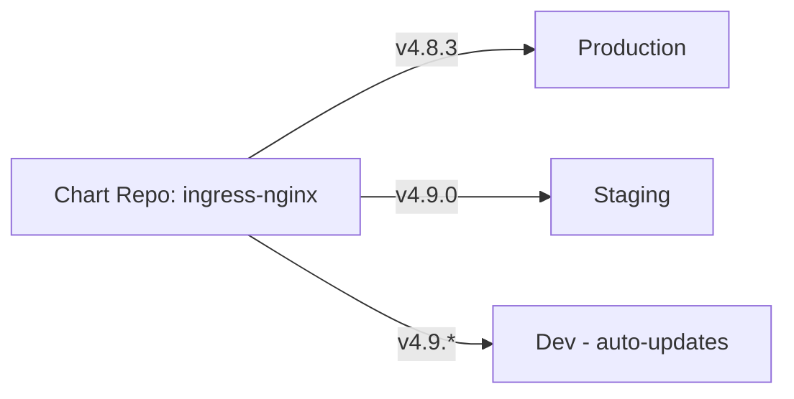

# How to Handle Helm Chart Version Pinning in ArgoCD

Author: [nawazdhandala](https://github.com/nawazdhandala)

Tags: ArgoCD, GitOps, Kubernetes, Helm

Description: Learn how to pin Helm chart versions in ArgoCD to ensure reproducible deployments, prevent unexpected upgrades, and implement controlled version promotion across environments.

---

Deploying Helm charts without pinning versions is like running `apt-get upgrade` in production with your eyes closed. You might get lucky, or you might get a breaking change in a minor release. ArgoCD gives you several ways to control exactly which chart version gets deployed, from exact pins to semantic version ranges. This guide covers every approach, when to use each one, and how to build a version promotion workflow.

## Why Version Pinning Matters

When ArgoCD deploys a Helm chart from a repository, the `targetRevision` field controls which version gets pulled. Without it, ArgoCD may pull the latest version available, which means a chart maintainer pushing a new release can trigger changes in your cluster without any commit to your Git repository. That breaks the core GitOps principle of Git as the source of truth.



## Exact Version Pinning

The safest approach pins to an exact chart version:

```yaml
# application.yaml - exact version pin
apiVersion: argoproj.io/v1alpha1
kind: Application
metadata:
  name: ingress-nginx
  namespace: argocd
spec:
  project: default
  source:
    repoURL: https://kubernetes.github.io/ingress-nginx
    chart: ingress-nginx
    targetRevision: 4.8.3  # Exact version - never changes automatically
    helm:
      valueFiles:
        - values.yaml
  destination:
    server: https://kubernetes.default.svc
    namespace: ingress-nginx
```

With exact pinning, the only way to change the deployed version is to update the `targetRevision` in Git and let ArgoCD sync the change. This creates a clear audit trail.

## Semantic Version Ranges

ArgoCD supports semver constraints for `targetRevision` when the source is a Helm chart repository (not a Git repo). This lets you auto-adopt patch releases while blocking minor or major changes:

```yaml
# Allow only patch updates
targetRevision: ">=4.8.0 <4.9.0"

# Allow patch updates for a specific minor
targetRevision: "4.8.*"

# Allow minor and patch updates within a major
targetRevision: ">=4.0.0 <5.0.0"

# Allow any version greater than or equal to
targetRevision: ">=4.8.3"
```

Example Application with a semver range:

```yaml
apiVersion: argoproj.io/v1alpha1
kind: Application
metadata:
  name: cert-manager
  namespace: argocd
spec:
  source:
    repoURL: https://charts.jetstack.io
    chart: cert-manager
    targetRevision: "1.13.*"  # Auto-adopt patch releases
    helm:
      parameters:
        - name: installCRDs
          value: "true"
  destination:
    server: https://kubernetes.default.svc
    namespace: cert-manager
```

Use semver ranges with caution. Even patch releases can introduce bugs. This approach works best for development and staging environments.

## Git-Based Version Pinning

When your Helm charts live in a Git repository instead of a Helm repository, version pinning uses Git references:

```yaml
# Pin to a specific Git tag
apiVersion: argoproj.io/v1alpha1
kind: Application
metadata:
  name: my-app
  namespace: argocd
spec:
  source:
    repoURL: https://github.com/myorg/helm-charts.git
    targetRevision: v2.1.0  # Git tag
    path: charts/my-app
  destination:
    server: https://kubernetes.default.svc
    namespace: production
```

Git-based pinning options:

```yaml
# Pin to exact commit SHA
targetRevision: a1b2c3d4e5f6

# Pin to a Git tag
targetRevision: v2.1.0

# Track a branch (not recommended for production)
targetRevision: main

# Track HEAD (most dangerous - any commit deploys)
targetRevision: HEAD
```

For production, always pin to a tag or commit SHA when using Git-based chart sources.

## Version Promotion Workflow

A disciplined version promotion strategy uses exact pins and promotes versions through environments:

```yaml
# environments/dev/ingress.yaml
spec:
  source:
    chart: ingress-nginx
    targetRevision: 4.9.0  # New version tested here first

# environments/staging/ingress.yaml
spec:
  source:
    chart: ingress-nginx
    targetRevision: 4.8.3  # Promoted after dev validation

# environments/production/ingress.yaml
spec:
  source:
    chart: ingress-nginx
    targetRevision: 4.8.3  # Promoted after staging validation
```

Automate promotions with a CI pipeline:

```bash
#!/bin/bash
# promote-chart-version.sh
# Usage: ./promote-chart-version.sh ingress-nginx 4.9.0 staging

CHART=$1
VERSION=$2
ENV=$3

# Update the targetRevision in the environment file
sed -i "s/targetRevision: .*/targetRevision: ${VERSION}/" \
  environments/${ENV}/${CHART}.yaml

# Commit and push - ArgoCD syncs automatically
git add environments/${ENV}/${CHART}.yaml
git commit -m "Promote ${CHART} to ${VERSION} in ${ENV}"
git push origin main
```

## Checking Available Versions

Before pinning, check what versions are available:

```bash
# List available chart versions from a Helm repo
helm search repo ingress-nginx/ingress-nginx --versions | head -20

# Check what version ArgoCD currently has resolved
argocd app get ingress-nginx -o json | jq '.status.sync.revision'

# See the chart version in the live state
argocd app get ingress-nginx -o json | jq '.status.summary'
```

## Handling Version Drift

When someone manually upgrades a chart outside of ArgoCD, the application shows as OutOfSync. Configure ArgoCD to self-heal:

```yaml
syncPolicy:
  automated:
    prune: true
    selfHeal: true  # Reverts manual changes back to pinned version
```

With self-heal enabled, if someone runs `helm upgrade` manually, ArgoCD detects the drift and rolls back to the version specified in Git.

## OCI Registry Version Pinning

For charts stored in OCI registries, version pinning works the same way:

```yaml
apiVersion: argoproj.io/v1alpha1
kind: Application
metadata:
  name: my-app
  namespace: argocd
spec:
  source:
    repoURL: oci://ghcr.io/myorg/charts
    chart: my-app
    targetRevision: 1.5.2  # Exact OCI tag
  destination:
    server: https://kubernetes.default.svc
    namespace: production
```

## Monitoring Version Status

Set up notifications to alert when a new chart version is available but not yet deployed:

```yaml
# argocd-notifications ConfigMap snippet
apiVersion: v1
kind: ConfigMap
metadata:
  name: argocd-notifications-cm
  namespace: argocd
data:
  trigger.on-outdated-chart: |
    - description: Chart has newer version available
      when: app.status.summary.externalURLs != nil
      send: [slack-outdated-notification]
```

## Best Practices

1. **Production always uses exact pins**. No ranges, no branch tracking, no HEAD.
2. **Dev can use ranges**. Semver ranges like `1.13.*` work for catching patch updates early.
3. **Commit version changes to Git**. Every version bump should be a Git commit with a meaningful message.
4. **Tag your own charts**. If you maintain internal charts, tag every release in Git.
5. **Review Chart.lock files**. For umbrella charts, the lock file pins transitive dependency versions.

For more on deploying Helm charts with ArgoCD, check out our [Helm and ArgoCD deployment guide](https://oneuptime.com/blog/post/2026-01-25-deploy-helm-charts-argocd/view).
