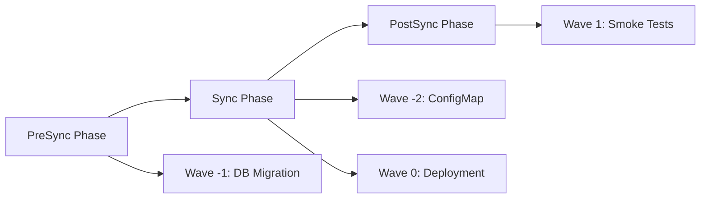

# How to Use Helm Hooks with ArgoCD Sync Hooks

Author: [nawazdhandala](https://github.com/nawazdhandala)

Tags: ArgoCD, GitOps, Kubernetes, Helm, Sync Hooks

Description: Learn how Helm hooks map to ArgoCD resource hooks and how to implement pre-sync, post-sync, and sync wave patterns for ordered deployments.

---

Helm hooks and ArgoCD resource hooks serve similar purposes - they let you run actions at specific points during the deployment lifecycle, like running database migrations before an upgrade or sending notifications after a deployment. However, they work differently under the hood. Understanding how these two hook systems interact is crucial when deploying Helm charts through ArgoCD.

This guide explains the relationship between Helm hooks and ArgoCD hooks, how they map to each other, and how to use them effectively together.

## Helm Hooks vs ArgoCD Hooks

Helm hooks use annotations on Kubernetes resources to trigger actions at specific lifecycle events:

```yaml
# Standard Helm hook
apiVersion: batch/v1
kind: Job
metadata:
  name: db-migrate
  annotations:
    "helm.sh/hook": pre-upgrade
    "helm.sh/hook-weight": "0"
    "helm.sh/hook-delete-policy": hook-succeeded
```

ArgoCD has its own hook system called resource hooks:

```yaml
# ArgoCD resource hook
apiVersion: batch/v1
kind: Job
metadata:
  name: db-migrate
  annotations:
    argocd.argoproj.io/hook: PreSync
    argocd.argoproj.io/hook-delete-policy: HookSucceeded
```

When ArgoCD renders Helm charts, it converts Helm hooks to ArgoCD hooks automatically.

## How ArgoCD Handles Helm Hooks

By default, ArgoCD maps Helm hook annotations to ArgoCD hook annotations:

| Helm Hook | ArgoCD Hook | When It Runs |
|-----------|-------------|--------------|
| `pre-install` | `PreSync` | Before the sync/install |
| `post-install` | `PostSync` | After the sync/install |
| `pre-upgrade` | `PreSync` | Before the sync/upgrade |
| `post-upgrade` | `PostSync` | After the sync/upgrade |
| `pre-delete` | `PreSync` (with special handling) | Before deletion |
| `post-delete` | `PostSync` (with special handling) | After deletion |
| `pre-rollback` | Not directly mapped | N/A |
| `test` | Skipped by default | N/A |

The mapping happens at render time. When ArgoCD runs `helm template`, it detects the Helm hook annotations and translates them to ArgoCD equivalents.

## Practical Example: Database Migration

A common use case is running database migrations before deploying a new version:

```yaml
# templates/migration-job.yaml
apiVersion: batch/v1
kind: Job
metadata:
  name: {{ .Release.Name }}-db-migrate-{{ .Values.image.tag | replace "." "-" }}
  annotations:
    # Helm hook annotation
    "helm.sh/hook": pre-upgrade,pre-install
    "helm.sh/hook-weight": "-5"
    "helm.sh/hook-delete-policy": hook-succeeded
spec:
  backoffLimit: 3
  template:
    spec:
      restartPolicy: Never
      containers:
        - name: migrate
          image: {{ .Values.image.repository }}:{{ .Values.image.tag }}
          command: ["./migrate", "up"]
          env:
            - name: DATABASE_URL
              valueFrom:
                secretKeyRef:
                  name: {{ .Release.Name }}-db-secret
                  key: url
```

When deployed through ArgoCD, this Job will:
1. Be converted to an ArgoCD `PreSync` hook
2. Run before the main application resources are synced
3. Be deleted after successful completion (due to `hook-succeeded` policy)

## Using ArgoCD-Native Hooks Instead

If you are writing charts specifically for ArgoCD, you can use ArgoCD's native hook annotations directly:

```yaml
# templates/pre-sync-migration.yaml
apiVersion: batch/v1
kind: Job
metadata:
  name: {{ .Release.Name }}-db-migrate
  annotations:
    argocd.argoproj.io/hook: PreSync
    argocd.argoproj.io/hook-delete-policy: HookSucceeded
    argocd.argoproj.io/sync-wave: "-1"
spec:
  backoffLimit: 3
  template:
    spec:
      restartPolicy: Never
      containers:
        - name: migrate
          image: {{ .Values.image.repository }}:{{ .Values.image.tag }}
          command: ["./migrate", "up"]
          env:
            - name: DATABASE_URL
              valueFrom:
                secretKeyRef:
                  name: {{ .Release.Name }}-db-secret
                  key: url
```

ArgoCD-native hooks give you access to additional features:

- **Sync waves**: Control the order of resource creation within a phase
- **More hook phases**: `PreSync`, `Sync`, `PostSync`, `SyncFail`, `Skip`
- **Better integration**: Native hooks work more reliably with ArgoCD's sync engine

## Sync Waves with Helm Hooks

ArgoCD sync waves let you order resources within a sync phase. Combine them with hooks for precise control:

```yaml
# Step 1: Create ConfigMap (wave -2)
apiVersion: v1
kind: ConfigMap
metadata:
  name: app-config
  annotations:
    argocd.argoproj.io/sync-wave: "-2"
data:
  config.yaml: |
    database:
      host: postgres
      port: 5432

---
# Step 2: Run migration (wave -1, PreSync hook)
apiVersion: batch/v1
kind: Job
metadata:
  name: db-migrate
  annotations:
    argocd.argoproj.io/hook: PreSync
    argocd.argoproj.io/hook-delete-policy: HookSucceeded
    argocd.argoproj.io/sync-wave: "-1"
spec:
  template:
    spec:
      restartPolicy: Never
      containers:
        - name: migrate
          image: myorg/my-app:v2.0.0
          command: ["./migrate", "up"]

---
# Step 3: Deploy application (wave 0)
apiVersion: apps/v1
kind: Deployment
metadata:
  name: my-app
  annotations:
    argocd.argoproj.io/sync-wave: "0"
spec:
  replicas: 3
  template:
    spec:
      containers:
        - name: my-app
          image: myorg/my-app:v2.0.0

---
# Step 4: Run smoke tests (wave 1, PostSync hook)
apiVersion: batch/v1
kind: Job
metadata:
  name: smoke-test
  annotations:
    argocd.argoproj.io/hook: PostSync
    argocd.argoproj.io/hook-delete-policy: HookSucceeded
    argocd.argoproj.io/sync-wave: "1"
spec:
  template:
    spec:
      restartPolicy: Never
      containers:
        - name: test
          image: myorg/my-app:v2.0.0
          command: ["./smoke-test"]
```

The execution order is:



## Hook Delete Policies

Both Helm and ArgoCD support delete policies that control when hook resources are cleaned up:

### Helm Delete Policies

```yaml
annotations:
  "helm.sh/hook-delete-policy": hook-succeeded
  # Options:
  # hook-succeeded - Delete after successful execution
  # hook-failed - Delete after failed execution
  # before-hook-creation - Delete existing hook before creating new one
```

### ArgoCD Delete Policies

```yaml
annotations:
  argocd.argoproj.io/hook-delete-policy: HookSucceeded
  # Options:
  # HookSucceeded - Delete after successful execution
  # HookFailed - Delete after failed execution
  # BeforeHookCreation - Delete before creating new instance
```

## Disabling Helm Hook Conversion

If you want ArgoCD to skip Helm hooks entirely (not convert them), you can set the `helm.sh/hook` annotation to `crd-install` or use the skip annotation:

```yaml
annotations:
  # Tell ArgoCD to skip this resource during sync
  argocd.argoproj.io/hook: Skip
```

Or configure it at the application level:

```yaml
apiVersion: argoproj.io/v1alpha1
kind: Application
metadata:
  name: my-app
  namespace: argocd
spec:
  source:
    repoURL: https://github.com/myorg/my-charts.git
    path: charts/my-app
    helm:
      # Skip Helm tests
      skipTests: true
```

## Handling SyncFail Hooks

ArgoCD provides a `SyncFail` hook that Helm does not have. This runs when a sync fails, which is useful for notifications:

```yaml
apiVersion: batch/v1
kind: Job
metadata:
  name: sync-fail-notify
  annotations:
    argocd.argoproj.io/hook: SyncFail
    argocd.argoproj.io/hook-delete-policy: HookSucceeded
spec:
  template:
    spec:
      restartPolicy: Never
      containers:
        - name: notify
          image: curlimages/curl
          command:
            - curl
            - -X
            - POST
            - -H
            - "Content-Type: application/json"
            - -d
            - '{"text":"Sync failed for my-app in production!"}'
            - https://hooks.slack.com/services/xxx/yyy/zzz
```

## Troubleshooting Helm Hooks in ArgoCD

Common issues:

1. **Hook not running**: Check if the Helm hook annotation is being correctly mapped. View the rendered manifest with `argocd app manifests my-app`.

2. **Hook running every sync**: Make sure you have a delete policy set. Without one, the hook Job persists and is not recreated.

3. **Hook order issues**: Use sync waves to control ordering within a phase.

4. **Test hooks**: By default, ArgoCD skips Helm test hooks. Use `skipTests: false` if you want them to run.

## Summary

Helm hooks and ArgoCD hooks work together seamlessly. ArgoCD automatically maps Helm lifecycle hooks (`pre-install`, `post-upgrade`, etc.) to ArgoCD sync phases (`PreSync`, `PostSync`). For charts specifically built for ArgoCD, use native ArgoCD hook annotations for access to additional features like sync waves and the `SyncFail` phase. Combine hooks with sync waves for precise deployment ordering - run migrations first, deploy the application second, and validate with smoke tests last.
