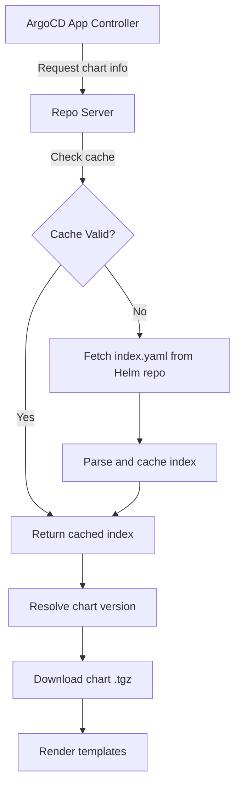

# How to Handle Helm Repository Index Updates in ArgoCD

Author: [nawazdhandala](https://github.com/nawazdhandala)

Tags: ArgoCD, GitOps, Kubernetes, Helm, Repository Management

Description: Learn how ArgoCD handles Helm repository index caching and refreshing, and how to troubleshoot stale index issues for timely chart deployments.

---

When ArgoCD deploys Helm charts from a Helm repository, it relies on the repository's `index.yaml` file to discover available charts and their versions. Understanding how ArgoCD fetches, caches, and refreshes this index is essential for avoiding situations where new chart versions seem invisible or stale versions keep getting deployed.

This guide covers the mechanics of Helm repository index handling in ArgoCD and practical solutions for common index-related issues.

## How Helm Repository Indexes Work

A Helm repository is essentially an HTTP server hosting two things:

1. Packaged chart archives (`.tgz` files)
2. An `index.yaml` file that catalogs all available charts and versions

The `index.yaml` file looks like this:

```yaml
apiVersion: v1
entries:
  my-app:
    - name: my-app
      version: 1.2.3
      created: "2026-02-20T10:30:00Z"
      digest: sha256:abc123...
      urls:
        - https://charts.example.com/my-app-1.2.3.tgz
    - name: my-app
      version: 1.2.2
      created: "2026-02-15T08:00:00Z"
      digest: sha256:def456...
      urls:
        - https://charts.example.com/my-app-1.2.2.tgz
  another-app:
    - name: another-app
      version: 3.0.0
      ...
generated: "2026-02-20T10:35:00Z"
```

When ArgoCD needs to resolve a chart version, it downloads this index, parses it, and selects the matching chart version.

## ArgoCD's Index Caching Mechanism

ArgoCD's repo-server component is responsible for fetching and caching Helm repository indexes. Here is how the caching works:



By default, ArgoCD caches Helm repository indexes and refreshes them based on a configurable interval. The key settings are:

### Repo Server Cache Settings

These are configured via the `argocd-cmd-params-cm` ConfigMap:

```yaml
apiVersion: v1
kind: ConfigMap
metadata:
  name: argocd-cmd-params-cm
  namespace: argocd
data:
  # How long repo-server caches repository data (default: 24h)
  reposerver.repo.cache.expiration: "1h"
```

You can also configure it through ArgoCD's main ConfigMap:

```yaml
apiVersion: v1
kind: ConfigMap
metadata:
  name: argocd-cm
  namespace: argocd
data:
  # Timeout for fetching repository data (default: 60s)
  timeout.reconciliation: "180s"
```

## Forcing an Index Refresh

When you publish a new chart version and need ArgoCD to see it immediately, you have several options.

### Option 1: Hard Refresh via UI

In the ArgoCD UI, open your application and click the **Refresh** button. Hold Shift and click to perform a "Hard Refresh" that bypasses the cache entirely.

### Option 2: Hard Refresh via CLI

```bash
# Soft refresh - uses cache if valid
argocd app get my-app --refresh

# Hard refresh - bypasses cache, fetches fresh index
argocd app get my-app --hard-refresh
```

### Option 3: Invalidate the Repo Server Cache

If you need to clear the cache for all applications using a specific repository:

```bash
# Restart the repo-server to clear all caches
kubectl -n argocd rollout restart deployment argocd-repo-server
```

This is a heavy-handed approach but effective when cache corruption is suspected.

### Option 4: Use the API

```bash
# Force refresh through the ArgoCD API
curl -X GET \
  "https://argocd.example.com/api/v1/applications/my-app?refresh=hard" \
  -H "Authorization: Bearer <token>"
```

## Reducing Cache Duration for Faster Updates

If your workflow requires ArgoCD to detect new chart versions quickly, reduce the cache expiration:

```yaml
apiVersion: v1
kind: ConfigMap
metadata:
  name: argocd-cmd-params-cm
  namespace: argocd
data:
  # Reduce cache to 5 minutes
  reposerver.repo.cache.expiration: "5m"
```

After updating, restart the repo-server:

```bash
kubectl -n argocd rollout restart deployment argocd-repo-server
```

Be careful with very low values. If you have many applications and repositories, frequent index fetches can put significant load on both the repo-server and the Helm repository server.

## Using Webhooks to Trigger Refreshes

A better approach than short cache durations is using webhooks. When a new chart is pushed to your Helm repository, trigger an ArgoCD refresh:

```bash
#!/bin/bash
# webhook-handler.sh - Called by your CI/CD after chart push

ARGOCD_SERVER="https://argocd.example.com"
ARGOCD_TOKEN="<your-api-token>"
APP_NAME="my-app"

# Trigger a hard refresh for the application
curl -s -X GET \
  "${ARGOCD_SERVER}/api/v1/applications/${APP_NAME}?refresh=hard" \
  -H "Authorization: Bearer ${ARGOCD_TOKEN}" \
  -H "Content-Type: application/json"

echo "Refresh triggered for ${APP_NAME}"
```

In a CI pipeline (GitHub Actions example):

```yaml
# .github/workflows/chart-release.yaml
name: Release Helm Chart
on:
  push:
    paths:
      - 'charts/**'

jobs:
  release:
    runs-on: ubuntu-latest
    steps:
      - name: Package and push chart
        run: |
          helm package charts/my-app
          curl -u ${{ secrets.HELM_USER }}:${{ secrets.HELM_PASS }} \
            --upload-file my-app-*.tgz \
            https://helm.example.com/api/charts

      - name: Trigger ArgoCD refresh
        run: |
          curl -s -X GET \
            "${{ secrets.ARGOCD_SERVER }}/api/v1/applications/my-app?refresh=hard" \
            -H "Authorization: Bearer ${{ secrets.ARGOCD_TOKEN }}"
```

## Handling Version Resolution

ArgoCD supports several ways to specify the target chart version:

```yaml
spec:
  source:
    repoURL: https://charts.example.com
    chart: my-app
    # Exact version
    targetRevision: 1.2.3
    # Semver range - resolves to highest matching version from the index
    targetRevision: ">=1.0.0 <2.0.0"
    # Wildcard - latest in the 1.x series
    targetRevision: "1.*"
    # Latest version (use with caution)
    targetRevision: "*"
```

When using semver ranges or wildcards, index freshness becomes even more critical because ArgoCD resolves the version from the cached index. A stale index means ArgoCD might deploy an older version even though a newer one has been published.

## Monitoring Index Health

Set up monitoring to detect stale indexes early. Check the repo-server metrics:

```bash
# Port-forward to the repo-server metrics endpoint
kubectl -n argocd port-forward svc/argocd-repo-server 8084:8084

# Check cache-related metrics
curl -s localhost:8084/metrics | grep repo_server
```

Key metrics to watch:

- `argocd_repo_server_git_request_total` - Total number of repository requests
- `argocd_repo_server_git_request_duration_seconds` - Duration of repository fetches

## Troubleshooting Index Issues

### New Chart Version Not Visible

Symptom: You pushed a new chart version but ArgoCD still shows the old version.

Solution:

```bash
# 1. Verify the chart exists in the repository
curl -u user:pass https://helm.example.com/index.yaml | grep "version: 1.3.0"

# 2. Hard refresh the application
argocd app get my-app --hard-refresh

# 3. If still not visible, check the repo-server logs
kubectl -n argocd logs deploy/argocd-repo-server | grep "my-app"
```

### Index Download Timeouts

Symptom: Large repositories with thousands of charts cause timeout errors.

Solution: Increase the repo-server timeout:

```yaml
apiVersion: v1
kind: ConfigMap
metadata:
  name: argocd-cmd-params-cm
  namespace: argocd
data:
  # Increase timeout for slow repositories
  reposerver.repo.cache.expiration: "2h"
```

Also consider splitting large repositories into smaller, focused ones.

### Corrupted Index Cache

Symptom: ArgoCD shows incorrect chart versions or errors despite the repository being healthy.

Solution: Clear the repo-server cache by restarting:

```bash
kubectl -n argocd rollout restart deployment argocd-repo-server
```

If ArgoCD uses Redis for caching, you can also flush the Redis cache:

```bash
kubectl -n argocd exec -it deploy/argocd-redis -- redis-cli FLUSHALL
```

## Best Practices

1. **Use webhooks over short cache intervals** - They provide faster detection without the overhead of constant polling
2. **Pin chart versions in production** - Use exact versions to avoid unexpected upgrades from index refreshes
3. **Use semver ranges in staging** - Let staging pick up new patches automatically for early detection
4. **Monitor repo-server resources** - Large index files consume memory during parsing
5. **Keep index files lean** - Clean up old chart versions from your Helm repository to reduce index size

## Summary

ArgoCD's Helm repository index caching is designed to balance freshness with performance. The default 24-hour cache works for most scenarios, but you can tune it down for faster detection or use webhooks for event-driven refreshes. Understanding this caching mechanism helps you avoid the frustrating situation where a newly published chart seems invisible to ArgoCD.

For related reading, see [How to Use ArgoCD with Helm](https://oneuptime.com/blog/post/2026-02-02-argocd-helm/view).
