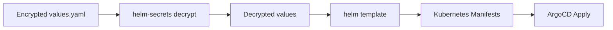

# How to Use Helm Secrets Plugin with ArgoCD CMP

Author: [nawazdhandala](https://github.com/nawazdhandala)

Tags: ArgoCD, GitOps, Kubernetes, Helm, Secrets Management

Description: Learn how to integrate the helm-secrets plugin with ArgoCD as a Config Management Plugin to decrypt encrypted Helm values files during deployment.

---

The helm-secrets plugin is a Helm wrapper that integrates Mozilla SOPS directly into the Helm workflow. Instead of encrypting entire manifest files, you encrypt your Helm values files and helm-secrets transparently decrypts them before passing the values to Helm for rendering. When combined with ArgoCD as a Config Management Plugin, this creates a seamless pipeline where encrypted values in Git get decrypted and rendered into Kubernetes manifests automatically.

This guide covers setting up helm-secrets as an ArgoCD CMP sidecar with practical examples for different key management backends.

## How helm-secrets Differs from Raw SOPS

While a raw SOPS plugin decrypts individual YAML files, helm-secrets operates at the Helm level. The difference is important:

- **Raw SOPS**: Encrypts full Kubernetes manifest files (Secrets, ConfigMaps)
- **helm-secrets**: Encrypts Helm values files, then Helm renders the chart with decrypted values



This means your Helm chart stays clean and unaware of encryption - only the values file is encrypted. This is especially useful with third-party charts where you cannot modify the templates.

## Setting Up the Plugin

### Plugin Configuration

```yaml
# plugin.yaml
apiVersion: argoproj.io/v1alpha1
kind: ConfigManagementPlugin
metadata:
  name: helm-secrets
spec:
  version: v1.0
  init:
    command: [sh, -c]
    args:
      - |
        # Build Helm dependencies if Chart.yaml exists
        if [ -f "Chart.yaml" ]; then
          helm dependency build . 2>/dev/null || true
        fi
  generate:
    command: [sh, -c]
    args:
      - |
        set -euo pipefail

        # Determine release name and namespace
        RELEASE=${ARGOCD_APP_NAME:-release}
        NAMESPACE=${ARGOCD_APP_NAMESPACE:-default}

        # Build the helm command with all values files
        HELM_ARGS=""

        # Add regular values files
        for f in values.yaml values-*.yaml; do
          if [ -f "$f" ]; then
            HELM_ARGS="$HELM_ARGS -f $f"
          fi
        done

        # Add encrypted values files using helm-secrets
        # Encrypted files follow the naming convention: secrets.yaml or secrets-*.yaml
        for f in secrets.yaml secrets-*.yaml; do
          if [ -f "$f" ]; then
            HELM_ARGS="$HELM_ARGS -f secrets://$f"
          fi
        done

        # Render the chart
        helm secrets template "$RELEASE" . \
          --namespace "$NAMESPACE" \
          --include-crds \
          $HELM_ARGS
  discover:
    find:
      # Match directories with encrypted secrets files
      glob: "**/secrets.yaml"
```

### Building the Container Image

```dockerfile
FROM alpine:3.19

# Install base dependencies
RUN apk add --no-cache curl bash git gnupg

# Install Helm
RUN curl -fsSL https://raw.githubusercontent.com/helm/helm/main/scripts/get-helm-3 | bash

# Install SOPS
ARG SOPS_VERSION=3.8.1
RUN curl -fsSL "https://github.com/getsops/sops/releases/download/v${SOPS_VERSION}/sops-v${SOPS_VERSION}.linux.amd64" \
      -o /usr/local/bin/sops && \
    chmod +x /usr/local/bin/sops

# Install helm-secrets plugin
RUN helm plugin install https://github.com/jkroepke/helm-secrets --version v4.6.0

# Install age for age-key encryption
RUN apk add --no-cache age

# Copy ArgoCD CMP server
COPY --from=quay.io/argoproj/argocd:v2.10.0 \
    /usr/local/bin/argocd-cmp-server \
    /usr/local/bin/argocd-cmp-server

COPY plugin.yaml /home/argocd/cmp-server/config/plugin.yaml

USER 999
ENTRYPOINT ["/usr/local/bin/argocd-cmp-server"]
```

### Deploying the Sidecar

```yaml
apiVersion: apps/v1
kind: Deployment
metadata:
  name: argocd-repo-server
  namespace: argocd
spec:
  template:
    spec:
      containers:
        - name: helm-secrets-plugin
          image: my-registry/argocd-helm-secrets:v1.0
          securityContext:
            runAsNonRoot: true
            runAsUser: 999
          env:
            # For age keys
            - name: SOPS_AGE_KEY_FILE
              value: /home/argocd/.config/sops/age/keys.txt
            # For AWS KMS (if using IRSA, these are injected automatically)
            # - name: AWS_REGION
            #   value: us-east-1
          resources:
            requests:
              memory: "256Mi"
              cpu: "200m"
            limits:
              memory: "1Gi"
              cpu: "1000m"
          volumeMounts:
            - name: var-files
              mountPath: /var/run/argocd
            - name: plugins
              mountPath: /home/argocd/cmp-server/plugins
            - name: cmp-tmp
              mountPath: /tmp
            - name: sops-age-key
              mountPath: /home/argocd/.config/sops/age
              readOnly: true
            # Helm cache for chart dependencies
            - name: helm-cache
              mountPath: /home/argocd/.cache/helm
            - name: helm-config
              mountPath: /home/argocd/.config/helm
      volumes:
        - name: sops-age-key
          secret:
            secretName: sops-age-key
        - name: helm-cache
          emptyDir: {}
        - name: helm-config
          emptyDir: {}
```

## Repository Structure

A typical project using helm-secrets looks like this:

```
my-app/
  Chart.yaml
  values.yaml           # Non-sensitive values (plaintext)
  secrets.yaml           # Sensitive values (SOPS-encrypted)
  values-production.yaml # Environment-specific overrides (plaintext)
  secrets-production.yaml # Environment-specific secrets (encrypted)
  .sops.yaml            # SOPS encryption configuration
  templates/
    deployment.yaml
    service.yaml
    secret.yaml
```

### The Values Files

Non-sensitive values stay in plaintext:

```yaml
# values.yaml
replicaCount: 3
image:
  repository: my-app
  tag: "1.2.3"
service:
  type: ClusterIP
  port: 8080
resources:
  requests:
    memory: "128Mi"
    cpu: "100m"
```

Sensitive values are encrypted with SOPS:

```yaml
# secrets.yaml (after encryption with sops)
database:
    host: ENC[AES256_GCM,data:kO0kXQ3mRGQ=,iv:...,tag:...,type:str]
    username: ENC[AES256_GCM,data:3xHf,iv:...,tag:...,type:str]
    password: ENC[AES256_GCM,data:p2HjK7fzQ==,iv:...,tag:...,type:str]
    port: ENC[AES256_GCM,data:MzMwNg==,iv:...,tag:...,type:int]
api:
    key: ENC[AES256_GCM,data:aBcDeFgHiJ==,iv:...,tag:...,type:str]
sops:
    age: age1xxxxxxxxxxxxxxxxxxxxxxxxxxxxxxxxxxxxxxxxxxxxxxxxxxxxxxxx
    lastmodified: "2026-02-26T10:00:00Z"
    version: 3.8.1
```

### The Helm Template

Your Helm templates reference values normally - they do not know about encryption:

```yaml
# templates/secret.yaml
apiVersion: v1
kind: Secret
metadata:
  name: {{ .Release.Name }}-credentials
type: Opaque
stringData:
  DB_HOST: {{ .Values.database.host }}
  DB_USER: {{ .Values.database.username }}
  DB_PASS: {{ .Values.database.password }}
  API_KEY: {{ .Values.api.key }}
```

## Encrypting Values Files

Set up your `.sops.yaml` for the repository:

```yaml
# .sops.yaml
creation_rules:
  - path_regex: secrets.*\.yaml$
    age: age1xxxxxxxxxxxxxxxxxxxxxxxxxxxxxxxxxxxxxxxxxxxxxxxxxxxxxxxx
```

Encrypt your secrets file:

```bash
# Create the secrets file with plaintext values first
cat > secrets.yaml << 'EOF'
database:
  host: prod-db.internal.example.com
  username: app_user
  password: super-secret-password-123
  port: 5432
api:
  key: sk-live-abcdef123456
EOF

# Encrypt it in place
sops --encrypt --in-place secrets.yaml

# Verify the encryption
cat secrets.yaml
# All values should show ENC[...] markers

# To edit later
sops secrets.yaml
```

## Creating the ArgoCD Application

```yaml
apiVersion: argoproj.io/v1alpha1
kind: Application
metadata:
  name: my-app-production
  namespace: argocd
spec:
  project: default
  source:
    repoURL: https://github.com/myorg/helm-apps.git
    targetRevision: main
    path: apps/my-app
    plugin:
      name: helm-secrets
  destination:
    server: https://kubernetes.default.svc
    namespace: my-app
  syncPolicy:
    automated:
      prune: true
      selfHeal: true
```

## Multi-Environment Setup

For multiple environments, use environment-specific values and secrets files:

```
my-app/
  Chart.yaml
  values.yaml              # Base values
  secrets.yaml             # Base secrets
  values-staging.yaml      # Staging overrides
  secrets-staging.yaml     # Staging secrets
  values-production.yaml   # Production overrides
  secrets-production.yaml  # Production secrets
```

Update the plugin to accept an environment parameter:

```yaml
generate:
  command: [sh, -c]
  args:
    - |
      set -euo pipefail
      ENV=${ENVIRONMENT:-production}

      HELM_ARGS="-f values.yaml"
      [ -f "secrets.yaml" ] && HELM_ARGS="$HELM_ARGS -f secrets://secrets.yaml"
      [ -f "values-${ENV}.yaml" ] && HELM_ARGS="$HELM_ARGS -f values-${ENV}.yaml"
      [ -f "secrets-${ENV}.yaml" ] && HELM_ARGS="$HELM_ARGS -f secrets://secrets-${ENV}.yaml"

      helm secrets template "$ARGOCD_APP_NAME" . \
        --namespace "$ARGOCD_APP_NAMESPACE" \
        --include-crds \
        $HELM_ARGS
```

## Troubleshooting

**Decryption fails with "no key found"**: Ensure the age key or KMS credentials are properly mounted and accessible by the sidecar container.

**Helm dependency errors**: Make sure the init command runs `helm dependency build` and that the sidecar can reach chart repositories.

**Plugin not being selected**: Check that the discover glob matches your directory structure, or explicitly specify the plugin name in the Application spec.

```bash
# Check sidecar logs for decryption errors
kubectl logs deployment/argocd-repo-server \
  -n argocd \
  -c helm-secrets-plugin \
  --tail=50
```

## Summary

The helm-secrets CMP plugin combines Helm's chart rendering with SOPS encryption to let you store sensitive Helm values securely in Git. The encrypted values files are decrypted transparently during manifest generation, keeping your Helm templates clean and your secrets safe. This pattern works well with any SOPS-supported key management backend and scales naturally across multiple environments.
