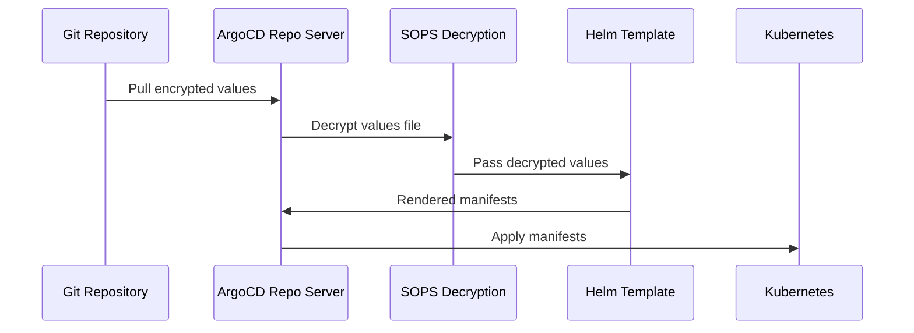

# How to Use Helm Secrets Plugin with ArgoCD

Author: [nawazdhandala](https://github.com/nawazdhandala)

Tags: ArgoCD, GitOps, Kubernetes, Helm, Security

Description: Learn how to integrate the helm-secrets plugin with ArgoCD to decrypt and deploy encrypted Helm values files using SOPS, AGE, and cloud KMS providers in a GitOps workflow.

---

Storing secrets in Git is a GitOps requirement, but storing them in plaintext is a security disaster. The helm-secrets plugin solves this by encrypting values files with Mozilla SOPS, letting you commit encrypted secrets alongside your Helm charts. Integrating this with ArgoCD means your entire deployment - including sensitive values like database passwords and API keys - lives in Git while remaining encrypted at rest.

This guide covers installing the helm-secrets plugin in ArgoCD, configuring encryption providers, creating encrypted values files, and troubleshooting common issues.

## How It Works

The helm-secrets plugin wraps standard Helm commands. When ArgoCD renders a Helm chart, it can use helm-secrets to decrypt values files before passing them to `helm template`. The decryption happens inside the ArgoCD repo server pod, and decrypted values never touch disk in plaintext.



## Installing helm-secrets in ArgoCD

You need to install both the helm-secrets plugin and SOPS in the ArgoCD repo server. The recommended approach is to build a custom repo server image.

Create a Dockerfile:

```dockerfile
# Dockerfile for custom ArgoCD repo server
FROM quay.io/argoproj/argocd:v2.9.3

# Switch to root to install tools
USER root

# Install SOPS
RUN curl -Lo /usr/local/bin/sops \
    https://github.com/getsops/sops/releases/download/v3.8.1/sops-v3.8.1.linux.amd64 && \
    chmod +x /usr/local/bin/sops

# Install AGE (encryption tool)
RUN curl -Lo /tmp/age.tar.gz \
    https://github.com/FiloSottile/age/releases/download/v1.1.1/age-v1.1.1-linux-amd64.tar.gz && \
    tar xf /tmp/age.tar.gz -C /tmp && \
    mv /tmp/age/age /usr/local/bin/ && \
    mv /tmp/age/age-keygen /usr/local/bin/ && \
    rm -rf /tmp/age*

# Install helm-secrets plugin
USER argocd
RUN helm plugin install https://github.com/jkroepke/helm-secrets --version v4.5.1
```

Build and push the image:

```bash
# Build the custom repo server image
docker build -t myorg/argocd-repo-server:v2.9.3-secrets .
docker push myorg/argocd-repo-server:v2.9.3-secrets
```

## Alternative: Init Container Approach

If you do not want to maintain a custom image, use an init container:

```yaml
# Patch for the ArgoCD repo server deployment
apiVersion: apps/v1
kind: Deployment
metadata:
  name: argocd-repo-server
  namespace: argocd
spec:
  template:
    spec:
      initContainers:
        - name: install-helm-secrets
          image: alpine:3.19
          command:
            - sh
            - -c
            - |
              # Install SOPS
              wget -O /custom-tools/sops \
                https://github.com/getsops/sops/releases/download/v3.8.1/sops-v3.8.1.linux.amd64
              chmod +x /custom-tools/sops

              # Install AGE
              wget -O /tmp/age.tar.gz \
                https://github.com/FiloSottile/age/releases/download/v1.1.1/age-v1.1.1-linux-amd64.tar.gz
              tar xf /tmp/age.tar.gz -C /tmp
              mv /tmp/age/age /custom-tools/
              mv /tmp/age/age-keygen /custom-tools/
              chmod +x /custom-tools/age /custom-tools/age-keygen
          volumeMounts:
            - name: custom-tools
              mountPath: /custom-tools
      containers:
        - name: repo-server
          env:
            - name: HELM_PLUGINS
              value: /custom-tools/helm-plugins
            - name: SOPS_AGE_KEY_FILE
              value: /sops-age/keys.txt
          volumeMounts:
            - name: custom-tools
              mountPath: /usr/local/bin/sops
              subPath: sops
            - name: custom-tools
              mountPath: /usr/local/bin/age
              subPath: age
            - name: sops-age
              mountPath: /sops-age
      volumes:
        - name: custom-tools
          emptyDir: {}
        - name: sops-age
          secret:
            secretName: sops-age-key
```

## Setting Up Encryption with AGE

AGE is the simplest encryption provider for SOPS. Generate a key pair:

```bash
# Generate an AGE key pair
age-keygen -o age-key.txt

# The public key is printed to stdout, looks like:
# age1xxxxxxxxxxxxxxxxxxxxxxxxxxxxxxxxxxxxxxxxxxxxxxxxx

# Create a Kubernetes secret with the private key
kubectl create secret generic sops-age-key \
  --namespace argocd \
  --from-file=keys.txt=age-key.txt
```

Create a `.sops.yaml` configuration in your Git repo:

```yaml
# .sops.yaml - SOPS configuration
creation_rules:
  # Encrypt only the 'data' and 'stringData' keys in secrets files
  - path_regex: .*secrets.*\.yaml$
    age: age1xxxxxxxxxxxxxxxxxxxxxxxxxxxxxxxxxxxxxxxxxxxxxxxxx

  # Default rule for all other encrypted files
  - age: age1xxxxxxxxxxxxxxxxxxxxxxxxxxxxxxxxxxxxxxxxxxxxxxxxx
```

## Creating Encrypted Values Files

Create a secrets values file and encrypt it:

```yaml
# secrets.yaml (before encryption)
database:
  password: my-super-secret-password

api:
  key: sk-1234567890abcdef

redis:
  auth:
    password: redis-secret-pass
```

Encrypt the file:

```bash
# Encrypt with SOPS using AGE
sops --encrypt --age age1xxxxxxxxxxxxxxxxxxxxxxxxxxxxxxxxxxxxxxxxxxxxxxxxx \
  secrets.yaml > secrets.enc.yaml

# Or if .sops.yaml is configured, just:
sops --encrypt secrets.yaml > secrets.enc.yaml
```

The encrypted file looks like this:

```yaml
database:
    password: ENC[AES256_GCM,data:abc123...,iv:...,tag:...,type:str]
api:
    key: ENC[AES256_GCM,data:def456...,iv:...,tag:...,type:str]
redis:
    auth:
        password: ENC[AES256_GCM,data:ghi789...,iv:...,tag:...,type:str]
sops:
    age:
        - recipient: age1xxxxxxxxxxxxxxxxxxxxxxxxxxxxxxxxxxxxxxxxxxxxxxxxx
          enc: |
            -----BEGIN AGE ENCRYPTED FILE-----
            ...
            -----END AGE ENCRYPTED FILE-----
    lastmodified: "2026-02-26T10:00:00Z"
    version: 3.8.1
```

Commit the encrypted file to Git:

```bash
git add secrets.enc.yaml .sops.yaml
git commit -m "Add encrypted secrets for my-app"
```

## Configuring ArgoCD Application

Reference the encrypted values file using the `secrets://` protocol:

```yaml
apiVersion: argoproj.io/v1alpha1
kind: Application
metadata:
  name: my-app
  namespace: argocd
spec:
  project: default
  source:
    repoURL: https://github.com/myorg/k8s-deployments.git
    targetRevision: main
    path: apps/my-app
    helm:
      valueFiles:
        - values.yaml
        - secrets+age-import:///sops-age/keys.txt?secrets.enc.yaml
  destination:
    server: https://kubernetes.default.svc
    namespace: production
```

The `secrets+age-import://` prefix tells helm-secrets to decrypt the file using the AGE key at the specified path before passing it to Helm.

## Using Cloud KMS Providers

For production environments, use a cloud KMS provider instead of AGE:

### AWS KMS

```yaml
# .sops.yaml for AWS KMS
creation_rules:
  - kms: arn:aws:kms:us-east-1:123456789012:key/your-key-id
```

The ArgoCD repo server needs AWS credentials via IAM roles for service accounts (IRSA) or environment variables.

### GCP KMS

```yaml
# .sops.yaml for GCP KMS
creation_rules:
  - gcp_kms: projects/my-project/locations/global/keyRings/my-ring/cryptoKeys/my-key
```

## Editing Encrypted Files

To modify secrets:

```bash
# Open the encrypted file in your editor
sops secrets.enc.yaml

# The file is decrypted in memory, you edit plaintext
# On save, it re-encrypts automatically

# Or decrypt to a temp file, edit, re-encrypt
sops --decrypt secrets.enc.yaml > secrets.tmp.yaml
# Edit secrets.tmp.yaml
sops --encrypt secrets.tmp.yaml > secrets.enc.yaml
rm secrets.tmp.yaml
```

## Troubleshooting

**"sops: command not found"** - SOPS is not installed in the repo server. Check that the init container ran or the custom image includes SOPS.

**"failed to decrypt"** - The AGE key is not mounted or the key does not match. Verify:

```bash
# Check the secret exists
kubectl get secret sops-age-key -n argocd

# Check the repo server pod has the volume mount
kubectl describe pod -n argocd -l app.kubernetes.io/component=repo-server
```

**"helm-secrets plugin not found"** - The plugin is not installed in the repo server's Helm plugin directory. Check `HELM_PLUGINS` environment variable.

For more on managing Helm deployments with ArgoCD, see our [complete Helm and ArgoCD guide](https://oneuptime.com/blog/post/2026-01-17-helm-argocd-gitops-deployments/view).
