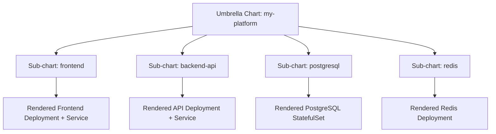

# How to Use Helm Umbrella Charts with ArgoCD

Author: [nawazdhandala](https://github.com/nawazdhandala)

Tags: ArgoCD, GitOps, Kubernetes, Helm, Umbrella Charts

Description: Learn how to deploy Helm umbrella charts through ArgoCD, managing multi-component applications as a single unit with coordinated dependency management and value inheritance.

---

Helm umbrella charts bundle multiple sub-charts into a single deployable unit. When you run a three-tier application with a frontend, backend, database, and cache layer, an umbrella chart lets you version and deploy all of those components together. Combining umbrella charts with ArgoCD gives you GitOps-driven deployment of the entire stack while ArgoCD handles sync status, health checks, and drift detection across all sub-charts.

This guide covers setting up umbrella charts for ArgoCD, managing sub-chart dependencies, passing values between layers, and handling the common gotchas.

## What Is an Umbrella Chart

An umbrella chart is a Helm chart that has no templates of its own (or very few). Instead, it declares other charts as dependencies. When Helm renders the umbrella chart, it pulls in all the sub-charts and renders them together.



## Chart Structure

Here is a typical umbrella chart layout:

```text
my-platform/
  Chart.yaml
  Chart.lock
  values.yaml
  values-staging.yaml
  values-production.yaml
  charts/        # Sub-charts go here after dependency build
  templates/
    _helpers.tpl
    namespace.yaml  # Optional shared resources
```

The `Chart.yaml` declares dependencies:

```yaml
# Chart.yaml
apiVersion: v2
name: my-platform
description: Umbrella chart for the full application stack
version: 2.1.0
appVersion: "1.0.0"

dependencies:
  - name: frontend
    version: "1.3.0"
    repository: "file://../charts/frontend"
    # Or from a Helm repo:
    # repository: "https://charts.myorg.com"
    condition: frontend.enabled

  - name: backend-api
    version: "2.0.1"
    repository: "file://../charts/backend-api"
    condition: backend-api.enabled

  - name: postgresql
    version: "13.2.24"
    repository: "https://charts.bitnami.com/bitnami"
    condition: postgresql.enabled

  - name: redis
    version: "18.4.0"
    repository: "https://charts.bitnami.com/bitnami"
    condition: redis.enabled
```

## Configuring Values for Sub-Charts

In the umbrella chart's `values.yaml`, nest values under each sub-chart's name:

```yaml
# values.yaml - umbrella chart values
frontend:
  enabled: true
  replicaCount: 2
  image:
    repository: myorg/frontend
    tag: "1.3.0"
  service:
    type: ClusterIP
    port: 80

backend-api:
  enabled: true
  replicaCount: 3
  image:
    repository: myorg/backend-api
    tag: "2.0.1"
  env:
    DATABASE_HOST: my-platform-postgresql
    REDIS_HOST: my-platform-redis-master

postgresql:
  enabled: true
  auth:
    database: myapp
    username: myapp
  primary:
    persistence:
      size: 20Gi

redis:
  enabled: true
  architecture: standalone
  auth:
    enabled: false
```

## Deploying with ArgoCD

Create an ArgoCD Application that points to the umbrella chart:

```yaml
# argocd-application.yaml
apiVersion: argoproj.io/v1alpha1
kind: Application
metadata:
  name: my-platform
  namespace: argocd
spec:
  project: default
  source:
    repoURL: https://github.com/myorg/helm-charts.git
    targetRevision: main
    path: my-platform
    helm:
      valueFiles:
        - values.yaml
        - values-production.yaml
  destination:
    server: https://kubernetes.default.svc
    namespace: production
  syncPolicy:
    automated:
      prune: true
      selfHeal: true
    syncOptions:
      - CreateNamespace=true
```

Apply it to your cluster:

```bash
# Deploy the umbrella chart through ArgoCD
kubectl apply -f argocd-application.yaml
```

## Dependency Building

ArgoCD needs to build chart dependencies before rendering. By default, ArgoCD runs `helm dependency build` automatically when it detects a `Chart.yaml` with dependencies. For this to work, ArgoCD must have access to any remote Helm repositories referenced in the dependencies.

Add external repos to ArgoCD:

```bash
# Add the Bitnami repo to ArgoCD
argocd repo add https://charts.bitnami.com/bitnami --type helm --name bitnami
```

Or declaratively:

```yaml
# helm-repo-secret.yaml
apiVersion: v1
kind: Secret
metadata:
  name: bitnami-helm-repo
  namespace: argocd
  labels:
    argocd.argoproj.io/secret-type: repository
type: Opaque
stringData:
  type: helm
  name: bitnami
  url: https://charts.bitnami.com/bitnami
```

## Environment Overrides

Use multiple values files for environment-specific configuration:

```yaml
# values-staging.yaml
frontend:
  replicaCount: 1
  image:
    tag: "develop"

backend-api:
  replicaCount: 1
  image:
    tag: "develop"

postgresql:
  primary:
    persistence:
      size: 5Gi
```

Reference both files in the ArgoCD Application:

```yaml
source:
  helm:
    valueFiles:
      - values.yaml           # Base values loaded first
      - values-staging.yaml   # Overrides loaded second
```

## Disabling Sub-Charts per Environment

The `condition` field in `Chart.yaml` dependencies lets you toggle sub-charts. For a staging environment that uses a shared database:

```yaml
# values-staging.yaml
postgresql:
  enabled: false  # Use shared staging database instead

backend-api:
  env:
    DATABASE_HOST: shared-postgres.staging.svc
```

## Handling Chart.lock in Git

When using external chart repositories, `Chart.lock` pins exact dependency versions. Commit both `Chart.yaml` and `Chart.lock` to Git. ArgoCD uses `Chart.lock` to ensure reproducible builds.

```bash
# Update dependencies locally and commit the lock file
helm dependency update my-platform/
git add my-platform/Chart.yaml my-platform/Chart.lock
git commit -m "Update chart dependencies"
```

Do not commit the `charts/` directory if you are using remote dependencies. ArgoCD downloads them during sync based on `Chart.lock`.

## Sync Waves for Ordered Deployment

Umbrella charts deploy all sub-charts simultaneously by default. To order them, add sync wave annotations in a shared template:

```yaml
# templates/sync-waves.yaml
# This ConfigMap exists solely to set sync ordering
# PostgreSQL and Redis should deploy before the app
---
apiVersion: v1
kind: ConfigMap
metadata:
  name: sync-ordering
  annotations:
    argocd.argoproj.io/sync-wave: "-1"
    helm.sh/hook-weight: "-1"
data:
  note: "Infrastructure components sync first"
```

Alternatively, use Helm hook weights in the sub-charts themselves, though this requires modifying the sub-chart templates.

## Monitoring Umbrella Chart Health

ArgoCD shows the health of every resource across all sub-charts in the resource tree view. The overall application health is determined by the worst status across all resources.

```bash
# Check the overall status
argocd app get my-platform

# View individual resources
argocd app resources my-platform

# Check sync status for specific sub-chart resources
argocd app resources my-platform --kind Deployment
```

## Common Issues

**Dependency build failures**: ArgoCD cannot reach the Helm repository. Verify the repo is registered with `argocd repo list` and that network policies allow the ArgoCD repo server to reach external URLs.

**Values not applying to sub-charts**: Ensure values are nested under the sub-chart's name exactly as it appears in `Chart.yaml`. A dependency named `backend-api` requires values under the `backend-api` key.

**CRD conflicts**: If two sub-charts try to install the same CRDs, use the `skipCrds` option on one of them:

```yaml
source:
  helm:
    skipCrds: true
```

## When to Use Umbrella Charts vs Separate Applications

Umbrella charts work well when components are tightly coupled and should be versioned together. If your frontend and backend must always deploy in lockstep, an umbrella chart enforces that. If components can evolve independently, separate ArgoCD Applications with their own sync policies give you more flexibility. For a deeper look at managing multiple applications, see our post on the [ArgoCD App of Apps pattern](https://oneuptime.com/blog/post/2026-01-30-argocd-app-of-apps-pattern/view).
