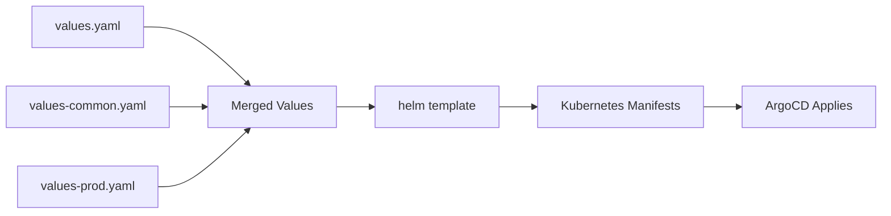

# How to Use Helm Values Files for Environment Differences in ArgoCD

Author: [nawazdhandala](https://github.com/nawazdhandala)

Tags: ArgoCD, GitOps, Kubernetes, Helm, Environment Management

Description: Learn how to use Helm values files with ArgoCD to manage environment-specific configurations across dev, staging, and production with layered value overrides.

---

Helm charts parameterize everything through values. A single chart can produce wildly different Kubernetes manifests depending on which values you pass in. This makes Helm a natural fit for managing environment differences - the chart stays the same, and each environment gets its own values file that customizes replicas, resources, feature flags, and connection strings.

ArgoCD supports Helm natively and lets you specify multiple values files per Application. This guide shows how to structure your Helm values for multi-environment deployments managed by ArgoCD.

## How Helm Values Work in ArgoCD

When ArgoCD renders a Helm application, it runs `helm template` with the values files you specify. Multiple values files are merged in order, with later files overriding earlier ones.



## Structuring Values Files

The standard approach uses a base values file plus environment-specific overrides.

```
charts/payment-service/
  Chart.yaml
  values.yaml                # Defaults for all environments
  values-dev.yaml            # Dev overrides
  values-staging.yaml        # Staging overrides
  values-prod.yaml           # Production overrides
  templates/
    deployment.yaml
    service.yaml
    hpa.yaml
    pdb.yaml
    ingress.yaml
```

### Base Values (values.yaml)

The base contains sensible defaults that work for the simplest environment.

```yaml
# values.yaml - Base configuration
replicaCount: 1

image:
  repository: myorg/payment-service
  tag: latest
  pullPolicy: IfNotPresent

service:
  type: ClusterIP
  port: 80

resources:
  requests:
    cpu: 100m
    memory: 128Mi
  limits:
    cpu: 500m
    memory: 512Mi

env:
  LOG_LEVEL: info
  PORT: "8080"

ingress:
  enabled: false

autoscaling:
  enabled: false

podDisruptionBudget:
  enabled: false

serviceMonitor:
  enabled: false

nodeSelector: {}
tolerations: []
topologySpreadConstraints: []
```

### Dev Values (values-dev.yaml)

Dev overrides are minimal. Just enable debug logging and point to dev dependencies.

```yaml
# values-dev.yaml
image:
  tag: dev-latest
  pullPolicy: Always

env:
  LOG_LEVEL: debug
  DATABASE_HOST: postgres.team-alpha-dev.svc
  REDIS_HOST: redis.team-alpha-dev.svc
  FEATURE_FLAG_NEW_CHECKOUT: "true"

ingress:
  enabled: true
  className: nginx
  hosts:
    - host: payment.dev.internal
      paths:
        - path: /
          pathType: Prefix
```

### Staging Values (values-staging.yaml)

Staging mirrors production settings more closely.

```yaml
# values-staging.yaml
replicaCount: 2

image:
  tag: v2.3.0-rc1

resources:
  requests:
    cpu: 250m
    memory: 256Mi
  limits:
    cpu: 1
    memory: 1Gi

env:
  LOG_LEVEL: info
  DATABASE_HOST: postgres.shared-databases.svc
  REDIS_HOST: redis.shared-redis.svc
  FEATURE_FLAG_NEW_CHECKOUT: "true"

ingress:
  enabled: true
  className: nginx
  hosts:
    - host: payment.staging.internal
      paths:
        - path: /
          pathType: Prefix

serviceMonitor:
  enabled: true
  interval: 30s
```

### Production Values (values-prod.yaml)

Production gets full resources, autoscaling, disruption budgets, and topology constraints.

```yaml
# values-prod.yaml
replicaCount: 5

image:
  tag: v2.2.1

resources:
  requests:
    cpu: 500m
    memory: 512Mi
  limits:
    cpu: 2
    memory: 2Gi

env:
  LOG_LEVEL: warn
  DATABASE_HOST: postgres-primary.shared-databases.svc
  REDIS_HOST: redis.shared-redis.svc
  FEATURE_FLAG_NEW_CHECKOUT: "false"

ingress:
  enabled: true
  className: nginx
  annotations:
    cert-manager.io/cluster-issuer: letsencrypt-prod
  hosts:
    - host: payment.example.com
      paths:
        - path: /
          pathType: Prefix
  tls:
    - secretName: payment-tls
      hosts:
        - payment.example.com

autoscaling:
  enabled: true
  minReplicas: 5
  maxReplicas: 20
  targetCPUUtilizationPercentage: 70
  targetMemoryUtilizationPercentage: 80

podDisruptionBudget:
  enabled: true
  minAvailable: 3

serviceMonitor:
  enabled: true
  interval: 15s

topologySpreadConstraints:
  - maxSkew: 1
    topologyKey: topology.kubernetes.io/zone
    whenUnsatisfiable: DoNotSchedule
    labelSelector:
      matchLabels:
        app: payment-service
```

## ArgoCD Application Configuration

Create an ArgoCD Application for each environment, specifying the appropriate values files.

```yaml
# Dev application
apiVersion: argoproj.io/v1alpha1
kind: Application
metadata:
  name: payment-service-dev
  namespace: argocd
  labels:
    environment: dev
spec:
  project: team-alpha
  source:
    repoURL: https://github.com/myorg/team-alpha-config.git
    path: charts/payment-service
    targetRevision: main
    helm:
      valueFiles:
        - values.yaml
        - values-dev.yaml
  destination:
    server: https://kubernetes.default.svc
    namespace: team-alpha-dev
  syncPolicy:
    automated:
      prune: true
      selfHeal: true
---
# Production application
apiVersion: argoproj.io/v1alpha1
kind: Application
metadata:
  name: payment-service-prod
  namespace: argocd
  labels:
    environment: production
spec:
  project: team-alpha
  source:
    repoURL: https://github.com/myorg/team-alpha-config.git
    path: charts/payment-service
    targetRevision: main
    helm:
      valueFiles:
        - values.yaml
        - values-prod.yaml
  destination:
    server: https://kubernetes.default.svc
    namespace: team-alpha-prod
```

## Using Values Files from a Different Repository

ArgoCD's multi-source feature lets you pull the Helm chart from one repo and values files from another. This is common when using third-party charts with your own values.

```yaml
apiVersion: argoproj.io/v1alpha1
kind: Application
metadata:
  name: prometheus-prod
  namespace: argocd
spec:
  project: platform
  sources:
    # Chart from upstream Helm repo
    - repoURL: https://prometheus-community.github.io/helm-charts
      chart: kube-prometheus-stack
      targetRevision: 56.6.0
      helm:
        valueFiles:
          - $values/monitoring/prometheus/values-prod.yaml
    # Values from your config repo
    - repoURL: https://github.com/myorg/platform-config.git
      targetRevision: main
      ref: values
  destination:
    server: https://kubernetes.default.svc
    namespace: monitoring
```

The `$values` reference points to the second source, allowing you to keep your values files in your own repository while using the upstream chart.

## Layered Values for Complex Environments

For organizations with many environment dimensions (region, tier, feature set), layer multiple values files:

```yaml
spec:
  source:
    helm:
      valueFiles:
        - values.yaml              # Base defaults
        - values-prod.yaml         # Production settings
        - values-us-east.yaml      # Region-specific
        - values-high-traffic.yaml # Traffic tier
```

Each file overrides the previous. The final merged values determine the deployment configuration.

## ArgoCD Parameter Overrides

Beyond values files, ArgoCD lets you set individual Helm parameters directly in the Application spec. Use this for values that are specific to the ArgoCD deployment rather than the chart configuration.

```yaml
spec:
  source:
    helm:
      valueFiles:
        - values.yaml
        - values-prod.yaml
      parameters:
        # Override specific values from ArgoCD
        - name: image.tag
          value: v2.3.2
        - name: replicaCount
          value: "10"
```

Parameters set this way override everything in values files. This is useful for CI/CD pipelines that update image tags.

## ApplicationSet with Dynamic Values

Generate environment-specific applications using ApplicationSets with Helm values:

```yaml
apiVersion: argoproj.io/v1alpha1
kind: ApplicationSet
metadata:
  name: payment-service
  namespace: argocd
spec:
  generators:
    - list:
        elements:
          - env: dev
            valuesFile: values-dev.yaml
            namespace: team-alpha-dev
          - env: staging
            valuesFile: values-staging.yaml
            namespace: team-alpha-staging
          - env: prod
            valuesFile: values-prod.yaml
            namespace: team-alpha-prod
  template:
    metadata:
      name: "payment-service-{{env}}"
    spec:
      project: team-alpha
      source:
        repoURL: https://github.com/myorg/team-alpha-config.git
        path: charts/payment-service
        targetRevision: main
        helm:
          valueFiles:
            - values.yaml
            - "{{valuesFile}}"
      destination:
        server: https://kubernetes.default.svc
        namespace: "{{namespace}}"
```

## Validating Values Locally

Before pushing changes, render the chart locally to verify:

```bash
# Render dev configuration
helm template payment-service charts/payment-service \
  -f charts/payment-service/values.yaml \
  -f charts/payment-service/values-dev.yaml

# Render prod configuration
helm template payment-service charts/payment-service \
  -f charts/payment-service/values.yaml \
  -f charts/payment-service/values-prod.yaml

# Compare the two
diff <(helm template ... -f values-dev.yaml) <(helm template ... -f values-prod.yaml)
```

## Best Practices

**Keep the base values minimal.** The base should work for the simplest case. Do not put production settings in the base and override them down for dev.

**Document every value.** Add comments to values.yaml explaining what each parameter does and what valid values look like. Your future self and your teammates will thank you.

**Avoid deeply nested overrides.** Helm merges values shallowly by default. Deeply nested structures can behave unexpectedly. Keep your values structure relatively flat.

**Do not store secrets in values files.** Use external secret management (Vault, External Secrets Operator, Sealed Secrets) for sensitive data. Values files in Git are not the place for passwords or API keys.

**Pin chart versions.** Always specify exact chart versions in ArgoCD Applications. Never use version ranges like `>=1.0.0` for anything beyond dev environments.

Helm values files with ArgoCD give you a clean, familiar way to manage environment differences. The chart defines the structure, values files customize it, and ArgoCD ensures each environment runs exactly what its values specify. When you need to change a production setting, it is a single-line change in a values file - reviewed, approved, and applied through GitOps.
