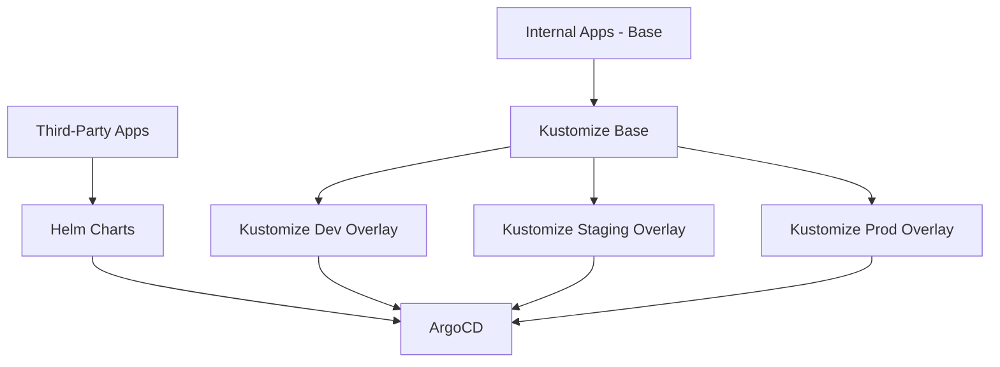

# ArgoCD Helm vs Kustomize: When to Use Each

Author: [nawazdhandala](https://github.com/nawazdhandala)

Tags: ArgoCD, GitOps, Kubernetes, Helm, Kustomize

Description: A practical guide to choosing between Helm and Kustomize in ArgoCD, with real-world examples showing when each tool shines and how to combine them effectively.

---

When configuring ArgoCD applications, you inevitably face the Helm vs Kustomize question. Both are first-class citizens in ArgoCD. Both can template and customize Kubernetes manifests. Both have large communities and extensive documentation. The choice depends on your use case, team preferences, and the complexity of your configuration needs. This article provides a practical framework for deciding, with real examples from production deployments.

## How ArgoCD Handles Each Tool

ArgoCD supports Helm and Kustomize natively through its repo server component. Understanding how ArgoCD processes each tool helps explain their different behaviors.

### Helm in ArgoCD

ArgoCD renders Helm charts using `helm template` during the sync process. It does not use `helm install` or maintain Helm releases. The rendered manifests are then applied to the cluster like any other Kubernetes YAML.

```yaml
# ArgoCD Application using Helm
apiVersion: argoproj.io/v1alpha1
kind: Application
metadata:
  name: my-app
  namespace: argocd
spec:
  source:
    repoURL: https://charts.example.com
    chart: my-app
    targetRevision: 1.5.0
    helm:
      # Override values inline
      values: |
        replicas: 3
        image:
          repository: myregistry/my-app
          tag: v2.1.0
        resources:
          requests:
            cpu: 200m
            memory: 256Mi
      # Or use a values file from the repo
      valueFiles:
        - values-production.yaml
      # Individual parameter overrides
      parameters:
        - name: service.type
          value: ClusterIP
```

### Kustomize in ArgoCD

ArgoCD runs `kustomize build` to generate the final manifests. It applies the resulting YAML to the cluster.

```yaml
# ArgoCD Application using Kustomize
apiVersion: argoproj.io/v1alpha1
kind: Application
metadata:
  name: my-app
  namespace: argocd
spec:
  source:
    repoURL: https://github.com/org/gitops-repo.git
    path: apps/my-app/overlays/production
    targetRevision: main
    kustomize:
      # Override the image
      images:
        - myregistry/my-app:v2.1.0
      # Add a common label
      commonLabels:
        environment: production
      # Add a name prefix
      namePrefix: prod-
```

## Helm: Strengths and Weaknesses

### When Helm Excels

**Third-party applications.** Helm's biggest advantage is the massive ecosystem of pre-built charts. When deploying Prometheus, Nginx, PostgreSQL, or any popular application, there is almost certainly a well-maintained Helm chart available.

```bash
# Deploying third-party software with Helm is straightforward
# ArgoCD Application for Prometheus Stack
apiVersion: argoproj.io/v1alpha1
kind: Application
metadata:
  name: prometheus-stack
spec:
  source:
    repoURL: https://prometheus-community.github.io/helm-charts
    chart: kube-prometheus-stack
    targetRevision: 56.6.2
    helm:
      values: |
        prometheus:
          prometheusSpec:
            retention: 30d
            storageSpec:
              volumeClaimTemplate:
                spec:
                  resources:
                    requests:
                      storage: 100Gi
        grafana:
          enabled: true
          adminPassword: use-external-secret
```

**Complex templating.** Helm's Go templating engine supports conditionals, loops, functions, and complex logic.

```yaml
# Helm template with conditional logic
{{- if .Values.autoscaling.enabled }}
apiVersion: autoscaling/v2
kind: HorizontalPodAutoscaler
metadata:
  name: {{ include "myapp.fullname" . }}
spec:
  scaleTargetRef:
    apiVersion: apps/v1
    kind: Deployment
    name: {{ include "myapp.fullname" . }}
  minReplicas: {{ .Values.autoscaling.minReplicas }}
  maxReplicas: {{ .Values.autoscaling.maxReplicas }}
  metrics:
    {{- range .Values.autoscaling.metrics }}
    - type: {{ .type }}
      resource:
        name: {{ .resource.name }}
        target:
          type: Utilization
          averageUtilization: {{ .resource.targetAverageUtilization }}
    {{- end }}
{{- end }}
```

**Versioned releases.** Helm charts have semantic versioning, making it easy to pin and upgrade versions of third-party software.

### Helm Weaknesses

**Template debugging.** When Helm templates fail, the error messages can be cryptic. Debugging deeply nested template logic is painful.

```bash
# Debugging Helm template errors
# "error calling include: template: no template 'myapp.labels' associated with template 'gotpl'"
# Good luck figuring out which file and line this refers to
```

**Hidden complexity.** Helm charts from the community can be extremely complex with hundreds of configurable values, making it hard to understand what you are actually deploying.

**No dry-run diff.** While ArgoCD shows diffs, understanding what changed in a Helm values update versus the actual rendered output requires rendering both versions.

## Kustomize: Strengths and Weaknesses

### When Kustomize Excels

**Environment overlays.** Kustomize's overlay system is perfect for managing the same application across different environments.

```
apps/my-app/
  base/
    kustomization.yaml
    deployment.yaml
    service.yaml
    configmap.yaml
  overlays/
    dev/
      kustomization.yaml
      replica-count.yaml
    staging/
      kustomization.yaml
      replica-count.yaml
      resource-limits.yaml
    production/
      kustomization.yaml
      replica-count.yaml
      resource-limits.yaml
      hpa.yaml
```

```yaml
# base/kustomization.yaml
apiVersion: kustomize.config.k8s.io/v1beta1
kind: Kustomization
resources:
  - deployment.yaml
  - service.yaml
  - configmap.yaml

# overlays/production/kustomization.yaml
apiVersion: kustomize.config.k8s.io/v1beta1
kind: Kustomization
resources:
  - ../../base
  - hpa.yaml
patches:
  - path: replica-count.yaml
  - path: resource-limits.yaml
images:
  - name: myregistry/my-app
    newTag: v2.1.0
namespace: production
```

**Plain YAML.** Kustomize works with standard Kubernetes YAML. There is no template language to learn. What you see is what gets deployed (plus patches).

```yaml
# overlays/production/replica-count.yaml
apiVersion: apps/v1
kind: Deployment
metadata:
  name: my-app
spec:
  replicas: 5
```

This patch is valid Kubernetes YAML. There is no special syntax to learn.

**Strategic merge patches.** Kustomize can surgically modify specific fields without replacing entire resources.

```yaml
# Add a sidecar container to the base deployment
apiVersion: apps/v1
kind: Deployment
metadata:
  name: my-app
spec:
  template:
    spec:
      containers:
        - name: log-forwarder
          image: fluent/fluent-bit:latest
          resources:
            requests:
              cpu: 50m
              memory: 64Mi
```

### Kustomize Weaknesses

**No templating logic.** Kustomize deliberately avoids templating. If you need conditionals or loops, you cannot express them in Kustomize alone.

**Verbose for complex variations.** When environments differ significantly, the number of patch files can grow unwieldy.

**No package ecosystem.** There is no equivalent to Helm's chart repository. You cannot install third-party applications with a single Kustomize command.

## Decision Framework

Use this framework to decide which tool fits each use case:

| Scenario | Recommended | Reason |
|----------|-------------|--------|
| Third-party software (Prometheus, Nginx, etc.) | Helm | Charts already exist and are maintained |
| Internal applications with multiple environments | Kustomize | Clean overlay model without template complexity |
| Applications needing conditional resources | Helm | Go templating supports conditionals |
| Teams new to Kubernetes | Kustomize | No template language to learn |
| Complex parameterized deployments | Helm | Values-based customization is more flexible |
| Simple applications with minor environment differences | Kustomize | Less overhead than a full Helm chart |

## Combining Helm and Kustomize

ArgoCD supports using both tools together. This is often the best approach.

### Kustomize Post-Rendering of Helm Charts

Use Helm for the base chart and Kustomize to apply environment-specific patches.

```yaml
# ArgoCD multi-source Application
apiVersion: argoproj.io/v1alpha1
kind: Application
metadata:
  name: my-app
spec:
  sources:
    - repoURL: https://charts.example.com
      chart: my-app
      targetRevision: 1.5.0
      helm:
        valueFiles:
          - $values/apps/my-app/values-production.yaml
    - repoURL: https://github.com/org/gitops-repo.git
      targetRevision: main
      ref: values
```

### Kustomize with Helm Chart Inflator

```yaml
# kustomization.yaml that uses a Helm chart as a base
apiVersion: kustomize.config.k8s.io/v1beta1
kind: Kustomization

helmCharts:
  - name: my-app
    repo: https://charts.example.com
    version: 1.5.0
    releaseName: my-app
    namespace: production
    valuesFile: values.yaml

patches:
  - path: production-patches.yaml
```

## Real-World Pattern

In practice, many organizations adopt this pattern:

- **Helm** for all third-party applications and shared internal libraries
- **Kustomize** for application-specific deployment configurations and environment overlays
- **Multi-source ArgoCD Applications** to combine both where needed



Neither Helm nor Kustomize is universally better. They are complementary tools that solve different aspects of Kubernetes configuration management. The best ArgoCD deployments use both, choosing the right tool for each situation. For monitoring your ArgoCD applications regardless of which configuration tool you use, explore [ArgoCD deployment monitoring best practices](https://oneuptime.com/blog/post/2026-02-26-argocd-vs-fluxcd-comparison/view).
