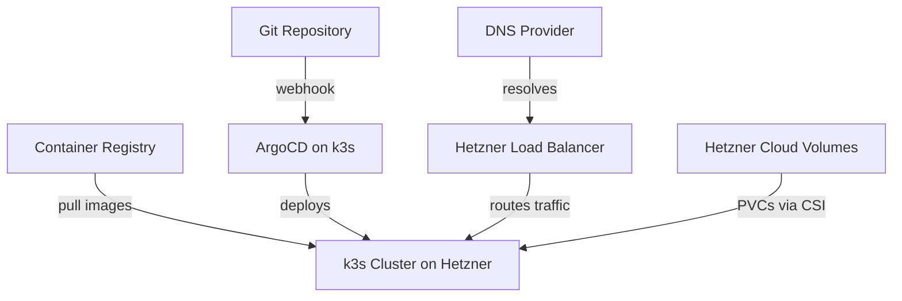

# How to Use ArgoCD with Hetzner Cloud Kubernetes

Author: [nawazdhandala](https://github.com/nawazdhandala)

Tags: ArgoCD, GitOps, Kubernetes, Hetzner Cloud, Cost Optimization

Description: Learn how to deploy ArgoCD on Hetzner Cloud Kubernetes for a cost-effective GitOps workflow with load balancers, volumes, and networking configuration.

---

Hetzner Cloud has become the go-to choice for developers and small teams who want powerful infrastructure at a fraction of the cost of major cloud providers. While Hetzner does not offer a managed Kubernetes service like EKS or GKE, you can run Kubernetes on Hetzner using tools like k3s, kubeadm, or the community-maintained Hetzner Cloud Controller Manager. Combined with ArgoCD, this gives you a fully functional GitOps pipeline that costs a fraction of what you would pay elsewhere.

This guide covers setting up ArgoCD on Kubernetes running on Hetzner Cloud, integrating with Hetzner's load balancers and volumes, and the practical considerations specific to Hetzner's platform.

## Why Hetzner Cloud for Kubernetes?

The pricing is the headline. A Hetzner CX31 (2 vCPU, 8GB RAM, 80GB SSD) costs around 7 euros per month. Compare that to equivalent instances on AWS or GCP, and you are looking at 3 to 5 times the cost. For a three-node Kubernetes cluster running ArgoCD, your monthly bill might be 21 euros.

## Prerequisites

- A Hetzner Cloud account
- Three or more servers (CX21 or CX31 recommended)
- Kubernetes installed (k3s, kubeadm, or similar)
- Hetzner Cloud API token
- kubectl configured with your cluster

## Step 1: Bootstrap Kubernetes on Hetzner

The most popular approach is using k3s with the Hetzner Cloud Controller Manager.

```bash
# On the first node, install k3s
curl -sfL https://get.k3s.io | INSTALL_K3S_EXEC="server \
  --disable-cloud-controller \
  --disable servicelb \
  --disable traefik \
  --kubelet-arg cloud-provider=external \
  --tls-san <LOAD_BALANCER_IP>" sh -

# Get the token for joining additional nodes
cat /var/lib/rancher/k3s/server/node-token

# On worker nodes
curl -sfL https://get.k3s.io | K3S_URL=https://<MASTER_IP>:6443 \
  K3S_TOKEN=<NODE_TOKEN> \
  INSTALL_K3S_EXEC="agent --kubelet-arg cloud-provider=external" sh -
```

### Install the Hetzner Cloud Controller Manager

The cloud controller manager enables native Hetzner Cloud integration for load balancers and node management.

```bash
# Create the Hetzner Cloud secret
kubectl create secret generic hcloud \
  --namespace kube-system \
  --from-literal=token=<HETZNER_API_TOKEN> \
  --from-literal=network=<NETWORK_ID>

# Deploy the cloud controller manager
kubectl apply -f https://github.com/hetznercloud/hcloud-cloud-controller-manager/releases/latest/download/ccm-networks.yaml
```

### Install the Hetzner CSI Driver

For persistent volumes backed by Hetzner Cloud Volumes.

```bash
# Deploy the CSI driver
kubectl apply -f https://raw.githubusercontent.com/hetznercloud/csi-driver/main/deploy/kubernetes/hcloud-csi.yml
```

## Step 2: Install ArgoCD

```bash
# Create namespace and install ArgoCD
kubectl create namespace argocd
kubectl apply -n argocd -f https://raw.githubusercontent.com/argoproj/argo-cd/stable/manifests/install.yaml

# Wait for pods
kubectl wait --for=condition=Ready pod --all -n argocd --timeout=300s

# Get initial admin password
kubectl -n argocd get secret argocd-initial-admin-secret \
  -o jsonpath="{.data.password}" | base64 -d && echo
```

## Step 3: Expose ArgoCD with Hetzner Load Balancer

With the cloud controller manager installed, you can create LoadBalancer services that automatically provision Hetzner Cloud Load Balancers.

```yaml
# argocd-lb.yaml
apiVersion: v1
kind: Service
metadata:
  name: argocd-server-lb
  namespace: argocd
  annotations:
    # Hetzner-specific load balancer annotations
    load-balancer.hetzner.cloud/name: "argocd-lb"
    load-balancer.hetzner.cloud/location: "fsn1"
    load-balancer.hetzner.cloud/use-private-ip: "true"
    load-balancer.hetzner.cloud/uses-proxyprotocol: "true"
    load-balancer.hetzner.cloud/algorithm-type: "round_robin"
spec:
  type: LoadBalancer
  ports:
    - name: https
      port: 443
      targetPort: 8080
      protocol: TCP
  selector:
    app.kubernetes.io/name: argocd-server
```

### Using Nginx Ingress with Hetzner LB

For a production setup, use a single load balancer with an ingress controller.

```yaml
# nginx-ingress-app.yaml
apiVersion: argoproj.io/v1alpha1
kind: Application
metadata:
  name: nginx-ingress
  namespace: argocd
spec:
  project: default
  source:
    repoURL: https://kubernetes.github.io/ingress-nginx
    chart: ingress-nginx
    targetRevision: 4.x
    helm:
      values: |
        controller:
          service:
            annotations:
              load-balancer.hetzner.cloud/name: "ingress-lb"
              load-balancer.hetzner.cloud/location: "fsn1"
              load-balancer.hetzner.cloud/use-private-ip: "true"
              load-balancer.hetzner.cloud/uses-proxyprotocol: "true"
            type: LoadBalancer
          config:
            use-proxy-protocol: "true"
  destination:
    server: https://kubernetes.default.svc
    namespace: ingress-nginx
  syncPolicy:
    automated:
      prune: true
      selfHeal: true
    syncOptions:
      - CreateNamespace=true
```

Then create the ArgoCD ingress.

```yaml
# argocd-ingress.yaml
apiVersion: networking.k8s.io/v1
kind: Ingress
metadata:
  name: argocd-server
  namespace: argocd
  annotations:
    nginx.ingress.kubernetes.io/ssl-passthrough: "true"
    nginx.ingress.kubernetes.io/backend-protocol: "HTTPS"
    cert-manager.io/cluster-issuer: "letsencrypt-prod"
spec:
  ingressClassName: nginx
  tls:
    - hosts:
        - argocd.example.com
      secretName: argocd-tls
  rules:
    - host: argocd.example.com
      http:
        paths:
          - path: /
            pathType: Prefix
            backend:
              service:
                name: argocd-server
                port:
                  number: 443
```

## Step 4: Configure Persistent Storage

Hetzner Cloud Volumes are available as persistent volumes through the CSI driver.

```yaml
# pvc-hetzner.yaml
apiVersion: v1
kind: PersistentVolumeClaim
metadata:
  name: app-data
spec:
  accessModes:
    - ReadWriteOnce
  storageClassName: hcloud-volumes
  resources:
    requests:
      storage: 10Gi
```

## Step 5: Container Registry Setup

Hetzner does not offer a managed container registry, so you have several options:

### Option A: Use an External Registry

```yaml
# github-registry-secret.yaml
apiVersion: v1
kind: Secret
metadata:
  name: ghcr-repo
  namespace: argocd
  labels:
    argocd.argoproj.io/secret-type: repository
stringData:
  type: helm
  name: ghcr
  enableOCI: "true"
  url: ghcr.io/my-org
  username: "<GITHUB_USERNAME>"
  password: "<GITHUB_PAT>"
```

### Option B: Run Your Own Harbor Registry

Deploy Harbor on your Hetzner cluster using ArgoCD.

```yaml
# harbor-app.yaml
apiVersion: argoproj.io/v1alpha1
kind: Application
metadata:
  name: harbor
  namespace: argocd
spec:
  project: default
  source:
    repoURL: https://helm.goharbor.io
    chart: harbor
    targetRevision: 1.14.x
    helm:
      values: |
        expose:
          type: ingress
          ingress:
            hosts:
              core: registry.example.com
            className: nginx
        persistence:
          persistentVolumeClaim:
            registry:
              storageClass: hcloud-volumes
              size: 50Gi
  destination:
    server: https://kubernetes.default.svc
    namespace: harbor
  syncPolicy:
    automated:
      prune: true
      selfHeal: true
    syncOptions:
      - CreateNamespace=true
```

## Architecture on Hetzner Cloud



## Cost Comparison

Here is a realistic cost comparison for a small ArgoCD setup.

| Component | Hetzner | AWS (EKS) | GCP (GKE) |
|-----------|---------|-----------|-----------|
| Control plane | Free (self-managed) | ~$73/month | ~$73/month |
| 3 worker nodes (4 vCPU, 8GB) | ~$21/month | ~$150/month | ~$130/month |
| Load balancer | ~$6/month | ~$18/month | ~$18/month |
| 50GB storage | ~$2/month | ~$5/month | ~$4/month |
| **Total** | **~$29/month** | **~$246/month** | **~$225/month** |

That is roughly an 8x cost difference for similar resources.

## Hetzner-Specific Tips

### Server Locations

Hetzner has data centers in:
- Falkenstein (fsn1) - Germany
- Nuremberg (nbg1) - Germany
- Helsinki (hel1) - Finland
- Ashburn (ash) - USA

Choose the location closest to your users and keep all servers in the same location for the private network.

### Private Networking

Always use Hetzner's private networking between nodes. This keeps inter-node traffic off the public internet and avoids bandwidth charges.

```bash
# Create a private network
hcloud network create --name k8s-network --ip-range 10.0.0.0/8

# Add a subnet
hcloud network add-subnet k8s-network \
  --type server --network-zone eu-central --ip-range 10.0.0.0/24
```

### Firewall Rules

Hetzner Cloud Firewalls are free. Use them to restrict access to your nodes.

```bash
# Create a firewall
hcloud firewall create --name k8s-firewall

# Allow SSH from your IP
hcloud firewall add-rule k8s-firewall --direction in --protocol tcp \
  --port 22 --source-ips <YOUR_IP>/32

# Allow Kubernetes API
hcloud firewall add-rule k8s-firewall --direction in --protocol tcp \
  --port 6443 --source-ips <YOUR_IP>/32

# Allow HTTP/HTTPS from anywhere (for ingress)
hcloud firewall add-rule k8s-firewall --direction in --protocol tcp \
  --port 80 --source-ips 0.0.0.0/0
hcloud firewall add-rule k8s-firewall --direction in --protocol tcp \
  --port 443 --source-ips 0.0.0.0/0
```

## Troubleshooting on Hetzner

### Cloud Controller Manager Not Working

If load balancers are not being created, check the CCM logs.

```bash
kubectl logs -n kube-system -l app=hcloud-cloud-controller-manager
```

### Volume Mount Failures

Hetzner volumes can only be attached to one server at a time. Check that the volume is not stuck on a previous node.

```bash
hcloud volume list
```

### Node Connectivity Issues

Make sure all nodes are on the same private network and the firewall allows inter-node traffic.

```bash
# Allow all traffic within the private network
hcloud firewall add-rule k8s-firewall --direction in --protocol tcp \
  --port any --source-ips 10.0.0.0/8
```

## Conclusion

Running ArgoCD on Hetzner Cloud is the most cost-effective way to get a production-quality GitOps pipeline. While you sacrifice the convenience of a managed Kubernetes service, tools like k3s and the Hetzner Cloud Controller Manager make the setup manageable. The combination of extremely low costs, solid hardware, and European data centers makes Hetzner an excellent choice for teams that want to maximize their infrastructure budget without compromising on GitOps capabilities.
