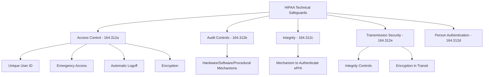

# How to Implement HIPAA-Compliant Deployments with ArgoCD

Author: [nawazdhandala](https://github.com/nawazdhandala)

Tags: ArgoCD, GitOps, Kubernetes, HIPAA, Healthcare Compliance

Description: Learn how to configure ArgoCD deployments to meet HIPAA security and privacy requirements for healthcare applications handling protected health information.

---

Deploying healthcare applications that handle Protected Health Information (PHI) requires meeting strict HIPAA Security Rule requirements. Every deployment pipeline must demonstrate access controls, audit trails, encryption, and integrity verification. ArgoCD's GitOps model aligns well with HIPAA requirements because it provides inherent auditability, but there are specific configurations you need to get right.

In this guide, I will walk through configuring ArgoCD to meet the key HIPAA technical safeguards for deployment pipelines handling ePHI (electronic Protected Health Information).

## HIPAA Technical Safeguards Overview

The HIPAA Security Rule defines three categories of safeguards: administrative, physical, and technical. For deployment pipelines, the technical safeguards are most relevant.



## Access Control (164.312(a))

### Unique User Identification

Every person who interacts with ArgoCD must have a unique identifier. Disable the default admin account and enforce SSO.

```yaml
# argocd-cm.yaml
apiVersion: v1
kind: ConfigMap
metadata:
  name: argocd-cm
  namespace: argocd
data:
  # Disable local admin account
  admin.enabled: "false"
  # Configure OIDC for unique user identification
  oidc.config: |
    name: Okta
    issuer: https://myorg.okta.com/oauth2/default
    clientID: argocd-client-id
    clientSecret: $oidc.okta.clientSecret
    requestedScopes:
      - openid
      - profile
      - email
      - groups
    requestedIDTokenClaims:
      groups:
        essential: true
```

### Role-Based Access Control

Implement least-privilege access for all ArgoCD operations.

```yaml
# argocd-rbac-cm.yaml
apiVersion: v1
kind: ConfigMap
metadata:
  name: argocd-rbac-cm
  namespace: argocd
data:
  policy.csv: |
    # PHI application access restricted to authorized personnel
    p, role:phi-deployer, applications, get, phi-project/*, allow
    p, role:phi-deployer, applications, sync, phi-project/*, allow
    p, role:phi-deployer, applications, action/*, phi-project/*, allow

    # PHI viewer - can see status but not deploy
    p, role:phi-viewer, applications, get, phi-project/*, allow

    # General developers cannot access PHI applications
    p, role:developer, applications, get, non-phi-project/*, allow
    p, role:developer, applications, sync, non-phi-project/*, allow

    # Security team has audit access to everything
    p, role:security-auditor, applications, get, */*, allow
    p, role:security-auditor, logs, get, */*, allow

    # Map SSO groups
    g, okta-group:phi-deployers, role:phi-deployer
    g, okta-group:phi-viewers, role:phi-viewer
    g, okta-group:developers, role:developer
    g, okta-group:security, role:security-auditor

  # Default is no access
  policy.default: ""
```

### Emergency Access Procedure

HIPAA requires an emergency access procedure. Create a break-glass mechanism.

```yaml
# break-glass-account.yaml
apiVersion: v1
kind: ConfigMap
metadata:
  name: argocd-cm
  namespace: argocd
data:
  # Emergency account - credentials in sealed secret, rotated regularly
  accounts.emergency-admin: apiKey, login
  accounts.emergency-admin.enabled: "true"
```

```yaml
# Seal the emergency credentials
apiVersion: bitnami.com/v1alpha1
kind: SealedSecret
metadata:
  name: argocd-secret
  namespace: argocd
spec:
  encryptedData:
    accounts.emergency-admin.password: AgBy3...encrypted...
```

Store the emergency credentials in a physical safe or a separate secrets manager with its own audit trail. Document the procedure for when and how to use the emergency account.

### Session Management

Configure automatic session timeouts to meet the automatic logoff requirement.

```yaml
# argocd-cmd-params-cm.yaml
apiVersion: v1
kind: ConfigMap
metadata:
  name: argocd-cmd-params-cm
  namespace: argocd
data:
  # Session timeout - 15 minutes of inactivity
  server.sessionDuration: "15m"
```

## Audit Controls (164.312(b))

HIPAA requires mechanisms to record and examine activity in systems containing ePHI.

```yaml
# Configure comprehensive audit logging
apiVersion: v1
kind: ConfigMap
metadata:
  name: argocd-notifications-cm
  namespace: argocd
data:
  service.webhook.hipaa-audit: |
    url: https://audit.myorg.com/api/hipaa-events
    headers:
      - name: Authorization
        value: Bearer $hipaa-audit-token
      - name: Content-Type
        value: application/json

  template.hipaa-audit-event: |
    webhook:
      hipaa-audit:
        method: POST
        body: |
          {
            "event_type": "deployment_change",
            "hipaa_relevant": true,
            "timestamp": "{{.app.status.operationState.finishedAt}}",
            "user": "{{.app.status.operationState.operation.initiatedBy.username}}",
            "application": "{{.app.metadata.name}}",
            "project": "{{.app.spec.project}}",
            "action": "sync",
            "status": "{{.app.status.operationState.phase}}",
            "revision": "{{.app.status.operationState.syncResult.revision}}",
            "cluster": "{{.app.spec.destination.server}}",
            "namespace": "{{.app.spec.destination.namespace}}"
          }

  # Trigger for all PHI application syncs
  trigger.on-phi-sync: |
    - when: app.spec.project == 'phi-project' and app.status.operationState.phase in ['Succeeded', 'Failed', 'Error']
      send: [hipaa-audit-event]

  # Annotate PHI applications to receive audit notifications
  defaultTriggers: |
    - on-phi-sync
```

Configure audit log retention for 6 years as required by HIPAA.

## Integrity Controls (164.312(c))

Ensure that ePHI is not altered or destroyed in an unauthorized manner.

### Git Signed Commits

Require signed commits on repositories that contain PHI application configurations.

```yaml
# Pre-sync hook to verify commit signatures
apiVersion: batch/v1
kind: Job
metadata:
  name: verify-commit-signature
  annotations:
    argocd.argoproj.io/hook: PreSync
    argocd.argoproj.io/hook-delete-policy: HookSucceeded
spec:
  template:
    spec:
      containers:
        - name: verifier
          image: bitnami/git:latest
          command:
            - /bin/sh
            - -c
            - |
              # Clone the repo and verify the commit signature
              git clone "$REPO_URL" /tmp/repo
              cd /tmp/repo
              git checkout "$REVISION"

              # Verify GPG signature
              if ! git verify-commit HEAD 2>/dev/null; then
                echo "ERROR: Commit $REVISION is not signed. HIPAA compliance requires signed commits."
                exit 1
              fi

              echo "Commit signature verified successfully"
          env:
            - name: REPO_URL
              value: "https://github.com/myorg/phi-gitops.git"
            - name: REVISION
              value: "{{.app.status.operationState.syncResult.revision}}"
      restartPolicy: Never
```

### Image Integrity Verification

Verify container image signatures before deployment.

```yaml
# kyverno-image-verification.yaml
apiVersion: kyverno.io/v1
kind: ClusterPolicy
metadata:
  name: verify-phi-images
spec:
  validationFailureAction: Enforce
  rules:
    - name: verify-image-signature
      match:
        any:
          - resources:
              kinds:
                - Pod
              namespaces:
                - phi-*
      verifyImages:
        - imageReferences:
            - "registry.myorg.com/phi-*"
          attestors:
            - count: 1
              entries:
                - keys:
                    publicKeys: |
                      -----BEGIN PUBLIC KEY-----
                      ... your cosign public key ...
                      -----END PUBLIC KEY-----
```

## Transmission Security (164.312(e))

All data in transit must be encrypted.

```yaml
# ArgoCD TLS configuration
apiVersion: v1
kind: ConfigMap
metadata:
  name: argocd-cmd-params-cm
  namespace: argocd
data:
  # Force TLS for all connections
  server.insecure: "false"
  # Configure TLS for repo server communication
  reposerver.tls.enabled: "true"
  # Redis TLS
  redis.tls.enabled: "true"
```

Ensure your ArgoCD installation uses TLS for all internal communication between components.

```yaml
# ingress-tls.yaml
apiVersion: networking.k8s.io/v1
kind: Ingress
metadata:
  name: argocd-server
  namespace: argocd
  annotations:
    nginx.ingress.kubernetes.io/ssl-redirect: "true"
    nginx.ingress.kubernetes.io/force-ssl-redirect: "true"
    # HSTS header
    nginx.ingress.kubernetes.io/configuration-snippet: |
      more_set_headers "Strict-Transport-Security: max-age=31536000; includeSubDomains";
spec:
  tls:
    - hosts:
        - argocd.myorg.com
      secretName: argocd-tls
  rules:
    - host: argocd.myorg.com
      http:
        paths:
          - path: /
            pathType: Prefix
            backend:
              service:
                name: argocd-server
                port:
                  number: 443
```

## PHI Application Project Isolation

Create a dedicated ArgoCD project for PHI applications with strict isolation.

```yaml
# phi-project.yaml
apiVersion: argoproj.io/v1alpha1
kind: AppProject
metadata:
  name: phi-project
  namespace: argocd
spec:
  description: HIPAA-compliant PHI applications
  sourceRepos:
    - https://github.com/myorg/phi-gitops.git
  destinations:
    - namespace: "phi-*"
      server: https://phi-cluster.myorg.com
  # No auto-sync for PHI applications
  syncWindows:
    - kind: allow
      schedule: "0 6 * * 1-5"
      duration: 12h
      applications:
        - "*"
      manualSync: true
  clusterResourceWhitelist: []  # No cluster-level resources
  namespaceResourceWhitelist:
    - group: apps
      kind: Deployment
    - group: ""
      kind: Service
    - group: ""
      kind: ConfigMap
    - group: ""
      kind: Secret
```

## Conclusion

HIPAA-compliant deployments with ArgoCD require attention to five key areas: unique user identification through SSO, comprehensive audit logging with 6-year retention, integrity verification through signed commits and images, encryption for all data in transit, and strict access controls through RBAC and project isolation. The GitOps model actually makes HIPAA compliance easier because every change is version-controlled and auditable by default. The main work is configuring the additional controls around authentication, encryption, and audit log forwarding. Once set up, your deployment pipeline becomes a compliance asset rather than a liability.
