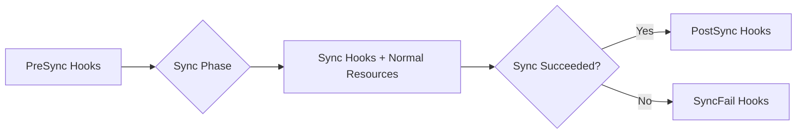

# How to Use the argocd.argoproj.io/hook Annotation

Author: [nawazdhandala](https://github.com/nawazdhandala)

Tags: ArgoCD, GitOps, Kubernetes, Sync Hooks, Deployment Automation

Description: Master the ArgoCD hook annotation to run database migrations, smoke tests, notifications, and cleanup tasks at specific phases of the sync lifecycle.

---

The `argocd.argoproj.io/hook` annotation transforms a Kubernetes resource into a sync hook - a resource that runs at a specific phase of ArgoCD's sync lifecycle rather than being applied as part of the normal sync. Hooks are typically Jobs or Pods that perform tasks like database migrations, smoke tests, cache warming, or notification sending.

## Hook phases

ArgoCD defines five hook phases:

```yaml
# PreSync - runs BEFORE the main sync operation
argocd.argoproj.io/hook: PreSync

# Sync - runs DURING the main sync (alongside normal resources)
argocd.argoproj.io/hook: Sync

# PostSync - runs AFTER all Sync resources are healthy
argocd.argoproj.io/hook: PostSync

# SyncFail - runs ONLY when the sync operation fails
argocd.argoproj.io/hook: SyncFail

# Skip - this resource is never applied (useful for temporarily disabling)
argocd.argoproj.io/hook: Skip
```



## PreSync hooks

PreSync hooks run before any normal resources are applied. Use them for:

### Database migrations

```yaml
apiVersion: batch/v1
kind: Job
metadata:
  name: db-migrate
  namespace: my-app
  annotations:
    argocd.argoproj.io/hook: PreSync
    argocd.argoproj.io/hook-delete-policy: BeforeHookCreation
    argocd.argoproj.io/sync-wave: "-1"  # Can combine with sync waves
spec:
  template:
    metadata:
      labels:
        app: db-migrate
    spec:
      containers:
        - name: migrate
          image: myorg/app:v1.2.3
          command: ["./migrate", "--direction", "up"]
          env:
            - name: DATABASE_URL
              valueFrom:
                secretKeyRef:
                  name: db-credentials
                  key: url
      restartPolicy: Never
  backoffLimit: 3
  activeDeadlineSeconds: 300  # Timeout after 5 minutes
```

### Pre-deployment validation

```yaml
apiVersion: batch/v1
kind: Job
metadata:
  name: pre-deploy-check
  annotations:
    argocd.argoproj.io/hook: PreSync
    argocd.argoproj.io/hook-delete-policy: BeforeHookCreation
spec:
  template:
    spec:
      containers:
        - name: validate
          image: myorg/deploy-tools:latest
          command: ["/bin/sh", "-c"]
          args:
            - |
              # Check cluster capacity
              echo "Checking cluster capacity..."
              AVAILABLE_CPU=$(kubectl top nodes --no-headers | awk '{sum+=$3} END {print sum}')
              if [ "$AVAILABLE_CPU" -gt 90 ]; then
                echo "ERROR: Cluster CPU usage too high for deployment"
                exit 1
              fi

              # Check database connectivity
              echo "Checking database connectivity..."
              pg_isready -h postgres.my-app.svc -p 5432
              if [ $? -ne 0 ]; then
                echo "ERROR: Database is not reachable"
                exit 1
              fi

              echo "Pre-deployment checks passed"
      restartPolicy: Never
  backoffLimit: 1
```

### Configuration backup

```yaml
apiVersion: batch/v1
kind: Job
metadata:
  name: backup-config
  annotations:
    argocd.argoproj.io/hook: PreSync
    argocd.argoproj.io/hook-delete-policy: HookSucceeded
spec:
  template:
    spec:
      containers:
        - name: backup
          image: bitnami/kubectl:latest
          command: ["/bin/sh", "-c"]
          args:
            - |
              # Backup current ConfigMaps before update
              kubectl get configmap -n my-app -o yaml > /backup/configmaps-$(date +%s).yaml
              # Backup current deployment spec
              kubectl get deployment -n my-app -o yaml > /backup/deployments-$(date +%s).yaml
      restartPolicy: Never
```

## Sync hooks

Sync hooks run alongside normal resources during the sync phase. They are applied together with regular resources:

```yaml
apiVersion: batch/v1
kind: Job
metadata:
  name: seed-data
  annotations:
    argocd.argoproj.io/hook: Sync
    argocd.argoproj.io/hook-delete-policy: BeforeHookCreation
    argocd.argoproj.io/sync-wave: "1"  # After Deployment in wave 0
spec:
  template:
    spec:
      containers:
        - name: seed
          image: myorg/app:v1.2.3
          command: ["./seed-data.sh"]
      restartPolicy: Never
```

## PostSync hooks

PostSync hooks run after all sync resources are healthy. Use them for:

### Smoke tests

```yaml
apiVersion: batch/v1
kind: Job
metadata:
  name: smoke-test
  annotations:
    argocd.argoproj.io/hook: PostSync
    argocd.argoproj.io/hook-delete-policy: HookSucceeded
spec:
  template:
    spec:
      containers:
        - name: test
          image: myorg/test-runner:latest
          command: ["/bin/sh", "-c"]
          args:
            - |
              # Wait for service to be reachable
              echo "Running smoke tests..."

              # Test health endpoint
              HTTP_CODE=$(curl -s -o /dev/null -w "%{http_code}" http://web-app.my-app.svc:8080/health)
              if [ "$HTTP_CODE" != "200" ]; then
                echo "FAIL: Health endpoint returned $HTTP_CODE"
                exit 1
              fi

              # Test API endpoint
              RESPONSE=$(curl -s http://web-app.my-app.svc:8080/api/v1/status)
              echo "API Response: $RESPONSE"

              if echo "$RESPONSE" | jq -e '.status == "ok"' > /dev/null; then
                echo "PASS: All smoke tests passed"
              else
                echo "FAIL: API status check failed"
                exit 1
              fi
      restartPolicy: Never
  backoffLimit: 2
```

### Deployment notification

```yaml
apiVersion: batch/v1
kind: Job
metadata:
  name: notify-deploy
  annotations:
    argocd.argoproj.io/hook: PostSync
    argocd.argoproj.io/hook-delete-policy: HookSucceeded
spec:
  template:
    spec:
      containers:
        - name: notify
          image: curlimages/curl:latest
          command: ["/bin/sh", "-c"]
          args:
            - |
              curl -X POST https://hooks.slack.com/services/T00000/B00000/XXXXX \
                -H 'Content-type: application/json' \
                -d '{
                  "text": "Deployment successful: my-app v1.2.3 is now live in production"
                }'
      restartPolicy: Never
```

### Cache warming

```yaml
apiVersion: batch/v1
kind: Job
metadata:
  name: warm-cache
  annotations:
    argocd.argoproj.io/hook: PostSync
    argocd.argoproj.io/hook-delete-policy: HookSucceeded
spec:
  template:
    spec:
      containers:
        - name: warm
          image: myorg/cache-warmer:latest
          command: ["./warm-cache.sh"]
          env:
            - name: SERVICE_URL
              value: http://web-app.my-app.svc:8080
            - name: CACHE_ENDPOINTS
              value: "/api/products,/api/categories,/api/featured"
      restartPolicy: Never
```

## SyncFail hooks

SyncFail hooks run when a sync fails. Use them for alerting and cleanup:

```yaml
apiVersion: batch/v1
kind: Job
metadata:
  name: sync-failure-alert
  annotations:
    argocd.argoproj.io/hook: SyncFail
    argocd.argoproj.io/hook-delete-policy: HookSucceeded
spec:
  template:
    spec:
      containers:
        - name: alert
          image: curlimages/curl:latest
          command: ["/bin/sh", "-c"]
          args:
            - |
              # Send PagerDuty alert
              curl -X POST https://events.pagerduty.com/v2/enqueue \
                -H 'Content-Type: application/json' \
                -d '{
                  "routing_key": "'$PAGERDUTY_KEY'",
                  "event_action": "trigger",
                  "payload": {
                    "summary": "ArgoCD sync failed for my-app",
                    "severity": "critical",
                    "source": "argocd"
                  }
                }'
          env:
            - name: PAGERDUTY_KEY
              valueFrom:
                secretKeyRef:
                  name: pagerduty-credentials
                  key: routing-key
      restartPolicy: Never
```

## Using Pods instead of Jobs

While Jobs are the most common hook resource, you can use any resource type. Pods work for simpler hooks:

```yaml
apiVersion: v1
kind: Pod
metadata:
  name: pre-check
  annotations:
    argocd.argoproj.io/hook: PreSync
    argocd.argoproj.io/hook-delete-policy: BeforeHookCreation
spec:
  containers:
    - name: check
      image: busybox
      command: ["sh", "-c", "echo 'Pre-check passed'"]
  restartPolicy: Never
```

However, Jobs are preferred because they have built-in retry logic with `backoffLimit` and timeout control with `activeDeadlineSeconds`.

## Combining hooks with sync waves

Hooks respect sync wave ordering. This lets you create complex deployment workflows:

```yaml
# Wave -2, PreSync: Backup current state
apiVersion: batch/v1
kind: Job
metadata:
  name: backup
  annotations:
    argocd.argoproj.io/hook: PreSync
    argocd.argoproj.io/sync-wave: "-2"
    argocd.argoproj.io/hook-delete-policy: BeforeHookCreation

---
# Wave -1, PreSync: Run migrations
apiVersion: batch/v1
kind: Job
metadata:
  name: migrate
  annotations:
    argocd.argoproj.io/hook: PreSync
    argocd.argoproj.io/sync-wave: "-1"
    argocd.argoproj.io/hook-delete-policy: BeforeHookCreation

---
# Wave 0: Normal Deployment (not a hook)
apiVersion: apps/v1
kind: Deployment
metadata:
  name: app
  # No hook annotation - this is a normal resource

---
# Wave 1, PostSync: Smoke test
apiVersion: batch/v1
kind: Job
metadata:
  name: smoke-test
  annotations:
    argocd.argoproj.io/hook: PostSync
    argocd.argoproj.io/sync-wave: "1"
    argocd.argoproj.io/hook-delete-policy: HookSucceeded

---
# Wave 2, PostSync: Notification
apiVersion: batch/v1
kind: Job
metadata:
  name: notify
  annotations:
    argocd.argoproj.io/hook: PostSync
    argocd.argoproj.io/sync-wave: "2"
    argocd.argoproj.io/hook-delete-policy: HookSucceeded
```

## Hook health assessment

ArgoCD determines hook completion using resource health:

- **Job** - Healthy when `.status.succeeded >= 1`. Failed when `.status.failed > backoffLimit`
- **Pod** - Healthy when phase is Succeeded. Failed when phase is Failed
- Other resource types use their standard health check

If a PreSync hook fails, the sync operation stops and no Sync-phase resources are applied.

## Debugging failed hooks

```bash
# Check hook status in the sync result
argocd app get my-app -o json | \
  jq '.status.operationState.syncResult.resources[] | select(.hookPhase != null)'

# View hook Job logs
kubectl logs job/db-migrate -n my-app

# Check Job status
kubectl describe job db-migrate -n my-app

# Check if old hook resources are lingering
kubectl get jobs -n my-app -l argocd.argoproj.io/hook
```

## Summary

The `argocd.argoproj.io/hook` annotation enables running tasks at specific points in the sync lifecycle: PreSync for migrations and validation, Sync for tasks that run alongside deployments, PostSync for smoke tests and notifications, and SyncFail for failure alerting. Use Jobs as the resource type for hooks since they provide retry logic and timeout control. Combine hooks with sync waves for precise ordering, and always pair hooks with appropriate hook-delete-policy annotations to manage cleanup. Hooks are the mechanism that turns ArgoCD from a simple resource applier into a full deployment orchestration platform.
