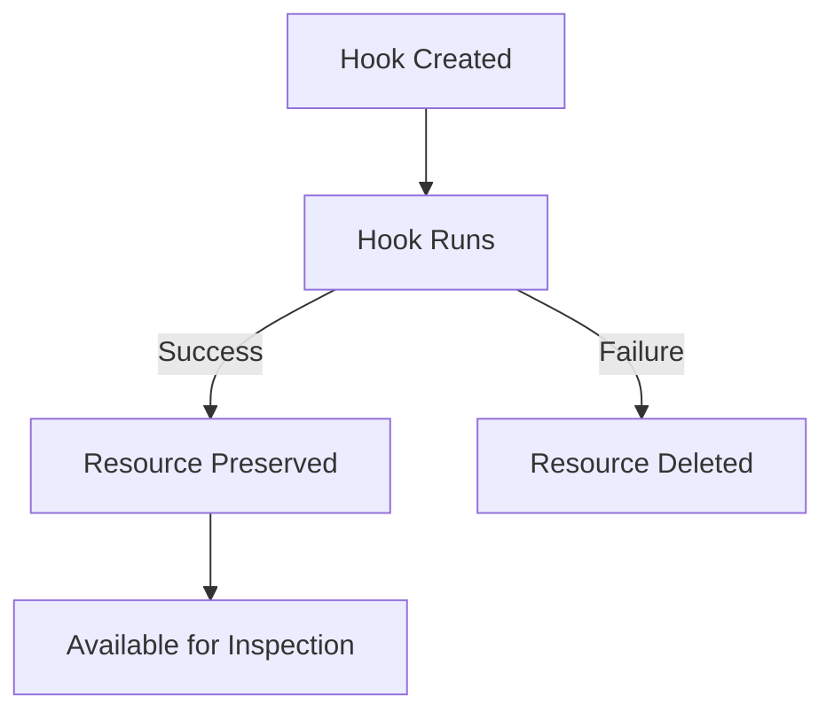

# How to Use HookFailed Delete Policy in ArgoCD

Author: [nawazdhandala](https://github.com/nawazdhandala)

Tags: ArgoCD, GitOps, Kubernetes, Sync Hooks, Resource Cleanup

Description: Learn how to use the HookFailed delete policy in ArgoCD to automatically delete hook resources that fail during sync while preserving successful ones.

---

The `HookFailed` delete policy in ArgoCD is the inverse of `HookSucceeded`. When a hook resource fails, ArgoCD automatically deletes it. When it succeeds, the resource is preserved in the cluster.

This might seem counterintuitive at first - why would you want to delete failed hooks and keep successful ones? But there are legitimate use cases where this pattern makes sense.

## How HookFailed Works

The lifecycle is the opposite of HookSucceeded:

1. ArgoCD creates the hook resource
2. The hook runs
3. If the hook fails: ArgoCD deletes the resource
4. If the hook succeeds: ArgoCD leaves the resource in the cluster



## Configuration

```yaml
apiVersion: batch/v1
kind: Job
metadata:
  name: deploy-audit
  annotations:
    argocd.argoproj.io/hook: PostSync
    argocd.argoproj.io/hook-delete-policy: HookFailed
spec:
  template:
    spec:
      containers:
        - name: audit
          image: myorg/audit-logger:latest
          command: ["./record-deployment.sh"]
      restartPolicy: Never
  backoffLimit: 1
```

## When to Use HookFailed

### Audit Trail Hooks

When you want to keep a record of successful deployments:

```yaml
# Keep successful audit records, discard failures
apiVersion: batch/v1
kind: Job
metadata:
  name: deployment-audit-v42
  annotations:
    argocd.argoproj.io/hook: PostSync
    argocd.argoproj.io/hook-delete-policy: HookFailed
spec:
  template:
    spec:
      containers:
        - name: audit
          image: myorg/audit:latest
          command:
            - /bin/sh
            - -c
            - |
              # Record the deployment in audit log
              echo "Recording deployment..."
              echo "{
                \"app\": \"web-service\",
                \"version\": \"v42\",
                \"timestamp\": \"$(date -u +%Y-%m-%dT%H:%M:%SZ)\",
                \"status\": \"deployed\"
              }" > /audit/deployment.json

              echo "Audit record created"
          volumeMounts:
            - name: audit-vol
              mountPath: /audit
      volumes:
        - name: audit-vol
          persistentVolumeClaim:
            claimName: audit-records
      restartPolicy: Never
  backoffLimit: 1
```

If the audit logging fails, you do not need the failed Job sitting around - the audit record was not created anyway. But if it succeeds, you might want to inspect or verify the record later.

### Validation Result Hooks

When the hook produces output you want to review:

```yaml
# Keep successful validation results, discard failures
apiVersion: batch/v1
kind: Job
metadata:
  name: security-scan
  annotations:
    argocd.argoproj.io/hook: PostSync
    argocd.argoproj.io/hook-delete-policy: HookFailed
spec:
  template:
    spec:
      containers:
        - name: scan
          image: myorg/security-scanner:latest
          command:
            - /bin/sh
            - -c
            - |
              # Run security scan and generate report
              scan-deployment --namespace my-app --output /reports/scan-results.json

              # Upload results
              curl -X POST "https://security.internal/reports" \
                -H "Content-Type: application/json" \
                -d @/reports/scan-results.json
      restartPolicy: Never
  backoffLimit: 1
```

### Non-Critical Hooks Where Failures Are Expected

If you have a hook that sometimes fails due to transient external dependencies and the failure is acceptable:

```yaml
# Try to update external dashboard - failure is acceptable
apiVersion: batch/v1
kind: Job
metadata:
  name: update-dashboard
  annotations:
    argocd.argoproj.io/hook: PostSync
    argocd.argoproj.io/hook-delete-policy: HookFailed
spec:
  template:
    spec:
      containers:
        - name: update
          image: curlimages/curl:latest
          command:
            - /bin/sh
            - -c
            - |
              # Update Grafana dashboard annotation
              curl -X POST "https://grafana.internal/api/annotations" \
                -H "Authorization: Bearer ${GRAFANA_TOKEN}" \
                -H "Content-Type: application/json" \
                -d "{
                  \"dashboardId\": 1,
                  \"time\": $(date +%s)000,
                  \"text\": \"Deployed v42\"
                }"
          env:
            - name: GRAFANA_TOKEN
              valueFrom:
                secretKeyRef:
                  name: grafana
                  key: token
      restartPolicy: Never
  backoffLimit: 0
```

## HookFailed vs HookSucceeded

| Aspect | HookSucceeded | HookFailed |
|--------|:---:|:---:|
| On success | Deleted | Preserved |
| On failure | Preserved | Deleted |
| Primary use | Keep failures for debugging | Keep successes for auditing |
| Common? | Very common | Less common |

Most teams use `HookSucceeded` because debugging failures is more important than inspecting successes. But `HookFailed` has its place in audit-oriented and reporting workflows.

## Combining with Other Policies

You can combine `HookFailed` with other delete policies:

### HookFailed + HookSucceeded (Delete Everything)

```yaml
annotations:
  argocd.argoproj.io/hook-delete-policy: HookSucceeded, HookFailed
```

This deletes the hook regardless of outcome. Useful for ephemeral tasks where you never need to inspect the hook resource:

```yaml
# Fire-and-forget notification
apiVersion: batch/v1
kind: Job
metadata:
  name: deploy-ping
  annotations:
    argocd.argoproj.io/hook: PostSync
    argocd.argoproj.io/hook-delete-policy: HookSucceeded, HookFailed
spec:
  template:
    spec:
      containers:
        - name: ping
          image: curlimages/curl:latest
          command:
            - /bin/sh
            - -c
            - curl -sf -X POST "https://deploys.example.com/ping" -d '{"app":"web"}' || true
      restartPolicy: Never
  backoffLimit: 0
```

### HookFailed + BeforeHookCreation

```yaml
annotations:
  argocd.argoproj.io/hook-delete-policy: HookFailed, BeforeHookCreation
```

Failed hooks are deleted immediately, and any remaining successful hooks are cleaned up before the next sync. Only the most recent successful hook exists at any time.

## Accumulation of Successful Hooks

Be aware that with only `HookFailed` set, successful hook resources accumulate over time. If you sync frequently, you might end up with many completed Jobs:

```bash
kubectl get jobs -n my-app
# NAME                     COMPLETIONS   DURATION   AGE
# deploy-audit-v39        1/1           5s         7d
# deploy-audit-v40        1/1           4s         5d
# deploy-audit-v41        1/1           6s         3d
# deploy-audit-v42        1/1           5s         1h
```

To manage this, either:
1. Use unique names (version numbers) and let them accumulate intentionally
2. Add `BeforeHookCreation` to keep only the latest
3. Set up a CronJob to clean up old Jobs

```bash
# Manual cleanup of old hook Jobs
kubectl delete jobs -n my-app -l app=audit-hook --field-selector=status.successful=1
```

## Summary

The `HookFailed` delete policy is the less common sibling of `HookSucceeded`, designed for workflows where you care more about inspecting successful results than debugging failures. Use it for audit trails, compliance reporting, and scenarios where successful hook output has lasting value. For most general-purpose hooks, `HookSucceeded` or the combination of `HookSucceeded, BeforeHookCreation` is the better default.
