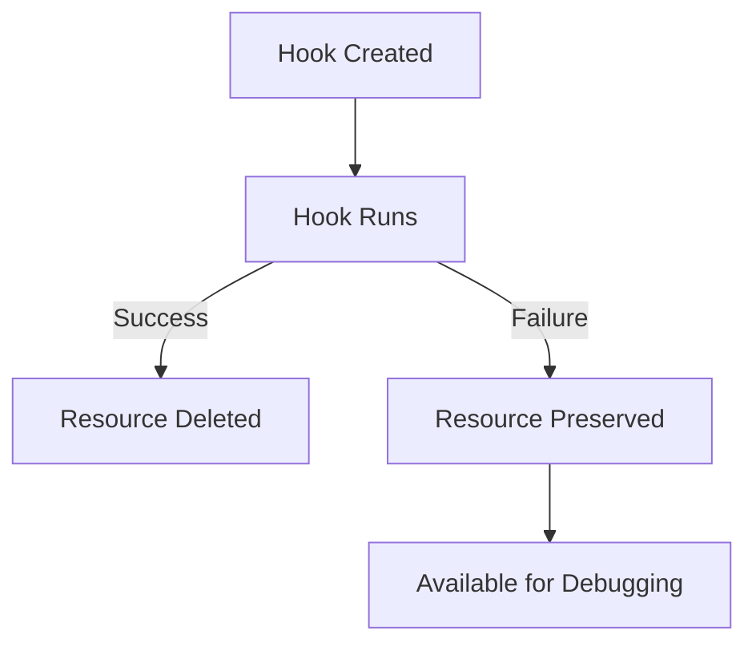

# How to Use HookSucceeded Delete Policy in ArgoCD

Author: [nawazdhandala](https://github.com/nawazdhandala)

Tags: ArgoCD, GitOps, Kubernetes, Sync Hooks, Resource Cleanup

Description: Learn how to use the HookSucceeded delete policy in ArgoCD to automatically clean up hook resources after they complete successfully during sync operations.

---

The `HookSucceeded` delete policy is the most commonly used hook cleanup strategy in ArgoCD. When a sync hook (like a migration Job or a notification task) finishes successfully, ArgoCD automatically deletes the hook resource. If the hook fails, the resource is preserved so you can inspect logs and debug the failure.

This policy strikes the right balance between keeping your cluster clean and retaining useful debugging information.

## How HookSucceeded Works

The lifecycle with `HookSucceeded` is straightforward:

1. ArgoCD creates the hook resource (Job, Pod, etc.)
2. The hook runs
3. If the hook succeeds: ArgoCD deletes the resource immediately
4. If the hook fails: ArgoCD leaves the resource in the cluster



## Basic Configuration

Add the delete policy annotation to your hook resource:

```yaml
apiVersion: batch/v1
kind: Job
metadata:
  name: db-migrate
  annotations:
    argocd.argoproj.io/hook: PreSync
    argocd.argoproj.io/hook-delete-policy: HookSucceeded
spec:
  template:
    spec:
      containers:
        - name: migrate
          image: myorg/api:v42
          command: ["python", "manage.py", "migrate", "--no-input"]
          env:
            - name: DATABASE_URL
              valueFrom:
                secretKeyRef:
                  name: db-credentials
                  key: url
      restartPolicy: Never
  backoffLimit: 3
  activeDeadlineSeconds: 300
```

## What "Succeeded" Means for Different Resource Types

ArgoCD determines success differently depending on the resource type:

**Job**: The Job's status shows `succeeded: 1` (at least one Pod completed with exit code 0).

**Pod**: The Pod's status is `Succeeded` (the container exited with code 0).

**Other resources**: For non-Job, non-Pod resources used as hooks (which is rare), ArgoCD considers them "succeeded" once they are healthy according to ArgoCD's health assessment.

## Practical Use Cases

### Database Migration

The classic use case. Clean up successful migrations, keep failed ones:

```yaml
apiVersion: batch/v1
kind: Job
metadata:
  name: schema-update
  annotations:
    argocd.argoproj.io/hook: PreSync
    argocd.argoproj.io/hook-delete-policy: HookSucceeded
spec:
  template:
    spec:
      containers:
        - name: migrate
          image: myorg/app:v10
          command:
            - /bin/sh
            - -c
            - |
              echo "Starting migration..."
              # Run alembic migration
              alembic upgrade head
              echo "Migration complete"
          env:
            - name: DB_URI
              valueFrom:
                secretKeyRef:
                  name: app-db
                  key: uri
      restartPolicy: Never
  backoffLimit: 2
```

When the migration succeeds:
- The Job and its Pods are deleted
- No clutter in `kubectl get jobs`
- Clean namespace

When the migration fails:
- The Job and Pod remain
- You can inspect logs: `kubectl logs job/schema-update`
- You can check events: `kubectl describe job schema-update`
- After fixing the issue, delete manually or let `BeforeHookCreation` clean it up on the next sync

### Cache Warming

Pre-populate caches before deployment:

```yaml
apiVersion: batch/v1
kind: Job
metadata:
  name: warm-cache
  annotations:
    argocd.argoproj.io/hook: PreSync
    argocd.argoproj.io/hook-delete-policy: HookSucceeded
spec:
  template:
    spec:
      containers:
        - name: warm
          image: myorg/cache-warmer:latest
          command:
            - /bin/sh
            - -c
            - |
              echo "Warming product cache..."
              curl -sf http://cache-api/warm/products
              echo "Warming user cache..."
              curl -sf http://cache-api/warm/users
              echo "Cache warming complete"
      restartPolicy: Never
  backoffLimit: 1
```

### Health Verification

Check that dependent services are healthy before deploying:

```yaml
apiVersion: batch/v1
kind: Job
metadata:
  name: dependency-check
  annotations:
    argocd.argoproj.io/hook: PreSync
    argocd.argoproj.io/hook-delete-policy: HookSucceeded
spec:
  template:
    spec:
      containers:
        - name: check
          image: curlimages/curl:latest
          command:
            - /bin/sh
            - -c
            - |
              echo "Checking database..."
              curl -sf http://postgres:5432/ || { echo "Database unavailable"; exit 1; }

              echo "Checking cache..."
              curl -sf http://redis:6379/ || { echo "Cache unavailable"; exit 1; }

              echo "Checking message queue..."
              curl -sf http://rabbitmq:15672/api/health/checks/alarms || { echo "MQ unavailable"; exit 1; }

              echo "All dependencies healthy"
      restartPolicy: Never
  backoffLimit: 1
  activeDeadlineSeconds: 60
```

## Handling the Accumulation of Failed Hooks

The downside of using only `HookSucceeded` is that failed hooks accumulate. If a hook fails repeatedly across multiple sync attempts, you end up with multiple failed Jobs:

```bash
# After several failed sync attempts
kubectl get jobs -n my-app
# NAME              COMPLETIONS   DURATION   AGE
# db-migrate        0/1           5m         2d    # Failed sync from 2 days ago
```

To handle this, combine `HookSucceeded` with `BeforeHookCreation`:

```yaml
annotations:
  argocd.argoproj.io/hook: PreSync
  argocd.argoproj.io/hook-delete-policy: HookSucceeded, BeforeHookCreation
```

This way:
- Successful hooks are deleted immediately
- Failed hooks stick around for debugging
- Before the next sync, any remaining hooks (including failed ones) are cleaned up

## Timing of Deletion

When ArgoCD detects that a hook Job has succeeded, it sends a delete request to the Kubernetes API. The deletion happens quickly - typically within a few seconds of the Job completing.

However, there can be a brief delay between the Job completing and ArgoCD detecting the completion. ArgoCD polls Job status periodically during the sync operation. In practice, the hook resource usually exists for 5 to 15 seconds after completion before being deleted.

## Debugging Before Deletion

If you need to inspect hook logs but the HookSucceeded policy deletes them too quickly, you have several options:

**Use BeforeHookCreation instead**: The resource stays until the next sync.

**Ship logs to a logging system**: Configure your hook containers to send logs to a centralized system like ELK, Datadog, or Loki.

**Temporarily remove the delete policy**: For debugging, remove the annotation, sync, inspect, then add it back.

```yaml
# Temporarily for debugging - no delete policy
annotations:
  argocd.argoproj.io/hook: PreSync
  # argocd.argoproj.io/hook-delete-policy: HookSucceeded  # Commented out
```

## Summary

`HookSucceeded` is the default choice for most hook delete policies. It keeps your cluster clean by removing successful hooks while preserving failed ones for debugging. For the best of both worlds, combine it with `BeforeHookCreation` to ensure even failed hooks are eventually cleaned up. The key insight is that successful hooks rarely need inspection - you only care about the output when something goes wrong.
